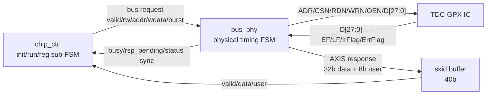
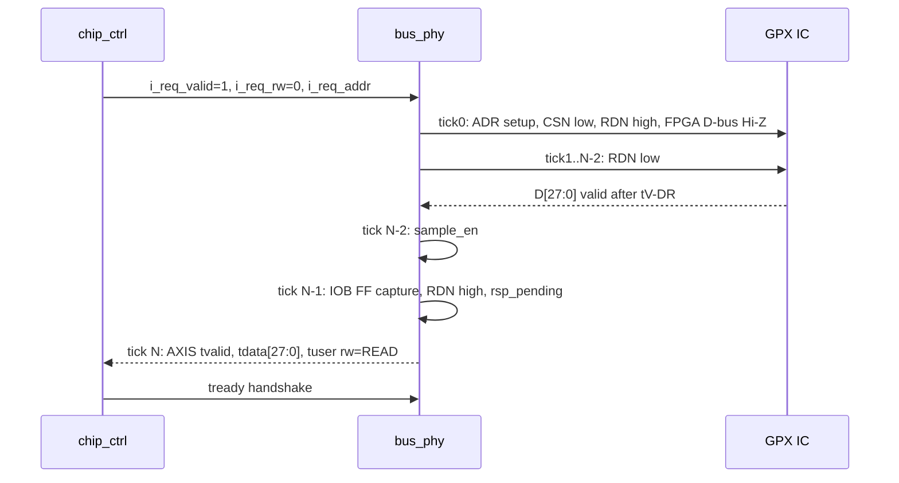
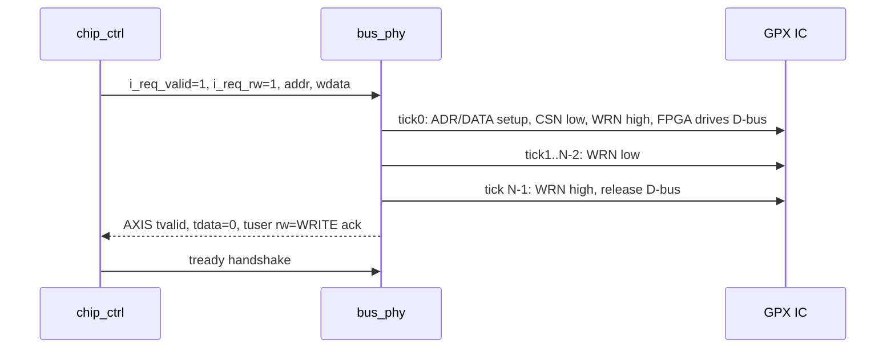
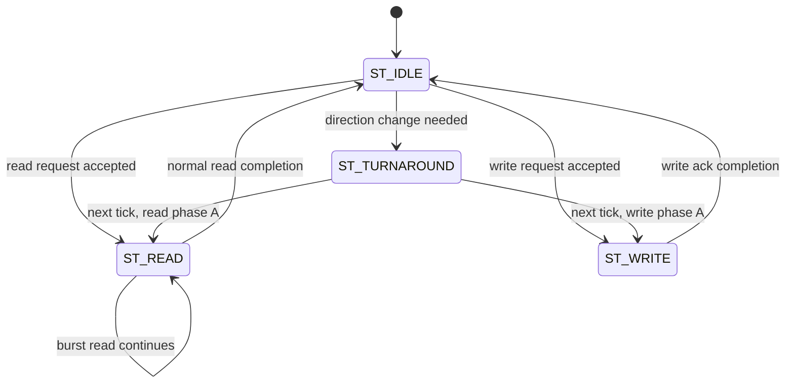

# C01_GPX_Bus_Read

문서 버전: `v002`  
작성일: `2026-04-29`  
작성 목적: GPX IC로부터 값을 읽어 오는 가장 앞단, 즉 `tdc_gpx_bus_phy`의 물리 버스 접근 primitive를 독립 Cluster로 분석하고 다음 Cluster인 chip acquisition이 의존해야 할 계약을 정리한다.

---

## 1. 이번 Cluster의 목적

`C01_GPX_Bus_Read`의 목적은 TDC-GPX IC와 FPGA 사이의 28-bit async parallel bus 접근이 운용상 안전한지 확인하는 것이다.

이 Cluster는 아직 shot/capture/drain 정책을 깊게 다루지 않는다. 그 정책은 `C02_Chip_Acquisition`에서 `tdc_gpx_chip_ctrl`과 `tdc_gpx_chip_run` 중심으로 확장한다.

이번 단계에서 닫아야 하는 질문은 다음과 같다.

1. GPX IC register/IFIFO read primitive가 timing 요구사항을 만족하는가?
2. FPGA가 bus를 drive하는 WRITE와 GPX IC가 bus를 drive하는 READ 사이에 bus contention 가능성이 없는가?
3. `bus_ticks`, `bus_clk_div`, `tick_en`의 운용 계약이 명확한가?
4. read/write 완료가 AXI-Stream response로 상위 FSM에 정확히 전달되는가?
5. GPX status pin인 `EF1/EF2/LF1/LF2/IrFlag/ErrFlag`가 안전하게 동기화되는가?

---

## 2. 분석 대상 파일

주 분석 대상:

| 파일 | 역할 |
|---|---|
| `Doc/TDC-GPX-Datasheet.pdf` | C01 bus interface, timing, OEN, EF/LF pin 의미의 기준 문서 |
| `tdc_gpx_bus_phy.vhd` | GPX IC 물리 bus timing FSM, IOBUF, read/write response, status pin synchronizer |
| `tdc_gpx_cfg_pkg.vhd` | bus timing legal table, 기본 BUS_TIMING init 값 |

참조 대상:

| 파일 | 참조 이유 |
|---|---|
| `tdc_gpx_config_ctrl.vhd` | `bus_phy`가 per-chip으로 어떻게 인스턴스되고 `chip_ctrl`과 연결되는지 확인 |
| `tdc_gpx_chip_ctrl.vhd` | `bus_phy` request/response를 어떤 계약으로 소비하는지 확인 |

이번 Cluster에서 의도적으로 깊게 보지 않는 항목:

- shot/capture/drain FSM의 세부 상태 전이
- IFIFO expected count 기반 drain 정책
- raw beat FIFO, decode, cell, VDMA output
- err_handler recovery 정책

---

## 3. 기준 데이터시트 근거

이번 v002부터 C01의 1차 기준은 `Doc/TDC-GPX-Datasheet.pdf`이다. 코드 주석이나 기존 package table은 데이터시트의 bus timing을 RTL clock tick으로 옮긴 2차 해석으로 본다.

### 데이터시트에서 확인한 C01 관련 사실

| 데이터시트 위치 | C01에 필요한 기준 |
|---|---|
| p.3 System overview | TDC-GPX는 `28 Bit` 또는 `2 x 16 Bit` asynchronous data bus를 사용하며 `CSN`, `RDN`, `WRN`, 4-bit address range를 가진다. 현재 RTL은 `c_TDC_BUS_WIDTH=28` 기준이다. |
| p.7 Bus Timings / Write operations | WRITE는 `ADR`, `CSN`, `DATA`, `WRN`의 setup/hold와 `WRN` low/high pulse width를 만족해야 한다. 주요 최소값은 `tS-AD=2 ns`, `tS-DW=5 ns`, `tH-DW=4 ns`, `tPW-WL=6 ns`, `tPW-WH=6 ns`이다. |
| p.7 Bus Timings / Read operations | READ는 `RDN` low/high pulse width와 data valid/hold window를 만족해야 한다. 주요 값은 `tPW-RL=6 ns`, `tPW-RH=6 ns`, `tV-DR=max 11.8 ns`, `tH-DR=min 4 ns`, `tS-EF=max 11.8 ns`이다. |
| p.7 Read operations 주의문 | Empty FIFO에서 read하는 것은 허용되지 않는다. 따라서 EF 기반 drain 판단은 C02에서 반드시 검증해야 한다. |
| p.8 OEN operations | `OEN=Low`이면 output buffer가 계속 bus를 drive하고, `OEN=High`이면 read strobe 동안만 drive한다. WRITE 중에는 반드시 `OEN=High`여야 한다. |
| p.8 16 Bit Mode / p.51 Bug Report | 16-bit mode는 command pair와 CSN workaround가 필요하다. 현재 C01은 28-bit bus만 분석하며, RTL은 Reg14[4]를 0으로 강제해 16-bit mode 진입을 막고 있다. |
| p.11~12 Pin Description | `EF1/EF2`는 Interface FIFO empty flag이며 active HIGH, `LF1/LF2`는 Interface FIFO load flag이며 active HIGH이다. `OEN`은 active LOW input이다. |

### C01 clock 기준

Bus_Phy가 샘플링하고 FSM tick을 진행하는 clock은 `i_tdc_clk=200 MHz`이다. 따라서 C01 timing 계산에서 `T_clk=5 ns`를 고정 기준으로 사용한다. `i_axis_aclk` 등 다른 clock domain의 150 MHz/200 MHz 표기는 C01의 GPX bus sampling 기준이 아니다.

---

## 4. Cluster 경계

### 입력 경계

이 Cluster가 받는 주요 입력은 `chip_ctrl` 계층에서 오는 bus transaction request이다.

| 입력 | 의미 |
|---|---|
| `i_tick_en` | `bus_clk_div`로 생성된 transaction phase tick |
| `i_bus_ticks` | 1 transaction을 몇 tick으로 구성할지 지정 |
| `i_req_valid` | read/write transaction 요청 |
| `i_req_rw` | `0`: READ, `1`: WRITE |
| `i_req_addr` | GPX register address |
| `i_req_wdata` | WRITE 시 28-bit data |
| `i_oen_permanent` | drain burst에서 GPX가 bus를 계속 drive하도록 하는 모드 |
| `i_req_burst` | back-to-back burst READ 유지 요청 |

### 출력 경계

이 Cluster의 출력은 두 종류다.

1. GPX IC 물리 pin 제어
2. 상위 `chip_ctrl`로 전달되는 AXI-Stream response와 동기화 status

| 출력 | 의미 |
|---|---|
| `o_adr` | GPX register address |
| `o_csn` | chip select |
| `o_rdn` | read strobe |
| `o_wrn` | write strobe |
| `o_oen` | GPX output enable 관련 제어 |
| `io_d` | 28-bit bidirectional data bus |
| `o_m_axis_tvalid/tdata/tuser` | read data 또는 write ack response |
| `o_busy` | transaction 진행 중 |
| `o_rsp_pending` | deferred response 또는 AXI response가 아직 소비되지 않음 |
| `o_ef1_sync/o_ef2_sync/...` | GPX async status pin의 2-FF synchronized 결과 |

---

## 5. 상위 연결 구조

`tdc_gpx_config_ctrl`는 chip별로 `bus_phy`, bus response skid buffer, `chip_ctrl`을 하나씩 생성한다.



연결 근거:

- `tdc_gpx_config_ctrl.vhd:1445-1483`: `u_bus_phy` 인스턴스와 GPX pin 연결
- `tdc_gpx_config_ctrl.vhd:1485-1503`: bus response skid buffer 및 pending merge
- `tdc_gpx_config_ctrl.vhd:1751-1764`: `chip_ctrl` request/response/status 연결

---

## 6. 정상 READ 운용 시퀀스

`bus_phy`의 READ는 tick phase 기반이다. IDLE에서 request를 받아들이는 순간이 `tick 0`이며, 이후 `ST_READ` 안에서 `s_tick_r`이 `1`부터 증가한다.



핵심 코드 근거:

- `tdc_gpx_bus_phy.vhd:278-288`: tick assignment와 Phase A/L/H 설명
- `tdc_gpx_bus_phy.vhd:455-473`: READ direct entry, OEN low, D-bus Hi-Z, tick 시작
- `tdc_gpx_bus_phy.vhd:527-548`: RDN low, sample_en, RDN high, rsp_pending
- `tdc_gpx_bus_phy.vhd:342-350`: deferred read response를 AXI-Stream으로 emit

### READ timing 공식

데이터시트 p.7의 READ timing을 `i_tdc_clk=200 MHz` clock tick으로 변환하면 다음과 같다. `bus_clk_div`는 phase tick 하나를 몇 개의 200 MHz clock으로 만들지 정하고, `bus_ticks`는 한 transaction을 몇 phase tick으로 구성할지 정한다.

```text
RDN low -> IOB FF capture delay
= ((bus_ticks - 3) * bus_clk_div + 1) * T_clk
```

Bus_Phy 샘플링 clock은 200 MHz이므로 `T_clk = 5 ns`이다. 따라서 C01에서 timing margin을 계산할 때는 150 MHz 계열 clock을 섞지 않는다.

GPX datasheet READ 조건:

| 항목 | 조건 |
|---|---|
| `tS-AD` | address setup before strobe low >= 2 ns |
| `tH-AD` | address hold after strobe high >= 0 ns |
| `tS-CSN` / `tH-CSN` | chip select setup/hold >= 0 ns |
| `tPW-RL` | RDN low pulse width >= 6 ns |
| `tPW-RH` | RDN high pulse width in burst >= 6 ns |
| `tV-DR` | data valid delay after RDN low: max 11.8 ns |
| `tH-DR` | data hold after RDN high: min 4 ns, max 8.5 ns. 데이터시트 주석상 `OEN=0`과 stable address이면 hold를 길게 유지할 수 있다. |
| `tS-EF` | last data read 후 EF set: max 11.8 ns |
| Empty FIFO rule | 데이터시트는 empty FIFO read를 금지한다. `bus_phy`는 EF를 동기화만 하므로, 실제 drain 제어는 C02에서 EF 기반으로 검증해야 한다. |

운용상 legal 조합:

| div | ticks | capture | 상태 |
|---:|---:|---:|---|
| 1 | 4 | 10 ns | illegal, `tV-DR` margin 부족 |
| 1 | 5 | 15 ns | OK, 가장 빠른 조합 |
| 2 | 4 | 15 ns | OK |
| 2 | 5 | 25 ns | OK, 기본 init |
| 3 | 4 | 20 ns | OK |

근거:

- `Doc/TDC-GPX-Datasheet.pdf`: p.7 Read Operations
- `tdc_gpx_bus_phy.vhd:33-52`
- `tdc_gpx_cfg_pkg.vhd:266-305`
- `tdc_gpx_cfg_pkg.vhd:317-318`: init `bus_clk_div=2`, `bus_ticks=5`

---

## 7. 정상 WRITE 운용 시퀀스

WRITE는 FPGA가 `io_d`를 drive한다. 따라서 bus contention 방지를 위해 WRITE 중에는 OEN과 tri-state 제어가 중요하다. 데이터시트 p.8은 WRITE 중 `OEN`이 반드시 HIGH여야 한다고 명시한다.



핵심 코드 근거:

- `tdc_gpx_bus_phy.vhd:418-435`: WRITE direct entry, FPGA D-bus drive
- `tdc_gpx_bus_phy.vhd:608-630`: WRN low, 완료, D-bus release, write ack response

GPX datasheet WRITE 조건:

| 항목 | 조건 | Bus_Phy 해석 |
|---|---|---|
| `tS-AD` | address setup before WRN low >= 2 ns | tick0에서 address를 먼저 내고 tick1부터 WRN low이므로 최소 1 phase tick 확보 |
| `tH-AD` | address hold after WRN high >= 0 ns | transaction 종료 시 address hold 요구는 0 ns라 FSM 구조상 충족 |
| `tS-DW` | write data setup before WRN high >= 5 ns | data는 tick0부터 drive되고 WRN은 tick1..N-2 동안 low |
| `tH-DW` | write data hold after WRN high >= 4 ns | WRN high 전환 edge와 data release edge의 상대 timing은 waveform 검증 대상 |
| `tPW-WL` | WRN low pulse width >= 6 ns | `bus_clk_div=2`, `bus_ticks=5` 기본값에서 30 ns 확보 |
| `tPW-WH` | WRN high pulse width >= 6 ns | back-to-back write에서도 Phase H + 다음 Phase A로 2 phase tick 확보 |
| `OEN` | WRITE 중 OEN must be HIGH | `ST_WRITE`에서 `s_oen_r='1'` 유지 |

---

## 8. FSM 구조

`tdc_gpx_bus_phy`의 FSM은 4개 state로 구성된다.



상태별 의미:

| State | 의미 |
|---|---|
| `ST_IDLE` | request 수락 대기, bus strobes high, D-bus Hi-Z |
| `ST_TURNAROUND` | READ/WRITE 방향 전환을 위한 1 tick gap |
| `ST_READ` | RDN phase 제어, IOB FF sample, deferred read response 생성 |
| `ST_WRITE` | WRN phase 제어, FPGA data drive, write ack 생성 |

핵심 코드 근거:

- `tdc_gpx_bus_phy.vhd:151-156`: FSM state 정의
- `tdc_gpx_bus_phy.vhd:359-476`: `ST_IDLE`
- `tdc_gpx_bus_phy.vhd:484-512`: `ST_TURNAROUND`
- `tdc_gpx_bus_phy.vhd:527-597`: `ST_READ`
- `tdc_gpx_bus_phy.vhd:608-635`: `ST_WRITE`

---

## 9. Bus contention 방지 계약

`bus_phy`는 다음 safety invariant를 명시한다.

데이터시트 p.8의 OEN 기준은 이 절의 핵심 전제이다. `OEN=Low`이면 GPX output buffer가 계속 bus를 drive하고, `OEN=High`이면 read strobe 동안만 drive한다. 특히 WRITE 중에는 `OEN=High`가 필수이다.

| Invariant | 설명 | 코드상 구현 |
|---|---|---|
| `INV-1` | WRITE 시 FPGA가 data bus를 drive하고 GPX `OEN`은 HIGH로 둔다 | WRITE entry 및 `ST_WRITE` |
| `INV-2` | READ 시 FPGA D-bus는 Hi-Z이며 GPX가 drive한다 | READ entry 및 `ST_READ` |
| `INV-3` | IDLE 시 D-bus Hi-Z, 단 `oen_permanent` 예외 | `ST_IDLE` |
| `INV-5` | WRITE -> READ 전환 시 turnaround gap | `ST_TURNAROUND` |
| `INV-6` | READ -> WRITE 전환 시 OEN high leading gap | `ST_TURNAROUND` |
| `INV-7` | `oen_permanent=1` 동안 WRITE 금지 | `ST_IDLE` WRITE branch |

중요한 점은 READ/WRITE 방향 전환에서 즉시 반대 방향 transaction에 진입하지 않고 `ST_TURNAROUND`를 거친다는 것이다. 이 gap은 bus contention을 피하는 가장 직접적인 보호 장치다.

근거:

- `Doc/TDC-GPX-Datasheet.pdf`: p.8 OEN operations
- `tdc_gpx_bus_phy.vhd:54-60`: invariant 주석
- `tdc_gpx_bus_phy.vhd:403-416`: READ 이후 WRITE 요청 시 turnaround
- `tdc_gpx_bus_phy.vhd:440-453`: WRITE 이후 READ 요청 시 turnaround
- `tdc_gpx_bus_phy.vhd:484-510`: turnaround state에서 strobe high, D-bus Hi-Z, OEN high 유지

---

## 10. AXI-Stream response 계약

`bus_phy`는 read/write 완료를 단일 AXI-Stream response path로 전달한다.

| Field | READ response | WRITE response |
|---|---|---|
| `tvalid` | read data valid | write ack valid |
| `tdata[27:0]` | GPX read data | zero |
| `tdata[31:28]` | zero | zero |
| `tuser[0]` | `0` READ | `1` WRITE |
| `tuser[4:1]` | target address | target address |
| `tkeep` | `1111` | `1111` |

상위 `chip_ctrl`는 raw `tvalid`가 아니라 `valid AND ready`인 fire pulse를 사용해야 한다.

근거:

- `tdc_gpx_bus_phy.vhd:10-17`: response interface 설명
- `tdc_gpx_bus_phy.vhd:327-350`: tvalid hold와 deferred read response
- `tdc_gpx_bus_phy.vhd:654-660`: output assignment
- `tdc_gpx_chip_ctrl.vhd:592-602`: `o_s_axis_tready`와 `s_bus_rsp_fire`

### `o_rsp_pending`의 의미

`o_rsp_pending`은 단순히 내부 FSM busy가 아니라, response가 아직 소비되지 않았음을 나타낸다.

```vhdl
o_rsp_pending <= s_rsp_pending_r or s_axis_tvalid_r;
```

이 신호는 `chip_ctrl`의 drain/flush watchdog이 downstream backpressure를 bus hang으로 오인하지 않도록 하는 데 쓰인다.

근거:

- `tdc_gpx_bus_phy.vhd:654-655`
- `tdc_gpx_config_ctrl.vhd:1502-1503`: `bus_phy` pending + skid valid merge
- `tdc_gpx_chip_ctrl.vhd:607-614`: `chip_run`으로 pending 전달

---

## 11. Burst READ 운용

Burst READ는 IFIFO drain에서 중요하다.

`bus_phy`의 burst 정책:

1. `s_oen_perm_r`는 burst 시작 시 latch된다.
2. `i_req_burst`는 live로 본다.
3. burst 유지 중에도 response가 소비되지 않으면 다음 read로 진행하지 않고 hold한다.
4. burst read 간 RDN high gap은 Phase H + Phase A로 2 ticks 확보된다.

이 설계의 의미:

- `oen_permanent`가 중간에 흔들려도 burst 중 GPX output enable 정책은 안정된다.
- `chip_run`은 `i_req_burst`를 낮춰 mid-burst abort를 요청할 수 있다.
- AXI response backpressure가 있으면 read를 더 진행하지 않으므로 response overwrite가 없다.

근거:

- `tdc_gpx_bus_phy.vhd:552-576`

---

## 12. Status pin synchronizer

GPX IC의 status pin은 async input이다.

대상 pin:

- `EF1`: Interface FIFO 1 empty flag, active HIGH
- `EF2`: Interface FIFO 2 empty flag, active HIGH
- `LF1`: Interface FIFO 1 load flag, active HIGH
- `LF2`: Interface FIFO 2 load flag, active HIGH
- `IrFlag`: interrupt flag, active HIGH
- `ErrFlag`: error flag, active HIGH

`bus_phy`는 각 pin에 대해 2-FF synchronizer를 두고 `ASYNC_REG` attribute를 부여한다.


운용상 의미:

- metastability에 대한 기본 방어는 있다.
- 단, pulse 폭이 `i_tdc_clk` 기준으로 충분히 길어야 한다. 매우 짧은 pulse는 2-FF sync만으로 event capture 보장이 되지 않는다.
- 이 Cluster에서는 status pin의 의미를 동기화된 level로 다음 Cluster에 넘긴다. IrFlag/EF 기반 drain 정책은 `C02`에서 분석한다.

근거:

- `Doc/TDC-GPX-Datasheet.pdf`: p.11~12 Pin Description
- `tdc_gpx_bus_phy.vhd:234-246`: `ASYNC_REG`
- `tdc_gpx_bus_phy.vhd:665-705`: 2-FF synchronizer

---

## 13. 코드 리뷰 결과

### F-C01-01. `bus_ticks` illegal 조합에 대한 runtime 보호가 부분적이다

`bus_phy` 내부는 `i_bus_ticks < 4`를 local clamp로 4에 맞춘다. 그러나 `div=1, ticks=4`는 `tdc_gpx_cfg_pkg`의 timing table상 illegal이다. 즉, `bus_phy` 단독으로는 `tV-DR`을 만족하지 않는 조합을 완전히 막지 않는다.

현재 보호:

- `bus_phy`는 `ticks >= 4`만 assert/clamp한다.
- `tdc_gpx_cfg_pkg`는 `c_BUS_CLK_DIV_MIN=2`라고 명시한다.

운용상 필요한 계약:

- CSR write path 또는 SW driver가 `div=1, ticks=4` 조합을 금지해야 한다.
- `bus_clk_div=0`은 `chip_ctrl` tick generator에서 div=1처럼 동작하므로, SW 정책에서 명확히 금지 또는 alias 처리해야 한다.

위험도: 중간  
근거:

- `tdc_gpx_bus_phy.vhd:385-388`, `tdc_gpx_bus_phy.vhd:426-430`, `tdc_gpx_bus_phy.vhd:462-466`
- `tdc_gpx_cfg_pkg.vhd:286-299`
- `tdc_gpx_chip_ctrl.vhd:629-636`

### F-C01-02. C01 bus timing 기준 clock은 200 MHz로 고정해야 한다

사용자 확인과 코드 주석 기준으로 `bus_phy`의 sampling/FSM clock은 200 MHz, `T_clk=5 ns`이다. 따라서 v001에서 언급했던 150 MHz/200 MHz 혼재는 C01 timing 판단의 불확실성이 아니라 문서화 분리 이슈로 정리한다. C01에서 `i_axis_aclk` 계열 clock을 bus timing 계산에 섞으면 안 된다.

위험도: 중간  
조치:

- `C01`에서는 `i_tdc_clk=200 MHz`를 bus timing 기준으로 명시한다.
- `i_axis_aclk`와 혼동하지 않도록 top-level clock contract 문서를 별도로 정리해야 한다.

근거:

- 사용자 피드백: Bus_Phy sampling clock은 200 MHz
- `tdc_gpx_bus_phy.vhd:33`
- `tdc_gpx_cfg_pkg.vhd:266-305`
- `tdc_gpx_config_ctrl.vhd:23`

### F-C01-03. `oen_permanent`는 강력하지만 운용 설명이 필요하다

`oen_permanent`는 burst drain에서 GPX가 계속 bus를 drive하는 맥락으로 보인다. 데이터시트 p.8은 `OEN=Low`일 때 GPX output buffer가 계속 bus를 drive한다고 설명한다. 이때 WRITE 요청은 무시되고 simulation warning만 발생한다.

운용상 의미:

- `oen_permanent=1` 기간에는 read/drain 전용 구간으로 취급해야 한다.
- 상위 FSM이 이 기간 WRITE를 만들지 않는다는 구조적 보장이 필요하다.
- `C02`에서 `chip_run`이 언제 `o_bus_oen_permanent`를 올리는지 검증해야 한다.

위험도: 낮음-중간  
근거:

- `Doc/TDC-GPX-Datasheet.pdf`: p.8 OEN operations
- `tdc_gpx_bus_phy.vhd:366-370`
- `tdc_gpx_bus_phy.vhd:392-401`
- `tdc_gpx_bus_phy.vhd:552-576`
- `tdc_gpx_chip_ctrl.vhd:589-590`

### F-C01-04. Response backpressure 처리 구조는 적절하나 검증 포인트가 중요하다

`bus_phy`는 `s_axis_tvalid_r`가 남아 있으면 새 request를 받지 않는다. 또 burst 중 response가 소비되지 않으면 다음 read로 넘어가지 않는다. 이 구조는 response overwrite 방지에 합리적이다.

다만 검증에서는 다음 조건을 반드시 확인해야 한다.

- `tready=0`이 오래 유지될 때 RDN/CSN/OEN이 의도한 상태로 hold되는가?
- `o_busy`와 `o_rsp_pending` 조합이 `chip_ctrl`에서 premature idle로 해석되지 않는가?
- response skid buffer에 valid가 남아 있을 때 `i_bus_rsp_pending`이 유지되는가?

위험도: 낮음  
근거:

- `tdc_gpx_bus_phy.vhd:327-350`
- `tdc_gpx_bus_phy.vhd:373-383`
- `tdc_gpx_bus_phy.vhd:571-576`
- `tdc_gpx_config_ctrl.vhd:1485-1503`

### F-C01-05. 16-bit mode는 현재 RTL 범위 밖이며 차단 정책이 유지되어야 한다

데이터시트 p.8은 16-bit mode에서 모든 read/write command를 pair로 수행해야 한다고 설명하고, p.51 bug report는 16-bit bus에서 CSN 관련 malfunction과 workaround를 제시한다. 현재 `bus_phy`와 raw path는 28-bit bus 기준으로 설계되어 있으므로 Reg14[4]를 켜면 C01의 transaction 계약이 깨진다.

현재 RTL은 이 위험을 완화하고 있다.

- `tdc_gpx_chip_init.vhd`는 Reg14 write 시 bit4를 0으로 강제한다.
- `tdc_gpx_chip_reg.vhd`도 직접 Reg14 write에서 bit4를 0으로 강제한다.
- CSR init 값도 Reg14를 0으로 둔다.

운용상 필요한 계약:

- 16-bit mode는 현재 시스템에서 지원하지 않는 명시적 금지 모드로 문서화한다.
- 향후 16-bit mode를 지원하려면 Bus_Phy transaction pair, CSN bug workaround, raw data assembly를 별도 Cluster/변경으로 설계해야 한다.

위험도: 낮음, 단 차단 정책이 제거되면 높음  
근거:

- `Doc/TDC-GPX-Datasheet.pdf`: p.8 16 Bit Mode, p.51 Bug Report
- `tdc_gpx_chip_init.vhd:236-241`
- `tdc_gpx_chip_reg.vhd:176-182`
- `tdc_gpx_csr_chip.vhd:403`

### F-C01-06. Empty FIFO read 금지는 C02의 최우선 검증 조건이다

데이터시트 p.7은 empty FIFO read를 금지한다. `bus_phy`는 `EF1/EF2`를 동기화해서 상위에 전달하지만, READ 요청 자체가 empty FIFO인지 판단하지 않는다. 따라서 C01 단독으로는 empty FIFO read 금지를 보장하지 못하며, 이 책임은 `chip_ctrl/chip_run`의 drain policy로 넘어간다.

운용상 필요한 계약:

- C02는 `EF1/EF2 active HIGH`를 기준으로 IFIFO drain 시작/중지 조건을 검증해야 한다.
- burst read 중 마지막 data 이후 `tS-EF <= 11.8 ns`와 200 MHz 2-FF synchronization latency를 고려해, EF 관측과 다음 read 요청 사이에 빈 FIFO를 읽지 않는지 확인해야 한다.

위험도: 중간  
근거:

- `Doc/TDC-GPX-Datasheet.pdf`: p.7 Read Operations, p.11~12 Pin Description
- `tdc_gpx_bus_phy.vhd:683-692`
- `tdc_gpx_bus_phy.vhd:700-703`

---

## 14. 검증 체크리스트

다음 항목을 C01 단위 시뮬레이션 또는 assertion으로 확인해야 한다.

### Timing parameter

- [ ] Bus_Phy waveform 기준 clock이 `i_tdc_clk=200 MHz`로 고정되어 있는가?
- [ ] `bus_ticks=5`, `bus_clk_div=1`에서 READ capture가 15 ns 위치로 잡히는가?
- [ ] `bus_ticks=4`, `bus_clk_div=2`에서 READ capture가 15 ns 위치로 잡히는가?
- [ ] `bus_ticks=4`, `bus_clk_div=1` 조합이 SW/CSR 정책에서 금지되는가?
- [ ] `bus_ticks<4` 입력 시 local clamp가 적용되고 warning/assert가 기대대로 보이는가?
- [ ] READ에서 `tPW-RL`, `tPW-RH`, `tV-DR`, `tH-DR`가 데이터시트 p.7 조건을 만족하는가?
- [ ] WRITE에서 `tS-DW`, `tH-DW`, `tPW-WL`, `tPW-WH`가 데이터시트 p.7 조건을 만족하는가?

### Direction and contention

- [ ] READ 중 `s_d_tri_r='1'`로 FPGA D-bus가 Hi-Z인가?
- [ ] WRITE 중 `s_d_tri_r='0'`로 FPGA가 drive하는가?
- [ ] READ->WRITE 전환 시 `ST_TURNAROUND`를 거치는가?
- [ ] WRITE->READ 전환 시 `ST_TURNAROUND`를 거치는가?
- [ ] `oen_permanent=1` 중 WRITE 요청이 실제 transaction으로 진행되지 않는가?
- [ ] WRITE 중 GPX `OEN`이 데이터시트 요구대로 HIGH로 유지되는가?
- [ ] Reg14[4] 16-bit mode가 init path와 direct register write path 모두에서 0으로 강제되는가?

### Response

- [ ] READ response가 IOB FF capture 다음 tick에 `tvalid=1`로 나온다.
- [ ] WRITE response는 `tdata=0`, `tuser[0]=1`로 나온다.
- [ ] `tready=0`이면 `tvalid`가 유지되고 새 request가 accept되지 않는다.
- [ ] skid buffer valid까지 포함한 `i_bus_rsp_pending`이 `chip_ctrl`에 전달된다.

### Status sync

- [ ] EF/LF/IrFlag/ErrFlag pin이 2-cycle latency로 sync output에 반영된다.
- [ ] reset 시 EF는 high, LF/IrFlag/ErrFlag는 low default가 된다.
- [ ] C02 검증에서 `EF1/EF2 active HIGH`를 empty FIFO로 해석하고, empty FIFO read를 만들지 않는다.

---

## 15. 다음 Cluster로 넘길 계약

`C02_Chip_Acquisition`은 C01에서 다음 계약이 성립한다고 보고 분석을 시작한다.

1. `bus_phy`는 `i_req_valid` transaction을 `i_tick_en` 경계에서 accept한다.
2. READ/WRITE transaction은 `i_bus_ticks` tick phase로 수행된다.
3. READ response는 GPX data를 IOB FF로 capture한 뒤 deferred AXI response로 전달된다.
4. WRITE response는 write ack로 전달되며 `tdata=0`, `tuser[0]=1`이다.
5. response는 `tvalid/tready` handshake 전까지 유지된다.
6. 새 request는 pending response가 남아 있으면 accept되지 않는다.
7. `o_rsp_pending`은 internal deferred response 또는 AXI response hold를 의미한다.
8. status pins는 2-FF sync된 level로 `chip_ctrl`에 들어간다.
9. bus timing legality는 `bus_phy` 단독이 아니라 CSR/SW 운용 계약까지 포함해 보장해야 한다.
10. C01의 bus timing 계산은 `i_tdc_clk=200 MHz`, `T_clk=5 ns` 기준이다.
11. 데이터시트상 `EF1/EF2 active HIGH`는 empty FIFO이며, empty FIFO read는 금지된다. C02는 이 조건을 drain 정책의 최우선 제약으로 검증해야 한다.
12. 현재 RTL은 28-bit bus 운용만 지원한다. Reg14[4] 16-bit mode 차단 정책은 유지되어야 한다.

---

## 16. 사용자 피드백 기록

### v001 작성 시점

사용자 요청:

- Cluster를 합리적이고 논리적으로 나눈다.
- GPX IC로부터 읽어 오는 단계부터 하나씩 검증한다.
- 각 Cluster 분석이 끝났을 때 사용자와 확인 후 다음 Cluster로 넘어간다.
- 각 Cluster 폴더 내에 Markdown과 PPT를 버전 관리되도록 새 파일로 생성한다.

이번 v001의 해석:

- `C01_GPX_Bus_Read`는 `tdc_gpx_bus_phy` 중심으로 정의했다.
- `chip_ctrl`와 `config_ctrl`는 연결 계약 확인 범위로만 참조했다.
- shot/capture/drain의 의미론은 `C02`로 넘긴다.

### v002 사용자 피드백 반영

사용자 피드백:

- 이번 Cluster를 분석하기 위한 기준 문서는 `Doc/TDC-GPX-Datasheet.pdf`이다.
- Bus_Phy에서 샘플링되는 clock은 200 MHz이다.

반영 내용:

- 데이터시트 p.7~8의 READ/WRITE/OEN timing 기준을 C01 본문에 추가했다.
- 데이터시트 p.11~12의 `EF/LF/IrFlag/ErrFlag` active polarity와 pin 의미를 status sync 절에 반영했다.
- 데이터시트 p.8, p.51의 16-bit mode 및 CSN bug report를 확인하고, 현재 RTL이 Reg14[4]를 차단하는 점을 리뷰 결과에 추가했다.
- C01 timing 계산 기준을 `i_tdc_clk=200 MHz`, `T_clk=5 ns`로 고정했다.
- empty FIFO read 금지를 C02로 넘길 핵심 계약에 추가했다.

### 사용자 확인 필요

1. C01의 범위를 `bus_phy` 중심으로 닫는 것에 동의하는가?
2. `bus_ticks/bus_clk_div` illegal 조합을 C01의 주요 리스크로 보는 것에 동의하는가?
3. 데이터시트 기준에서 C02의 최우선 검증 항목을 `EF1/EF2 active HIGH` 기반 empty FIFO read 방지로 잡는 것에 동의하는가?
4. 다음 C02에서 `chip_ctrl/chip_run`의 capture/drain/force_reinit을 이어서 분석해도 되는가?

---

## 17. 이번 버전의 한계

- 이번 문서는 코드 정적 분석 기반이다.
- `xvhdl`, `ghdl` 컴파일/시뮬레이션은 실행하지 않았다.
- `Doc/TDC-GPX-Datasheet.pdf`의 C01 관련 부분은 확인했으나, 파형 시뮬레이션으로 setup/hold를 계측하지는 않았다.
- 다음 버전에서는 사용자 피드백에 따라 READ/WRITE waveform 측정 조건과 assertion 후보를 더 구체화할 수 있다.

---

## 18. v002 -> v003 반영 위치 기록

이 절은 v002 검토 이후 사용자 피드백이 v003 어디에 반영되었는지 추적하기 위한 forward trace이다.

### 변경 원인

사용자 검토:

- v001/v002의 `div=1,ticks=5,capture=15 ns` 표기가 transaction 기준으로는 `20 ns`가 맞는 것 같다고 지적했다.
- 데이터시트 기준으로 GPX data bus가 40 MHz, 즉 25 ns보다 빠르게 read 가능한지 확인이 필요하다고 했다.
- 이 내용이 `F-C01-01`과 연관된다고 판단했다.
- OEN pin이 미연결, pull-up, pull-down으로 고정될 수 있는 예외 상황과 generic 처리 방안을 검토 요청했다.
- 모듈 내부 조합논리가 timing 분석에 방해되는지 검토 요청했다.
- 200 MHz main clock과 40 MHz 이하 GPX status 조건에서 2-FF synchronizer가 충분한지 재판단 요청했다.
- 200 MHz GPX control/capture clock과 150 MHz output Stream clock의 분리를 판단에 반영해 달라고 요청했다.
- 모듈 경계 FF/register 기준과 VHDL prefix/postfix naming rule을 분석 기준에 추가했다.

### v003 반영 위치

다음 파일에 반영되었다.

- `Doc/cluster_analysis/C01_GPX_Bus_Read/C01_GPX_Bus_Read_20260429_v003.md`
- `Doc/cluster_analysis/C01_GPX_Bus_Read/C01_GPX_Bus_Read_20260429_v003.pptx`
- `Doc/cluster_analysis/cluster_analysis_operating_protocol_20260429_v002.md`

Markdown 반영 위치:

| v002에서 보완 필요했던 내용 | v003 반영 위치 | 판단 변화 |
|---|---|---|
| `15 ns` 계산 기준이 모호함 | v003 `## 6. 정상 READ 운용 시퀀스`의 `READ timing 공식과 기준점 분리` | `RDN low->capture=15 ns`, `tick0->capture=20 ns`, `beat period=25 ns`로 분리 |
| GPX data bus 40 MHz 한계 확인 필요 | v003 `## 6`, `### F-C01-01` | `div=1,ticks=5`는 40 MHz 경계, `div=1,ticks=4`는 50 MHz라 금지 |
| F-C01-01 의미 재정리 필요 | v003 `### F-C01-01. READ timing 표기는 기준점이 분리되어야 한다` | illegal 조합 문제와 문서 표기 문제를 함께 정리 |
| F-C01-02에서 200 MHz/150 MHz 관계 재판단 필요 | v003 `### F-C01-02. C01 bus clock 200 MHz와 output stream 150 MHz는 별도 clock-domain 계약이다` | 결함보다 clock-domain contract 문서화 항목으로 재정의 |
| OEN 예외 운용 필요 | v003 `### F-C01-07. OEN pin 미연결/고정 예외는 generic 운용 모드가 필요하다` | pull-up/미연결은 permanent 비의존 generic 후보, Low 고정은 unsupported |
| 조합논리 여부 확인 필요 | v003 `### F-C01-08. tdc_gpx_bus_phy는 next-state 조합 FSM은 없지만 경계 출력 하나는 조합 OR이다` | `o_rsp_pending` 조합 OR을 register boundary 개선 후보로 기록 |
| 2-FF synchronizer 충분성 재판단 필요 | v003 `### F-C01-09. Status pin 2-FF synchronizer는 level 신호에는 충분하나 event counter가 아니다` | level status에는 충분, pulse capture로 해석하면 C02 검증 필요 |
| 검증 항목 보완 필요 | v003 `## 14. 검증 체크리스트` | timing 기준점, 40 MHz, OEN generic, status level/pulse, module boundary 항목 추가 |
| C02 인계 계약 보완 필요 | v003 `## 15. 다음 Cluster로 넘길 계약` | OEN 예외, 40 MHz readout, 2-FF status 해석, register boundary 기준 추가 |
| 사용자 검토 기록 필요 | v003 `## 16. 사용자 피드백 기록`의 `v003 사용자 검토 반영` | 사용자 검토와 판단 결과를 시간순으로 추가 |

PPT 반영 위치:

| v003 PPT 위치 | 반영 내용 |
|---|---|
| Slide 3 | `15 ns/20 ns/25 ns` 기준점 3개를 분리해 시각화 |
| Slide 9 | Timing 기준점, 40 MHz readout, OEN 예외, 조합 경계, 2-FF sync finding 추가 |
| Slide 10 | C02로 넘길 핵심 계약에 40 MHz, OEN mode, 2-FF status, register boundary 기준 추가 |

운영 프로토콜 반영 위치:

| 운영 문서 위치 | 반영 내용 |
|---|---|
| `cluster_analysis_operating_protocol_20260429_v002.md` `## 4. 추가 설계 분석 기준` | module boundary FF/register 기준 추가 |
| `cluster_analysis_operating_protocol_20260429_v002.md` `### VHDL naming rule` | prefix/postfix naming rule 추가 |
| `cluster_analysis_operating_protocol_20260429_v003.md` `### Version lineage 기록 규칙` | 이전 버전에 다음 버전 반영 위치를 기록하는 규칙 추가 |

### 추적 근거

- `Doc/TDC-GPX-Datasheet.pdf`: p.7 Read Operations, p.8 OEN operations, p.11~12 Pin Description, p.27 28-bit data bus 40 MHz transfer rate
- `tdc_gpx_bus_phy.vhd:33-52`, `tdc_gpx_bus_phy.vhd:527-548`, `tdc_gpx_bus_phy.vhd:646-660`, `tdc_gpx_bus_phy.vhd:665-705`
- `tdc_gpx_csr_chip.vhd:846-859`
