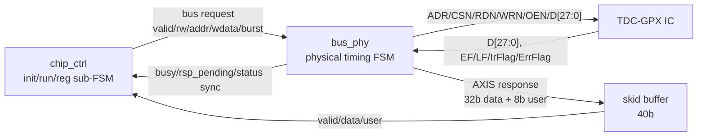
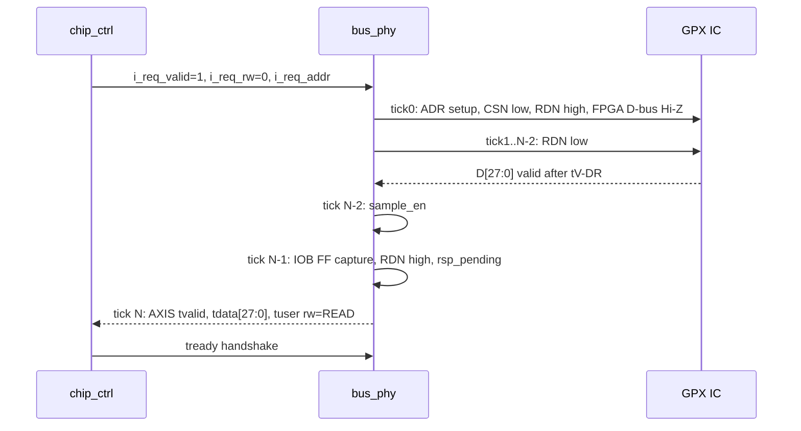
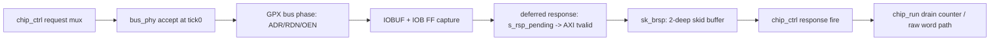
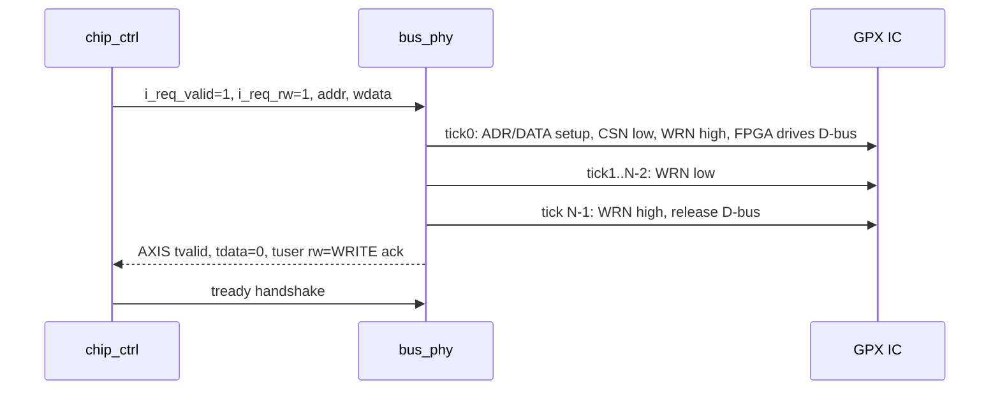
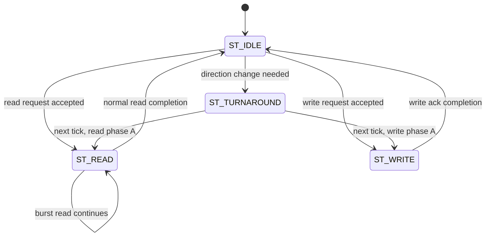

# C01_GPX_Bus_Read

문서 버전: `v009`  
작성일: `2026-04-29`  
최종 수정 시간: `2026-04-29 13:28:39 +09:00`  
작성 목적: GPX IC로부터 값을 읽어 오는 가장 앞단, 즉 `tdc_gpx_bus_phy`의 물리 버스 접근 primitive를 독립 Cluster로 분석하고 다음 Cluster인 chip acquisition이 의존해야 할 계약을 정리한다.

---

## 1. 이번 Cluster의 목적

`C01_GPX_Bus_Read`의 목적은 TDC-GPX IC와 FPGA 사이의 28-bit async parallel bus 접근이 운용상 안전한지 확인하는 것이다.

이 Cluster는 아직 shot/capture/drain 정책을 깊게 다루지 않는다. 그 정책은 `C02_Chip_Acquisition`에서 `tdc_gpx_chip_ctrl`과 `tdc_gpx_chip_run` 중심으로 확장한다.

이번 단계에서 닫아야 하는 질문은 다음과 같다.

1. GPX IC register/IFIFO read primitive가 timing 요구사항을 만족하는가?
2. FPGA가 bus를 drive하는 WRITE와 GPX IC가 bus를 drive하는 READ 사이에 bus contention 가능성이 없는가?
3. `bus_ticks`, `bus_clk_div`, `tick_en`의 운용 계약이 명확한가?
4. read/write 완료가 AXI-Stream response로 상위 FSM에 정확히 전달되는가?
5. GPX status pin인 `EF1/EF2/LF1/LF2/IrFlag/ErrFlag`가 안전하게 동기화되는가?

---

## 2. 분석 대상 파일

주 분석 대상:

| 파일 | 역할 |
|---|---|
| `Doc/TDC-GPX-Datasheet.pdf` | C01 bus interface, timing, OEN, EF/LF pin 의미의 기준 문서 |
| `tdc_gpx_bus_phy.vhd` | GPX IC 물리 bus timing FSM, IOBUF, read/write response, status pin synchronizer |
| `tdc_gpx_cfg_pkg.vhd` | bus timing legal table, 기본 BUS_TIMING init 값 |

참조 대상:

| 파일 | 참조 이유 |
|---|---|
| `tdc_gpx_config_ctrl.vhd` | `bus_phy`가 per-chip으로 어떻게 인스턴스되고 `chip_ctrl`과 연결되는지 확인 |
| `tdc_gpx_chip_ctrl.vhd` | `bus_phy` request/response를 어떤 계약으로 소비하는지 확인 |

이번 Cluster에서 의도적으로 깊게 보지 않는 항목:

- shot/capture/drain FSM의 세부 상태 전이
- IFIFO expected count 기반 drain 정책
- raw beat FIFO, decode, cell, VDMA output
- err_handler recovery 정책

---

## 3. 기준 데이터시트 근거

이번 v002부터 C01의 1차 기준은 `Doc/TDC-GPX-Datasheet.pdf`이다. 코드 주석이나 기존 package table은 데이터시트의 bus timing을 RTL clock tick으로 옮긴 2차 해석으로 본다.

### 데이터시트에서 확인한 C01 관련 사실

| 데이터시트 위치 | C01에 필요한 기준 |
|---|---|
| p.3 System overview | TDC-GPX는 `28 Bit` 또는 `2 x 16 Bit` asynchronous data bus를 사용하며 `CSN`, `RDN`, `WRN`, 4-bit address range를 가진다. 현재 RTL은 `c_TDC_BUS_WIDTH=28` 기준이다. |
| p.7 Bus Timings / Write operations | WRITE는 `ADR`, `CSN`, `DATA`, `WRN`의 setup/hold와 `WRN` low/high pulse width를 만족해야 한다. 주요 최소값은 `tS-AD=2 ns`, `tS-DW=5 ns`, `tH-DW=4 ns`, `tPW-WL=6 ns`, `tPW-WH=6 ns`이다. |
| p.7 Bus Timings / Read operations | READ는 `RDN` low/high pulse width와 data valid/hold window를 만족해야 한다. 주요 값은 `tPW-RL=6 ns`, `tPW-RH=6 ns`, `tV-DR=max 11.8 ns`, `tH-DR=min 4 ns`, `tS-EF=max 11.8 ns`이다. |
| p.7 Read operations 주의문 | Empty FIFO에서 read하는 것은 허용되지 않는다. 따라서 EF 기반 drain 판단은 C02에서 반드시 검증해야 한다. |
| p.8 OEN operations | `OEN=Low`이면 output buffer가 계속 bus를 drive하고, `OEN=High`이면 read strobe 동안만 drive한다. WRITE 중에는 반드시 `OEN=High`여야 한다. |
| p.8 16 Bit Mode / p.51 Bug Report | 16-bit mode는 command pair와 CSN workaround가 필요하다. 현재 C01은 28-bit bus만 분석하며, RTL은 Reg14[4]를 0으로 강제해 16-bit mode 진입을 막고 있다. |
| p.11~12 Pin Description | `EF1/EF2`는 Interface FIFO empty flag이며 active HIGH, `LF1/LF2`는 Interface FIFO load flag이며 active HIGH이다. `OEN`은 active LOW input이다. |

### C01 clock 기준

Bus_Phy가 샘플링하고 FSM tick을 진행하는 clock은 `i_tdc_clk=200 MHz`이다. 따라서 C01 timing 계산에서 `T_clk=5 ns`를 고정 기준으로 사용한다. `i_axis_aclk` 등 다른 clock domain의 150 MHz/200 MHz 표기는 C01의 GPX bus sampling 기준이 아니다.

---

## 4. Cluster 경계

### 입력 경계

이 Cluster가 받는 주요 입력은 `chip_ctrl` 계층에서 오는 bus transaction request이다.

| 입력 | 의미 |
|---|---|
| `i_tick_en` | `bus_clk_div`로 생성된 transaction phase tick |
| `i_bus_ticks` | 1 transaction을 몇 tick으로 구성할지 지정 |
| `i_req_valid` | read/write transaction 요청 |
| `i_req_rw` | `0`: READ, `1`: WRITE |
| `i_req_addr` | GPX register address |
| `i_req_wdata` | WRITE 시 28-bit data |
| `i_oen_permanent` | drain burst에서 GPX가 bus를 계속 drive하도록 하는 모드 |
| `i_req_burst` | back-to-back burst READ 유지 요청 |

### 출력 경계

이 Cluster의 출력은 두 종류다.

1. GPX IC 물리 pin 제어
2. 상위 `chip_ctrl`로 전달되는 AXI-Stream response와 동기화 status

| 출력 | 의미 |
|---|---|
| `o_adr` | GPX register address |
| `o_csn` | chip select |
| `o_rdn` | read strobe |
| `o_wrn` | write strobe |
| `o_oen` | GPX output enable 관련 제어 |
| `io_d` | 28-bit bidirectional data bus |
| `o_m_axis_tvalid/tdata/tuser` | read data 또는 write ack response |
| `o_busy` | transaction 진행 중 |
| `o_rsp_pending` | deferred response 또는 AXI response가 아직 소비되지 않음 |
| `o_ef1_sync/o_ef2_sync/...` | GPX async status pin의 2-FF synchronized 결과 |

---

## 5. 상위 연결 구조

`tdc_gpx_config_ctrl`는 chip별로 `bus_phy`, bus response skid buffer, `chip_ctrl`을 하나씩 생성한다.



연결 근거:

- `tdc_gpx_config_ctrl.vhd:1445-1483`: `u_bus_phy` 인스턴스와 GPX pin 연결
- `tdc_gpx_config_ctrl.vhd:1485-1503`: bus response skid buffer 및 pending merge
- `tdc_gpx_config_ctrl.vhd:1751-1764`: `chip_ctrl` request/response/status 연결

---

## 6. 정상 READ 운용 시퀀스

`bus_phy`의 READ는 tick phase 기반이다. IDLE에서 request를 받아들이는 순간이 `tick 0`이며, 이후 `ST_READ` 안에서 `s_tick_r`이 `1`부터 증가한다.



핵심 코드 근거:

- `tdc_gpx_bus_phy.vhd:278-288`: tick assignment와 Phase A/L/H 설명
- `tdc_gpx_bus_phy.vhd:455-473`: READ direct entry, OEN low, D-bus Hi-Z, tick 시작
- `tdc_gpx_bus_phy.vhd:527-548`: RDN low, sample_en, RDN high, rsp_pending
- `tdc_gpx_bus_phy.vhd:342-350`: deferred read response를 AXI-Stream으로 emit

### READ timing 공식과 기준점 분리

데이터시트 p.7의 READ timing을 clock tick으로 변환할 때는 기준점을 분리해야 한다. v001/v002의 `capture=15 ns` 표기는 `RDN low`가 실제로 발생한 뒤 IOB FF가 data를 capture할 때까지의 시간이다. 사용자가 지적한 `20 ns`는 transaction accept, 즉 `tick0`에서 IOB FF capture까지의 시간으로 보면 맞다.

```text
RDN low -> IOB FF capture delay
= ((bus_ticks - 3) * bus_clk_div + 1) * T_clk

transaction tick0 -> IOB FF capture delay
= ((bus_ticks - 2) * bus_clk_div + 1) * T_clk

RDN low pulse width
= (bus_ticks - 2) * bus_clk_div * T_clk

burst READ low-edge period
= bus_ticks * bus_clk_div * T_clk
```

기본 Bus_Phy 샘플링 clock은 200 MHz이므로 `T_clk = 5 ns`이다. 250 MHz 변경 검토 시에는 `T_clk = 4 ns`로 모든 tick 기반 값을 다시 계산해야 한다. C01에서 timing margin을 계산할 때는 output Stream clock 같은 다른 domain 값을 섞지 않는다.

예: `bus_clk_div=1`, `bus_ticks=5`

| 기준점 | 계산 | 결과 | 의미 |
|---|---:|---:|---|
| transaction `tick0` -> IOB FF capture | `((ticks - 2) * div + 1) * 5 ns` | `20 ns` | 주소 setup phase까지 포함한 내부 transaction 관점 |
| `RDN low` -> IOB FF capture | `((ticks - 3) * div + 1) * 5 ns` | `15 ns` | 데이터시트 `tV-DR` 검토 관점 |
| burst READ `RDN low` edge 간격 | `ticks * div * 5 ns` | `25 ns` | 연속 read beat rate 관점, 40 MHz |

따라서 v001/v002의 `15 ns`는 `tV-DR` 판단용으로는 맞지만, 표 제목이 단순히 `capture`로 되어 있어 transaction 관점의 `20 ns`와 혼동될 수 있었다. v003에서는 세 기준을 분리해서 기록한다.

### 정상 READ 운용 시퀀스: 200 MHz와 250 MHz 비교

아래 표는 동일한 Bus_Phy READ sequence를 clock만 바꿔 비교한 것이다. 비교 기준은 데이터시트 p.7의 READ timing과 p.27의 28-bit data bus 40 MHz transfer rate이다.

| 비교안 | `Tclk` | `div,ticks` | tick0->RDN low | RDN low->capture | tick0->capture | `tPW-RL` | burst low-edge period / rate | 판단 |
|---|---:|---:|---:|---:|---:|---:|---:|---|
| 200 MHz 최단 정상안 | 5 ns | `1,5` | 5 ns | 15 ns | 20 ns | 15 ns | 25 ns / 40 MHz | 정상 경계값. `tV-DR`, `tPW-RL`, 40 MHz 모두 만족 |
| 200 MHz 현재 기본 init | 5 ns | `2,5` | 10 ns | 25 ns | 35 ns | 30 ns | 50 ns / 20 MHz | 보수 정상안. 현재 init/CSR clamp와 일치 |
| 250 MHz에 같은 `1,5` 적용 | 4 ns | `1,5` | 4 ns | 12 ns | 16 ns | 12 ns | 20 ns / 50 MHz | 금지. `tV-DR` margin 0.2 ns이고 40 MHz 초과 |
| 250 MHz 최단 정상 후보 | 4 ns | `1,7` | 4 ns | 20 ns | 24 ns | 20 ns | 28 ns / 35.7 MHz | 정상 후보. 40 MHz 이하와 capture margin 확보 |
| 250 MHz 보수 후보 | 4 ns | `2,5` | 8 ns | 20 ns | 28 ns | 24 ns | 40 ns / 25 MHz | 보수 정상안. 속도보다 margin 우선 |

이 비교에서 중요한 점은 `div=1,ticks=5`가 200 MHz에서는 정상 경계값이지만, 250 MHz에서는 같은 설정이 더 이상 정상 READ 운용이 아니라는 것이다. 250 MHz로 변경하려면 최소한 `bus_ticks * bus_clk_div >= 7` 계약을 추가해야 하며, 실제 권장값은 timing margin을 고려해 `div=1,ticks=7` 또는 `div=2,ticks=5` 중에서 선택해야 한다.

### 125 MHz 이상 200 MHz 이하 정수 `Tclk` 후보 비교

사용자가 요청한 “200 MHz 이하, 125 MHz 이상에서 정수로 떨어지는 후보 clock”은 본 문서에서 `Tclk`가 정수 ns로 떨어지는 후보로 정의한다. 따라서 후보는 `Tclk=5/6/7/8 ns`, 즉 200 MHz, 166.667 MHz, 142.857 MHz, 125 MHz이다.

아래 표는 각 후보 clock에서 데이터시트 p.7 READ timing과 p.27의 40 MHz transfer rate를 만족하는 최단 정상 READ 설정을 고른 것이다.

| `Tclk` | clock | 최단 정상 `div,ticks` | tick0->RDN low | RDN low->capture | tick0->capture | `tPW-RL` | burst period / rate | 판단 |
|---:|---:|---:|---:|---:|---:|---:|---:|---|
| 5 ns | 200 MHz | `1,5` | 5 ns | 15 ns | 20 ns | 15 ns | 25 ns / 40 MHz | 최단 경계값. 가장 빠르지만 40 MHz 한계에 붙음 |
| 6 ns | 166.667 MHz | `1,5` | 6 ns | 18 ns | 24 ns | 18 ns | 30 ns / 33.3 MHz | 정상 후보. 200 MHz보다 여유 증가 |
| 7 ns | 142.857 MHz | `1,4` | 7 ns | 14 ns | 21 ns | 14 ns | 28 ns / 35.7 MHz | 정상 후보. ticks 4로도 40 MHz 이하 |
| 8 ns | 125 MHz | `1,4` | 8 ns | 16 ns | 24 ns | 16 ns | 32 ns / 31.25 MHz | 정상 후보. 가장 느리지만 timing margin 큼 |

해석:

- 200 MHz는 `div=1,ticks=5`에서 40 MHz 경계값에 정확히 붙는다.
- 166.667 MHz는 `div=1,ticks=5`를 유지해도 33.3 MHz로 내려가므로 margin이 생긴다.
- 142.857 MHz와 125 MHz는 `div=1,ticks=4`가 가능하다. 이때 142.857 MHz는 35.7 MHz, 125 MHz는 31.25 MHz이다.
- 150 MHz는 `Tclk=6.666... ns`라 본 절의 “정수 ns 후보”에서는 제외했다. 필요하면 별도 후보로 추가 비교할 수 있다.
- 최단 정상 설정만 보면 200 MHz가 가장 높은 readout rate를 제공하지만, 운용 margin과 timing closure 관점에서는 166.667 MHz 또는 142.857 MHz가 합리적 후보가 될 수 있다.

### Latency / Throughput / Pipeline / II 분석

이 절은 C01을 코딩 수정 단계로 넘기기 전에, 정상 READ primitive가 만드는 시간 비용과 병목 위치를 정리한다. 기준은 `bus_phy` 단독 latency와 `config_ctrl` 내부의 `bus_phy -> sk_brsp -> chip_ctrl/chip_run` pipeline latency를 분리한다.

#### Latency 공식

`tick0`는 `tdc_gpx_bus_phy`가 request를 accept하고 Phase A를 시작한 clock이다. `D=bus_clk_div`, `N=bus_ticks`, `T=Tclk`로 두면 다음과 같다.

```text
tick0 -> RDN low
= D * T

RDN low -> IOB FF capture
= ((N - 3) * D + 1) * T

tick0 -> IOB FF capture
= ((N - 2) * D + 1) * T

tick0 -> bus_phy AXI tvalid
= ((N - 1) * D + 1) * T

tick0 -> sk_brsp output valid
= bus_phy AXI tvalid + 1*T

tick0 -> chip_run response consumed
~= bus_phy AXI tvalid + 2*T
```

마지막 두 항목은 `tdc_gpx_skid_buffer`가 +1 cycle latency를 갖고, `chip_ctrl/chip_run`이 registered pipeline output을 다음 clock edge에서 소비한다고 본 보수적 운용 모델이다.

#### 후보 clock별 latency / throughput 비교

| clock | `Tclk` | `div,ticks` | capture latency | bus_phy tvalid | sk_brsp valid | chip_run consume | burst throughput |
|---:|---:|---:|---:|---:|---:|---:|---:|
| 200 MHz 최단 | 5 ns | `1,5` | 20 ns | 25 ns | 30 ns | 35 ns | 25 ns/word = 40 MHz |
| 200 MHz 기본 init | 5 ns | `2,5` | 35 ns | 45 ns | 50 ns | 55 ns | 50 ns/word = 20 MHz |
| 166.667 MHz 후보 | 6 ns | `1,5` | 24 ns | 30 ns | 36 ns | 42 ns | 30 ns/word = 33.3 MHz |
| 142.857 MHz 후보 | 7 ns | `1,4` | 21 ns | 28 ns | 35 ns | 42 ns | 28 ns/word = 35.7 MHz |
| 125 MHz 후보 | 8 ns | `1,4` | 24 ns | 32 ns | 40 ns | 48 ns | 32 ns/word = 31.25 MHz |
| 250 MHz 정상 후보 | 4 ns | `1,7` | 24 ns | 28 ns | 32 ns | 36 ns | 28 ns/word = 35.7 MHz |

해석:

- pure bus read latency만 보면 200 MHz `div=1,ticks=5`가 가장 빠르다.
- 현재 기본 init인 200 MHz `div=2,ticks=5`는 throughput이 20 MHz로 낮지만 timing margin이 크다.
- 142.857 MHz `div=1,ticks=4`는 35.7 MHz throughput을 유지하면서 capture latency가 21 ns라, 166.667 MHz보다 throughput이 높고 200 MHz 경계 운용보다 margin이 있다.
- 250 MHz 정상 후보 `div=1,ticks=7`은 latency가 200 MHz 최단보다 느리거나 비슷하고, throughput은 142.857 MHz 후보와 동일하다. 따라서 250 MHz 변경은 GPX bus READ 관점에서 뚜렷한 throughput 이득이 없다.

#### Throughput 분리: burst vs non-burst

Burst READ의 최대 sustainable throughput은 다음 공식으로 본다.

```text
burst word period = bus_ticks * bus_clk_div * Tclk
burst throughput  = 1 / burst word period
```

단, 이 값은 response path가 준비되어 있을 때의 상한이다. `tdc_gpx_bus_phy.vhd:569-576`은 burst 중에도 `s_axis_tvalid_r='0' or i_m_axis_tready='1'`일 때만 다음 beat로 재시작한다. 따라서 `sk_brsp` 또는 `chip_ctrl`가 backpressure를 걸면 burst throughput은 즉시 낮아진다.

Non-burst register READ는 `s_rsp_pending_r` 또는 `s_axis_tvalid_r`가 남아 있으면 새 request를 accept하지 않는다. 따라서 non-burst 처리량은 burst보다 낮고, SW register access나 개별 register read/write path는 “최대 readout rate”가 아니라 response drain latency와 tick alignment의 영향을 받는다.

#### II(Initiation Interval) 분석

II(Initiation Interval)는 “다음 READ transaction을 시작할 수 있는 최소 간격”이다. C01에서는 두 종류를 분리해야 한다.

1. Burst READ II: 같은 IFIFO drain burst 안에서 다음 read beat를 시작하는 간격
2. Non-burst READ II: 개별 register/IFIFO READ response가 완전히 빠진 뒤 다음 request를 accept할 수 있는 간격

`D=bus_clk_div`, `N=bus_ticks`, `T=Tclk`일 때, response path가 ready인 최선 조건의 II는 다음과 같다.

```text
Burst READ II
= N * D * T

Non-burst READ II cycles
= ceil_to_tick(((N - 1) * D + 3), D)

Non-burst READ II time
= Non-burst READ II cycles * T
```

여기서 `ceil_to_tick(x, D)`는 `x` cycle 이후에 도착하는 다음 `tick_en` 경계를 의미한다. Non-burst는 `s_rsp_pending_r`가 AXI tvalid로 변환되고, `s_axis_tvalid_r`가 `tready` handshake로 내려간 다음에야 `ST_IDLE`에서 새 request를 accept할 수 있기 때문에 burst보다 II가 크다.

| clock/cfg | Burst II | Non-burst II(best) | 의미 |
|---|---:|---:|---|
| 200 MHz `div=1,ticks=5` | 25 ns | 35 ns | burst는 40 MHz 경계, non-burst는 response serialization 때문에 약 28.6 MHz 수준 |
| 200 MHz `div=2,ticks=5` | 50 ns | 60 ns | 현재 기본 init 기준. margin은 크지만 II가 길다 |
| 166.667 MHz `div=1,ticks=5` | 30 ns | 42 ns | 33.3 MHz burst, non-burst 약 23.8 MHz |
| 142.857 MHz `div=1,ticks=4` | 28 ns | 42 ns | burst 35.7 MHz, non-burst 약 23.8 MHz |
| 125 MHz `div=1,ticks=4` | 32 ns | 48 ns | burst 31.25 MHz, non-burst 약 20.8 MHz |
| 250 MHz `div=1,ticks=7` | 28 ns | 36 ns | burst는 142.857 MHz 후보와 동일, non-burst는 짧지만 clock 상향 비용 존재 |

II 관점의 판단:

- GPX bus throughput을 높이는 핵심은 non-burst READ 반복이 아니라 burst READ 경로를 안정적으로 유지하는 것이다.
- `tdc_gpx_bus_phy.vhd:569-576`에 의해 burst는 response path가 ready일 때만 다음 beat로 재시작한다. 따라서 burst II는 `sk_brsp`, `chip_ctrl`, raw/downstream path의 backpressure에 의해 늘어날 수 있다.
- `tdc_gpx_bus_phy.vhd:373-383`의 acceptance guard 때문에 non-burst READ는 response가 남아 있는 동안 새 request를 받지 않는다.
- `o_rsp_pending`을 register boundary로 바꾸면 pending 관측이 1 clock 늦어질 수 있으므로, C02에서 non-burst II와 PH_RESP_DRAIN exit 조건의 영향을 함께 확인해야 한다.

#### Pipeline stage와 backpressure



Backpressure 의미:

- `bus_phy`는 response가 남아 있으면 새 request를 막는다.
- `sk_brsp`는 +1 cycle latency를 추가하지만 1 beat/cycle throughput을 유지한다.
- `chip_ctrl`는 RUN drain에서 raw hold가 full이면 bus response `tready`를 낮춘다.
- `i_bus_rsp_pending`은 bus_phy pending과 skid output valid를 합쳐 `chip_run`으로 전달된다.
- burst drain은 response path가 막히면 다음 beat로 진행하지 못하므로, 실제 throughput은 raw path/CDC/downstream backpressure에 의해 제한된다.
- II는 pipeline stage가 모두 ready인 상태의 최선값과 backpressure가 걸린 실제값을 분리해 보아야 한다.

코딩 수정 단계에서의 의미:

1. clock 후보를 바꿀 때는 `bus_ticks/bus_clk_div` clamp만 수정하면 부족하다. latency/throughput 표도 함께 갱신되어야 한다.
2. `o_rsp_pending`을 register boundary로 바꾸면 `chip_run`이 보는 pending이 1 clock 늦어질 수 있으므로, 위 pipeline latency에 +1 clock이 추가되는지 C02에서 확인해야 한다.
3. 250 MHz는 GPX bus READ throughput 관점의 이득이 작고, `div=1,ticks=5` illegal 위험과 timeout 상수 재스케일 비용이 크다.
4. 코딩 수정의 우선순위는 clock 상향보다 `div/ticks legality`, OEN mode, output stream CDC, pending boundary를 안전하게 닫는 쪽이 합리적이다.
5. II 관점에서는 burst path를 유지하는 것이 중요하므로, 코딩 수정 시 `i_req_burst`, `s_axis_tvalid_r`, `i_m_axis_tready`, `s_bus_rsp_pending` 관계를 assertion으로 검증해야 한다.

GPX datasheet READ 조건:

| 항목 | 조건 |
|---|---|
| `tS-AD` | address setup before strobe low >= 2 ns |
| `tH-AD` | address hold after strobe high >= 0 ns |
| `tS-CSN` / `tH-CSN` | chip select setup/hold >= 0 ns |
| `tPW-RL` | RDN low pulse width >= 6 ns |
| `tPW-RH` | RDN high pulse width in burst >= 6 ns |
| `tV-DR` | data valid delay after RDN low: max 11.8 ns |
| `tH-DR` | data hold after RDN high: min 4 ns, max 8.5 ns. 데이터시트 주석상 `OEN=0`과 stable address이면 hold를 길게 유지할 수 있다. |
| `tS-EF` | last data read 후 EF set: max 11.8 ns |
| Empty FIFO rule | 데이터시트는 empty FIFO read를 금지한다. `bus_phy`는 EF를 동기화만 하므로, 실제 drain 제어는 C02에서 EF 기반으로 검증해야 한다. |

운용상 legal 조합:

| clock | div | ticks | tick0->capture | RDN low->capture | burst low-edge period | rate | 상태 |
|---:|---:|---:|---:|---:|---:|---:|---|
| 200 MHz | 1 | 4 | 15 ns | 10 ns | 20 ns | 50 MHz | illegal, `tV-DR` 보장 전 sample이며 40 MHz도 초과 |
| 200 MHz | 1 | 5 | 20 ns | 15 ns | 25 ns | 40 MHz | 데이터시트 최대 readout 관점의 최단 정상안 |
| 200 MHz | 2 | 4 | 25 ns | 15 ns | 40 ns | 25 MHz | OK |
| 200 MHz | 2 | 5 | 35 ns | 25 ns | 50 ns | 20 MHz | OK, 현재 기본 init |
| 250 MHz | 1 | 5 | 16 ns | 12 ns | 20 ns | 50 MHz | illegal, 40 MHz 초과. `tV-DR` margin도 0.2 ns뿐 |
| 250 MHz | 1 | 6 | 20 ns | 16 ns | 24 ns | 41.7 MHz | illegal, 40 MHz 초과 |
| 250 MHz | 1 | 7 | 24 ns | 20 ns | 28 ns | 35.7 MHz | OK, 250 MHz 최단 정상 후보 |
| 250 MHz | 2 | 5 | 28 ns | 20 ns | 40 ns | 25 MHz | OK, 250 MHz 보수 후보 |

데이터시트 p.27은 28-bit data bus가 40 MHz transfer rate를 지원한다고 설명한다. 그러므로 C01 운용 정책은 40 MHz보다 빠른 readout을 목표로 잡지 않는다. `div=1,ticks=5`는 이론상 40 MHz로 경계값이며, 현재 CSR path는 `c_BUS_CLK_DIV_MIN=2`로 clamp하므로 기본 운용은 이보다 느리다.

근거:

- `Doc/TDC-GPX-Datasheet.pdf`: p.7 Read Operations
- `Doc/TDC-GPX-Datasheet.pdf`: p.27 Data bus capable of 40 MHz transfer rate
- `tdc_gpx_bus_phy.vhd:33-52`
- `tdc_gpx_bus_phy.vhd:527-548`
- `tdc_gpx_cfg_pkg.vhd:266-305`
- `tdc_gpx_cfg_pkg.vhd:317-318`: init `bus_clk_div=2`, `bus_ticks=5`

---

## 7. 정상 WRITE 운용 시퀀스

WRITE는 FPGA가 `io_d`를 drive한다. 따라서 bus contention 방지를 위해 WRITE 중에는 OEN과 tri-state 제어가 중요하다. 데이터시트 p.8은 WRITE 중 `OEN`이 반드시 HIGH여야 한다고 명시한다.



핵심 코드 근거:

- `tdc_gpx_bus_phy.vhd:418-435`: WRITE direct entry, FPGA D-bus drive
- `tdc_gpx_bus_phy.vhd:608-630`: WRN low, 완료, D-bus release, write ack response

GPX datasheet WRITE 조건:

| 항목 | 조건 | Bus_Phy 해석 |
|---|---|---|
| `tS-AD` | address setup before WRN low >= 2 ns | tick0에서 address를 먼저 내고 tick1부터 WRN low이므로 최소 1 phase tick 확보 |
| `tH-AD` | address hold after WRN high >= 0 ns | transaction 종료 시 address hold 요구는 0 ns라 FSM 구조상 충족 |
| `tS-DW` | write data setup before WRN high >= 5 ns | data는 tick0부터 drive되고 WRN은 tick1..N-2 동안 low |
| `tH-DW` | write data hold after WRN high >= 4 ns | WRN high 전환 edge와 data release edge의 상대 timing은 waveform 검증 대상 |
| `tPW-WL` | WRN low pulse width >= 6 ns | `bus_clk_div=2`, `bus_ticks=5` 기본값에서 30 ns 확보 |
| `tPW-WH` | WRN high pulse width >= 6 ns | back-to-back write에서도 Phase H + 다음 Phase A로 2 phase tick 확보 |
| `OEN` | WRITE 중 OEN must be HIGH | `ST_WRITE`에서 `s_oen_r='1'` 유지 |

---

## 8. FSM 구조

`tdc_gpx_bus_phy`의 FSM은 4개 state로 구성된다.



상태별 의미:

| State | 의미 |
|---|---|
| `ST_IDLE` | request 수락 대기, bus strobes high, D-bus Hi-Z |
| `ST_TURNAROUND` | READ/WRITE 방향 전환을 위한 1 tick gap |
| `ST_READ` | RDN phase 제어, IOB FF sample, deferred read response 생성 |
| `ST_WRITE` | WRN phase 제어, FPGA data drive, write ack 생성 |

핵심 코드 근거:

- `tdc_gpx_bus_phy.vhd:151-156`: FSM state 정의
- `tdc_gpx_bus_phy.vhd:359-476`: `ST_IDLE`
- `tdc_gpx_bus_phy.vhd:484-512`: `ST_TURNAROUND`
- `tdc_gpx_bus_phy.vhd:527-597`: `ST_READ`
- `tdc_gpx_bus_phy.vhd:608-635`: `ST_WRITE`

---

## 9. Bus contention 방지 계약

`bus_phy`는 다음 safety invariant를 명시한다.

데이터시트 p.8의 OEN 기준은 이 절의 핵심 전제이다. `OEN=Low`이면 GPX output buffer가 계속 bus를 drive하고, `OEN=High`이면 read strobe 동안만 drive한다. 특히 WRITE 중에는 `OEN=High`가 필수이다.

| Invariant | 설명 | 코드상 구현 |
|---|---|---|
| `INV-1` | WRITE 시 FPGA가 data bus를 drive하고 GPX `OEN`은 HIGH로 둔다 | WRITE entry 및 `ST_WRITE` |
| `INV-2` | READ 시 FPGA D-bus는 Hi-Z이며 GPX가 drive한다 | READ entry 및 `ST_READ` |
| `INV-3` | IDLE 시 D-bus Hi-Z, 단 `oen_permanent` 예외 | `ST_IDLE` |
| `INV-5` | WRITE -> READ 전환 시 turnaround gap | `ST_TURNAROUND` |
| `INV-6` | READ -> WRITE 전환 시 OEN high leading gap | `ST_TURNAROUND` |
| `INV-7` | `oen_permanent=1` 동안 WRITE 금지 | `ST_IDLE` WRITE branch |

중요한 점은 READ/WRITE 방향 전환에서 즉시 반대 방향 transaction에 진입하지 않고 `ST_TURNAROUND`를 거친다는 것이다. 이 gap은 bus contention을 피하는 가장 직접적인 보호 장치다.

근거:

- `Doc/TDC-GPX-Datasheet.pdf`: p.8 OEN operations
- `tdc_gpx_bus_phy.vhd:54-60`: invariant 주석
- `tdc_gpx_bus_phy.vhd:403-416`: READ 이후 WRITE 요청 시 turnaround
- `tdc_gpx_bus_phy.vhd:440-453`: WRITE 이후 READ 요청 시 turnaround
- `tdc_gpx_bus_phy.vhd:484-510`: turnaround state에서 strobe high, D-bus Hi-Z, OEN high 유지

---

## 10. AXI-Stream response 계약

`bus_phy`는 read/write 완료를 단일 AXI-Stream response path로 전달한다.

| Field | READ response | WRITE response |
|---|---|---|
| `tvalid` | read data valid | write ack valid |
| `tdata[27:0]` | GPX read data | zero |
| `tdata[31:28]` | zero | zero |
| `tuser[0]` | `0` READ | `1` WRITE |
| `tuser[4:1]` | target address | target address |
| `tkeep` | `1111` | `1111` |

상위 `chip_ctrl`는 raw `tvalid`가 아니라 `valid AND ready`인 fire pulse를 사용해야 한다.

근거:

- `tdc_gpx_bus_phy.vhd:10-17`: response interface 설명
- `tdc_gpx_bus_phy.vhd:327-350`: tvalid hold와 deferred read response
- `tdc_gpx_bus_phy.vhd:654-660`: output assignment
- `tdc_gpx_chip_ctrl.vhd:592-602`: `o_s_axis_tready`와 `s_bus_rsp_fire`

### `o_rsp_pending`의 의미

`o_rsp_pending`은 단순히 내부 FSM busy가 아니라, response가 아직 소비되지 않았음을 나타낸다.

```vhdl
o_rsp_pending <= s_rsp_pending_r or s_axis_tvalid_r;
```

이 신호는 `chip_ctrl`의 drain/flush watchdog이 downstream backpressure를 bus hang으로 오인하지 않도록 하는 데 쓰인다.

근거:

- `tdc_gpx_bus_phy.vhd:654-655`
- `tdc_gpx_config_ctrl.vhd:1502-1503`: `bus_phy` pending + skid valid merge
- `tdc_gpx_chip_ctrl.vhd:607-614`: `chip_run`으로 pending 전달

---

## 11. Burst READ 운용

Burst READ는 IFIFO drain에서 중요하다.

`bus_phy`의 burst 정책:

1. `s_oen_perm_r`는 burst 시작 시 latch된다.
2. `i_req_burst`는 live로 본다.
3. burst 유지 중에도 response가 소비되지 않으면 다음 read로 진행하지 않고 hold한다.
4. burst read 간 RDN high gap은 Phase H + Phase A로 2 ticks 확보된다.

이 설계의 의미:

- `oen_permanent`가 중간에 흔들려도 burst 중 GPX output enable 정책은 안정된다.
- `chip_run`은 `i_req_burst`를 낮춰 mid-burst abort를 요청할 수 있다.
- AXI response backpressure가 있으면 read를 더 진행하지 않으므로 response overwrite가 없다.

근거:

- `tdc_gpx_bus_phy.vhd:552-576`

---

## 12. Status pin synchronizer

GPX IC의 status pin은 async input이다.

대상 pin:

- `EF1`: Interface FIFO 1 empty flag, active HIGH
- `EF2`: Interface FIFO 2 empty flag, active HIGH
- `LF1`: Interface FIFO 1 load flag, active HIGH
- `LF2`: Interface FIFO 2 load flag, active HIGH
- `IrFlag`: interrupt flag, active HIGH
- `ErrFlag`: error flag, active HIGH

`bus_phy`는 각 pin에 대해 2-FF synchronizer를 두고 `ASYNC_REG` attribute를 부여한다.


운용상 의미:

- metastability에 대한 기본 방어는 있다.
- 단, pulse 폭이 `i_tdc_clk` 기준으로 충분히 길어야 한다. 매우 짧은 pulse는 2-FF sync만으로 event capture 보장이 되지 않는다.
- 이 Cluster에서는 status pin의 의미를 동기화된 level로 다음 Cluster에 넘긴다. IrFlag/EF 기반 drain 정책은 `C02`에서 분석한다.

근거:

- `Doc/TDC-GPX-Datasheet.pdf`: p.11~12 Pin Description
- `tdc_gpx_bus_phy.vhd:234-246`: `ASYNC_REG`
- `tdc_gpx_bus_phy.vhd:665-705`: 2-FF synchronizer

---

## 13. 코드 리뷰 결과

### F-C01-01. READ timing 표기는 기준점이 분리되어야 한다

v001/v002의 `div=1,ticks=5,capture=15 ns`는 `RDN low -> IOB FF capture` 기준으로는 맞다. 그러나 transaction `tick0 -> IOB FF capture` 기준으로는 20 ns이다. 문서가 기준점을 명확히 표시하지 않으면, 사용자가 지적한 것처럼 계산 결과가 서로 충돌해 보인다.

또한 데이터시트 p.27의 28-bit data bus 40 MHz transfer rate를 함께 고려하면, `div=1,ticks=5`는 burst read low-edge period가 25 ns로 정확히 40 MHz 경계값이다. `div=1,ticks=4`는 50 MHz가 되므로 `tV-DR` 위반뿐 아니라 데이터시트 readout rate 관점에서도 금지해야 한다.

현재 보호:

- `bus_phy`는 `ticks >= 4`만 assert/clamp한다.
- CSR output path는 `tdc_gpx_csr_chip.vhd`에서 `bus_clk_div >= c_BUS_CLK_DIV_MIN(2)`로 clamp한다.
- `tdc_gpx_cfg_pkg`의 table은 `div=1,ticks=5`를 fastest 후보로 쓰지만, 같은 파일의 `c_BUS_CLK_DIV_MIN=2`와 운용 정책상 실제 CSR 경로에서는 div=1을 막는다.

운용상 필요한 계약:

- C01 문서와 code comment는 `tick0->capture`, `RDN low->capture`, `burst beat period`를 분리해서 표기해야 한다.
- 40 MHz보다 빠른 GPX data bus readout 조합은 금지한다.
- CSR clamp 또는 SW policy는 `div=1,ticks=4`를 반드시 금지해야 한다.
- 현재처럼 `div>=2`를 유지하면 정상 CSR 운용에서는 F-C01-01의 위험이 낮아진다.

위험도: 중간  
근거:

- `tdc_gpx_bus_phy.vhd:385-388`, `tdc_gpx_bus_phy.vhd:426-430`, `tdc_gpx_bus_phy.vhd:462-466`
- `tdc_gpx_bus_phy.vhd:527-548`
- `tdc_gpx_cfg_pkg.vhd:286-299`
- `tdc_gpx_csr_chip.vhd:846-859`
- `tdc_gpx_chip_ctrl.vhd:629-636`
- `Doc/TDC-GPX-Datasheet.pdf`: p.7 Read Operations, p.27 data bus 40 MHz transfer rate

#### v004 보완 판단: `c_BUS_CLK_DIV_MIN=1` 전환과 Bus_Phy 자체 보호

사용자 판단에 따라 최종 목표는 `tdc_gpx_cfg_pkg.vhd`의 `c_BUS_CLK_DIV_MIN`을 `1`로 낮추는 것이다. 다만 이 변경은 단순 constant 변경으로 끝나면 안 된다. `div=1`을 허용하면 `ticks=4` 조합이 다시 들어올 수 있고, 이 조합은 `tV-DR`과 40 MHz readout 한계를 모두 위반한다.

C01 범위에서 필요한 운용 계약은 다음과 같다.

| 항목 | 계약 |
|---|---|
| `div=1` 허용 조건 | `ticks >= 5`이어야 한다. |
| `div>=2` 허용 조건 | `ticks >= 4`이면 된다. |
| 공통 timing 제약 | `(ticks - 3) * div >= 2`를 만족해야 한다. |
| 공통 readout 제약 | `ticks * div >= 5`, 즉 200 MHz 기준 read beat가 25 ns보다 짧아지면 안 된다. |

현재 `tdc_gpx_bus_phy`는 `i_bus_ticks`만 받고 `bus_clk_div`를 직접 받지 않는다. 따라서 `c_BUS_CLK_DIV_MIN=1`을 안전하게 지원하려면 다음 둘 중 하나가 필요하다.

1. 권장안: `tdc_gpx_bus_phy`에 `i_bus_clk_div`를 추가하고, transaction accept 시 `s_bus_clk_div_r`와 `s_bus_ticks_r`를 함께 latch한다. 그 뒤 Bus_Phy 내부에서 `div=1`이면 최소 `ticks=5`, 그 외에는 최소 `ticks=4`로 clamp/assert한다.
2. 대안: upstream인 CSR/chip_ctrl에서 이미 legalize된 `i_bus_ticks_eff`만 Bus_Phy에 넘긴다. 이 경우 Bus_Phy 단독으로는 보호할 수 없으므로, Cluster 경계 계약이 약해진다.

모듈 경계가 스스로 안전해야 한다는 새 운영 기준을 적용하면 권장안이 더 낫다. 실제 RTL 변경 영향성은 `chip_ctrl`의 tick generator, `csr_chip`의 clamp, `config_ctrl`의 port map까지 같이 봐야 하므로 C02 또는 별도 영향성 Cluster에서 진행한다.

추적 항목:

- 영향성 분석 ID: `I-C01-01-to-C02`
- 다음 분석 위치: `tdc_gpx_cfg_pkg.vhd`, `tdc_gpx_csr_chip.vhd`, `tdc_gpx_chip_ctrl.vhd`, `tdc_gpx_config_ctrl.vhd`, `tdc_gpx_bus_phy.vhd`

### F-C01-02. C01 bus clock 200 MHz와 output stream 150 MHz는 별도 clock-domain 계약이다

사용자 피드백 기준으로 GPX IC를 제어하고 capture하는 clock은 200 MHz이다. 이 clock으로 만들어진 tick이 GPX read/write strobe를 제어하며, GPX data bus readout은 데이터시트의 40 MHz transfer rate를 넘지 않도록 운용한다. 출력 Stream clock 150 MHz는 GPX bus timing 계산에 들어가는 값이 아니라 downstream 전송 domain으로 분리해서 보아야 한다.

따라서 F-C01-02는 결함이라기보다 clock-domain contract 문서화 항목이다. 다만 여러 GPX chip을 aggregate하는 구간에서는 총 bandwidth가 150 MHz stream에서 충분한지 C03/C04에서 별도 검증해야 한다.

위험도: 낮음-중간  
조치:

- `C01`에서는 `i_tdc_clk=200 MHz`를 bus timing 기준으로 명시한다.
- output stream 150 MHz는 GPX bus timing이 아니라 후단 pipeline throughput 관점에서 분석한다.
- multi-chip aggregate bandwidth는 C02 이후 downstream Cluster에서 확인한다.

근거:

- 사용자 피드백: Bus_Phy sampling clock은 200 MHz
- 사용자 피드백: output Stream 속도는 150 MHz로 반영 의도
- `tdc_gpx_bus_phy.vhd:33`
- `tdc_gpx_cfg_pkg.vhd:266-305`
- `tdc_gpx_config_ctrl.vhd:23`

#### v004 보완 판단: Stream out clock port와 Sync/Async generic 전략

현재 `tdc_gpx_top.vhd`에는 output AXI-Stream 전용 clock port가 없다. top-level output stream은 `i_axis_aclk` domain에서 구동되는 구조로 보이며, `i_tdc_clk=200 MHz`와 output stream 150 MHz 의도를 명확히 표현하려면 clock-domain 계약을 강화해야 한다.

권장 포트/제너릭 방향:

| 항목 | 제안 |
|---|---|
| output clock port | `i_m_axis_aclk`, `i_m_axis_aresetn` 추가 |
| mode generic | `g_STREAM_CLK_MODE` 또는 동등 generic으로 `SYNC` / `ASYNC` 선택 |
| SYNC mode | `i_m_axis_aclk`가 processing clock과 동일하다는 계약. 기존 구조에 clock port만 명시적으로 반영하면 된다. |
| ASYNC mode | processing/output clock이 다르므로 final AXI master 앞에 AXI async FIFO가 필요하다. rising/falling stream 각각 CDC FIFO가 필요하다. |

합리적 판단:

- GPX IC에서 read되는 data beat는 최대 40 MHz 수준이지만, 이를 제어하는 FSM과 내부 capture는 200 MHz 기준이다.
- output stream이 150 MHz이면 처리량 자체는 단일 stream 기준으로 충분할 가능성이 높다.
- 그러나 clock이 다르면 valid/ready backpressure가 clock boundary를 통과해야 하므로 단순 wire 연결은 안 된다.
- ASYNC mode에서는 `tvalid/tdata/tlast/tuser`와 `tready`를 포함한 AXI handshake 전체를 async FIFO로 건너야 한다.

따라서 C01 판단은 다음과 같다.

- Sync mode는 현재 구조와 가장 가깝고 위험이 낮다.
- Async mode를 지원하려면 output stream clock port와 async FIFO 삽입이 필수이다.
- 이 항목은 C01 Bus_Phy 내부보다 top/downstream boundary의 영향이 크므로 C03/C04 또는 downstream Cluster에서 구체 RTL 영향성을 분석한다.

추적 항목:

- 영향성 분석 ID: `I-C01-02-to-ClockDomain`
- 다음 분석 위치: `tdc_gpx_top.vhd:46-52`, `tdc_gpx_top.vhd:134-146`, `tdc_gpx_top.vhd:701-758`

### F-C01-03. `oen_permanent`는 강력하지만 운용 설명이 필요하다

`oen_permanent`는 burst drain에서 GPX가 계속 bus를 drive하는 맥락으로 보인다. 데이터시트 p.8은 `OEN=Low`일 때 GPX output buffer가 계속 bus를 drive한다고 설명한다. 이때 WRITE 요청은 무시되고 simulation warning만 발생한다.

운용상 의미:

- `oen_permanent=1` 기간에는 read/drain 전용 구간으로 취급해야 한다.
- 상위 FSM이 이 기간 WRITE를 만들지 않는다는 구조적 보장이 필요하다.
- `C02`에서 `chip_run`이 언제 `o_bus_oen_permanent`를 올리는지 검증해야 한다.

위험도: 낮음-중간  
근거:

- `Doc/TDC-GPX-Datasheet.pdf`: p.8 OEN operations
- `tdc_gpx_bus_phy.vhd:366-370`
- `tdc_gpx_bus_phy.vhd:392-401`
- `tdc_gpx_bus_phy.vhd:552-576`
- `tdc_gpx_chip_ctrl.vhd:589-590`

### F-C01-04. Response backpressure 처리 구조는 적절하나 검증 포인트가 중요하다

`bus_phy`는 `s_axis_tvalid_r`가 남아 있으면 새 request를 받지 않는다. 또 burst 중 response가 소비되지 않으면 다음 read로 넘어가지 않는다. 이 구조는 response overwrite 방지에 합리적이다.

다만 검증에서는 다음 조건을 반드시 확인해야 한다.

- `tready=0`이 오래 유지될 때 RDN/CSN/OEN이 의도한 상태로 hold되는가?
- `o_busy`와 `o_rsp_pending` 조합이 `chip_ctrl`에서 premature idle로 해석되지 않는가?
- response skid buffer에 valid가 남아 있을 때 `i_bus_rsp_pending`이 유지되는가?

위험도: 낮음  
근거:

- `tdc_gpx_bus_phy.vhd:327-350`
- `tdc_gpx_bus_phy.vhd:373-383`
- `tdc_gpx_bus_phy.vhd:571-576`
- `tdc_gpx_config_ctrl.vhd:1485-1503`

### F-C01-05. 16-bit mode는 현재 RTL 범위 밖이며 차단 정책이 유지되어야 한다

데이터시트 p.8은 16-bit mode에서 모든 read/write command를 pair로 수행해야 한다고 설명하고, p.51 bug report는 16-bit bus에서 CSN 관련 malfunction과 workaround를 제시한다. 현재 `bus_phy`와 raw path는 28-bit bus 기준으로 설계되어 있으므로 Reg14[4]를 켜면 C01의 transaction 계약이 깨진다.

현재 RTL은 이 위험을 완화하고 있다.

- `tdc_gpx_chip_init.vhd`는 Reg14 write 시 bit4를 0으로 강제한다.
- `tdc_gpx_chip_reg.vhd`도 직접 Reg14 write에서 bit4를 0으로 강제한다.
- CSR init 값도 Reg14를 0으로 둔다.

운용상 필요한 계약:

- 16-bit mode는 현재 시스템에서 지원하지 않는 명시적 금지 모드로 문서화한다.
- 향후 16-bit mode를 지원하려면 Bus_Phy transaction pair, CSN bug workaround, raw data assembly를 별도 Cluster/변경으로 설계해야 한다.

위험도: 낮음, 단 차단 정책이 제거되면 높음  
근거:

- `Doc/TDC-GPX-Datasheet.pdf`: p.8 16 Bit Mode, p.51 Bug Report
- `tdc_gpx_chip_init.vhd:236-241`
- `tdc_gpx_chip_reg.vhd:176-182`
- `tdc_gpx_csr_chip.vhd:403`

### F-C01-06. Empty FIFO read 금지는 C02의 최우선 검증 조건이다

데이터시트 p.7은 empty FIFO read를 금지한다. `bus_phy`는 `EF1/EF2`를 동기화해서 상위에 전달하지만, READ 요청 자체가 empty FIFO인지 판단하지 않는다. 따라서 C01 단독으로는 empty FIFO read 금지를 보장하지 못하며, 이 책임은 `chip_ctrl/chip_run`의 drain policy로 넘어간다.

운용상 필요한 계약:

- C02는 `EF1/EF2 active HIGH`를 기준으로 IFIFO drain 시작/중지 조건을 검증해야 한다.
- burst read 중 마지막 data 이후 `tS-EF <= 11.8 ns`와 200 MHz 2-FF synchronization latency를 고려해, EF 관측과 다음 read 요청 사이에 빈 FIFO를 읽지 않는지 확인해야 한다.

위험도: 중간  
근거:

- `Doc/TDC-GPX-Datasheet.pdf`: p.7 Read Operations, p.11~12 Pin Description
- `tdc_gpx_bus_phy.vhd:683-692`
- `tdc_gpx_bus_phy.vhd:700-703`

### F-C01-07. OEN pin 미연결/고정 예외는 generic 운용 모드가 필요하다

데이터시트 p.8에 따르면 `OEN=Low`이면 GPX output buffer가 계속 bus를 drive하고, `OEN=High`이면 read strobe 동안만 drive한다. WRITE 중에는 반드시 `OEN=High`여야 한다.

회로 상황별 판단:

| 회로 상태 | 판단 | 이유 |
|---|---|---|
| OEN이 GPX IC에 정상 연결 | 현재 `bus_phy` 정책과 일치 | READ에서 Low, WRITE에서 High, drain burst에서 permanent Low를 사용할 수 있다. |
| OEN 미연결 또는 pull-up으로 High 고정 | 기본 READ/WRITE는 대체로 가능하지만 `oen_permanent` 최적화는 무효 | GPX는 read strobe 동안만 drive한다. burst read 자체는 가능하나 permanent output hold를 가정하면 안 된다. |
| OEN pull-down 또는 Low 고정 | 현재 모듈 운용과 양립 불가 | WRITE 중에도 GPX가 bus를 drive하므로 데이터시트 위반과 bus contention 위험이 있다. config write가 필요한 현재 구조에서는 지원 불가로 보는 것이 맞다. |

권장 예외처리 방향:

- `g_OEN_MODE` 또는 동등 generic으로 OEN 운용 모드를 명시한다.
- 지원 모드는 `DYNAMIC_CONNECTED`, `PULLUP_OR_NOT_CONNECTED` 두 가지로 제한한다.
- 회로적으로 OEN pull-down 또는 Low 고정은 없다고 강제한다. 따라서 Low 고정 지원 로직은 만들지 않고, configuration assertion으로 막는다.
- `PULLUP_OR_NOT_CONNECTED` 운용에서는 `i_oen_permanent`를 내부적으로 무시하거나 금지하고, drain burst timing을 OEN permanent 비의존 방식으로 검증한다.

v004 기준 OEN 전략:

| 모드 | 회로 조건 | Bus_Phy 정책 |
|---|---|---|
| `DYNAMIC_CONNECTED` | OEN pin이 GPX IC와 정상 연결 | 현재처럼 READ에서 OEN Low, WRITE에서 OEN High, drain burst에서 `oen_permanent` 허용 |
| `PULLUP_OR_NOT_CONNECTED` | OEN pin 미연결 또는 pull-up으로 High 유지 | GPX는 read strobe 동안만 bus drive. `oen_permanent`는 비활성화하고 normal RDN strobe timing으로 read |

`PULLUP_OR_NOT_CONNECTED`에서 regular READ는 가능하다고 판단한다. 데이터시트상 OEN High이면 GPX output buffer는 read strobe 동안 drive하고, 현재 sample은 RDN high 전환 edge에서 이뤄지므로 `tH-DR` hold window 안에 있다. 다만 permanent output hold를 전제로 한 drain 최적화는 사용할 수 없다.

위험도: 중간  
근거:

- `Doc/TDC-GPX-Datasheet.pdf`: p.8 OEN operations, p.11~12 OEN active LOW input
- `tdc_gpx_bus_phy.vhd:367-370`
- `tdc_gpx_bus_phy.vhd:394-401`
- `tdc_gpx_bus_phy.vhd:459-460`
- `tdc_gpx_bus_phy.vhd:606-630`

### F-C01-08. `tdc_gpx_bus_phy`는 next-state 조합 FSM은 없지만 경계 출력 하나는 조합 OR이다

`tdc_gpx_bus_phy`의 주요 제어는 `p_iob_ff`, `p_fsm`, `p_sync` 세 개의 clocked process로 구성되어 있다. next-state 조합 process는 없고, GPX physical pin 출력 대부분은 register에서 직접 나온다.

다만 다음 예외가 있다.

- `o_rsp_pending <= s_rsp_pending_r or s_axis_tvalid_r`는 조합 OR이다.
- `IOBUF`의 `O => s_d_in` 경로는 외부 bus에서 IOB FF 입력까지의 물리 input path이다.
- `o_m_axis_tkeep <= "1111"` 같은 constant concurrent assignment가 있다.

분석 판단:

- GPX pin 경계인 `o_adr/o_csn/o_rdn/o_wrn/o_oen/io_d` 제어는 사실상 FF 기반이므로 C01 timing 분석에는 우호적이다.
- `o_rsp_pending`은 상위 FSM 제어에 들어가는 조합 경계가 될 수 있으므로, “모듈 경계는 FF/register로 닫는다”는 새 기준을 적용하면 향후 `o_rsp_pending_r`로 등록하는 개선 후보가 된다.

위험도: 낮음-중간  
근거:

- `tdc_gpx_bus_phy.vhd:269-276`
- `tdc_gpx_bus_phy.vhd:293-639`
- `tdc_gpx_bus_phy.vhd:646-660`
- `tdc_gpx_bus_phy.vhd:665-705`

#### v004 보완 판단: `o_rsp_pending_r` 등록 시 1 clock 지연 영향성

`o_rsp_pending`을 `o_rsp_pending_r`로 바꾸면 module boundary는 더 좋아지지만, 최소 1 clock 지연이 생긴다. 이 지연은 `chip_ctrl`이 bus response pending을 보고 watchdog freeze, drain completion, 다음 request accept를 판단하는 지점에 영향을 줄 수 있다.

검토해야 할 영향:

- `chip_ctrl`이 `i_bus_rsp_pending='0'`을 보고 너무 빨리 idle 또는 drain 완료로 판단하지 않는가?
- `s_rsp_pending_r`가 발생한 cycle과 AXI response/skid valid가 발생하는 cycle 사이에 pending 공백이 생기지 않는가?
- `config_ctrl`의 `s_bus_rsp_pending(i) <= s_bus_rsp_pending_raw(i) or s_brsp_sk_tvalid(i)` 구조와 register 지연이 충돌하지 않는가?
- pending register를 넣는다면 `busy`, `rsp_pending`, `skid_valid`를 포함한 conservative hold 방식이 필요한가?

이 영향성은 Bus_Phy 단독보다 `chip_ctrl` 소비 규칙과 연결되므로 C02에서 점검한다.

추적 항목:

- 영향성 분석 ID: `I-C01-08-to-C02`
- 다음 분석 위치: `tdc_gpx_chip_ctrl.vhd:592-614`, `tdc_gpx_config_ctrl.vhd:1485-1503`, `tdc_gpx_bus_phy.vhd:654-655`

### F-C01-09. Status pin 2-FF synchronizer는 level 신호에는 충분하나 event counter가 아니다

사용자 판단처럼 `i_tdc_clk=200 MHz`이고 GPX status pin 변화가 40 MHz 이하의 level 변화라면, 2-FF synchronizer는 metastability 방어와 level sampling 목적에는 타당하다. 200 MHz 기준 2-cycle latency는 10 ns이며, 비동기 phase까지 고려하면 상위 FSM이 status 변화를 보는 데 약 10~15 ns 수준의 지연을 예상할 수 있다.

다만 2-FF synchronizer는 짧은 pulse를 모두 capture하는 event detector가 아니다. 따라서 C02에서는 `EF/LF/IrFlag/ErrFlag`를 “최소 몇 cycle 이상 유지되는 level”로 사용하는지 확인해야 한다.

운용 판단:

- `EF1/EF2`, `LF1/LF2`는 데이터시트상 FIFO 상태 flag level이므로 2-FF로 충분하다고 판단한다.
- `IrFlag/ErrFlag`도 level flag로 운용한다면 충분하다.
- C02에서 empty FIFO read 방지를 검증할 때는 `tS-EF max 11.8 ns`와 2-FF sync latency를 합쳐 conservative하게 판단해야 한다.

위험도: 낮음, 단 pulse로 해석하면 중간  
근거:

- `Doc/TDC-GPX-Datasheet.pdf`: p.7 `tS-EF`, p.11~12 pin description, p.27 EF/LF high-active flag 설명
- `tdc_gpx_bus_phy.vhd:234-246`
- `tdc_gpx_bus_phy.vhd:665-705`

#### v004 보완 판단: `tS-EF max 11.8 ns`의 구조적 의미

데이터시트 p.7의 `tS-EF`는 마지막 data를 read한 뒤 Empty Flag가 set될 때까지의 최대 지연이다. 즉, IFIFO의 마지막 word를 읽는 순간부터 EF pin이 empty 상태를 반영하기까지 최대 11.8 ns가 걸릴 수 있다.

우리 구조에서 의미는 다음과 같다.

```text
last valid read
  -> EF pin becomes HIGH within max 11.8 ns
  -> bus_phy 2-FF synchronizer samples EF at 200 MHz
  -> chip_ctrl sees EF_sync after synchronizer latency
```

200 MHz 기준 1 clock은 5 ns이다. 따라서 EF pin 자체는 마지막 read 이후 11.8 ns 안에 올라오지만, `chip_ctrl`이 보는 `EF_sync`는 clock phase와 2-FF latency 때문에 더 늦게 보인다.

이것이 중요한 이유:

- burst read가 25 ns 간격으로 계속되면, 마지막 word를 읽은 직후 EF_sync를 보고 다음 read를 막기에는 늦을 수 있다.
- 따라서 빠른 drain에서는 EF만 보고 read를 멈추면 empty FIFO read 위험이 있다.
- C02에서는 expected count 기반 drain인지, EF 기반 drain인지, 또는 둘을 어떻게 조합하는지 반드시 확인해야 한다.

운용 계약:

- `EF1/EF2`는 “현재 empty 상태를 알려주는 level flag”이지, 200 MHz FSM에서 즉시 다음 read를 막는 zero-latency stop signal이 아니다.
- 40 MHz 경계 burst drain에서는 expected count 또는 conservative guard가 필요하다.

#### v005 보완 판단: 200 MHz / 250 MHz에서 `tS-EF` clock 환산

사용자 질문의 핵심인 “200 MHz 기준 `tS-EF max 11.8 ns`를 만족하려면 3 clock이 필요한가?”에 대한 판단은 다음과 같다.

결론부터 말하면, raw EF pin이 데이터시트의 최대 지연 안에 올라왔는지를 시간 guard로 덮는 관점에서는 3 clock이 맞다. `ceil(11.8 ns / 5 ns) = 3`이므로 200 MHz에서 2 clock은 10 ns로 부족하고, 3 clock은 15 ns로 `tS-EF max 11.8 ns`를 넘는다.

하지만 C02의 drain stop 판단에서 직접 보는 신호는 raw EF pin이 아니라 `tdc_gpx_bus_phy`의 2-FF synchronizer 출력이다. `tdc_gpx_bus_phy.vhd:683-690`에서 EF pin은 1단 meta FF에 들어가고, 다음 clock에서 2단 sync FF로 전달된다. 따라서 마지막 read 기준으로 EF pin이 11.8 ns 지점에 올라온다면, 200 MHz에서는 다음 clock edge인 15 ns에서 1단 FF가 잡고, 20 ns에서 2단 `EF_sync`가 상위 FSM에 보인다. setup/metastability margin까지 보수적으로 보면 C02는 4 clock을 최저 관측 지연, 5 clock을 안전 guard 후보로 검토해야 한다.

| 항목 | 200 MHz | 250 MHz | 판단 |
|---|---:|---:|---|
| `Tclk` | 5 ns | 4 ns | 250 MHz 변경 시 모든 tick 기반 timing 재계산 필요 |
| raw EF pin guard | `ceil(11.8/5)=3 clk` = 15 ns | `ceil(11.8/4)=3 clk` = 12 ns | 250 MHz는 0.2 ns margin뿐이라 매우 타이트함 |
| ideal `EF_sync` 관측 | 약 4 clk = 20 ns | 약 4 clk = 16 ns | 2-FF output 기준이며 raw pin guard보다 1 clock 이상 늦음 |
| conservative `EF_sync` guard | 5 clk = 25 ns | 5 clk = 20 ns | setup/metastability/IO margin 포함 시 C02 검토 후보 |

250 MHz 변경은 `tS-EF`만 보면 raw pin 기준 3 clock이 12 ns라 수치상 통과한다. 그러나 GPX IC readout 최대 속도 40 MHz 조건을 같이 보면 `div=1,ticks=5`는 사용할 수 없다. 250 MHz에서 `div=1,ticks=5`는 burst low-edge period가 `5 * 1 * 4 ns = 20 ns`, 즉 50 MHz가 되어 데이터시트의 40 MHz 경계보다 빠르다.

250 MHz에서 GPX readout 40 MHz를 넘지 않으려면 다음 계약이 필요하다.

```text
read period = bus_ticks * bus_clk_div * Tclk
read period >= 25 ns

250 MHz, Tclk = 4 ns:
bus_ticks * bus_clk_div >= ceil(25 / 4) = 7
```

250 MHz 후보 조합은 다음과 같다.

| 조합 | read period | readout | READ capture delay | 판단 |
|---|---:|---:|---:|---|
| `div=1,ticks=5` | 20 ns | 50 MHz | 12 ns | 금지. 40 MHz 초과 |
| `div=1,ticks=6` | 24 ns | 41.7 MHz | 16 ns | 금지. 40 MHz 초과 |
| `div=1,ticks=7` | 28 ns | 35.7 MHz | 20 ns | 권장 후보. 속도/`tV-DR` margin 균형 |
| `div=2,ticks=4` | 32 ns | 31.25 MHz | 12 ns | 수치상 가능하나 `tV-DR` margin 0.2 ns로 타이트 |
| `div=2,ticks=5` | 40 ns | 25 MHz | 20 ns | 보수 후보. 속도보다 margin 우선 |

따라서 250 MHz로 바꿀 경우 `tdc_gpx_cfg_pkg.vhd:266-305`의 200 MHz 전제, legal combination table, `c_ASSUMED_CLK_FREQ_HZ`, CSR clamp 규칙, testbench의 5 ns clock 가정을 모두 재검토해야 한다. 단순히 clock만 250 MHz로 올리면 GPX IC 입장에서는 `div=1,ticks=5`가 50 MHz readout으로 보일 수 있어 불합격이다.

추적 항목:

- 영향성 분석 ID: `I-C01-09-to-C02`
- 다음 분석 위치: `tdc_gpx_chip_run.vhd`, `tdc_gpx_chip_ctrl.vhd`, IFIFO expected count 관련 경로
- 추가 영향성 분석 ID: `I-C01-09-250MHz`
- 추가 분석 위치: `tdc_gpx_cfg_pkg.vhd:266-305`, `tdc_gpx_bus_phy.vhd:33-52`, `tdc_gpx_chip_run.vhd:817-823`

---

## 14. 검증 체크리스트

다음 항목을 C01 단위 시뮬레이션 또는 assertion으로 확인해야 한다.

### Timing parameter

- [ ] Bus_Phy waveform 기준 clock이 `i_tdc_clk=200 MHz`로 고정되어 있는가?
- [ ] `bus_ticks=5`, `bus_clk_div=1`에서 transaction `tick0` 기준 capture가 20 ns, `RDN low` 기준 capture가 15 ns로 구분되는가?
- [ ] `bus_ticks=5`, `bus_clk_div=1`에서 burst read low-edge period가 25 ns, 즉 40 MHz를 넘지 않는가?
- [ ] `bus_ticks=4`, `bus_clk_div=2`에서 READ capture가 15 ns 위치로 잡히는가?
- [ ] `bus_ticks=4`, `bus_clk_div=1` 조합이 50 MHz readout 및 `tV-DR` 위반으로 금지되는가?
- [ ] `bus_ticks<4` 입력 시 local clamp가 적용되고 warning/assert가 기대대로 보이는가?
- [ ] READ에서 `tPW-RL`, `tPW-RH`, `tV-DR`, `tH-DR`가 데이터시트 p.7 조건을 만족하는가?
- [ ] WRITE에서 `tS-DW`, `tH-DW`, `tPW-WL`, `tPW-WH`가 데이터시트 p.7 조건을 만족하는가?
- [ ] `c_BUS_CLK_DIV_MIN=1` 변경 시 `div=1 => ticks>=5` 계약이 Bus_Phy 또는 upstream에서 강제되는가?
- [ ] `tdc_gpx_bus_phy`가 `bus_clk_div`를 직접 받아 자체 legal check를 할지 결정되었는가?
- [ ] 250 MHz 변경 시 `bus_ticks * bus_clk_div >= 7` 계약으로 40 MHz readout 초과를 금지하는가?
- [ ] 250 MHz에서 `div=1,ticks=5/6` 조합이 각각 50 MHz/41.7 MHz readout이므로 illegal로 clamp/assert되는가?
- [ ] 250 MHz에서 권장 후보를 `div=1,ticks=7` 또는 margin 우선 `div=2,ticks=5`로 정의할지 결정하는가?
- [ ] 정상 READ 운용 시퀀스에서 200 MHz 정상안, 250 MHz illegal 동일설정, 250 MHz 정상 후보가 같은 기준점으로 비교되는가?
- [ ] 125~200 MHz 범위의 정수 `Tclk` 후보인 200/166.667/142.857/125 MHz가 같은 정상 READ 기준으로 비교되는가?
- [ ] 후보 clock별 최단 정상 `div,ticks`가 GPX 40 MHz readout 제한과 `tV-DR`, `tPW-RL`을 모두 만족하는가?
- [ ] 후보 clock별 capture latency, bus_phy tvalid latency, sk_brsp valid latency, chip_run consume latency가 계산되어 있는가?
- [ ] burst throughput 상한과 non-burst response serialization이 분리되어 설명되는가?
- [ ] response path backpressure가 burst throughput을 낮출 수 있음을 검증 항목에 포함하는가?
- [ ] Burst READ II와 non-burst READ II가 분리되어 계산되어 있는가?
- [ ] II가 `i_m_axis_tready`, `sk_brsp`, raw/downstream backpressure에 의해 늘어나는 조건을 검증하는가?

### Direction and contention

- [ ] READ 중 `s_d_tri_r='1'`로 FPGA D-bus가 Hi-Z인가?
- [ ] WRITE 중 `s_d_tri_r='0'`로 FPGA가 drive하는가?
- [ ] READ->WRITE 전환 시 `ST_TURNAROUND`를 거치는가?
- [ ] WRITE->READ 전환 시 `ST_TURNAROUND`를 거치는가?
- [ ] `oen_permanent=1` 중 WRITE 요청이 실제 transaction으로 진행되지 않는가?
- [ ] WRITE 중 GPX `OEN`이 데이터시트 요구대로 HIGH로 유지되는가?
- [ ] `g_OEN_MODE=DYNAMIC_CONNECTED`에서 기존 OEN 제어와 `oen_permanent`가 유지되는가?
- [ ] `g_OEN_MODE=PULLUP_OR_NOT_CONNECTED`에서 `oen_permanent` 의존 경로가 비활성화되는가?
- [ ] OEN Low 고정 조건은 회로적으로 금지되며 unsupported configuration으로 막히는가?
- [ ] Reg14[4] 16-bit mode가 init path와 direct register write path 모두에서 0으로 강제되는가?

### Response

- [ ] READ response가 IOB FF capture 다음 tick에 `tvalid=1`로 나온다.
- [ ] WRITE response는 `tdata=0`, `tuser[0]=1`로 나온다.
- [ ] `tready=0`이면 `tvalid`가 유지되고 새 request가 accept되지 않는다.
- [ ] skid buffer valid까지 포함한 `i_bus_rsp_pending`이 `chip_ctrl`에 전달된다.

### Status sync

- [ ] EF/LF/IrFlag/ErrFlag pin이 2-cycle latency로 sync output에 반영된다.
- [ ] reset 시 EF는 high, LF/IrFlag/ErrFlag는 low default가 된다.
- [ ] C02 검증에서 `EF1/EF2 active HIGH`를 empty FIFO로 해석하고, empty FIFO read를 만들지 않는다.
- [ ] IrFlag/ErrFlag가 pulse가 아니라 level로 사용되는지 C02에서 확인한다.
- [ ] `tS-EF max 11.8 ns`와 2-FF sync latency 때문에 EF 기반 stop이 늦을 수 있음을 C02 drain timing에서 확인한다.
- [ ] 200 MHz에서는 raw EF pin guard가 3 clock이고, `EF_sync` 관측은 4 clock 이상으로 잡히는지 확인한다.
- [ ] 250 MHz에서는 raw EF pin guard 3 clock이 12 ns로 매우 타이트하므로, `EF_sync` guard와 setup margin을 별도로 검토한다.

### Module boundary / coding rule

- [ ] Cluster 경계 출력이 가능한 한 FF/register에서 나오도록 설계되어 있는가?
- [ ] 불가피한 조합 출력은 finding 또는 설계 의도로 명시되어 있는가?
- [ ] naming rule이 운영 프로토콜의 prefix/postfix 규칙과 일치하는가?
- [ ] `o_rsp_pending_r` 등록화 시 1 clock 지연 영향성을 C02에서 확인한다.

### Clock-domain / Stream out

- [ ] top-level에 output stream 전용 clock port `i_m_axis_aclk`/reset 추가 필요성을 판단한다.
- [ ] `g_STREAM_CLK_MODE=SYNC`에서는 processing clock과 output clock 동일 계약을 검증한다.
- [ ] `g_STREAM_CLK_MODE=ASYNC`에서는 final AXI async FIFO 삽입 위치와 depth를 검토한다.

---

## 15. 다음 Cluster로 넘길 계약

`C02_Chip_Acquisition`은 C01에서 다음 계약이 성립한다고 보고 분석을 시작한다.

1. `bus_phy`는 `i_req_valid` transaction을 `i_tick_en` 경계에서 accept한다.
2. READ/WRITE transaction은 `i_bus_ticks` tick phase로 수행된다.
3. READ response는 GPX data를 IOB FF로 capture한 뒤 deferred AXI response로 전달된다.
4. WRITE response는 write ack로 전달되며 `tdata=0`, `tuser[0]=1`이다.
5. response는 `tvalid/tready` handshake 전까지 유지된다.
6. 새 request는 pending response가 남아 있으면 accept되지 않는다.
7. `o_rsp_pending`은 internal deferred response 또는 AXI response hold를 의미한다.
8. status pins는 2-FF sync된 level로 `chip_ctrl`에 들어간다.
9. bus timing legality는 `bus_phy` 단독이 아니라 CSR/SW 운용 계약까지 포함해 보장해야 한다.
10. C01의 bus timing 계산은 `i_tdc_clk=200 MHz`, `T_clk=5 ns` 기준이다.
11. 데이터시트상 `EF1/EF2 active HIGH`는 empty FIFO이며, empty FIFO read는 금지된다. C02는 이 조건을 drain 정책의 최우선 제약으로 검증해야 한다.
12. 현재 RTL은 28-bit bus 운용만 지원한다. Reg14[4] 16-bit mode 차단 정책은 유지되어야 한다.
13. `div=1,ticks=5`는 `RDN low->capture=15 ns`, `tick0->capture=20 ns`, burst beat period `25 ns=40 MHz`로 구분한다.
14. GPX data bus readout은 데이터시트의 40 MHz transfer rate를 넘지 않도록 운용한다.
15. OEN 미연결/pull-up 예외는 normal read/write만 허용하고 `oen_permanent` 의존을 제거하는 generic 정책이 필요하다.
16. OEN Low 고정은 WRITE bus contention 때문에 현재 구조에서 지원 불가로 본다.
17. `o_rsp_pending` 같은 조합 경계는 향후 FF/register boundary 기준으로 개선 후보에 올린다.
18. 2-FF synchronizer는 level status에는 충분하나 pulse event capture 용도로 해석하지 않는다.
19. `c_BUS_CLK_DIV_MIN=1` 변경은 목표로 인정하되, `div=1=>ticks>=5`를 Bus_Phy 또는 upstream에서 강제해야 한다.
20. output Stream clock은 `i_tdc_clk`와 별도 계약이다. Sync/Async mode를 generic으로 결정하고, Async mode에서는 AXI async FIFO가 필요하다.
21. `tS-EF max 11.8 ns`는 마지막 data read 후 EF pin이 empty를 반영하기까지의 최대 지연이며, 2-FF sync latency까지 합쳐 C02 drain stop 판단에 반영해야 한다.
22. 200 MHz에서 `tS-EF` raw pin guard는 3 clock이 맞지만, `chip_ctrl`가 보는 `EF_sync`는 2-FF 때문에 최소 4 clock 관측 지연으로 보아야 한다.
23. 250 MHz 변경 시 `div=1,ticks=5`는 50 MHz readout이므로 금지해야 하며, GPX readout 40 MHz 이하를 위해 `bus_ticks * bus_clk_div >= 7` 계약을 새로 적용해야 한다.
24. 250 MHz 변경은 `tdc_gpx_cfg_pkg`의 200 MHz 전제, CSR clamp, testbench clock, timeout/count 기반 상수를 함께 재검토해야 한다.
25. 200 MHz와 250 MHz 비교는 `정상 READ 운용 시퀀스` 기준으로 수행해야 하며, `tick0->RDN low`, `RDN low->capture`, `tick0->capture`, `tPW-RL`, burst low-edge period를 같은 표에서 비교한다.
26. 125~200 MHz 범위에서 정수 `Tclk` 후보는 200 MHz(5 ns), 166.667 MHz(6 ns), 142.857 MHz(7 ns), 125 MHz(8 ns)로 비교한다.
27. 각 후보 clock의 최단 정상 READ 설정은 각각 `200MHz: div=1,ticks=5`, `166.667MHz: div=1,ticks=5`, `142.857MHz: div=1,ticks=4`, `125MHz: div=1,ticks=4`이다.
28. `bus_phy` local latency는 `tick0->capture`, `tick0->bus_phy AXI tvalid`로 분리하고, `sk_brsp`와 `chip_run` consume latency는 pipeline stage로 추가해 본다.
29. Burst READ throughput 상한은 `bus_ticks * bus_clk_div * Tclk`로 계산하지만, 실제 throughput은 response path `tready`와 raw/downstream backpressure에 의해 낮아질 수 있다.
30. 250 MHz 정상 후보는 142.857 MHz 후보와 같은 35.7 MHz readout을 제공하므로, GPX bus READ throughput만 보면 clock 상향 이득이 제한적이다.
31. Burst READ II는 최선 조건에서 `bus_ticks * bus_clk_div * Tclk`이고, non-burst READ II는 response serialization과 다음 `tick_en` 정렬 때문에 더 길다.
32. 모든 후속 Cluster 산출물은 운영 프로토콜 v005에 따라 latency, throughput, pipeline, II와 timing diagram/block diagram을 포함해야 한다.

---

## 16. 사용자 피드백 기록

### v001 작성 시점

사용자 요청:

- Cluster를 합리적이고 논리적으로 나눈다.
- GPX IC로부터 읽어 오는 단계부터 하나씩 검증한다.
- 각 Cluster 분석이 끝났을 때 사용자와 확인 후 다음 Cluster로 넘어간다.
- 각 Cluster 폴더 내에 Markdown과 PPT를 버전 관리되도록 새 파일로 생성한다.

이번 v001의 해석:

- `C01_GPX_Bus_Read`는 `tdc_gpx_bus_phy` 중심으로 정의했다.
- `chip_ctrl`와 `config_ctrl`는 연결 계약 확인 범위로만 참조했다.
- shot/capture/drain의 의미론은 `C02`로 넘긴다.

### v002 사용자 피드백 반영

사용자 피드백:

- 이번 Cluster를 분석하기 위한 기준 문서는 `Doc/TDC-GPX-Datasheet.pdf`이다.
- Bus_Phy에서 샘플링되는 clock은 200 MHz이다.

반영 내용:

- 데이터시트 p.7~8의 READ/WRITE/OEN timing 기준을 C01 본문에 추가했다.
- 데이터시트 p.11~12의 `EF/LF/IrFlag/ErrFlag` active polarity와 pin 의미를 status sync 절에 반영했다.
- 데이터시트 p.8, p.51의 16-bit mode 및 CSN bug report를 확인하고, 현재 RTL이 Reg14[4]를 차단하는 점을 리뷰 결과에 추가했다.
- C01 timing 계산 기준을 `i_tdc_clk=200 MHz`, `T_clk=5 ns`로 고정했다.
- empty FIFO read 금지를 C02로 넘길 핵심 계약에 추가했다.

### v003 사용자 검토 반영

사용자 검토:

- v001/v002의 `div=1,ticks=5,capture=15 ns`가 20 ns가 맞는 것 아닌지 검토 요청했다.
- 데이터시트 기준으로 GPX IC 최대 readout 속도 40 MHz, 즉 25 ns보다 빠르게 읽을 수 있는지 확인을 요청했다.
- 이 내용이 F-C01-01과 연관될 것으로 판단했다.
- OEN pin이 연결되지 않거나 pull-up/pull-down으로 고정될 때의 예외 운용을 generic으로 처리하는 방안을 검토 요청했다.
- 모듈 내 조합논리가 timing 분석에 방해되는지 판단 요청했다.
- 200 MHz main clock과 GPX status 최대 40 MHz 조건에서 2-FF synchronizer가 충분한지 재판단 요청했다.
- 200 MHz GPX control/capture clock과 150 MHz output Stream clock의 역할 분리를 판단에 반영해 달라고 요청했다.
- 모듈 경계는 FF 또는 register로 닫고, VHDL prefix/postfix naming rule을 분석 기준에 추가하기를 요청했다.

반영 판단:

- `15 ns`는 `RDN low -> IOB FF capture` 기준으로 맞고, `20 ns`는 transaction `tick0 -> IOB FF capture` 기준으로 맞다. v003부터 두 기준을 분리한다.
- `div=1,ticks=5`는 burst read low-edge period가 25 ns로 40 MHz 경계값이다. 40 MHz보다 빠른 readout 조합은 금지한다.
- OEN pull-up/misconnection은 `oen_permanent` 기능을 비활성화하는 generic 모드로 처리할 수 있지만, OEN Low 고정은 WRITE contention 때문에 현재 구조에서 지원 불가로 판단한다.
- `tdc_gpx_bus_phy`는 주요 FSM이 clocked process로 구성되어 조합 next-state FSM은 없지만, `o_rsp_pending`은 조합 OR이므로 향후 register boundary 개선 후보로 기록한다.
- 2-FF synchronizer는 level status 신호에는 충분하다고 판단한다. 다만 pulse event capture 용도로는 부족할 수 있으므로 C02에서 status 사용 의미를 확인한다.
- F-C01-02는 clock 혼재 결함이 아니라 `200 MHz GPX control domain`과 `150 MHz output stream domain`을 분리해 문서화해야 하는 항목으로 재정의한다.

### v004 사용자 검토 반영

사용자 검토 및 승인:

- F-C01-01 판단에 동의했고, `tdc_gpx_cfg_pkg`의 `c_BUS_CLK_DIV_MIN=1` 전환이 필요하다고 했다. 단, 코드 영향성은 다음 Cluster에서 진행되도록 기록하고, 현재 모듈에서 처리 가능한 운용 계약과 방안을 제시하라고 요청했다.
- F-C01-02에 대해 Stream out clock port 부재를 지적했고, Sync/Async stream clock 전략을 generic option으로 판단해 달라고 요청했다.
- F-C01-03, F-C01-04, F-C01-05, F-C01-06 판단에 동의했다.
- F-C01-07에 대해 OEN pull-down/Low 고정은 회로적으로 없다고 강제하고, 정상 연결과 pull-up/미연결 두 경우의 전략을 요청했다.
- F-C01-08에 대해 `o_rsp_pending_r` 등록화 시 1 clock 지연 영향성을 다음 Cluster에서 점검하기로 했다.
- F-C01-09에 대해 판단에 동의했지만, `tS-EF max 11.8 ns` 제약이 우리 구조에 어떤 의미인지 timing 해석을 요청했다.
- 사용자 확인 필요 1~6 항목에 모두 동의했다.
- PPT에는 Timing Diagram이 필수이며, 운영 규칙에 추가해 즉시 적용하라고 요청했다.

반영 판단:

- `c_BUS_CLK_DIV_MIN=1` 전환은 받아들이되, `div=1=>ticks>=5` 및 `ticks*div>=5` 계약을 함께 강제해야 한다.
- Bus_Phy 자체 보호를 강화하려면 `i_bus_clk_div`를 Bus_Phy에 추가해 `i_bus_ticks`와 함께 latch/check하는 방식이 가장 명확하다.
- output stream은 `g_STREAM_CLK_MODE=SYNC/ASYNC`로 나누고, ASYNC mode는 AXI async FIFO를 필수로 본다.
- OEN generic은 `DYNAMIC_CONNECTED`, `PULLUP_OR_NOT_CONNECTED` 두 모드만 지원한다.
- `tS-EF`는 마지막 data read 후 EF pin이 올라오는 최대 지연이며, 200 MHz 2-FF sync latency와 합쳐 drain stop 판단 지연을 만든다.
- C01 v004 PPT에는 READ/EF timing diagram을 추가한다.

### v005 사용자 검토 반영

사용자 검토:

- F-C01-09와 관련해 200 MHz, 즉 5 ns clock 기준으로 `tS-EF max 11.8 ns`를 만족하려면 3 clock이 필요한지 확인 요청했다.
- 만약 이 판단이 맞다면, `i_tdc_clk`를 200 MHz에서 250 MHz로 변경할 때 GPX IC clock/timing 만족도를 추가 점검해 달라고 요청했다.

반영 판단:

- raw EF pin이 `tS-EF max 11.8 ns` 안에 올라왔음을 시간 guard로 덮는 기준에서는 200 MHz 3 clock이 맞다.
- 그러나 `chip_ctrl`가 사용하는 것은 2-FF synchronizer 출력이므로, `EF_sync` 관측 지연은 200 MHz 기준 최소 4 clock, 보수적으로 5 clock까지 검토해야 한다.
- 250 MHz에서는 raw EF pin guard 3 clock이 12 ns로 수치상 통과하지만 margin이 0.2 ns뿐이므로 매우 타이트하다.
- 250 MHz에서 `div=1,ticks=5`는 20 ns/read, 즉 50 MHz readout이 되어 GPX IC 40 MHz 조건을 위반한다.
- 250 MHz 운용 계약은 `bus_ticks * bus_clk_div >= 7`로 재정의해야 하며, 권장 후보는 `div=1,ticks=7` 또는 margin 우선 `div=2,ticks=5`이다.

### v006 사용자 검토 반영

사용자 검토:

- 사용자가 원한 것은 F-C01-09 단독의 `tS-EF` 비교가 아니라, `정상 READ 운용 시퀀스`에서 200 MHz와 250 MHz를 비교하는 것이었다고 지적했다.
- PPT도 동일하게 정상 READ sequence 비교가 필요하다고 요청했다.

반영 판단:

- C01 v006의 `## 6. 정상 READ 운용 시퀀스`에 `200 MHz와 250 MHz 비교` 절을 추가한다.
- 비교 기준은 `tick0->RDN low`, `RDN low->capture`, `tick0->capture`, `tPW-RL`, burst low-edge period/rate로 통일한다.
- 200 MHz의 `div=1,ticks=5`는 40 MHz 경계의 정상안이고, 250 MHz에 같은 값을 적용하면 50 MHz가 되어 illegal임을 명확히 분리한다.
- 250 MHz의 정상 후보는 `div=1,ticks=7`, 보수 후보는 `div=2,ticks=5`로 비교한다.
- C01 v006 PPT에는 정상 READ sequence 비교 timing diagram/table을 추가한다.

### v007 사용자 검토 반영

사용자 검토:

- 같은 정상 READ sequence 문제에 대해, 200 MHz 이하이면서 125 MHz 이상인 clock 중 정수로 떨어지는 후보 clock과 비교표도 추가해 달라고 요청했다.

반영 판단:

- `정수로 떨어지는 후보 clock`은 `Tclk`가 정수 ns인 후보로 정의한다.
- 후보는 `Tclk=5/6/7/8 ns`, 즉 200 MHz, 166.667 MHz, 142.857 MHz, 125 MHz이다.
- 각 후보에 대해 데이터시트 p.7 READ timing과 p.27 40 MHz transfer rate를 만족하는 최단 정상 `div,ticks`를 계산해 `## 6. 정상 READ 운용 시퀀스`에 추가한다.
- C01 v007 PPT에는 동일 후보 clock 비교표를 Slide 3에 추가한다.

### v008 사용자 검토 반영

사용자 검토:

- 마지막으로 latency, throughput, pipeline 분석을 추가하면 C01 분석을 끝내고 코딩 수정 단계로 갈 수 있을 것 같다고 했다.

반영 판단:

- C01 v008의 `## 6. 정상 READ 운용 시퀀스`에 `Latency / Throughput / Pipeline 분석` 절을 추가한다.
- latency는 `bus_phy` local latency와 `sk_brsp/chip_run` pipeline latency를 분리한다.
- throughput은 burst READ 상한과 non-burst register READ serialization을 분리한다.
- pipeline 분석에는 `bus_phy`, `sk_brsp`, `chip_ctrl`, `chip_run`, raw/downstream backpressure의 관계를 포함한다.
- C01 v008 PPT에는 latency/throughput/pipeline 전용 slide를 추가한다.

### v009 사용자 검토 반영

사용자 검토:

- II(Initiation Interval) 분석을 추가해 달라고 요청했다.
- 운영 규칙에 문서의 수정 시간까지 포함해 달라고 요청했다.
- 매 결과마다 latency, throughput, pipeline, II를 분석하고, Timing Diagram 또는 Timing Block Diagram으로 Markdown과 PPT에서 이해할 수 있게 규칙으로 반영해 달라고 요청했다.

반영 판단:

- 운영 프로토콜 v005에 `Latency / Throughput / Pipeline / II 필수 분석 규칙`과 `문서 수정 시간 기록 규칙`을 추가했다.
- C01 v009 header에 `최종 수정 시간`을 추가했다.
- C01 v009의 latency 분석 절을 `Latency / Throughput / Pipeline / II 분석`으로 확장하고, Burst READ II와 Non-burst READ II를 분리 계산했다.
- C01 v009 PPT `C01_GPX_Bus_Read_20260429_v009.pptx`에는 II를 포함한 Latency/Throughput/Pipeline/II slide를 반영했다.

### 사용자 확인 완료

다음 항목은 사용자가 모두 동의한 것으로 기록한다.

1. C01의 범위를 `bus_phy` 중심으로 닫는다.
2. `bus_ticks/bus_clk_div` illegal 조합을 C01의 주요 리스크로 본다.
3. `div=1,ticks=5`를 40 MHz 경계값으로 보고, `c_BUS_CLK_DIV_MIN=1` 전환 시 `ticks>=5` 계약을 강제한다.
4. OEN normal 연결과 pull-up/미연결 두 모드만 generic으로 지원하고, Low 고정은 회로적으로 금지한다.
5. 데이터시트 기준에서 C02의 최우선 검증 항목을 `EF1/EF2 active HIGH` 기반 empty FIFO read 방지로 잡는다.
6. 다음 C02에서 `chip_ctrl/chip_run`의 capture/drain/force_reinit을 이어서 분석한다.

---

## 17. 이번 버전의 한계

- 이번 문서는 코드 정적 분석 기반이다.
- `xvhdl`, `ghdl` 컴파일/시뮬레이션은 실행하지 않았다.
- `Doc/TDC-GPX-Datasheet.pdf`의 C01 관련 부분은 확인했으나, 파형 시뮬레이션으로 setup/hold를 계측하지는 않았다.
- 다음 버전에서는 사용자 피드백에 따라 READ/WRITE waveform 측정 조건과 assertion 후보를 더 구체화할 수 있다.
