# C01_GPX_Bus_Read 코드 검증 기록 v001

문서 버전: `v001`  
작성일: `2026-04-29`  
최종 수정 시간: `2026-04-29 15:01:00 +09:00`  
작성 목적: `C01_GPX_Bus_Read_Code_Update_20260429_v001` 단계에서 RTL/TB에 반영된 변경 사항을 Vivado 2025.2.1 xsim으로 실측해 닫고, 데이터시트 계약과 RTL 동작 사이의 잔여 차이를 finding으로 정리한다. 절대 기준은 `Doc/TDC-GPX-Datasheet.pdf`이며, RTL clock은 `i_tdc_clk = 200 MHz` (`Tclk = 5 ns`) 기준이다.

---

## 1. 검증 환경

| 항목 | 값 |
|---|---|
| 시뮬레이터 | Vivado 2025.2.1 xsim (`v2025.2.1`, SW Build 6403652) |
| Vivado 경로 | `C:/AMDDesignTools/2025.2.1/Vivado` |
| 실행 디렉터리 | `C:/Projects/my_sp/lib/IP/tdc_gpx_ctrl/tdc_gpx_ctrl.sim/sim_1/behav/xsim` (xpr `sim_1/behav/xsim` 사용) |
| 컴파일 표준 | VHDL-2008 (`xvhdl --2008` 시 `vhdl2008` 라이브러리 분류 사용) |
| Verilog 보조 | `glbl.v` 컴파일 후 `work.glbl`을 ASYNC mode (XPM CDC/FIFO) elaborate 시 함께 elab |
| 통합 .prj | `__c01_all_vhdl.prj` (모든 RTL + 회귀 TB 일괄 컴파일) |
| 회귀 실행 스크립트 | `HDL/tmp/c01_verify/run_regression.sh` |
| Vivado 시나리오 생성 스크립트 | `HDL/tmp/c01_verify/gen_c01_prj.tcl` |
| 로그 보존 폴더 | `HDL/tmp/c01_verify/` (`elab_*.log`, `sim_*.log`) |

추가 운용 노트:

- `xsim_work` 등 ad-hoc 폴더를 만들지 않고 xpr 표준 sim 디렉터리를 그대로 사용했다.
- `xelab/xsim`은 직렬로 실행해 Device Guard 차단 위험을 피했다.
- C01 contract TB는 `tb_tdc_gpx_bus_phy_c01_contract.vhd`로 신규 추가되었으며 이번 검증에서 xpr `sim_1`에 정식 등록했다.

---

## 2. RTL 변경 점검 결과

`C01_GPX_Bus_Read_Code_Update_20260429_v001` 변경 사항을 실제 파일에서 재확인했다.

| 파일 | 변경 의도 | 실제 반영 위치 | 상태 |
|---|---|---|---|
| `tdc_gpx_cfg_pkg.vhd` | `c_BUS_CLK_DIV_MIN=1`, `c_BUS_READ_PERIOD_MIN_CLKS=5` 도입 | `tdc_gpx_cfg_pkg.vhd:298-300` | OK |
| `tdc_gpx_csr_chip.vhd` | `div=1 -> ticks>=5`, `div>=2 -> ticks>=4`로 clamp | `tdc_gpx_csr_chip.vhd:846-862` | OK |
| `tdc_gpx_bus_phy.vhd` | `g_OEN_MODE`, `g_BUS_READ_PERIOD_MIN_CLKS`, `i_bus_clk_div` 추가 | `tdc_gpx_bus_phy.vhd:87-101` | OK |
| `tdc_gpx_bus_phy.vhd` | `fn_min_ticks_for_div`로 모듈 자체 clamp | `tdc_gpx_bus_phy.vhd:166-179`, accept 분기 `tdc_gpx_bus_phy.vhd:455-517` | OK |
| `tdc_gpx_bus_phy.vhd` | OEN 모드 `DYNAMIC_CONNECTED`, `PULLUP_OR_NOT_CONNECTED` | `tdc_gpx_bus_phy.vhd:163-164`, `tdc_gpx_bus_phy.vhd:409-413`, `tdc_gpx_bus_phy.vhd:505-509` | OK |
| `tdc_gpx_bus_phy.vhd` | `o_rsp_pending` 등록 출력화 | `tdc_gpx_bus_phy.vhd:227`, `tdc_gpx_bus_phy.vhd:367`, `tdc_gpx_bus_phy.vhd:712` | OK |
| `tdc_gpx_chip_ctrl.vhd` | `o_bus_clk_div_snap` 추가 | `tdc_gpx_chip_ctrl.vhd:151`, `tdc_gpx_chip_ctrl.vhd:993` | OK |
| `tdc_gpx_config_ctrl.vhd` | bus_phy generic/scalar wiring | `tdc_gpx_config_ctrl.vhd:1457-1503`, `tdc_gpx_config_ctrl.vhd:1773` | OK |
| `tdc_gpx_config_ctrl.vhd` | `g_STREAM_CLK_MODE` ASYNC/SYNC 분기 | `tdc_gpx_config_ctrl.vhd:67`, `tdc_gpx_config_ctrl.vhd:700-701`, `tdc_gpx_config_ctrl.vhd:1820-1915` | OK |
| `tdc_gpx_top.vhd` | top generic 노출/위임 | `tdc_gpx_top.vhd:40-42`, `tdc_gpx_top.vhd:458-461` | OK |
| `scripts/run_all_tbs.tcl` | C01 contract TB를 일괄 회귀에 포함 | `scripts/run_all_tbs.tcl:11-30` | OK (12 TBs / 12 runtimes 일치) |

---

## 3. 검증 흐름

```mermaid
flowchart LR
    A["Vivado batch -source gen_c01_prj.tcl"] --> B["launch_simulation -scripts_only<br/>top=tb_tdc_gpx_bus_phy_c01_contract"]
    B --> C["__c01_all_vhdl.prj 생성<br/>(설계+회귀 TB 일괄)"]
    C --> D["xvhdl --incr --relax<br/>--prj __c01_all_vhdl.prj"]
    D --> E["xvlog --relax glbl.v -> work.glbl"]
    E --> F["xelab xil_defaultlib.<top> [+ work.glbl]<br/>--snapshot <top>_snap"]
    F --> G["xsim <top>_snap -tclbatch <top>_run.tcl"]
    G --> H["sim_<top>.log + elab_<top>.log -> tmp/c01_verify"]
```

---

## 4. 시뮬레이션 결과 요약

| TB | runtime | 결과 | PASS marker | 주요 감시 항목 |
|---|---:|---|---|---|
| `tb_tdc_gpx_bus_phy_c01_contract` | 2 us | **PASS** | `tb_tdc_gpx_bus_phy_c01_contract PASS` (line 280) | div=1/ticks=4 clamp, burst II=25 ns, PULLUP OEN=1, registered `o_rsp_pending` |
| `tb_tdc_gpx_bus_phy` | 200 us | **PASS** (23 PASS 항목) | `*** ALL TESTS PASSED *** (total_rsp=85)` | RW/turnaround/burst/EF sync/`tPW-RL`/`tS-AD` 정량 측정 |
| `tb_tdc_gpx_chip_ctrl` | 200 us | **PASS** (46 PASS 항목) | `*** ALL TESTS PASSED *** (total_raw_words=224)` | drain/flush watchdog cap, AluTrigger 폭, soft reset, mid-shot stop, queued WRITE |
| `tb_tdc_gpx_config_ctrl` | 200 us | **PASS** (smoke) | `TB: PASS -- init complete, active_chip_mask = 15`, `TB: Smoke test completed successfully` | 4 chip ASYNC stream FIFO, init 완료, busy 해제, generic 전파 |

전체 결과: **4/4 TB pass** (`HDL/tmp/c01_verify/run_regression.sh` 최종 출력 기준).

`tb_tdc_gpx_full_int`는 상위 laser_ctrl 패키지 (`laser_ctrl_cfg_pkg`, `tb_laser_ctrl_pkg`, `tb_laser_ctrl_tests_pkg`)를 의존하므로 본 IP 단독 xpr에서는 elaborate 불가하다 (CRITICAL WARNING `[filemgmt 20-742]`로 Vivado가 자동 fallback). C01 검증 범위 밖이며, 상위 laser_ctrl 프로젝트에서 회귀 실행해야 한다.

근거 로그:

- `HDL/tmp/c01_verify/sim_tb_tdc_gpx_bus_phy_c01_contract.log`
- `HDL/tmp/c01_verify/sim_tb_tdc_gpx_bus_phy.log`
- `HDL/tmp/c01_verify/sim_tb_tdc_gpx_chip_ctrl.log`
- `HDL/tmp/c01_verify/sim_tb_tdc_gpx_config_ctrl.log`

---

## 5. 검증 시나리오 매트릭스 (Cluster 대응)

C01 v009 기준 데이터시트 계약과 본 검증 TB의 매핑.

| 데이터시트 / Cluster 계약 | 검증 TB | 검증 항목 | 결과 |
|---|---|---|---|
| p.7 READ ops, `tV-DR <= 11.8 ns`, `tPW-RL >= 6 ns` | `tb_tdc_gpx_bus_phy` [13] | `tPW-RL = 15000 ps`, `tS-AD = 5000 ps` | PASS |
| p.7/p.27 28-bit data bus 40 MHz max, `div=1,ticks=4` 금지 | `tb_tdc_gpx_bus_phy_c01_contract` [1] | bus_phy 내부에서 `ticks=4`를 `ticks=5`로 clamp (`v_pw = 15 ns`) | PASS |
| p.7 burst READ II = 25 ns @ 200 MHz `div=1,ticks=5` | `tb_tdc_gpx_bus_phy_c01_contract` [2] | RDN low edge 사이 25 ns 측정 | PASS |
| p.8 OEN ops, WRITE 중 OEN=High, drain burst 시 OEN=Low | `tb_tdc_gpx_bus_phy_c01_contract` [3], `tb_tdc_gpx_bus_phy` [5] | `PULLUP_OR_NOT_CONNECTED`에서 `o_oen=1` 유지, `oen_permanent='1'` WRITE 거부 | PASS |
| `o_rsp_pending` registered boundary (F-C01-08) | `tb_tdc_gpx_bus_phy_c01_contract` [4] | response pending/handshake 동안 high, handshake 직후 0으로 떨어짐 | PASS |
| chip_ctrl drain watchdog cap (Phase B 기록) | `tb_tdc_gpx_chip_ctrl` [4][9b][12] | drain capped at cap=16+flush, mid-stop 후 재시작, 64-entry burst | PASS |
| config_ctrl ASYNC stream FIFO (`g_STREAM_CLK_MODE="ASYNC"`) | `tb_tdc_gpx_config_ctrl` smoke | 4 chip init 완료, `active_chip_mask=15` | PASS |
| EF/LF/IrFlag/ErrFlag 2-FF synchronizer | `tb_tdc_gpx_bus_phy` [8] | `ef1_sync` 2-FF latency 추적 | PASS |
| empty FIFO read 금지 (`bus_phy`만 sync) | `tb_tdc_gpx_chip_ctrl` [7] | EF=1 동안 read 발생하지 않음 (chip_ctrl 책임) | PASS |
| 16-bit mode 차단 (Reg14[4]=0) | `tb_tdc_gpx_chip_ctrl` [6] | Reg14 capture content가 cfg_image와 일치 (bit4=0) | PASS |

---

## 6. 발견된 문제점 / 잔여 finding

> 절대 기준: `Doc/TDC-GPX-Datasheet.pdf`. RTL 근거에는 file:line 표기, datasheet 근거에는 page/section 표기를 사용한다.

### F-C01-V01. `tb_tdc_gpx_full_int`는 본 IP xpr에서 elaborate 불가

| 항목 | 내용 |
|---|---|
| 위험도 | 낮음 (운용/문서) |
| 데이터시트 근거 | 해당 없음 (상위 시스템 통합 TB) |
| RTL/TB 근거 | `tb_tdc_gpx_full_int.vhd:61-65` (`laser_ctrl_cfg_pkg`, `tb_laser_ctrl_pkg`, `tb_laser_ctrl_tests_pkg` use) |
| 문제 | 본 IP xpr에서 `tb_tdc_gpx_full_int`를 top으로 두면 Vivado가 `[filemgmt 20-742]` CRITICAL WARNING과 함께 `tb_laser_ctrl`로 자동 대체한다. C01 회귀 단독 실행 불가. |
| 권장 조치 | 상위 laser_ctrl 프로젝트에서 회귀하거나, 본 IP의 `scripts/run_all_tbs.tcl`에서 `tb_tdc_gpx_full_int`를 제외한 별도 “IP-only” 목록을 운영한다. C01 검증은 본 보고서 기준으로 충분하다. |
| 다음 Cluster 인계 | C02/C03 분석 시 “laser_ctrl 통합 회귀는 상위 프로젝트에서 수행”을 명시한다. |

### F-C01-V02. C01 contract TB는 `i_tick_en='1'`로 고정되어 있음

| 항목 | 내용 |
|---|---|
| 위험도 | 낮음 |
| 데이터시트 근거 | `Doc/TDC-GPX-Datasheet.pdf` p.7 Read Operations |
| RTL/TB 근거 | `tb_tdc_gpx_bus_phy_c01_contract.vhd:98`, `tb_tdc_gpx_bus_phy_c01_contract.vhd:141` (`i_tick_en => '1'`) |
| 문제 | C01 v009의 burst READ II 공식 `N*D*T`은 chip_ctrl tick generator의 `bus_clk_div` 기반 `tick_en` 패턴을 가정한다. contract TB는 단순화를 위해 tick_en을 1로 묶어 div의 영향을 무시했다. 따라서 `div>=2, ticks=5`에서 burst II = `5*D*T` 등이 contract TB 자체로는 측정되지 않는다. |
| 권장 조치 | `tb_tdc_gpx_bus_phy`의 BUS_CLK_DIV=2/4 시나리오 ([12])가 이 영역을 커버하므로 contract TB는 200 MHz `div=1` 경계만 닫는 역할로 유지한다. 추가 burst II 측정이 필요하면 `tb_tdc_gpx_bus_phy_c01_contract.vhd`에 div>=2 case를 별도 시나리오로 확장한다. |
| 다음 Cluster 인계 | C02 chip_run/burst II 검증에서 `bus_clk_div=2,4`의 실제 burst II를 추가 assert로 닫을 수 있다. |

### F-C01-V03. `o_rsp_pending` 등록 boundary가 `chip_run` PH_RESP_DRAIN II에 미치는 영향은 본 회귀에서 직접 측정되지 않음

| 항목 | 내용 |
|---|---|
| 위험도 | 중간 (남은 영향성) |
| 데이터시트 근거 | 해당 없음 (내부 boundary) |
| RTL/TB 근거 | `tdc_gpx_bus_phy.vhd:227` (`s_rsp_pending_out_r`), `tdc_gpx_bus_phy.vhd:367` (handshake clear), `tdc_gpx_chip_ctrl.vhd` PH_RESP_DRAIN 분기 |
| 문제 | C01 update 보고서의 “남은 영향성 1”에서 명시한 항목이다. contract TB는 boundary register의 set/clear 거동만 본다. `chip_run`의 PH_RESP_DRAIN exit 조건이 +1 clock 늦은 pending을 만나도 정상 동작하는지는 `tb_tdc_gpx_chip_ctrl` [4][9b][12]에서 watchdog cap이 정상 trip되는 것으로 간접 확인된다. |
| 권장 조치 | C02 분석 단계에서 `o_rsp_pending` -> chip_run drain exit, non-burst II에 대한 latency 표를 작성하고, 필요하면 `tb_tdc_gpx_chip_ctrl`에 “pending 1-clock 지연”을 명시적으로 검증하는 시나리오를 추가한다. |
| 다음 Cluster 인계 | C02 `tdc_gpx_chip_run` Latency / Throughput / Pipeline / II 분석에 “F-C01-V03 검증 후속”으로 포함한다. |

### F-C01-V04. `PULLUP_OR_NOT_CONNECTED` 운용은 보드 회로도와 별도 검토가 필요함

| 항목 | 내용 |
|---|---|
| 위험도 | 낮음-중간 (운용 계약) |
| 데이터시트 근거 | `Doc/TDC-GPX-Datasheet.pdf` p.8 OEN operations, p.11~12 OEN pin |
| RTL/TB 근거 | `tdc_gpx_bus_phy.vhd:163-164`, `tdc_gpx_bus_phy.vhd:505-509`, contract TB [3] |
| 문제 | TB는 GPX의 RDN-gated read 모델을 emulate해 `i_oen_permanent='1'` 상황에서도 `o_oen=1`을 유지하고 read response가 발생함을 확인했다. 그러나 실제 보드의 OEN 처리(미연결, pull-up, GPX 내부 hold)가 데이터시트 p.8 가정을 만족하는지는 본 검증에서 결정할 수 없다. |
| 권장 조치 | 보드 회로도 확인 후 `g_OEN_MODE`의 default 값을 결정한다. 회로가 dynamic OEN을 driving하지 않는 경우 top-level instance에서 `PULLUP_OR_NOT_CONNECTED`로 명시한다. |
| 다음 Cluster 인계 | C02/하드웨어 검증 단계에서 보드 회로도 cross-check 항목으로 유지한다. |

### F-C01-V05. `g_STREAM_CLK_MODE="ASYNC"` 회귀 외에 `"SYNC"` 경로는 본 회귀에서 미검증

| 항목 | 내용 |
|---|---|
| 위험도 | 중간 (구조 변경 영향) |
| 데이터시트 근거 | 해당 없음 (output stream domain) |
| RTL/TB 근거 | `tdc_gpx_config_ctrl.vhd:67`, `tdc_gpx_config_ctrl.vhd:1820-1832` (SYNC bypass), `tdc_gpx_top.vhd:42` |
| 문제 | `tb_tdc_gpx_config_ctrl`은 default ASYNC 경로만 검증했다. SYNC mode에서 `s_raw_axis_tready/tvalid/tdata/tuser` direct passthrough가 의도대로 동작하는지는 별도 시나리오가 필요하다. |
| 권장 조치 | 차후 단계에서 `tb_tdc_gpx_config_ctrl`에 generic override(`-generic_top "g_STREAM_CLK_MODE=SYNC"`)로 SYNC 경로 smoke를 추가한다. arg-file generic 운용은 user feedback memory의 `xsim debug quirks`에 따라 별도 prj/`xelab` 호출로 격리한다. |
| 다음 Cluster 인계 | C03 또는 downstream Cluster에서 SYNC/ASYNC 비교를 latency/II 표로 정리한다. |

### F-C01-V06. `tb_tdc_gpx_config_ctrl`는 smoke 수준 — 운용 계약 전체를 닫지는 못함

| 항목 | 내용 |
|---|---|
| 위험도 | 중간 |
| 데이터시트 근거 | `Doc/TDC-GPX-Datasheet.pdf` p.7 Read, p.8 OEN, p.11~12 EF/LF/IrFlag/ErrFlag |
| RTL/TB 근거 | `tb_tdc_gpx_config_ctrl.vhd` (TB 본문), `sim_tb_tdc_gpx_config_ctrl.log` 진행 라인 |
| 문제 | TB는 4개 chip이 init까지 도달해 `chip_busy=0`이 되고 smoke가 끝났다는 단일 PASS만 출력한다. CSR clamp 변경(`div=1` 허용)이 실제 4 chip 환경에서 chip_ctrl tick generator에 어떻게 작용하는지, ASYNC stream FIFO drain이 backpressure 하에서 의도대로 멈추는지 등은 별도 시나리오가 필요하다. |
| 권장 조치 | C02 단계에서 config_ctrl TB에 (i) `bus_clk_div=1, ticks=5` 강제 시나리오, (ii) raw FIFO backpressure 시나리오, (iii) per-chip ErrFlag/IrFlag 응답 시나리오를 추가한다. |
| 다음 Cluster 인계 | C02 `Latency / Throughput / Pipeline / II` 분석에 위 세 시나리오를 명시 항목으로 포함한다. |

### F-C01-V07. C01 contract TB warning은 정상 — 그러나 simulation log의 “Warning”이 false-positive로 처리되지 않도록 운용 정책 필요

| 항목 | 내용 |
|---|---|
| 위험도 | 낮음 |
| 데이터시트 근거 | 해당 없음 |
| RTL/TB 근거 | `tdc_gpx_bus_phy.vhd:430-434` (clamp warning), `tdc_gpx_bus_phy.vhd:443-445` (write-during-OEN-perm warning) |
| 문제 | 본 회귀의 `Warning: bus_phy: bus timing clamped (div=1, ticks=4)`와 `Warning: bus_phy: write request ignored (oen_permanent='1')`은 의도된 정책 보호 alarm이다. 그러나 `run_regression.sh`나 상위 CI가 “Warning”을 단순 grep으로 fail로 분류하면 정상 회귀가 실패로 표시될 수 있다. |
| 권장 조치 | `run_all_tbs.tcl` 또는 회귀 스크립트의 fail 판정에서 `assert ... severity warning`은 제외하고, `severity failure` 또는 명시적 “FAIL” marker만 fail로 본다. 본 보고서의 `run_regression.sh`는 이미 이 정책을 적용했다. |
| 다음 Cluster 인계 | 상위 CI에서 `run_all_tbs.tcl`을 호출하는 bash wrapper도 같은 정책을 유지한다. |

---

## 7. Latency / Throughput / Pipeline / II 검증 항목

C01 v009 절차에 따라 본 검증에서 수치적으로 닫은 항목을 정리한다.

| 항목 | 측정/근거 | 측정값 | 데이터시트/Cluster 기준 | 결과 |
|---|---|---|---|---|
| `RDN low pulse width` (`div=1,ticks=4 -> clamp 5`) | contract TB [1] `v_pw = now - v_fall_1` | 15 ns | `tPW-RL >= 6 ns` (datasheet p.7), C01 v009 표 `(ticks-3)*div*Tclk` | PASS |
| Burst READ II (`div=1,ticks=5`) | contract TB [2] `v_fall_2 - v_fall_1` | 25 ns | `ticks*div*Tclk = 25 ns -> 40 MHz` (datasheet p.27) | PASS |
| `tPW-RL` 실측 (default `div=2,ticks=5`) | bus_phy TB [13] | 15000 ps (`(ticks-3)*div*Tclk = 15 ns`) | `tPW-RL >= 6 ns` | PASS |
| `tS-AD` 실측 | bus_phy TB [13] | 5000 ps | `tS-AD >= 2 ns` | PASS |
| `o_rsp_pending` set-to-clear latency | contract TB [4] | response handshake 직후 1 clock 이내 (`wait until rising_edge(s_clk)` x2) | C01 v009 F-C01-08 권장 | PASS |
| EF sync 2-FF latency | bus_phy TB [8] | 2 clock | C01 v009 status sync 절 | PASS |
| AluTrigger 폭 | chip_ctrl TB [8] | 15000 ps (>= 10 ns) | C02 예비 (datasheet AluTrigger 항목) | PASS |
| chip_ctrl drain cap | chip_ctrl TB [4][9b] | drain words = 17, 65 (cap=16+flush) | Phase B 변경 (commit `029ce53`) | PASS |

추가 정량 검증이 필요한 항목 (F-C01-V03, F-C01-V05, F-C01-V06)은 C02 분석 단계로 인계한다.

---

## 8. 사용자 피드백 기록

이번 검증 단계에서 사용자가 직접 입력한 추가 결정/판단은 없다. 사용자는 “C01 cluster 분석 폴더의 자료와 규칙을 숙지하고, 수정된 코드에 대한 검증 시뮬레이션을 Vivado로 실측한 뒤 규칙에 맞는 형식으로 결과 파일을 생성”할 것을 요청했다. 이 보고서가 그 요청에 대한 산출물이다.

---

## 9. 산출물 위치 및 다음 단계

### 산출물

| 파일 | 의미 |
|---|---|
| `Doc/cluster_analysis/C01_GPX_Bus_Read/C01_GPX_Bus_Read_Code_Verify_20260429_v001.md` | 본 검증 보고서 (이 문서) |
| `HDL/tmp/c01_verify/gen_c01_prj.tcl` | C01 contract TB의 Vivado xsim script-only 생성 |
| `HDL/tmp/c01_verify/run_regression.sh` | 4개 TB 직렬 회귀 (xelab + xsim, glbl 옵션 포함) |
| `HDL/tmp/c01_verify/elab_*.log`, `HDL/tmp/c01_verify/sim_*.log` | 각 TB elab/simulation 원본 로그 |
| `tdc_gpx_ctrl.sim/sim_1/behav/xsim/__c01_all_vhdl.prj` | 설계+회귀 TB 일괄 컴파일 .prj |

### 다음 단계 후보

1. C02 `Chip_Acquisition` 분석을 시작한다. 이번 검증에서 finding으로 인계한 항목(F-C01-V03, F-C01-V05, F-C01-V06)을 C02 검증 시나리오에 명시한다.
2. 보드 회로도 확인 후 `g_OEN_MODE` default 결정 (F-C01-V04).
3. 상위 laser_ctrl 프로젝트에서 `tb_tdc_gpx_full_int`, `tb_tdc_gpx_top_int` 회귀를 별도 실행한다.

---

## 10. 추적 근거 요약

| 종류 | 위치 |
|---|---|
| 데이터시트 | `Doc/TDC-GPX-Datasheet.pdf` p.7 Read Operations, p.8 OEN operations, p.11~12 Pin Description, p.27 28-bit data bus 40 MHz |
| C01 분석 | `Doc/cluster_analysis/C01_GPX_Bus_Read/C01_GPX_Bus_Read_20260429_v009.md` |
| C01 코드 보완 기록 | `Doc/cluster_analysis/C01_GPX_Bus_Read/C01_GPX_Bus_Read_Code_Update_20260429_v001.md` |
| RTL 변경 | `tdc_gpx_cfg_pkg.vhd:298-300`, `tdc_gpx_csr_chip.vhd:846-862`, `tdc_gpx_bus_phy.vhd:87-179`, `tdc_gpx_bus_phy.vhd:367`, `tdc_gpx_bus_phy.vhd:712`, `tdc_gpx_chip_ctrl.vhd:151`, `tdc_gpx_chip_ctrl.vhd:993`, `tdc_gpx_config_ctrl.vhd:67`, `tdc_gpx_config_ctrl.vhd:1457-1503`, `tdc_gpx_config_ctrl.vhd:1820-1915`, `tdc_gpx_top.vhd:40-42`, `tdc_gpx_top.vhd:458-461` |
| 검증 TB | `tb_tdc_gpx_bus_phy_c01_contract.vhd:1-283`, `tb_tdc_gpx_bus_phy.vhd`, `tb_tdc_gpx_chip_ctrl.vhd`, `tb_tdc_gpx_config_ctrl.vhd` |
| 회귀 출력 | `HDL/tmp/c01_verify/sim_*.log` |

---

## v001 -> v002 반영 위치 기록

| 항목 | 기록 내용 |
|---|---|
| 변경 원인 | `C01_GPX_Bus_Read_Code_Verify_Review_20260429_v001.md` (R-C01-VR-01/02/03) + 사용자 가이드 “px_utility_pkg에 정의한 것을 활용해줘” |
| 반영된 다음 버전 파일 | `Doc/cluster_analysis/C01_GPX_Bus_Read/C01_GPX_Bus_Read_Code_Verify_20260429_v002.md` |
| 다음 버전 반영 위치 | section 2.1 (R-C01-VR-01: ASYNC/SYNC 정정), section 2.2 (R-C01-VR-02: CSR IP black-box 범위 정정 + clamp 종단 회귀), section 2.3 (R-C01-VR-03: warning allow-list 명시), section 3.1 (config_ctrl 양 mode 회귀 인프라), section 3.2 (`tb_tdc_gpx_csr_chip_clamp` 신규), section 4 전체 회귀 결과 (5 TB / 6 회귀, 모두 PASS), section 6 finding 갱신 표 |
| 판단 변화 | F-C01-V05 닫힘 (사실은 SYNC만 검증됐으나 v002에서 양 mode PASS), F-C01-V06 부분 닫힘 (CSR clamp 닫힘, backpressure/IrFlag는 C02 인계), F-C01-V07 닫힘 (allow-list 명시). v001의 ASYNC 검증 / config_ctrl smoke가 CSR clamp 검증을 포함한다는 단정은 v002에서 폐기됨. |
| 추적 근거 | `tb_tdc_gpx_config_ctrl.vhd:18-25` (generic 추가), `tb_tdc_gpx_config_ctrl.vhd:204` (DUT 위임), `tb_tdc_gpx_csr_chip_clamp.vhd:1-322`, `HDL/tmp/c01_verify/sim_tb_tdc_gpx_csr_chip_clamp.log` (11/11 PASS), `HDL/tmp/c01_verify/sim_tb_tdc_gpx_config_ctrl_SYNC.log`, `HDL/tmp/c01_verify/sim_tb_tdc_gpx_config_ctrl_ASYNC.log`, `HDL/tmp/c01_verify/run_config_ctrl_two_modes.sh`, `tdc_gpx_ctrl.sim/sim_1/behav/xsim/__c01_all_vhdl.prj` (CSR IP source 추가) |
