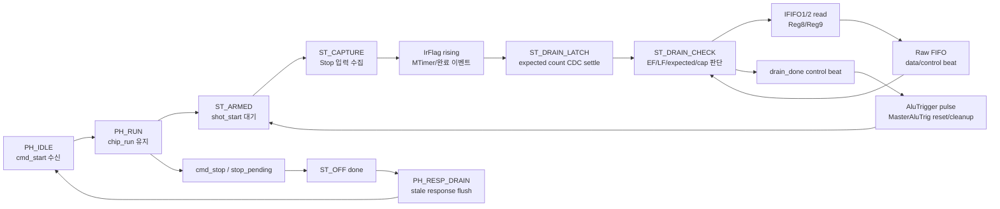
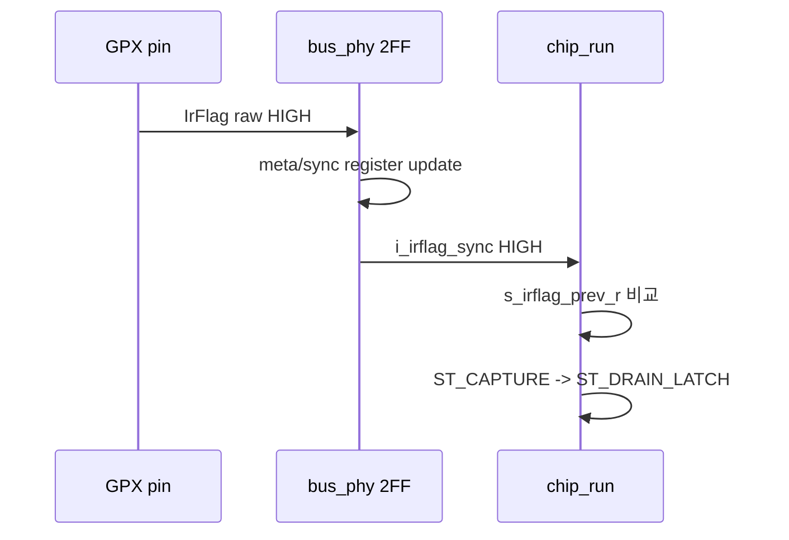
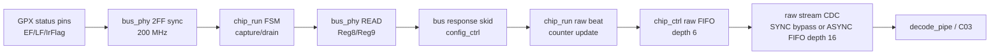

# C02 Chip Acquisition Analysis

문서 버전: `v001`  
작성일: `2026-04-29`  
최종 수정 시간: `2026-04-29 20:34:21 +09:00`  
작성 목적: `C01_GPX_Bus_Read`에서 검증된 bus primitive 위에 `tdc_gpx_chip_ctrl` / `tdc_gpx_chip_run`의 chip acquisition, capture, IFIFO drain, raw stream 출력 운용 개념을 데이터시트 기준으로 분석한다.

---

## 1. C02 결론 요약

`C02_Chip_Acquisition`은 한 번의 GPX bus read가 아니라, `cmd_start` 이후 여러 shot을 반복 수행하는 run loop를 다룬다.

정상 구조는 다음과 같다.



핵심 판단:

1. C02 nominal 운용은 **비-Quiet mode + Reg5 MasterAluTrig=1** 전제에 가깝다. 즉 `AluTrigger`는 데이터 계산 시작 트리거가 아니라 shot 후 cleanup/reset trigger로 쓰인다.
2. 데이터시트 기준상 가장 큰 위험은 **empty Interface FIFO read 금지**이다. 현재 RTL은 `EF_sync='0'`일 때만 read를 발행하지만, 2-FF sync 지연과 testbench 허용 범위 때문에 "empty read가 절대 발생하지 않는다"는 검증은 아직 닫히지 않았다.
3. `expected_ififo1/2`는 burst sizing과 mismatch diagnosis에는 쓰이지만, single EF drain의 hard stop 조건으로는 쓰이지 않는다. 데이터시트 금지 조건을 강화하려면 C02 보완 단계에서 이 계약을 다시 설계해야 한다.
4. Raw stream clock strategy는 C01 보완 후 `config_ctrl`에서 `g_STREAM_CLK_MODE="ASYNC"` 기본값 + `xpm_fifo_async`로 반영되어 있다. C02 입장에서는 `chip_ctrl` raw output까지가 200 MHz TDC domain이고, C03 이후 decode stream은 AXI-stream clock domain이다.
5. C02는 코드 수정 전 분석 단계이다. 본 문서 기준으로 사용자 검토 후 별도 code-fix plan을 만들어 진행해야 한다.

---

## 2. 데이터시트 기준

| ID | 데이터시트 근거 | C02 해석 |
|---|---|---|
| DS-C02-01 | `Doc/TDC-GPX-Datasheet.pdf p.8 Bus Timings / Read operations` | `tS-EF Empty Flag Set Time max 11.8 ns`, 그리고 empty FIFO read 금지 문구가 있다. C01의 `tS-EF + 2FF` 논의가 C02 drain stop 판단으로 이어진다. |
| DS-C02-02 | `p.13 Pin Description` | `EF1/EF2`는 Interface FIFO empty flag, active HIGH. `LF1/LF2`는 Interface FIFO load flag, active HIGH. `IrFlag`와 `ErrFlag`도 active HIGH. |
| DS-C02-03 | `p.19 Register 4` | `Quiet=1`이면 ALU가 자동 시작하지 않고 `ALUTrigger` rising edge 또는 `AluTrigSoft`로 시작한다. `MTimerStart/Stop`도 Reg4 bit로 선택된다. |
| DS-C02-04 | `p.19 Register 5` | `MasterAluTrig` / `PartialAluTrig`는 비-Quiet mode에서 `AluTrigger` pin HIGH를 reset trigger로 사용할 수 있게 한다. |
| DS-C02-05 | `p.20~21 Register 8/9` | Reg8은 IFIFO1 data, Reg9는 IFIFO2 data이다. C02 drain read 주소와 직접 대응된다. |
| DS-C02-06 | `p.22 Register 12` | IntFlag source는 Reg12 unmask bit로 선택된다. `TimerFlagU`, `IFifoIntU`, `HFifoIntU` 등이 `IrFlag` pin을 만들 수 있다. |
| DS-C02-07 | `p.42 R-Mode / Non-quiet mode` | non-quiet mode에서는 post-processing이 첫 hit 이후 자동으로 시작하고, first data가 interface FIFO에 typ. 200 ns 후 가능하다. |
| DS-C02-08 | `p.45 R-Mode quiet mode example` | 예제는 `IrFlag` 확인 후 `AluTrigger`를 발생시키고, data valid 대기 후 EF가 low인 동안 IFIFO를 read한다. Quiet mode에서는 C02 현 sequence와 다르다. |
| DS-C02-09 | `p.48 M-Mode timing` | M-Mode는 Quiet mode가 필요하며, `Stop -> ALU trigger` min 400 ns, `ALU trigger -> data valid` max 1 us 조건이 있다. |
| DS-C02-10 | `p.49 Internal Data Processing / Readout` | Interface FIFO transfer max 40 MHz, data bus max 40 MHz. EF/LF는 모두 HIGH active. 낮은 data rate에서는 EF 확인 권장. empty Interface FIFO read 금지. LF는 해당 FIFO를 read하지 않을 때만 valid하며 read 중 spike 가능. |
| DS-C02-11 | `p.51 M-Mode measurement flow` | M-Mode 예제 역시 `IrFlag -> ALU trigger -> empty flag 확인 -> FIFO read -> reset` 흐름을 보인다. |

데이터시트 기준으로 C02가 닫아야 하는 최상위 질문:

> 현재 RTL의 `capture -> drain -> AluTrigger` 순서는 어떤 GPX mode에서 합법인가?

현재 코드와 cfg override를 보면 nominal 답은 다음과 같다.

> 비-Quiet mode에서 post-processing/data 준비는 GPX 내부가 자동 수행하고, `AluTrigger`는 Reg5 `MasterAluTrig=1`에 의해 shot 종료 후 reset/cleanup trigger로 쓰는 운용이다. Quiet/M-Mode를 허용하려면 현재 C02 FSM 순서는 재검토가 필요하다.

---

## 3. RTL Mapping

| 구간 | RTL 근거 | 의미 |
|---|---|---|
| `chip_run` state set | `tdc_gpx_chip_run.vhd:182-195` | `ST_OFF`, `ST_ARMED`, `ST_CAPTURE`, `ST_DRAIN_*`, `ST_ALU_*`, `ST_OVERRUN_FLUSH`로 acquisition loop 구성 |
| IrFlag edge detect | `tdc_gpx_chip_run.vhd:301-306`, `428-439` | synced IrFlag rising edge를 감지하면 `ST_DRAIN_LATCH`로 진입 |
| expected count latch settle | `tdc_gpx_chip_run.vhd:202-209`, `467-477` | IrFlag 후 16 TDC clocks를 기다린 뒤 `i_expected_ififo1/2`를 sample |
| Drain decision | `tdc_gpx_chip_run.vhd:482-610` | EF high, n_drain_cap, LF burst 가능 여부, single EF read, completion/fallback을 결정 |
| Single read response | `tdc_gpx_chip_run.vhd:625-682` | IFIFO1/2 single read response가 fire되면 raw beat를 만들고 drain counter 증가 |
| Burst read response | `tdc_gpx_chip_run.vhd:713-815` | burst response마다 raw beat와 counter를 증가, burst 종료 후 flush |
| EF settle between reads | `tdc_gpx_chip_run.vhd:817-823` | 각 read 후 `c_FLAG_SETTLE_LAST=2`, 즉 3 clocks 대기 후 다시 EF 판단 |
| AluTrigger pulse | `tdc_gpx_chip_run.vhd:825-864` | drain_done 후 `g_ALU_PULSE_CLKS=4`, recovery `g_RECOVERY_CLKS=8`; 이후 다시 `ST_ARMED` 또는 `ST_OFF` |
| Coordinator phase | `tdc_gpx_chip_ctrl.vhd:253`, `724-733`, `752-768` | `cmd_start`가 `PH_RUN`으로 진입하고, `chip_run`이 done을 낼 때만 `PH_RESP_DRAIN`으로 종료 |
| Bus response tready/pending | `tdc_gpx_chip_ctrl.vhd:593-615` | raw FIFO full이면 RUN response tready를 낮추고, pending은 bus/skid/tvalid hold를 합쳐 `chip_run`으로 전달 |
| Raw FIFO | `tdc_gpx_chip_ctrl.vhd:332`, `1003-1210` | depth 6 shift-register FIFO. data beat와 control beat를 함께 보관하며 backpressure를 `s_raw_hold_busy`로 되돌린다. |
| Status sync | `tdc_gpx_bus_phy.vhd:720-762` | EF/LF/IrFlag/ErrFlag는 free-running 2-FF synchronizer를 거쳐 `chip_run`으로 전달 |
| Stream CDC | `tdc_gpx_config_ctrl.vhd:1820-1930` | `SYNC`는 direct bypass, `ASYNC`는 `xpm_fifo_async` depth 16으로 TDC clock -> AXI-stream clock crossing |
| Reg5 override | `tdc_gpx_stop_cfg_decode.vhd:336-346` | `Reg5.MasterAluTrig=1`, `Reg5.PartialAluTrig=0` 강제. `AluTrigger` pin이 master reset/cleanup 용도라는 운용 전제 |

---

## 4. 정상 Acquisition Sequence

### 4.1 Run 진입

`PH_IDLE`에서 `i_cmd_start='1'`이면 `chip_ctrl`은 run에 필요한 설정을 snapshot한다.

근거: `tdc_gpx_chip_ctrl.vhd:724-733`

Snapshot 대상:

| 신호 | 의미 |
|---|---|
| `i_cfg_image` | GPX register image |
| `i_cfg.drain_mode` | EF single drain 또는 LF/expected 기반 burst drain |
| `i_cfg.n_drain_cap` | per-IFIFO cap, 0이면 unlimited |
| `i_cfg.bus_clk_div`, `i_cfg.bus_ticks` | C01 bus timing |
| `i_max_range_clks` | capture/drain watchdog window |

`chip_run`은 `ST_OFF -> ST_ARMED`로 들어가고 `o_stopdis='0'`이 되어 stop 입력을 열어 둔다.

근거: `tdc_gpx_chip_run.vhd:377-384`

### 4.2 Shot capture

`ST_ARMED`에서 `i_shot_start='1'`이면 `ST_CAPTURE`로 진입한다. 이때 range watchdog이 시작되고 drain counter가 0으로 초기화된다.

근거: `tdc_gpx_chip_run.vhd:386-410`

IrFlag는 bus_phy 2-FF sync를 거쳐 들어오며, `chip_run` 내부에서 edge detect된다.



### 4.3 Expected count settle

IrFlag가 감지되어도 즉시 read하지 않는다. `ST_DRAIN_LATCH`에서 `c_EXP_LATCH_SETTLE_LAST=15`까지 대기한 뒤 expected count를 latch한다. 즉 200 MHz 기준 약 80 ns의 settle window가 있다.

근거: `tdc_gpx_chip_run.vhd:202-209`, `467-477`

이 설계 의도는 `stop_cfg_decode -> xpm_cdc_handshake -> chip_run` 경로의 late update를 흡수하는 것이다.

### 4.4 IFIFO drain

`ST_DRAIN_CHECK`는 다음 우선순위로 동작한다.

| 우선순위 | 조건 | 동작 | RTL |
|---:|---|---|---|
| 1 | `EF1=1` 또는 cap 도달 | IFIFO1 done으로 간주 | `tdc_gpx_chip_run.vhd:488-490` |
| 2 | `EF2=1` 또는 cap 도달 | IFIFO2 done으로 간주 | `491-493` |
| 3 | IFIFO1 done, IFIFO2 not done | IFIFO1 done control beat 1회 emit | `498-505` |
| 4 | 양쪽 done | final drain_done control beat emit, `ST_ALU_PULSE` | `507-519` |
| 5 | LF/expected 기반 burst IFIFO1 | Reg8 burst read | `520-538` |
| 6 | LF/expected 기반 burst IFIFO2 | Reg9 burst read | `540-558` |
| 7 | EF single IFIFO1 | Reg8 single read | `560-566` |
| 8 | EF single IFIFO2 | Reg9 single read | `568-574` |
| 9 | fallback | mismatch 검사 후 drain_done | `576-610` |

single read 조건은 `v_ififo*_can_read := not done and EF_sync='0'`이다. 따라서 RTL 의도상 empty flag가 synchronized high이면 read하지 않는다.

하지만 데이터시트 절대 기준은 raw GPX 관점의 empty FIFO read 금지이다. `EF_sync`는 raw pin보다 늦다. 따라서 "RTL이 EF_sync만 보고 read한다"는 사실만으로는 empty read가 절대 없음을 증명하지 못한다.

### 4.5 Shot cleanup / re-arm

두 IFIFO가 done이면 `s_drain_done_r` control beat가 발생하고, `ST_ALU_PULSE`에서 `AluTrigger` pin을 4 clocks 동안 high로 만든다. 200 MHz 기준 20 ns pulse이다. 이후 `ST_ALU_RECOVERY`에서 8 clocks, 즉 40 ns를 기다리고 다시 `ST_ARMED`로 간다.

근거: `tdc_gpx_chip_run.vhd:825-864`

이 동작은 데이터시트 p.19 Reg5 `MasterAluTrig`와 `tdc_gpx_stop_cfg_decode.vhd:343-344`의 override를 조합하면, "post-drain master reset / cleanup" 운용으로 해석된다.

### 4.6 Run 종료

정상 shot 완료마다 `chip_ctrl` phase가 `PH_RESP_DRAIN`으로 가는 것은 아니다. `PH_RUN`은 repeated shot loop를 계속 유지한다. `PH_RESP_DRAIN`은 `cmd_stop`, stop_pending 종료, cfg/reg 완료, soft reset, timeout 등으로 `chip_run` 또는 sub-FSM이 done을 낼 때 stale response를 flush하기 위한 phase이다.

근거: `tdc_gpx_chip_ctrl.vhd:752-768`, `790-807`

---

## 5. Timing Block Diagram

아래 도식은 nominal non-quiet / MasterAluTrig cleanup mode의 한 shot 기준이다.

```text
TDC clock = 200 MHz, Tclk = 5 ns

shot_start
   |
   v
ST_CAPTURE  -- waits for IrFlag_sync rising ------------------------------+
                                                                          |
IrFlag raw GPX pin HIGH                                                   |
   | 2FF sync + edge detect: about 3~4 TDC clocks from raw edge            |
   v                                                                      |
ST_DRAIN_LATCH                                                            |
   | expected count settle: 16 clocks = 80 ns                              |
   v                                                                      |
ST_DRAIN_CHECK                                                            |
   | if EF_sync=0 issue Reg8/Reg9 read                                     |
   v                                                                      |
C01 bus read primitive                                                    |
   | burst beat period = bus_ticks * bus_clk_div * 5 ns                    |
   | default div=2,ticks=5 => 50 ns / word                                 |
   | fastest legal @200MHz div=1,ticks=5 => 25 ns / word                   |
   v                                                                      |
raw data beat -> chip_ctrl raw FIFO -> raw stream                         |
   | after single read: ST_DRAIN_SETTLE 3 clocks = 15 ns                   |
   +------------------------ back to ST_DRAIN_CHECK -----------------------+

Both IFIFOs done
   |
   v
drain_done control beat -> AluTrigger high 4 clocks -> recovery 8 clocks -> ST_ARMED
```

`tS-EF max 11.8 ns` 해석:

| 항목 | 200 MHz 기준 |
|---|---:|
| EF raw pin이 마지막 data read 후 empty를 반영하기 위한 worst time | max 11.8 ns |
| raw pin 관점 guard | 3 clocks = 15 ns가 최소 정수 guard |
| 2-FF sync 관측 지연 | raw high 이후 추가 약 2 clocks |
| `chip_run` single-read 후 settle | 3 clocks 후 `ST_DRAIN_CHECK` 복귀 |

현재 RTL의 3-clock settle은 raw `tS-EF`에는 대응하지만, 2-FF sync와 edge alignment까지 포함한 "절대 empty read 방지"로 충분한지는 waveform/assertion으로 검증해야 한다. 특히 testbench가 extra read를 허용하는 현재 기준은 데이터시트 절대 기준과 충돌한다.

---

## 6. Latency / Throughput / Pipeline / II 분석

### 6.1 공통 기호

| 기호 | 의미 |
|---|---|
| `T` | TDC clock period = 5 ns |
| `D` | `bus_clk_div` |
| `N` | `bus_ticks` |
| `B` | C01 burst beat period = `N * D * T` |

대표값:

| 설정 | `B` | GPX readout rate |
|---|---:|---:|
| default `D=2, N=5` | 50 ns | 20 Mword/s |
| fastest legal @200 MHz `D=1, N=5` | 25 ns | 40 Mword/s |
| illegal @200 MHz `D=1, N=4` | 20 ns | 50 Mword/s, 데이터시트 40 MHz 초과 |

### 6.2 Latency

| 기준점 | 관측점 | 최선/기본 latency | 근거 |
|---|---|---:|---|
| `cmd_start` accepted | `ST_ARMED` | 약 1 clock + phase dispatch | `chip_ctrl:724-733`, `chip_run:377-384` |
| `shot_start` | `ST_CAPTURE` active | 1 clock | `chip_run:386-410` |
| raw `IrFlag` edge | `ST_DRAIN_LATCH` entry | 약 3~4 TDC clocks | `bus_phy:720-762`, `chip_run:301-306`, `428-439` |
| `ST_DRAIN_LATCH` entry | expected count sampled | 16 clocks = 80 ns | `chip_run:202-209`, `467-477` |
| expected count sampled | first drain decision | +1 clock | same state transition semantics |
| read request issue | raw data beat produced | C01 read latency + response fire | C01 v009, `chip_run:625-682` |
| single read response | next drain decision | 3 settle clocks + state transition | `chip_run:817-823` |
| both IFIFO done | `drain_done` control beat visible | chip_run pulse + raw FIFO enqueue/handshake, ready-dependent | `chip_ctrl:1003-1176` |
| drain completion | next `ST_ARMED` | AluTrigger 4 clocks + recovery 8 clocks = 60 ns | `chip_run:825-864` |

### 6.3 Throughput

| 경로 | 이상적 상한 | 실제 제한 |
|---|---:|---|
| GPX bus burst drain | `1 / (N * D * T)` | `bus_phy` response ready, raw FIFO, stream CDC backpressure |
| default burst drain | 20 Mword/s | 40 MHz GPX limit보다 낮음 |
| fastest legal 200 MHz | 40 Mword/s | GPX limit 경계값 |
| raw FIFO enqueue | 최대 1 beat / 200 MHz clock | bus read가 더 느리므로 정상 조건에서는 병목 아님 |
| ASYNC raw CDC | FIFO depth 16, AXI read side 150 MHz | 정상 GPX 40 Mword/s보다 빠르므로 평균 처리율 병목 아님. 단, downstream `tready=0`이면 backpressure |

### 6.4 Pipeline



Backpressure 전파:

| 지점 | 역방향 전파 |
|---|---|
| downstream raw not ready | `s_raw_axis_tready` low |
| ASYNC FIFO full | `s_raw_axis_tready <= not s_raw_cdc_full` |
| chip_ctrl raw FIFO full | `s_raw_hold_busy=1` |
| PH_RUN bus response | `o_s_axis_tready=0` |
| chip_run wait states | `i_bus_rsp_pending=1`이면 wait watchdog freeze + pending-stuck watchdog 진행 |

### 6.5 II(Initiation Interval)

| Transaction | II 정의 | 최선값 | 증가 조건 |
|---|---|---:|---|
| Shot II | 다음 `shot_start`를 받아도 sequence error 없이 처리 가능한 최소 간격 | `capture + drain + AluTrigger/recovery` 완료 후 `ST_ARMED` 복귀 | FIFO fill량, bus drain 시간, downstream backpressure, timeout/recovery |
| Burst read beat II | 같은 burst 안에서 다음 GPX read beat를 시작하는 간격 | `N * D * T` | response path not ready, raw FIFO full, ASYNC FIFO full |
| Single EF read II | EF 기반 single read 후 다음 single read decision까지의 간격 | C01 read latency + `ST_DRAIN_SETTLE` 3 clocks + decision | tick alignment, `i_bus_rsp_pending`, raw busy |
| Run command II | `cmd_start` 이후 다음 `cmd_start`를 받을 수 있는 간격 | `cmd_stop -> ST_OFF done -> PH_RESP_DRAIN min 3 clocks -> PH_IDLE` | bus busy/pending, PH_RESP_DRAIN hard cap/quarantine |

Shot II는 다음 식으로 추상화한다.

```text
Shot_II_min =
  IrFlag_wait
  + IrFlag_sync_detect
  + expected_count_settle(16 cycles)
  + drain_time(IFIFO1, IFIFO2)
  + drain_done/control enqueue
  + AluTrigger_pulse(4 cycles)
  + recovery(8 cycles)
```

여기서 `drain_time`은 drain mode별로 다르다.

```text
burst drain_time ~= total_data_words * (N * D * T) + flush/settle/control overhead
single EF drain_time ~= total_data_words * (C01 read latency + 3*T settle + decision overhead)
```

---

## 7. Code Review Findings

### F-C02-01. Empty FIFO read 금지 조건이 아직 검증으로 닫히지 않았다

| 항목 | 내용 |
|---|---|
| 위험도 | 높음 |
| 데이터시트 근거 | `Doc/TDC-GPX-Datasheet.pdf p.8`, `p.49`: empty Interface FIFO read 금지 |
| RTL 근거 | `tdc_gpx_chip_run.vhd:488-496`, `560-574`, `817-823`; `tdc_gpx_bus_phy.vhd:720-762` |
| TB 근거 | `tb_tdc_gpx_chip_ctrl.vhd:602-650` |
| 문제 | RTL은 `EF_sync` 기반으로 read 여부를 판단한다. 그러나 EF raw pin은 `tS-EF max 11.8 ns` 후 변하고, FPGA 내부에서는 2-FF sync 지연이 추가된다. testbench는 "sync latency 때문에 extra reads 가능"을 정상으로 허용한다. 이는 데이터시트의 empty read 금지와 충돌한다. |
| 권장 조치 | C02 code-fix plan에서 chip model에 "fill=0인 Reg8/Reg9 read는 FAIL" assertion을 추가하고, RTL은 `expected_ififo` 또는 추가 guard를 사용해 empty read를 구조적으로 막는 방향을 검토한다. |
| 다음 단계 | 사용자 확인 후 C02 보완 계획에 포함 |

판단 근거:

- `chip_run`은 `i_ef*_sync='0'`일 때 read를 낸다.
- `bus_phy` status sync는 free-running 2-FF이다.
- `ST_DRAIN_SETTLE` 3 clocks는 raw `tS-EF`에는 맞지만, sync 관측까지 포함한 절대 방지로 충분한지는 파형 검증이 필요하다.
- 현재 TB는 empty read를 fail로 만들지 않는다. 오히려 extra read 가능성을 pass 범위로 인정한다.

### F-C02-02. Quiet/M-Mode를 허용하면 현재 `capture -> drain -> AluTrigger` 순서가 데이터시트 흐름과 맞지 않는다

| 항목 | 내용 |
|---|---|
| 위험도 | 중간~높음 |
| 데이터시트 근거 | `p.19 Register 4 Quiet`, `p.45 R-Mode quiet example`, `p.48 M-Mode timing`, `p.51 M-Mode flow` |
| RTL 근거 | `tdc_gpx_chip_run.vhd:428-439`, `507-519`, `825-864`; `tdc_gpx_stop_cfg_decode.vhd:343-344` |
| 문제 | 데이터시트 quiet/M-mode flow는 `IrFlag -> AluTrigger -> data valid wait -> EF read`이다. 현재 FSM은 `IrFlag -> drain -> AluTrigger -> recovery`이다. 이는 `AluTrigger`를 ALU 계산 시작이 아니라 post-drain MasterAluTrig reset으로 쓰는 운용일 때만 합리적이다. |
| 권장 조치 | nominal mode를 "non-quiet + MasterAluTrig cleanup"으로 문서/CSR에서 명시적으로 제한하거나, Quiet/M-mode 지원이 필요하면 FSM 순서를 별도 mode로 분기해야 한다. |
| 다음 단계 | C02 사용자 확인 필요 |

### F-C02-03. `expected_ififo`가 hard read bound가 아니라 burst/mismatch 보조로만 사용된다

| 항목 | 내용 |
|---|---|
| 위험도 | 중간 |
| 데이터시트 근거 | `p.49`: empty FIFO read 금지 |
| RTL 근거 | `tdc_gpx_chip_run.vhd:520-558`, `576-605`; `tdc_gpx_stop_cfg_decode.vhd:10-19` |
| 문제 | `stop_cfg_decode` contract는 "IrFlag 전 마지막 beat가 final expected count"라고 말하지만, `chip_run`은 expected count를 burst 길이 산정과 mismatch 진단에만 사용한다. single EF drain에서는 expected count 이상 read를 막지 않는다. |
| 권장 조치 | expected count가 신뢰 가능한 mode에서는 `drain_cnt >= expected_ififo`를 done 조건으로 쓰는 옵션 또는 hard guard를 검토한다. expected count가 0인 fallback에서는 EF guard를 더 보수적으로 둔다. |
| 다음 단계 | F-C02-01 해결안과 같이 검토 |

### F-C02-04. Testbench raw count가 data beat와 control beat를 분리하지 않는다

| 항목 | 내용 |
|---|---|
| 위험도 | 중간 |
| TB 근거 | `tb_tdc_gpx_chip_ctrl.vhd:421-435`, `599-608`, `644-650` |
| 문제 | `sv_raw_word_cnt`는 `tuser(7)=1` control beat도 raw word로 같이 count한다. 따라서 "12 actual + extra read"인지 "12 data + IFIFO1 done + drain_done"인지가 pass/fail 기준에서 분리되지 않는다. |
| 권장 조치 | data beat count, control beat count, empty read count를 분리한 monitor를 추가한다. `tuser(7)=1`은 control beat로 별도 집계해야 한다. |
| 다음 단계 | C02 testbench 보완 계획에 포함 |

### F-C02-05. `g_STREAM_CLK_MODE="SYNC"`는 외부 clock 계약이 없으면 위험하다

| 항목 | 내용 |
|---|---|
| 위험도 | 낮음~중간 |
| RTL 근거 | `tdc_gpx_config_ctrl.vhd:1820-1831`, `1834-1930` |
| 문제 | ASYNC mode는 `xpm_fifo_async`로 CDC가 명확하다. SYNC mode는 direct bypass이므로 `i_tdc_clk`와 `i_axis_aclk`가 동일 또는 timing-constrained synchronous pair라는 외부 계약이 필수다. |
| 권장 조치 | C01에서 정한 운영 계약을 유지한다. 기본값 `ASYNC`는 합리적이다. SYNC mode 사용 시 top-level constraint 또는 simulation marker를 별도로 남긴다. |
| 다음 단계 | C03/C04 stream CDC 분석에서 재확인 |

---

## 8. C02 보완 방향 후보

아직 code-fix plan은 아니다. 사용자 검토 후 별도 계획으로 전환한다.

| 후보 | 목적 | 장점 | 주의점 |
|---|---|---|---|
| A. TB empty-read assertion 추가 | 데이터시트 위반을 즉시 검출 | 가장 먼저 해야 할 검증 강화 | 기존 pass 범위가 깨질 수 있음 |
| B. data/control beat 분리 monitor | raw throughput과 drain correctness 분리 | F-C02-04 해결 | 기존 test 출력/기대값 갱신 필요 |
| C. expected count hard bound 옵션 | empty read 방지 강화 | count가 신뢰 가능한 shot에서 안전 | expected count CDC/stale 위험과 mismatch 정책 재설계 필요 |
| D. EF guard 확장 | `tS-EF + 2FF`를 보수적으로 흡수 | EF fallback 안전성 향상 | drain latency/II 증가 |
| E. Quiet mode 금지 또는 mode check | nominal 운용 계약 명확화 | 현 구조 유지 가능 | Quiet/M-mode 필요 시 별도 FSM 필요 |

우선순위 제안:

1. TB assertion부터 추가한다. 데이터시트 위반 여부를 먼저 보이게 만든다.
2. 그 결과에 따라 RTL guard를 결정한다.
3. Quiet/M-mode는 nominal 운용에서 금지할지, 장기 지원할지 사용자와 결정한다.

---

## 9. 사용자 확인 필요

| ID | 질문 | 추천 판단 |
|---|---|---|
| Q-C02-01 | 이 프로젝트의 nominal GPX mode를 non-quiet + MasterAluTrig cleanup으로 고정해도 되는가? | 추천: 우선 고정. Quiet/M-mode는 별도 확장으로 분리 |
| Q-C02-02 | `expected_ififo`를 read hard bound로 승격할 것인가? | 추천: count valid가 보장되는 mode에서는 hard bound 옵션 추가 |
| Q-C02-03 | TB에서 empty FIFO read를 즉시 fatal로 처리해도 되는가? | 추천: Yes. 데이터시트 절대 기준이라 pass 범위로 두면 안 됨 |
| Q-C02-04 | single EF fallback의 settle guard를 더 늘릴 것인가? | 추천: assertion 결과와 waveform을 본 뒤 결정 |
| Q-C02-05 | C02 코드 보완은 review/plan/approval 절차로 진행할 것인가? | 추천: 운영 프로토콜 v006대로 별도 `C02_..._Code_Fix_Plan` 생성 |

---

## 10. 사용자 피드백 기록

| 시간 | 사용자 입력 | 반영 |
|---|---|---|
| 2026-04-29 | "좋아 C02 진행하자." | `C02_Chip_Acquisition` 폴더 생성, Plan v001 생성, 본 Analysis v001 작성 |

---

## 11. 이번 버전에서 실행하지 않은 것

- xsim 회귀는 실행하지 않았다.
- RTL 수정은 하지 않았다.
- empty-read waveform 계측은 아직 수행하지 않았다.

본 Markdown을 기준으로 발표용 핵심 도식 PPT `C02_Chip_Acquisition_260429203421_Analysis_v001.pptx`를 생성했다. PPT는 7 slides로 구성했고, timing block, topology, latency/throughput/II, finding 요약을 포함한다.

---

## 12. Version Lineage

| 항목 | 내용 |
|---|---|
| 직전 문서 | `C02_Chip_Acquisition_260429203421_Plan_v001.md` |
| 본 문서 | `C02_Chip_Acquisition_260429203421_Analysis_v001.md` |
| 동반 PPT | `C02_Chip_Acquisition_260429203421_Analysis_v001.pptx` |
| 다음 문서 후보 | 사용자 검토 후 v008 파일명 규칙의 review 문서 또는 `C02_Chip_Acquisition_260430124944_Code_Fix_Plan_v001.md` |
| 판단 변화 | C02 정상 운용을 "repeated PH_RUN shot loop"로 명확화. `PH_RESP_DRAIN`은 shot마다가 아니라 run 종료/flush phase로 분리했다. |
| 추적 근거 | 데이터시트 p.8/p.13/p.19/p.20~22/p.42/p.45/p.48~51, RTL line mapping section 3 |
