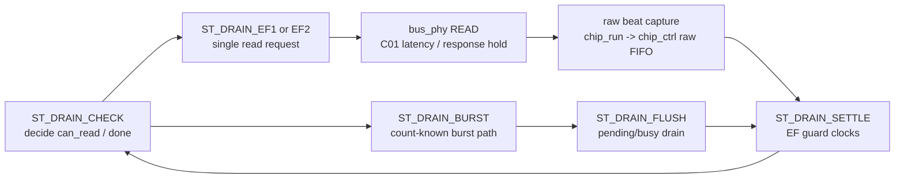

# C02_Chip_Acquisition Code Fix Plan Review v001

문서 버전: `v001`  
작성일: `2026-04-30`  
최종 수정 시간: `2026-04-30 13:38:32 +09:00`  
작성 목적: `C02_Chip_Acquisition_260430124944_Code_Fix_Plan_v001.md`를 사용자가 위에서부터 검토하면서 공유하는 수정 방향을 시간순으로 기록한다. 사용자가 "다 끝났어" 또는 "이제 반영해줘"라고 말하기 전까지 본 문서는 반영 대기 메모이며, 이후 `C02_Chip_Acquisition_260430133832_Code_Fix_Plan_v002.md`에 반영한다.

---

## 1. 검토 운영 방식

| 항목 | 내용 |
|---|---|
| 검토 대상 | `C02_Chip_Acquisition_260430124944_Code_Fix_Plan_v001.md` |
| 검토 방식 | 사용자가 위에서부터 생각나는 수정 방향을 공유하고, Codex는 판단과 근거를 짧게 답하며 이 문서에 기록한다. |
| 반영 조건 | 사용자가 "다 끝났어" 또는 "이제 반영해줘"라고 명시하면 Plan v002에 반영한다. |
| 현재 상태 | Plan v002 반영 완료 |

---

## 2. 사용자 검토 메모

### R-C02-P001-01. 목표 A의 fill 기반 strict 검증은 echo_receiver 유무를 구분해야 한다

| 항목 | 내용 |
|---|---|
| 입력 시각 | 2026-04-30 13:12:32 +09:00 |
| 관련 Plan 위치 | 목표 A. Empty FIFO read 금지 조건을 검증으로 먼저 보이게 만든다 |
| 사용자 피드백 | 현재는 `echo_receiver`를 통해 burst 가능한 값을 전달받을 수 있지만, `echo_receiver` 기능이 없을 때는 burst count를 알 수 없게 된다. 이 현상이 non-burst가 되는 경우 중 하나이다. non-burst일 때는 Datasheet에 나온 timing 제어가 더 엄격해져야 할 것 같으므로 검토할 수 있도록 기록이 필요하다. |
| Codex 1차 판단 | 타당하다. 목표 A의 fill 기반 strict 검증은 "TB chip model 내부 fill"만 보아서는 부족하고, 실제 RTL 운용에서 `expected_ififo` 또는 echo-derived count가 신뢰 가능한 경우와 count를 모르는 EF-only non-burst fallback 경우를 분리해야 한다. |
| 반영 필요 방향 | Plan v002에서 `echo_receiver/count-known burst mode`와 `count-unknown non-burst EF fallback mode`를 분리하고, non-burst EF fallback에는 `tS-EF + 2FF sync + guard`를 더 엄격하게 적용하는 검증 항목을 추가한다. |
| 연결 계약 | C01-C11, C01-C13, C01-C14, C01-C21, C01-C22, C01-C28, C01-C31 |
| 추적 근거 | `Doc/TDC-GPX-Datasheet.pdf p.8/p.49` empty FIFO read 금지, `C01_GPX_Bus_Read_20260429_v009.md:1037`, `:1047-1048`, `:1054-1057` |
| 반영 상태 | Plan v002 반영 완료 |

## 3. 반영 완료 목록

| Review ID | 요약 | 우선순위 | 상태 |
|---|---|---|---|
| R-C02-P001-01 | echo_receiver 유무에 따라 count-known burst와 count-unknown non-burst EF fallback을 분리하고 non-burst timing guard를 엄격화 | 높음 | 반영 완료 |
| R-C02-P001-02 | 목표 B는 현재 drain pipeline/II 상태를 면밀히 분석한 뒤, 보완 방법론과 선택 기준을 Markdown/도표로 제시해야 함 | 높음 | 반영 완료 |
| R-C02-P001-03 | Quiet/M-mode 운용은 없고, C02는 I-Mode single 측정만 대상으로 한다 | 높음 | 반영 완료 |
| R-C02-P001-04 | 검증 항목은 요청사항을 포함해 기능 점검 경계를 명확히 구분하도록 재구성해야 함 | 높음 | 반영 완료 |
| R-C02-P001-05 | EF fallback settle은 입력부터 제어 판단까지 전달 경로와 기준점을 명확히 분리해야 함 | 높음 | 반영 완료 |
| R-C02-P001-06 | 범위 제외/후속 항목을 재분류해야 함: Quiet/M-mode/250MHz 제외, CDC/OEN 검토 유지, 16-bit는 28-bit closure 이후 | 높음 | 반영 완료 |
| R-C02-P001-07 | 위험과 완화는 검토 가능한 명확한 계획으로 재구성해야 함 | 높음 | 반영 완료 |
| R-C02-P001-08 | 사용자 승인 요청 항목은 검증 경계/위험 항목과 추적 가능하게 매핑해야 함 | 높음 | 반영 완료 |

---

### R-C02-P001-02. 목표 B는 현재 pipeline/II 분석과 보완 방법론이 먼저 필요하다

| 항목 | 내용 |
|---|---|
| 입력 시각 | 2026-04-30 13:17:55 +09:00 |
| 관련 Plan 위치 | 목표 B. RTL에서 EF sync 지연으로 인한 fallback over-read를 구조적으로 줄인다 |
| 사용자 피드백 | 목표 B는 파이프라인과 II 등에 대해 현재 상태를 면밀히 분석해야 한다. 논리값을 반영하려면 현재 설계를 어디에 어떻게 보완해서 pipeline과 II 문제를 해결할지 방법론이 면밀하게 분석되어야 한다. 사용자가 쉽게 검토하고 결정할 수 있도록 Markdown과 도표 형태로 보완이 필요하다. |
| Codex 1차 판단 | 타당하다. Plan v001의 목표 B는 `ST_DRAIN_SETTLE` 5 clocks, `expected_ififo` hard bound 같은 결론형 조치가 먼저 나와 있고, 현재 pipeline/II 상태와 보완 후보의 선택 근거가 충분히 분리되어 있지 않다. |
| 반영 필요 방향 | Plan v002에서 목표 B를 "현재 상태 분석"과 "보완 방법론"으로 재구성한다. 특히 `ST_DRAIN_CHECK -> ST_DRAIN_EF1/EF2/BURST/FLUSH -> ST_DRAIN_SETTLE -> ST_DRAIN_CHECK` loop의 cycle 단위 pipeline, best-case II, backpressure II, EF-only fallback II, count-known burst II를 먼저 표와 Mermaid timing/block diagram으로 보여준다. |
| 연결 계약 | C01-C5, C01-C6, C01-C7, C01-C11, C01-C21, C01-C22, C01-C28, C01-C29, C01-C31, C01-C32 |
| 추적 근거 | `tdc_gpx_chip_run.vhd:482-623`, `:625-682`, `:713-805`, `:817-822`; `C02_Chip_Acquisition_260430124944_Code_Fix_Plan_v001.md:67-94`, `:262-276` |
| 반영 상태 | Plan v002 반영 완료 |

#### Plan v002에 추가해야 할 검토 프레임

Plan v002의 목표 B에는 아래 4단계 검토 프레임을 넣는다.

| 단계 | Plan v002 보완 내용 | 사용자가 결정할 수 있어야 하는 질문 |
|---|---|---|
| 1. 현재 pipeline 분해 | `chip_run` drain loop를 state/cycle 단위로 분해한다. `ST_DRAIN_CHECK`, `ST_DRAIN_EF1/EF2`, `ST_DRAIN_BURST`, `ST_DRAIN_FLUSH`, `ST_DRAIN_SETTLE`, `chip_ctrl raw FIFO`, bus response pending 경계를 표시한다. | 현재 설계가 어느 stage에서 빈 FIFO read 위험을 만들 수 있는가? |
| 2. 현재 II 산출 | count-known burst, EF-only non-burst, raw backpressure, pending response stall 조건을 분리해 II 공식을 산출한다. | guard를 늘리면 어느 운용 모드의 II가 얼마나 증가하는가? |
| 3. 보완 후보 비교 | 후보를 최소 3개로 비교한다. A: guard-only, B: expected hard bound + guard, C: count-known burst 유지 + EF-only fallback 엄격화. | 안전성과 throughput 중 어떤 trade-off가 합리적인가? |
| 4. 선택 기준 제시 | 데이터시트 empty read 금지, 40 MHz readout, latency/II 증가, 구현 복잡도, TB 검증 가능성을 기준으로 선택표를 만든다. | 어떤 보완안을 이번 RTL 수정에 적용할 것인가? |

#### Plan v002에 포함할 도표 요구

Markdown에는 최소 다음 도표를 포함한다.



또한 아래 timing/block table을 둔다.

| 운용 모드 | 현재 II 구성 | 보완 후보 II 구성 | 주요 위험 |
|---|---|---|---|
| count-known burst | `C01 burst beat period + response/raw ready` | hard bound로 expected 초과 read 차단 | expected stale value |
| EF-only non-burst | `C01 non-burst read + 3clk settle + decision` | `C01 non-burst read + strict guard + decision` | guard 부족 시 empty read |
| raw backpressure | `read II + raw FIFO stall` | raw FIFO stall을 별도 II로 계측 | PH_RESP_DRAIN/pending 지연 |

#### Plan v002의 목표 B 문구 수정 방향

Plan v001의 "5 clocks 권장" 문구는 Plan v002에서 바로 결론으로 두지 않는다. 대신 다음 순서로 바꾼다.

1. 현재 `c_FLAG_SETTLE_LAST` 또는 동등 guard가 만드는 실제 settle clocks를 산출한다.
2. `tS-EF max 11.8 ns`, 200 MHz 5 ns clock, 2-FF sync latency를 합산해 필요한 관측 guard 후보를 계산한다.
3. count-known burst에서는 expected hard bound가 empty read 방지의 1차 수단인지 검토한다.
4. EF-only non-burst에서는 guard 강화가 1차 수단인지 검토한다.
5. 각 후보의 latency/II 증가를 표로 보여준 뒤 사용자가 선택할 수 있게 한다.

---

### R-C02-P001-03. 목표 D는 Quiet/M-mode 제외가 아니라 I-Mode single 전용 계약으로 바꾼다

| 항목 | 내용 |
|---|---|
| 입력 시각 | 2026-04-30 13:20:18 +09:00 |
| 관련 Plan 위치 | 목표 D. Quiet/M-mode 운용 범위를 명확히 제한한다 |
| 사용자 피드백 | Quiet/M-mode 운용은 없다. 따라서 오로지 I-Mode의 single 측정으로만 진행한다. |
| Codex 1차 판단 | 확정 운용 조건으로 받아야 한다. Plan v001의 목표 D는 "Quiet/M-mode를 이번 범위에서 제외하고 필요 시 후속 계획"이라는 표현이었지만, Plan v002에서는 더 명확히 "C02 지원 운용은 I-Mode single measurement only"로 써야 한다. |
| 반영 필요 방향 | F-C02-02는 Quiet/M-mode sequence mismatch 문제가 아니라 "프로젝트 운용 범위 밖"으로 정리한다. 대신 RTL/TB/문서에서 I-Mode single 측정 조건, non-quiet 설정, single-shot acquisition/drain sequence만 검증 대상으로 제한한다. |
| 연결 계약 | C01-C8, C01-C11, C01-C18, C01-C28, C01-C31, C01-C32 |
| 추적 근거 | `C02_Chip_Acquisition_260429203421_Analysis_v001.md` F-C02-02, `C02_Chip_Acquisition_260430124944_Code_Fix_Plan_v001.md:117-136`, 사용자 운용 확정 |
| 반영 상태 | Plan v002 반영 완료 |

#### Plan v002 수정 방향

Plan v002에서는 목표 D를 다음처럼 바꾼다.

| 기존 Plan v001 표현 | Plan v002 수정 방향 |
|---|---|
| Quiet/M-mode 운용 범위를 명확히 제한한다 | I-Mode single 측정 전용 운용 계약을 명시한다 |
| Quiet/M-mode full support는 이번 범위 제외, 필요 시 후속 확장 | Quiet/M-mode는 프로젝트 운용 범위 밖이므로 C02 RTL 보완 대상이 아니다 |
| nominal `non-quiet + MasterAluTrig cleanup` 문서화 | I-Mode single measurement sequence 기준으로 acquisition/drain/cleanup flow를 다시 표현 |

Plan v002에서 추가해야 할 검증 관점:

1. TB scenario 이름과 문서 설명을 I-Mode single measurement 기준으로 맞춘다.
2. Quiet/M-mode 흐름에 대한 수정 계획은 삭제하거나 "N/A by project operating contract"로 표기한다.
3. F-C02-02는 finding closure table에서 "운용 범위 제외로 닫힘, 단 CSR/config에서 Quiet/M-mode가 활성화되지 않도록 별도 확인 필요"로 정리한다.
4. C02 결과 Markdown/PPT는 I-Mode single acquisition timing diagram만 포함한다.

---

### R-C02-P001-04. 검증 항목은 기능 점검 경계를 명확히 구분해야 한다

| 항목 | 내용 |
|---|---|
| 입력 시각 | 2026-04-30 13:22:09 +09:00 |
| 관련 Plan 위치 | section 5 `검증 항목` |
| 사용자 피드백 | 지금까지 요청한 내용을 포함해서 더 깊이 고민하고, 기능 점검의 경계를 명확히 구분하게 검토해야 한다. |
| Codex 1차 판단 | 타당하다. Plan v001의 검증 항목 V-C02-01~10은 필요한 항목을 나열했지만, 기능 경계가 충분히 분리되어 있지 않다. 특히 I-Mode single 전용 운용, echo/count-known 여부, EF-only non-burst fallback, pipeline/II, response/backpressure, negative 검증의 경계가 한 표 안에 섞여 있다. |
| 반영 필요 방향 | Plan v002의 검증 항목은 flat list가 아니라 "검증 경계 matrix"로 재구성한다. 각 경계마다 목적, 포함 범위, 제외 범위, pass/fail 기준, 관련 C01 계약, 관련 finding, 필요한 TB/RTL 계측을 분리한다. |
| 연결 계약 | C01-C1~C01-C32 전체. 특히 C01-C11, C01-C14, C01-C21, C01-C22, C01-C28, C01-C29, C01-C31, C01-C32 |
| 추적 근거 | `C02_Chip_Acquisition_260430124944_Code_Fix_Plan_v001.md:245-258`, R-C02-P001-01~03 |
| 반영 상태 | Plan v002 반영 완료 |

#### Plan v002 검증 경계 재구성안

Plan v002의 section 5는 아래처럼 기능 경계별로 재작성한다.

| 검증 경계 | 목적 | 포함 범위 | 제외 범위 | 핵심 pass/fail 기준 |
|---|---|---|---|---|
| VB-C02-01 I-Mode single 운용 경계 | 프로젝트 지원 모드를 명확히 고정 | I-Mode single shot start, IrFlag, IFIFO drain, cleanup | Quiet/M-mode, R-mode quiet, multi-mode ALU sequence | Quiet/M-mode 관련 설정이 활성화되지 않고, single measurement sequence만 실행 |
| VB-C02-02 Datasheet 금지 조건 경계 | empty FIFO read 절대 금지 확인 | Reg8/Reg9 IFIFO read, EF active HIGH, fill=0 read monitor | 성능 최적화 판단 | fill=0 read가 1회라도 있으면 FAIL |
| VB-C02-03 Count-known burst 경계 | echo_receiver/expected count가 신뢰 가능한 경우의 drain 검증 | expected_ififo > 0, burst, hard bound, 40 MHz readout | expected count unknown fallback | expected 초과 read 없음, data beat count 정확, control beat 분리 |
| VB-C02-04 Count-unknown EF-only non-burst 경계 | echo_receiver 기능이 없거나 count를 모르는 경우의 안전 drain 검증 | expected_ififo=0, EF-only decision, strict guard, single read loop | burst optimization | empty read 0, `tS-EF + 2FF + guard` 만족, II 증가 문서화 |
| VB-C02-05 Pipeline/II 경계 | 현 설계와 보완안의 cycle/II 차이를 검증 | ST_DRAIN_CHECK/EF/BURST/FLUSH/SETTLE loop, bus_phy latency, raw FIFO | 상위 decoder 처리 | best-case II, guarded II, backpressure II를 분리 산출 |
| VB-C02-06 Response/backpressure 경계 | C01 response hold/pending 계약이 C02에서 유지되는지 확인 | `i_bus_rsp_pending`, `i_s_axis_tvalid`, `o_s_axis_tready`, raw FIFO full, PH_RESP_DRAIN | 정상 no-stall drain만 보는 단순 테스트 | pending 중 new request stall, no data/control drop, PH_RESP_DRAIN exit/fatal 추적 가능 |
| VB-C02-07 Data/control stream boundary | raw data beat와 drain_done/control beat가 섞이지 않게 검증 | `tuser(7)`, data count, control count, ififo id | hit decoding 의미론 | data beat count와 control beat count가 독립적으로 PASS |
| VB-C02-08 Negative/fail-propagation 경계 | 검증 체계가 실패를 놓치지 않는지 확인 | forced empty read, forced monitor fail, integrated exit code | RTL 기능 성공 판단 | negative run은 exit code 1, transcript에 실패 원인 보존 |
| VB-C02-09 Timing legality 경계 | C01 bus timing 계약을 C02가 깨지 않는지 확인 | 200 MHz, 40 MHz readout, `div=1=>ticks>=5`, tick/capture 기준점 | 250 MHz retiming 구현 | illegal readout 조합 없음, timing diagram에 기준점 표시 |
| VB-C02-10 산출물 경계 | 사용자가 결정 가능한 검증 보고 형태 보장 | Markdown/PPT, timing diagram, pipeline/II 표, evidence log | 구두 설명만으로 closure | 결과 문서에서 각 VB 항목의 PASS/FAIL/보류가 추적 가능 |

#### 기존 V-C02 항목 재배치

Plan v001의 V-C02-01~10은 폐기하지 않고, Plan v002에서 위 검증 경계 안으로 재배치한다.

| 기존 항목 | Plan v002 재배치 |
|---|---|
| V-C02-01 Empty FIFO read strict assertion | VB-C02-02, VB-C02-04 |
| V-C02-02 Data/control beat 분리 count | VB-C02-07 |
| V-C02-03 Fill 8/4 drain | VB-C02-03 또는 VB-C02-04로 모드 분리 |
| V-C02-04 Fill 16/8 drain | VB-C02-03 count-known burst |
| V-C02-05 EF=1 empty start | VB-C02-02, VB-C02-04 |
| V-C02-06 expected_ififo hard bound | VB-C02-03 |
| V-C02-07 raw backpressure | VB-C02-06 |
| V-C02-08 PH_RESP_DRAIN stuck/fatal path | VB-C02-06 |
| V-C02-09 Negative forced empty read | VB-C02-08 |
| V-C02-10 Latency/Throughput/Pipeline/II 산출 | VB-C02-05, VB-C02-10 |

#### Plan v002 검증 문서 요구사항

각 검증 경계는 다음 필드를 가져야 한다.

| 필드 | 내용 |
|---|---|
| Boundary ID | `VB-C02-xx` |
| 목적 | 무엇을 닫는 검증인지 |
| Datasheet 근거 | page/항목 |
| C01 계약 | C01-Cxx |
| RTL/TB 관측점 | signal, state, counter, transcript marker |
| Positive criteria | 정상 run에서 PASS 조건 |
| Negative criteria | fail injection 또는 위반 시 FAIL 조건 |
| Latency/II 영향 | 해당 검증이 pipeline/II에 주는 의미 |
| 산출 evidence | log line, waveform marker, result table |

#### 판단 변화

Plan v002에서는 "검증 항목"이라는 제목을 유지하더라도 내용은 아래처럼 바뀌어야 한다.

> 검증 항목은 테스트 케이스 목록이 아니라 기능 점검 경계 목록이다. 테스트 케이스는 각 경계를 닫기 위한 수단이며, 각 경계는 데이터시트 근거와 C01 handoff 계약에 연결되어야 한다.

---

### R-C02-P001-05. EF fallback settle은 raw input부터 control decision까지 기준점을 분리해야 한다

| 항목 | 내용 |
|---|---|
| 입력 시각 | 2026-04-30 13:28:15 +09:00 |
| 관련 Plan 위치 | section 6 `Latency / Throughput / Pipeline / II 영향 예측`, 특히 `EF fallback settle` |
| 사용자 피드백 | EF fallback settle 관련해서 입력부터 제어원으로 전달되기까지의 명확한 구분 정보가 필요하다. 현재는 포괄해서 설명되어 판단하기에 정보가 부족하다. |
| Codex 1차 판단 | 타당하다. Plan v001의 `EF fallback settle = ST_DRAIN_SETTLE 3 clocks -> 5 clocks` 설명은 raw GPX pin 변화, bus_phy 2-FF sync 출력, chip_ctrl 전달, chip_run 제어 판단 시점을 한 덩어리로 묶고 있다. Plan v002에서는 각 기준점을 분리해야 한다. |
| 반영 필요 방향 | Plan v002의 section 6에 `EF fallback signal path / latency basis` 표를 추가한다. raw `EF pin`, `bus_phy` meta/sync FF, `chip_ctrl` input pass-through, `chip_run i_ef*_sync`, `ST_DRAIN_CHECK` decision, `ST_DRAIN_SETTLE` guard를 별도 stage로 나눈다. |
| 연결 계약 | C01-C8, C01-C11, C01-C21, C01-C22, C01-C28, C01-C31, C01-C32 |
| 추적 근거 | `tdc_gpx_bus_phy.vhd:740-748`, `:757-758`; `tdc_gpx_chip_ctrl.vhd:166-167`, `:532-533`; `tdc_gpx_chip_run.vhd:135-136`, `:202`, `:482-496`, `:817-822`; `C02_Chip_Acquisition_260430124944_Code_Fix_Plan_v001.md:262-270` |
| 반영 상태 | Plan v002 반영 완료 |

#### Plan v002에 필요한 EF fallback 기준점 분리

Plan v002에서는 아래 표를 section 6에 포함한다.

| Stage | 기준점 | 현재 RTL 근거 | 의미 | 계산/판단 포인트 |
|---|---|---|---|---|
| S0 | 마지막 IFIFO data read가 GPX 내부 FIFO를 empty로 만듦 | C02 TB chip model / GPX datasheet | `tS-EF` 계산 시작점 | Datasheet `tS-EF max 11.8 ns` |
| S1 | raw `EF1/EF2` pin이 HIGH로 변함 | GPX IC pin | GPX가 empty를 pin에 반영 | 200 MHz에서 raw guard는 `ceil(11.8ns / 5ns)=3 clocks` |
| S2 | `bus_phy` meta FF가 raw EF를 샘플 | `tdc_gpx_bus_phy.vhd:740-741` | asynchronous pin 1단 샘플 | edge alignment에 따라 S1 이후 다음 clock |
| S3 | `bus_phy` sync FF가 `o_ef*_sync`를 갱신 | `tdc_gpx_bus_phy.vhd:747-758` | C02가 실제로 보는 synchronized EF level | raw EF pin 대비 2-FF 관측 지연 |
| S4 | `chip_ctrl`가 `i_ef*_sync`를 `chip_run`에 전달 | `tdc_gpx_chip_ctrl.vhd:166-167`, `:532-533` | 별도 register 없이 연결되는 제어 입력 | 현재는 pass-through로 보이며, timing boundary 필요성 검토 |
| S5 | `chip_run`의 `ST_DRAIN_CHECK`가 `i_ef*_sync`로 read/done 판단 | `tdc_gpx_chip_run.vhd:482-496` | 실제 control decision point | empty read 방지의 최종 판단점 |
| S6 | `ST_DRAIN_SETTLE` guard 후 다시 `ST_DRAIN_CHECK` 진입 | `tdc_gpx_chip_run.vhd:202`, `:817-822` | 다음 read decision 전 기다리는 시간 | 현재 `c_FLAG_SETTLE_LAST=2`, 즉 3 clocks로 해석됨 |

#### Plan v002에 필요한 timing diagram

Markdown에는 아래 형태의 timing diagram 또는 동등한 Mermaid/표를 포함한다.

```text
T0        : last data read completes / FIFO becomes empty
T0+11.8ns : GPX raw EF pin must be HIGH by datasheet max
clk N     : bus_phy meta FF may sample raw EF
clk N+1   : bus_phy sync FF updates o_ef*_sync
clk N+1   : chip_ctrl/chip_run see i_ef*_sync if combinational pass-through
next ST_DRAIN_CHECK : chip_run uses EF_sync for done/can_read decision
```

#### Plan v002의 판단 구조

Plan v002에서는 `EF fallback settle`을 다음 세 값으로 분리한다.

| 구분 | 의미 | 예시 판단 |
|---|---|---|
| raw EF guard | GPX pin이 empty를 반영할 때까지 기다리는 시간 | 200 MHz 기준 최소 3 clocks |
| sync observation latency | raw EF가 bus_phy 2-FF를 통과해 `o_ef*_sync`로 보이는 시간 | raw EF edge alignment 포함 최소 2 clocks 추가 관측 |
| control decision guard | `chip_run`이 다음 read decision을 하기 전 실제로 기다리는 settle loop | 현재 3 clocks로 보이나, raw+sync 전체를 덮는지 재산출 필요 |

#### 판단 변화

Plan v001의 "3 clocks -> 5 clocks" 표현은 Plan v002에서 다음처럼 바꾼다.

> EF fallback guard는 단일 숫자가 아니라 raw GPX EF pin 반영 시간, bus_phy 2-FF 관측 지연, chip_run 제어 판단 시점의 합성 문제이다. 따라서 Plan v002에서는 각 기준점을 나눈 후, `ST_DRAIN_SETTLE` 값이 어떤 구간을 덮는지 명확히 계산한다.

---

### R-C02-P001-06. 범위 제외 / 후속 항목 재분류

| 항목 | 내용 |
|---|---|
| 입력 시각 | 2026-04-30 13:32:51 +09:00 |
| 관련 Plan 위치 | section 7 `범위 제외 / 후속 항목`, 목표 D, Handoff 계약 C01-C12/C15/C16/C20/C23~C30 |
| 사용자 피드백 | Quiet/M-mode full sequence 지원 항목은 안 한다. 250 MHz retiming 항목도 제외한다. output stream CDC 전체 재설계는 검토되어야 한다. 16-bit bus mode 지원은 28-bit 기능이 완전히 close 된 이후에 검토한다. OEN board default 최종 결정은 OEN 연결과 OEN High 고정 두 가지에 대해 검토되어야 한다. |
| Codex 1차 판단 | 타당하다. Plan v001은 일부 항목을 "후속 후보"로 열어두었지만, 사용자 운용 기준이 확정된 항목은 더 강하게 닫아야 한다. 반대로 output stream CDC와 OEN 두 조건은 후속 검토 항목으로 명확히 살아 있어야 한다. |
| 반영 필요 방향 | Plan v002에서 section 7을 `완전 제외`, `후속 검토`, `조건부 후속`으로 재분류한다. Quiet/M-mode와 250 MHz retiming은 완전 제외, output stream CDC와 OEN board mode는 후속 검토, 16-bit는 28-bit closure 이후 조건부 후속으로 둔다. |
| 연결 계약 | C01-C12, C01-C15, C01-C16, C01-C20, C01-C23, C01-C24, C01-C30 |
| 추적 근거 | `C02_Chip_Acquisition_260430124944_Code_Fix_Plan_v001.md:280-288`, 사용자 운용 확정 |
| 반영 상태 | Plan v002 반영 완료 |

#### Plan v002 범위 재분류안

| 항목 | Plan v002 분류 | 처리 방향 |
|---|---|---|
| Quiet/M-mode full sequence 지원 | 완전 제외 | 프로젝트 운용 범위가 I-Mode single only로 확정되었으므로 C02/후속 구현 대상에서 제외한다. 다만 CSR/config에서 해당 모드가 활성화되지 않도록 확인 항목만 남긴다. |
| 250 MHz retiming | 완전 제외 | 본 프로젝트 C02 보완 범위에서 제외한다. C01 v009의 250 MHz 분석은 판단 근거로 보존하되, 후속 구현 후보로 열지 않는다. |
| output stream CDC 전체 재설계 | 후속 검토 | C01에서 ASYNC 기본값과 xpm_fifo_async evidence는 닫혔지만, C02 이후 raw/stream 경계 전체 CDC 검토는 필요하다. C03/C04 후보로 명시한다. |
| 16-bit bus mode 지원 | 조건부 후속 | 28-bit 기능이 완전히 close된 이후에만 검토한다. 현재는 Reg14[4] 차단/unsupported 계약을 유지한다. |
| OEN board default 최종 결정 | 후속 검토 | 두 가지 board mode를 검토한다. 1) OEN 정상 연결, 2) OEN High 고정 또는 pull-up/not-connected 계열. OEN Low 고정은 C01 계약상 unsupported로 유지한다. |

#### Plan v002에서 바꿀 문구

Plan v001의 section 7 표현을 다음처럼 바꾼다.

| 기존 표현 | 수정 방향 |
|---|---|
| Quiet/M-mode: 사용자 결정 후 별도 mode-support plan | Quiet/M-mode는 운용하지 않으므로 구현/후속 계획에서 제외 |
| 250 MHz: 별도 retiming 영향성 Cluster | 250 MHz retiming은 본 프로젝트 범위에서 제외. C01 분석은 근거로만 보존 |
| output stream CDC: C03/C04 stream CDC 분석 | 유지하되 "검토 필요"로 격상 |
| 16-bit: 별도 기능 확장 | 28-bit close 이후 조건부 검토 |
| OEN: board integration 확인 후 결정 | OEN 정상 연결 / OEN High 고정 두 경우를 후속 검토 대상으로 명시 |

#### 판단 변화

Plan v002에서는 "범위 제외 / 후속 항목"이 단순 parking lot이 아니라 의사결정 상태를 나타내야 한다.

상태 구분:

- `완전 제외`: 이번 프로젝트 운용 기준상 하지 않음
- `후속 검토`: 현재 Cluster에서는 구현하지 않지만 반드시 별도 검토 필요
- `조건부 후속`: 선행 기능 closure 이후에만 검토

---

### R-C02-P001-07. 위험과 완화는 승인 판단 가능한 계획으로 재구성해야 한다

| 항목 | 내용 |
|---|---|
| 입력 시각 | 2026-04-30 13:35:35 +09:00 |
| 관련 Plan 위치 | section 8 `위험과 완화` |
| 사용자 피드백 | 위험과 완화 관련해서도 업데이트가 필요하고, 사용자가 검토할 수 있는 명확한 계획이 더 필요하다. |
| Codex 1차 판단 | 타당하다. Plan v001의 위험과 완화 표는 위험/영향/완화만 간단히 적고 있어, 어떤 위험을 어떤 검증 경계에서 조기 검출하고, 어떤 완화안을 선택해야 하는지 판단하기 어렵다. |
| 반영 필요 방향 | Plan v002의 section 8은 risk register 형태로 재작성한다. 각 위험에 대해 원인, 영향, 조기 검출 방법, 완화 옵션, 선택 기준, 잔여 위험, 승인 판단점을 둔다. |
| 연결 계약 | C01-C11, C01-C14, C01-C17, C01-C20, C01-C21, C01-C22, C01-C28~C01-C32 |
| 추적 근거 | `C02_Chip_Acquisition_260430124944_Code_Fix_Plan_v001.md:292-300`, R-C02-P001-01~06 |
| 반영 상태 | Plan v002 반영 완료 |

#### Plan v002 risk register 재구성안

Plan v002에는 아래 형태의 표를 포함한다.

| Risk ID | 위험 | 원인 | 조기 검출 | 완화 옵션 | 승인 판단점 |
|---|---|---|---|---|---|
| RK-C02-01 | empty FIFO read 발생 | EF raw pin 반영 지연, 2-FF sync 관측 지연, EF-only fallback read loop | TB fill=0 Reg8/Reg9 read assertion, empty_read_count | A: guard 강화, B: expected hard bound, C: count-known/unknown mode 분리 | empty read 0을 절대 PASS 조건으로 둘 것인가? 권장 Yes |
| RK-C02-02 | guard 강화로 non-burst II 증가 | EF-only fallback에서 매 read 후 settle 필요 | pipeline/II table, timestamped monitor | A: count-known burst는 hard bound로 최적화, B: EF-only는 안전 우선 | throughput보다 datasheet 금지 조건을 우선할 것인가? 권장 Yes |
| RK-C02-03 | expected_ififo stale 또는 echo count 불신 | echo_receiver/CDC/count latch timing 문제 | expected snapshot log, mismatch sticky, count-known/unknown 분리 TB | A: expected=0 fallback 분리, B: stale 검출 시 hard bound 미적용 | hard bound 적용 조건을 expected_ififo>0만으로 충분히 볼 것인가? 추가 검증 필요 |
| RK-C02-04 | data/control beat count 혼동 | `tuser(7)` control beat가 raw count에 섞임 | data_count/control_count 분리 monitor | monitor 분리, 기존 range pass 제거 | 기존 pass 기준을 폐기하고 count 분리 기준으로 갈 것인가? 권장 Yes |
| RK-C02-05 | PH_RESP_DRAIN/pending 해석 오류 | response hold/backpressure와 phase exit 조건 혼동 | `i_bus_rsp_pending`, `i_s_axis_tvalid`, `o_s_axis_tready`, phase log | PH_RESP_DRAIN 전용 monitor와 hard cap/fatal transcript | PH_RESP_DRAIN을 per-shot drain이 아닌 stale flush/quarantine으로 고정할 것인가? 권장 Yes |
| RK-C02-06 | I-Mode single 외 모드가 활성화됨 | CSR/config가 Quiet/M-mode를 열 가능성 | config image/mode bit check | Quiet/M-mode N/A 계약, mode bit assertion 또는 문서 제한 | C02 지원 모드를 I-Mode single only로 lock할 것인가? 사용자 확정 Yes |
| RK-C02-07 | output stream CDC 경계가 불명확 | C01 ASYNC evidence는 있지만 전체 raw/stream 경계 검토는 남음 | config_ctrl mode log, async FIFO evidence, downstream clock check | C03/C04 후속 CDC 검토로 분리 | C02 code-fix 범위 밖이지만 후속 검토로 남길 것인가? 권장 Yes |
| RK-C02-08 | OEN board mode 미결정 | OEN 정상 연결과 OEN High 고정 조건이 다름 | board mode matrix, OEN generic mode check | 두 board mode를 후속 검토 대상으로 분리 | OEN Low fixed는 unsupported로 유지할 것인가? 권장 Yes |
| RK-C02-09 | 검증 실패 전파 누락 | TB가 PASS 문구만 보고 실패를 놓침 | negative run, integrated exit code, transcript artifact | forced fail hook, empty-read negative test | C02도 C01처럼 positive/negative evidence를 남길 것인가? 권장 Yes |

#### Plan v002에 필요한 위험 평가 필드

각 risk는 다음 필드를 가져야 한다.

| 필드 | 내용 |
|---|---|
| Risk ID | `RK-C02-xx` |
| 연결 검증 경계 | `VB-C02-xx` |
| 연결 C01 계약 | `C01-Cxx` |
| 위험 설명 | 어떤 오동작 또는 판단 오류인지 |
| 원인 | RTL 구조, CDC, TB 허용 기준, 운용 범위 모호성 등 |
| 영향 | 데이터시트 위반, data loss, II 증가, mode confusion, 후속 Cluster 위험 |
| 조기 검출 | 어떤 assertion/log/counter/waveform으로 빨리 볼 수 있는지 |
| 완화 옵션 | 하나 이상. 옵션별 trade-off 포함 |
| 승인 판단점 | 사용자가 선택해야 하는 정책 또는 Codex 권장안 |
| 잔여 위험 | 이번 C02에서 닫지 못하고 후속으로 넘기는 내용 |

#### 판단 변화

Plan v002에서는 section 8을 단순한 "위험과 완화" 표가 아니라 사용자가 승인할 수 있는 risk-control plan으로 만든다.

핵심 원칙:

1. 위험은 검증 경계 `VB-C02-xx`와 연결한다.
2. 완화는 RTL 수정, TB assertion, 문서 계약, 후속 Cluster 분리 중 어디인지 명확히 한다.
3. 각 위험마다 "사용자 승인 판단점"을 남긴다.
4. C02에서 닫는 위험과 후속 검토로 넘기는 위험을 분리한다.

---

### R-C02-P001-08. 사용자 승인 요청 항목은 검증 항목과 추적 가능하게 매핑해야 한다

| 항목 | 내용 |
|---|---|
| 입력 시각 | 2026-04-30 13:37:14 +09:00 |
| 관련 Plan 위치 | section 10 `사용자 승인 요청 항목`, section 5 `검증 항목` |
| 사용자 피드백 | section 5 검증 항목에서 10개를 도출했는데, section 10 사용자 승인 요청 항목은 6개만 나왔다. 왜 6개만 승인 요청으로 나온 것인지 확인이 필요하다. |
| Codex 1차 판단 | 맞다. Plan v001은 검증 항목 10개와 승인 요청 6개 사이의 매핑을 제공하지 않아, 어떤 검증은 정책 승인 대상이고 어떤 검증은 실행 항목인지 구분할 수 없다. |
| 반영 필요 방향 | Plan v002에서는 사용자 승인 요청 항목을 검증 경계 `VB-C02-xx`와 risk `RK-C02-xx`에 매핑한다. 승인 항목은 단순 실행 목록이 아니라 사용자가 결정해야 하는 정책/범위/위험 수용 항목으로 재정의한다. |
| 연결 계약 | C01-C32, 운영 프로토콜 Review 처리 사이클 규칙 |
| 추적 근거 | `C02_Chip_Acquisition_260430124944_Code_Fix_Plan_v001.md:245-258`, `:318-329`, R-C02-P001-04, R-C02-P001-07 |
| 반영 상태 | Plan v002 반영 완료 |

#### Plan v002 승인 항목 재구성 원칙

Plan v002에서는 승인 요청을 두 종류로 나눈다.

| 승인 종류 | 의미 | 예 |
|---|---|---|
| 정책 승인 | 사용자가 운용/범위/위험 수용 기준을 결정해야 하는 항목 | I-Mode single only, empty read 0 절대 기준, 250 MHz 제외, OEN 후속 검토 |
| 실행 승인 | Codex가 RTL/TB/script/doc 작업을 진행해도 되는지 묻는 항목 | TB strict monitor 추가, RTL guard 후보 구현, xsim regression 생성 |

#### Plan v002 승인 요청 Matrix 초안

| Approval ID | 승인 항목 | 연결 검증 경계 | 연결 Risk | 연결 기존 V-C02 | 권장 |
|---|---|---|---|---|---|
| AP-C02-01 | C02 운용 범위를 I-Mode single measurement only로 lock한다. | VB-C02-01 | RK-C02-06 | 신규/목표 D | 승인 |
| AP-C02-02 | empty FIFO read 0회를 절대 PASS 기준으로 둔다. | VB-C02-02, VB-C02-04 | RK-C02-01 | V-C02-01, V-C02-05 | 승인 |
| AP-C02-03 | echo/count-known burst와 count-unknown EF-only non-burst를 분리해 검증한다. | VB-C02-03, VB-C02-04 | RK-C02-02, RK-C02-03 | V-C02-03, V-C02-04, V-C02-06 | 승인 |
| AP-C02-04 | `expected_ififo` hard bound는 count-known 조건에서만 적용하고, stale 가능성을 별도 검증한다. | VB-C02-03 | RK-C02-03 | V-C02-06 | 조건부 승인 |
| AP-C02-05 | EF fallback guard는 raw EF, 2-FF sync, control decision 경로를 계산한 뒤 값 후보를 선택한다. | VB-C02-04, VB-C02-05 | RK-C02-01, RK-C02-02 | V-C02-10 | 승인 |
| AP-C02-06 | data/control beat count를 분리하고 기존 range pass 기준을 제거한다. | VB-C02-07 | RK-C02-04 | V-C02-02, V-C02-03, V-C02-04 | 승인 |
| AP-C02-07 | PH_RESP_DRAIN은 stale response flush/quarantine으로 검증하고 per-shot drain으로 해석하지 않는다. | VB-C02-06 | RK-C02-05 | V-C02-07, V-C02-08 | 승인 |
| AP-C02-08 | C02 positive/negative regression entrypoint를 만들고 exit code evidence를 남긴다. | VB-C02-08 | RK-C02-09 | V-C02-09 | 승인 |
| AP-C02-09 | output stream CDC 전체 재설계는 C02 code-fix 범위 밖이지만 후속 검토 항목으로 유지한다. | VB-C02-10 | RK-C02-07 | 산출물/후속 | 승인 |
| AP-C02-10 | OEN은 정상 연결과 OEN High 고정 두 board mode를 후속 검토하고, OEN Low fixed는 unsupported로 유지한다. | VB-C02-10 | RK-C02-08 | 후속 | 승인 |
| AP-C02-11 | 16-bit mode는 28-bit closure 이후 조건부 후속 검토로 둔다. | VB-C02-10 | 범위 risk | 후속 | 승인 |
| AP-C02-12 | 250 MHz retiming은 본 프로젝트/C02 보완 범위에서 제외한다. | VB-C02-09 | 범위 risk | timing legality | 승인 |

#### 기존 6개 승인 항목에 대한 판단

Plan v001의 A-C02-01~06은 폐기하지 않고, Plan v002에서 위 AP-C02 matrix에 흡수한다.

| 기존 승인 ID | Plan v002 이동 |
|---|---|
| A-C02-01 TB strict empty-read assertion | AP-C02-02, AP-C02-08 |
| A-C02-02 EF fallback guard 5 clocks | AP-C02-05로 변경. 5 clocks는 확정값이 아니라 후보로 낮춘다. |
| A-C02-03 expected_ififo hard bound | AP-C02-03, AP-C02-04 |
| A-C02-04 data/control beat count 분리 | AP-C02-06 |
| A-C02-05 Quiet/M-mode 제외 | AP-C02-01로 변경. I-Mode single only로 확정 |
| A-C02-06 C02 xsim regression entrypoint | AP-C02-08 |

#### 판단 변화

Plan v002의 승인 요청은 "6개 실행 동의"가 아니라 "검증 경계와 위험 통제에 대한 승인 matrix"가 되어야 한다. 각 승인 항목은 최소 하나 이상의 `VB-C02`, `RK-C02`, 기존 `V-C02` 또는 후속 범위 항목과 연결되어야 한다.

---

## 4. Review v001 -> Plan v002 반영 위치 기록

| Review ID | Plan v002 반영 위치 |
|---|---|
| R-C02-P001-01 | section 4 목표 A, section 6 VB-C02-03/04, section 10 AP-C02-03 |
| R-C02-P001-02 | section 4 목표 B, section 7 Latency/Throughput/Pipeline/II 분석 계획 |
| R-C02-P001-03 | section 3.1 C02 운용 범위, section 4 목표 A/D, section 8 범위 제외, section 10 AP-C02-01 |
| R-C02-P001-04 | section 6 기능 검증 경계 Matrix |
| R-C02-P001-05 | section 4 목표 C, section 7.1 산출 대상 |
| R-C02-P001-06 | section 8 범위 제외 / 후속 항목 |
| R-C02-P001-07 | section 9 Risk-Control Plan |
| R-C02-P001-08 | section 10 사용자 승인 요청 Matrix |

| 항목 | 기록 내용 |
|---|---|
| 사용자 완료 입력 | "다 끝났어" |
| 반영된 계획 파일 | `C02_Chip_Acquisition_260430133832_Code_Fix_Plan_v002.md` |
| 판단 변화 | Review v001의 반영 대기 메모를 Plan v002 공식 수정계획으로 전환 |
| 반영 시각 | `2026-04-30 13:38:32 +09:00` |
