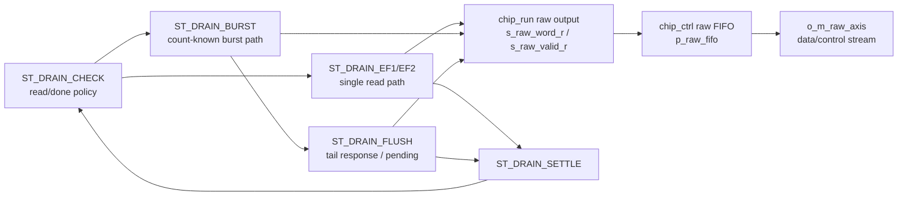
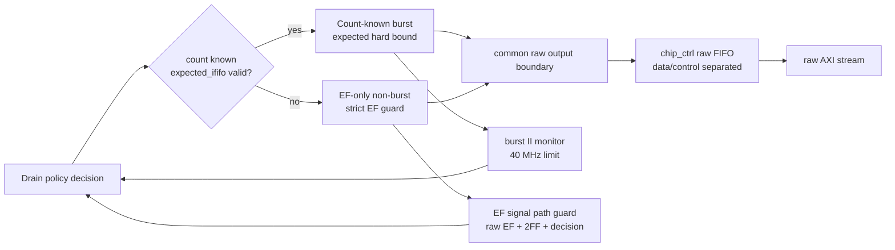

# C02_Chip_Acquisition Code Fix Plan Review v002

문서 버전: `v002`  
작성일: `2026-04-30`  
최종 수정 시간: `2026-04-30 14:08:51 +09:00`  
작성 목적: `C02_Chip_Acquisition_260430133832_Code_Fix_Plan_v002.md`를 사용자가 검토하면서 공유한 의문점과 수정 방향을 시간순으로 기록한다. 사용자의 "다 검토 했어" 확인 후 본 문서의 피드백은 `C02_Chip_Acquisition_260430140851_Code_Fix_Plan_v003.md`에 반영되었다.

---

## 1. 검토 운영 방식

| 항목 | 내용 |
|---|---|
| 검토 대상 | `C02_Chip_Acquisition_260430133832_Code_Fix_Plan_v002.md` |
| 검토 방식 | 사용자가 의문점과 수정 방향을 전달하면 Codex는 판단과 근거를 기록한다. |
| 반영 조건 | 사용자가 "다 됐어", "다 검토 했어" 또는 "반영해줘"라고 명시하면 Plan v003에 반영한다. |
| 현재 상태 | Plan v003 반영 완료 |

---

## 2. 사용자 검토 메모

### R-C02-P002-01. 목표 B에는 현재 drain pipeline과 개선 drain pipeline의 구조 비교가 필요하다

| 항목 | 내용 |
|---|---|
| 입력 시각 | 2026-04-30 13:58:43 +09:00 |
| 관련 Plan 위치 | `C02_Chip_Acquisition_260430133832_Code_Fix_Plan_v002.md` section 4.2.1 `현재 drain pipeline` |
| 사용자 피드백 | 목표 B에서 현재 drain pipeline뿐 아니라 개선 방향의 drain pipeline 표현도 추가해 구조적으로 비교 분석할 수 있어야 검토와 결정이 쉬워진다. 또한 현재 drain pipeline 구조에서 `ST_DRAIN_EF1/EF2`는 raw FIFO로 값이 전달되는 것처럼 보이지만, `ST_DRAIN_BURST`는 raw FIFO로 저장되지 않는 것처럼 그려져 있어 맞는지 검토가 필요하다. |
| Codex 1차 판단 | 사용자 지적이 맞다. RTL상 `ST_DRAIN_BURST`도 raw beat를 생성한다. 다만 `ST_DRAIN_BURST`가 raw FIFO에 직접 write하는 것이 아니라, `tdc_gpx_chip_run`이 `s_raw_word_r/s_raw_valid_r`를 세우고, `tdc_gpx_chip_ctrl`의 `p_raw_fifo`가 `s_run_raw_valid`를 받아 저장한다. Plan v002 그림은 이 공통 raw output/fifo sink를 명확히 표현하지 못해 오해 소지가 있다. |
| 반영 필요 방향 | Plan v003의 목표 B에는 `현재 drain pipeline`과 `개선 drain pipeline 후보`를 나란히 둔다. 현재 구조에서는 `ST_DRAIN_EF1/EF2`, `ST_DRAIN_BURST`, `ST_DRAIN_FLUSH`가 모두 raw output 공통 sink를 통해 `chip_ctrl raw FIFO`로 들어간다는 점을 도식화한다. 개선 구조에서는 count-known burst path와 count-unknown EF-only path를 분리하고, 둘 다 common raw FIFO boundary로 합류하도록 표현한다. |
| 연결 계약 | C01-C3, C01-C5, C01-C6, C01-C7, C01-C28, C01-C29, C01-C31, C01-C32 |
| RTL 근거 | `tdc_gpx_chip_run.vhd:625-635` EF1 raw output, `:672-682` EF2 raw output, `:713-728` BURST raw output, `:762-805` FLUSH raw output/pending 처리, `tdc_gpx_chip_ctrl.vhd:537-538`, `:1003-1024`, `:1162-1164` raw FIFO/output |
| 반영 상태 | Plan v003 반영 완료 |

#### 현재 구조에서 정정해야 할 핵심 판단

| 경로 | raw beat 생성 여부 | raw FIFO 저장 경로 | Plan v002 그림 문제 |
|---|---|---|---|
| `ST_DRAIN_EF1` | 있음 | `s_raw_word_r/s_raw_valid_r` -> `chip_ctrl p_raw_fifo` | 표현됨 |
| `ST_DRAIN_EF2` | 있음 | `s_raw_word_r/s_raw_valid_r` -> `chip_ctrl p_raw_fifo` | 표현됨 |
| `ST_DRAIN_BURST` | 있음 | `s_raw_word_r/s_raw_valid_r` -> `chip_ctrl p_raw_fifo` | raw FIFO 공통 sink가 빠져 오해 가능 |
| `ST_DRAIN_FLUSH` | 있음 | trailing response를 raw output으로 넘길 수 있음 | flush와 raw FIFO 관계도 명확히 표현 필요 |

#### Plan v003에 추가할 현재 drain pipeline 도식 방향



#### Plan v003에 추가할 개선 drain pipeline 후보 도식 방향



#### Plan v003에서 사용자가 결정하기 쉽게 보여야 할 비교표

| 비교 항목 | 현재 구조 | 개선 후보 | 결정 포인트 |
|---|---|---|---|
| raw FIFO 합류 | single/burst/flush 모두 raw output을 통해 합류하지만 Plan v002 그림이 불명확 | 공통 raw output boundary를 명시 | burst path data가 raw FIFO에 들어가는지 추적 가능해야 함 |
| count-known path | expected count를 burst sizing에 사용하나 hard bound 의미가 약함 | expected hard bound + burst II monitor | stale count 검증 조건 필요 |
| count-unknown path | EF-only single read + settle | EF-only strict guard + empty read assertion | safety 우선, II 증가 수용 여부 |
| II 분석 | path별 II가 한 그림에서 분리되지 않음 | burst II / non-burst II / backpressure II 분리 | 어떤 path가 느려지는지 결정 가능해야 함 |

### R-C02-P002-02. 목표 C의 T0는 `last data read completes`가 아니라 마지막 data read의 RDN low edge 기준으로 분리해야 한다

| 항목 | 내용 |
|---|---|
| 입력 시각 | 2026-04-30 14:05:45 +09:00 |
| 관련 Plan 위치 | `C02_Chip_Acquisition_260430133832_Code_Fix_Plan_v002.md` section 4 `목표 C`, section 7.1 `raw EF guard` |
| 사용자 피드백 | 목표 C에서 T0가 `last data read completes`로만 되어 있다. Datasheet 기준으로는 마지막 data의 `RDN`이 Low로 떨어진 직후부터 `tS-EF max 11.8 ns`가 걸리는 것으로 보이며, 그러면 `tPW-RL min 6 ns` 구간이 `tS-EF` window와 교집합으로 포함되는 것이 아닌지 검토가 필요하다. |
| Codex 1차 판단 | 사용자 지적이 타당하다. Plan v002의 T0 표현은 너무 늦은 기준점이다. Datasheet p.7 Figure 2의 Read Operations는 `EF tS-EF Last data`를 마지막 read strobe와 함께 표시하며, `RDN` low pulse width인 `tPW-RL`과 `tS-EF`가 별도 직렬 지연으로 더해지는 구조로 보면 안 된다. 즉 `last data read completes` 이후에 다시 11.8 ns를 전부 기다린다고 해석하면 보수적이지만 latency/II 분석은 왜곡된다. |
| 반영 필요 방향 | Plan v003에서는 T0를 두 개로 나눈다. `T0a = 마지막 data read의 RDN falling edge`, `T0b = read capture / RDN rising / response consumed`. raw EF guard는 `T0a -> raw EF HIGH <= 11.8 ns`로 계산하고, `T0b` 이후 남은 raw EF residual은 `max(0, 11.8 ns - (T0b - T0a))`로 계산한다. 그 다음 별도로 2-FF sync 관측 지연과 `ST_DRAIN_CHECK` decision alignment를 더한다. |
| 연결 계약 | C01-C11, C01-C13, C01-C14, C01-C21, C01-C22, C01-C25, C01-C32 |
| Datasheet 근거 | `Doc/TDC-GPX-Datasheet.pdf p.7 Figure 2 Read Operations`: `tPW-RL Read LOW Time min 6 ns`, `tS-EF Empty Flag Set Time max 11.8 ns`, `It is not allowed to read from an empty FIFO !` |
| C01 근거 | `C01_GPX_Bus_Read_20260429_v009.md:196-198` 정상 READ 200 MHz 최단안은 `RDN low->capture=15 ns`, `tPW-RL=15 ns`, `burst period=25 ns/40 MHz`; `:1047-1048` C02로 `tS-EF + 2FF` 반영 계약 |
| 반영 상태 | Plan v003 반영 완료 |

#### T0 기준점 정정안

```text
T0a        : 마지막 data word를 꺼내는 READ의 RDN falling edge
T0a+11.8ns : Datasheet상 raw EF pin이 HIGH가 되어야 하는 최대 시각
T0b        : RDN rising / data capture / bus response 생성 기준점
Residual   : max(0, 11.8ns - (T0b - T0a))
Tsync      : raw EF HIGH 이후 bus_phy 2-FF synchronizer 관측 지연
Tdecision  : chip_run ST_DRAIN_CHECK가 EF_sync를 이용해 read/done 판단하는 시각
```

#### 200 MHz 최단 정상 READ 기준의 의미

| 항목 | 값 | 의미 |
|---|---:|---|
| `Tclk` | 5 ns | C02 기준 clock |
| `RDN low->capture` | 15 ns | C01 v009 정상 READ 최단안 |
| `tPW-RL min` | 6 ns | Datasheet 최소 low width |
| `tS-EF max` | 11.8 ns | 마지막 data read 후 EF set 최대 시간 |
| raw EF residual at capture | 0 ns | `15 ns > 11.8 ns`이므로, Datasheet 기준 raw EF 반영 시간은 capture 시점 전에 이미 충족된다. 단, status pin setup/2-FF sync/decision alignment는 별도 계산해야 한다. |

#### Plan v003에서 바뀌어야 할 문장

Plan v002의 `T0 : last data read completes / FIFO becomes empty`는 다음처럼 바꿔야 한다.

> `tS-EF`의 절대 기준점은 마지막 data read의 완료 시각이 아니라 마지막 data를 꺼내는 read strobe 기준점으로 분리해 계산한다. C02 구현은 response/capture 이후에 EF를 관측하므로, `tS-EF` 전체를 post-response guard에 다시 더하지 않고 이미 `RDN low` 기간에서 소비된 시간을 제외한 residual, 2-FF synchronizer latency, decision alignment를 별도로 산출한다.

## 3. 반영 목록

| Review ID | 요약 | 우선순위 | 상태 |
|---|---|---|---|
| R-C02-P002-01 | 현재 drain pipeline 그림의 burst raw FIFO 경로를 정정하고, 개선 drain pipeline 후보와 구조 비교표를 추가 | 높음 | 반영 완료 |
| R-C02-P002-02 | 목표 C의 T0를 마지막 data read의 RDN falling edge와 response/capture 기준점으로 분리하고, `tPW-RL`과 `tS-EF`의 교집합을 timing/II 계산에 반영 | 높음 | 반영 완료 |

## 4. Review v002 -> Plan v003 반영 위치 기록

| Review ID | Plan v003 반영 위치 |
|---|---|
| R-C02-P002-01 | `C02_Chip_Acquisition_260430140851_Code_Fix_Plan_v003.md` section 4.2.1 `현재 drain pipeline`, section 4.2.2 `개선 drain pipeline 후보`, section 4.2.3 `II 산출 프레임` |
| R-C02-P002-02 | `C02_Chip_Acquisition_260430140851_Code_Fix_Plan_v003.md` section `목표 C`, section 7.1 `산출 대상`, section 12 `Version Lineage` |

| 항목 | 내용 |
|---|---|
| 반영된 계획 파일 | `C02_Chip_Acquisition_260430140851_Code_Fix_Plan_v003.md` |
| 반영 시각 | `2026-04-30 14:08:51 +09:00` |
