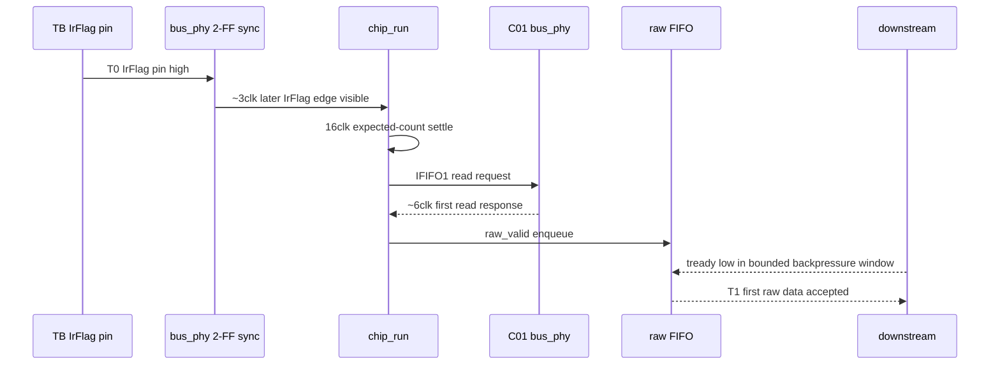
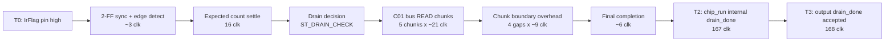

# C02_Chip_Acquisition Timing Breakdown v001

문서 버전: `v001`  
작성일: `2026-04-30`  
최종 수정 시간: `2026-04-30 16:26:12 +09:00`  
작성 목적: `C02_Chip_Acquisition_260430155825_Code_Verify_v001.md`의 `[16]` 실측값 `T1=40clk`, `T2=167clk`가 어떤 RTL 단계에서 소비되는지 분해한다.

---

## 1. 결론

`T1=40clk`는 GPX IC READ 자체가 40clk 걸린다는 뜻이 아니다. `[16]` 테스트벤치가 raw output backpressure를 검증하기 위해 `s_raw_axis_tready`를 일부러 낮춘 구간을 포함한 "첫 raw data가 downstream에 accepted된 시점"이다.

`T2=167clk`는 20개 IFIFO word를 모두 drain하고, `chip_run` 내부 final `drain_done`이 발생할 때까지의 시간이다. 이 값은 주로 다음 항목이 누적된 결과다.

- IrFlag 2-FF synchronizer 및 edge detect
- expected IFIFO count settle window
- C01 `bus_phy` read transaction timing
- burst chunk 단위 drain 구조
- chunk 사이의 `ST_DRAIN_FLUSH` / `ST_DRAIN_SETTLE` / `ST_DRAIN_CHECK`
- final drain completion 판단

---

## 2. 기준 조건

| 항목 | 값 |
|---|---|
| clock | 200 MHz, 1 clk = 5 ns |
| scenario | `tb_tdc_gpx_chip_ctrl` `[16] Bounded raw AXI backpressure + latency/II measurement` |
| IFIFO fill | IFIFO1 = 12 word, IFIFO2 = 8 word |
| drain mode | burst mode |
| Reg6 fill/LF threshold | 4 |
| bus timing | `bus_clk_div=1`, `bus_ticks=5` |
| measured T1 | first raw data accepted = 40 clk |
| measured T2 | `chip_run` internal drain complete = 167 clk |
| measured T3 | output `drain_done` accepted = 168 clk |

근거:

- `tb_tdc_gpx_chip_ctrl.vhd:1549-1665`
- `tdc_gpx_bus_phy.vhd:318-323`, `:582-650`
- `tdc_gpx_chip_run.vhd:475-490`, `:490-659`, `:752-856`

---

## 3. T0 to T1 분해

T0는 테스트벤치가 `s_irflag_pin <= '1'`을 적용한 시점이다. T1은 raw FIFO에 들어온 첫 data가 downstream `tready='1'` 조건에서 accepted된 시점이다.

| 구간 | 소비 clk | 이유 |
|---|---:|---|
| IrFlag pin -> `i_irflag_sync` edge detect | 약 3 clk | C01 `bus_phy` status 2-FF synchronizer와 `chip_run`의 edge detect register 때문에 pin 변화가 즉시 drain FSM에 보이지 않는다. |
| `ST_DRAIN_LATCH` expected count settle | 16 clk | `c_EXP_LATCH_SETTLE_LAST=15`. echo_receiver/config_ctrl expected count CDC가 IrFlag 직전까지 갱신될 수 있으므로 16 cycle 대기 후 latch한다. |
| `ST_DRAIN_CHECK` -> first read request | 약 1 clk | `ST_DRAIN_CHECK`에서 IFIFO1 burst read를 결정하고 registered request를 낸다. |
| C01 `bus_phy` first READ response | 약 6 clk | `bus_ticks=5` read cycle: Phase A, Phase L, Phase H, deferred response가 포함된다. |
| `chip_run` raw_valid -> `chip_ctrl` raw FIFO | 약 1 clk | `chip_run`의 raw beat는 coordinator raw FIFO에 한 단계 등록되어 output으로 간다. |
| raw output accepted wait | 약 13 clk | `[16]` TB가 bounded backpressure 검증을 위해 `s_raw_axis_tready`를 낮춘 구간과 재개 edge가 포함된다. |
| 합계 | 약 40 clk | 실측 `first_data=40clk`와 일치 |

중요 해석:

- `T1=40clk` 중 마지막 약 13clk는 GPX/C01 read 지연이 아니라, TB가 일부러 만든 raw output backpressure 영향이다.
- 따라서 GPX IC read timing 판단에는 T1 전체를 사용하면 안 된다.
- GPX IC read timing 판단 기준은 C01 `bus_phy`의 `bus_ticks=5`, `bus_clk_div=1`, Datasheet read timing이다.

---

## 4. T0 to T2 분해

T2는 output accepted 기준이 아니라 `chip_run` 내부 final `drain_done` 발생 기준이다. `[16]`의 20 data word는 Reg6 fill threshold 4 때문에 4-word burst chunk 단위로 drain된다.

20 word 구성:

| IFIFO | word 수 | burst chunk 구성 |
|---|---:|---|
| IFIFO1 | 12 | 4 word x 3 chunk |
| IFIFO2 | 8 | 4 word x 2 chunk |
| 합계 | 20 | 5 chunk |

대략적인 누적:

| 구간 | 소비 clk | 이유 |
|---|---:|---|
| IrFlag sync/edge + expected settle + first request 준비 | 약 20 clk | T1 분해의 앞부분과 동일하다. |
| 5개 burst chunk의 C01 read service | 약 105 clk | 각 chunk는 4 word다. 첫 response까지 약 6clk, 이후 burst response 간격은 `bus_ticks=5` 기준으로 약 5clk다. 따라서 chunk당 약 `6 + 3*5 = 21clk`, 5 chunk면 약 105clk다. |
| chunk 사이 drain 재판정 overhead | 약 36 clk | chunk 사이에는 `ST_DRAIN_FLUSH`, `ST_DRAIN_SETTLE(g_EF_SYNC_GUARD_CLKS=5)`, `ST_DRAIN_CHECK`, request register latency가 들어간다. 4개 경계에서 약 9clk씩 추가된다. |
| final completion/control 판단 | 약 6 clk | 마지막 data response 이후 EF/expected done 판정, final `drain_done` 생성까지의 정리 구간이다. |
| 합계 | 약 167 clk | 실측 `run_complete=167clk`와 일치 |

---

## 5. Pipeline 관점

---

## 6. 운용 판단

1. `T1=40clk`는 downstream backpressure를 포함한 output acceptance latency다. GPX IC READ latency로 해석하면 안 된다.
2. `T2=167clk`는 C02 drain completion latency다. 20 word, 5 burst chunk, 200 MHz, `bus_ticks=5`, fill threshold 4 조건에서의 값이다.
3. Throughput/II 해석은 두 개로 나눠야 한다.
   - GPX READ side: C01 `bus_ticks=5`가 기준이므로 burst response 간격은 약 5clk다.
   - raw output side: backpressure 해제 후 FIFO가 보유한 beat를 연속 accept할 수 있어 `II_min=1clk`가 가능하다.
4. C02 성능을 개선하려면 먼저 16clk expected settle과 5clk EF settle/chunk boundary가 필수인지 재검토해야 한다. 단, 이 값들은 CDC/stale count와 Datasheet EF timing을 보호하기 위한 guard이므로 단순 축소는 위험하다.

---

## 7. Lineage

| 기준 문서/코드 | 본 문서 반영 |
|---|---|
| `C02_Chip_Acquisition_260430155825_Code_Verify_v001.md` | `[16]` latency/II 실측값의 원인 분해 |
| `tb_tdc_gpx_chip_ctrl.vhd:1549-1665` | T0/T1/T2 계측 방식 확인 |
| `tdc_gpx_bus_phy.vhd` | C01 read transaction timing 기준 확인 |
| `tdc_gpx_chip_run.vhd` | `ST_DRAIN_LATCH`, `ST_DRAIN_CHECK`, `ST_DRAIN_BURST`, `ST_DRAIN_FLUSH`, `ST_DRAIN_SETTLE` 구간 확인 |

