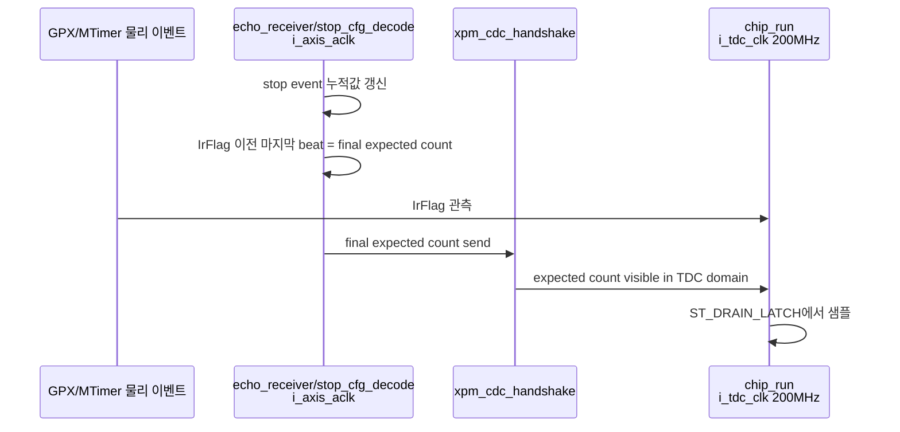

# C02 Expected Count Latch Guard 재판단 v001

- Cluster: C02_Chip_Acquisition
- 문서 목적: `c_EXP_LATCH_SETTLE_LAST = 16clk` 대기가 물리적으로 필요한지 재판단
- 작성/수정 시간: 2026-04-30 17:05:47 +09:00
- 기준: `Doc/TDC-GPX-Datasheet.pdf`, C01/C02 운용 계약, 현 RTL

## 1. 사용자 질문

IrFlag는 MTimer가 측정 범위 종료 시점에 발생시키는 신호이고, `echo_receiver`의 expected IFIFO 값은 IrFlag에 의해 결정되는 값보다 먼저 결정되는 값이다. 그렇다면 `ST_DRAIN_LATCH`에서 16clk를 기다릴 필요가 있는가?

## 2. 결론

현재 운용 개념 기준으로는 **GPX 물리 이벤트 관점에서 16clk 대기는 필수로 보기 어렵다.**

I-Mode single 운용에서 expected IFIFO count는 IrFlag 이후 새로 결정되는 값이 아니다. 측정 window 안에서 이미 관측된 stop event의 누적값이고, `stop_cfg_decode` 계약도 "IrFlag 이전 마지막 beat가 최종 expected count"라고 정의한다. 따라서 물리적으로 "IrFlag 뒤에 expected count가 새로 확정되기 때문에 16clk가 필요하다"는 해석은 맞지 않다.

다만 현 RTL에서는 expected count가 `i_axis_aclk` 도메인에서 만들어지고, `xpm_cdc_handshake`를 통해 `i_tdc_clk` 도메인으로 전달된다. 그래서 **값 자체는 IrFlag 전에 결정되어도, C02 `chip_run`이 샘플하는 200MHz 도메인에서 아직 보이지 않을 가능성**은 남아 있다. 이 경우 16clk는 Datasheet 물리 timing 요구가 아니라 CDC/구현 가시성에 대한 보수적 방어이다.

## 3. 근거 추적

| 구분 | 근거 | 의미 |
|---|---|---|
| Stop decode 계약 | `tdc_gpx_stop_cfg_decode.vhd:10`, `tdc_gpx_stop_cfg_decode.vhd:18` | IrFlag 이전 마지막 beat가 최종 expected count이고 output이 retain된다. |
| Expected count 갱신 | `tdc_gpx_stop_cfg_decode.vhd:273` | expected count는 `i_stop_evt_tvalid`에서 갱신된다. |
| Clock domain | `tdc_gpx_config_ctrl.vhd:21` | stop decode는 AXI stream domain, chip/run/bus는 TDC domain 구조이다. |
| CDC 전달 | `tdc_gpx_config_ctrl.vhd:1379`, `tdc_gpx_config_ctrl.vhd:1395`, `tdc_gpx_config_ctrl.vhd:1411` | expected count는 `xpm_cdc_handshake`와 source send FSM을 거쳐 TDC domain으로 넘어온다. |
| 현 16clk 대기 | `tdc_gpx_chip_run.vhd:210`, `tdc_gpx_chip_run.vhd:214`, `tdc_gpx_chip_run.vhd:475`, `tdc_gpx_chip_run.vhd:481` | `ST_DRAIN_LATCH`에서 16clk 후 expected count를 샘플한다. |

## 4. 물리 이벤트와 RTL 가시성 분리

판단은 다음 두 질문을 분리해야 한다.

1. `echo_receiver` 값이 IrFlag 이후에 물리적으로 새로 결정되는가?
   - 현재 운용 개념에서는 아니다.
   - I-Mode single의 측정 범위 안에서 이미 결정된 stop 누적값이다.

2. 이미 결정된 값이 IrFlag와 같은 시점에 C02 200MHz 도메인에서 항상 보이는가?
   - 현 RTL만 보면 보장 조건이 명시되어 있지 않다.
   - `xpm_cdc_handshake`의 source/destination 동기화 지연과 source send FSM 때문에 final beat가 IrFlag에 매우 근접하면 TDC 도메인 표시가 늦을 수 있다.

따라서 16clk 대기의 정체는 "물리적 stop/IrFlag 관계"가 아니라 "CDC 도착 지연을 흡수하기 위한 구현 guard"이다.

## 5. 16clk 대기에 대한 재판단

| 항목 | 판단 |
|---|---|
| Datasheet 요구인가? | 아니다. 현재 확인된 Datasheet timing 항목의 직접 요구로 볼 수 없다. |
| GPX 물리 이벤트 때문에 필요한가? | 아니다. expected count는 IrFlag 뒤에 새로 발생하는 값이 아니다. |
| 현 RTL 방어로 의미가 있는가? | 있다. final expected count가 AXI->TDC CDC 중일 수 있는 경우 stale sample을 줄인다. |
| 고정 16clk가 합리적인가? | 과보수 가능성이 크다. 특히 echo_receiver가 final count를 충분히 먼저 보장한다면 0 또는 1clk까지 줄일 수 있다. |
| 즉시 제거 가능한가? | "expected count가 IrFlag 전에 TDC domain에서 valid/stable"이라는 계약 검증 전에는 위험하다. |

## 6. 보완 방향

### 권장 1: 16clk를 고정 상수에서 generic으로 변경

`c_EXP_LATCH_SETTLE_LAST`를 고정 16clk 상수로 두지 말고 `g_EXP_LATCH_GUARD_CLKS` 같은 generic으로 전환한다.

- 현재 안전 기본값: 16clk 유지
- 계약 검증 후 후보값: 0clk 또는 1clk
- 목적: 프로젝트/보드/clock mode별로 guard를 줄이되, 기존 보수 운용도 유지

### 권장 2: expected count valid 계약 추가

장기적으로는 blind delay보다 다음 계약이 더 명확하다.

- `echo_receiver/stop_cfg_decode`가 shot별 final expected count를 확정한다.
- AXI->TDC CDC가 final bundle과 valid 또는 shot sequence를 함께 넘긴다.
- `chip_run`은 IrFlag 이후 "해당 shot의 expected valid"를 확인한 뒤 drain을 시작한다.

이 구조가 있으면 16clk 같은 경험적 대기 대신 명시적 data/control boundary로 판단할 수 있다.

### 권장 3: 검증으로 축소 가능성 확인

다음 검증을 추가해야 한다.

| 검증 | 목적 |
|---|---|
| final stop beat가 IrFlag보다 충분히 앞선 case | guard 0clk에서도 expected count가 stale이 아닌지 확인 |
| final stop beat가 IrFlag에 근접한 worst case | CDC 도착 지연이 실제로 몇 TDC clk인지 측정 |
| `g_STREAM_CLK_MODE="SYNC"` | 동일 clock/동기 mode에서 guard 제거 가능성 확인 |
| `g_STREAM_CLK_MODE="ASYNC"` | 150MHz AXI -> 200MHz TDC CDC 지연 측정 |
| stale expected fault injection | guard 축소 후에도 mismatch fault가 안전하게 닫히는지 확인 |

## 7. C02 수정 계획 반영 항목

1. `c_EXP_LATCH_SETTLE_LAST`는 Datasheet 요구가 아닌 구현 guard로 재분류한다.
2. C02 latency 분석에서 현재 16clk는 필수 물리 latency가 아니라 제거/축소 후보로 표시한다.
3. code fix 후보에 `g_EXP_LATCH_GUARD_CLKS` generic 전환을 추가한다.
4. 검증 항목에 final expected count의 TDC domain 도착 시간 측정을 추가한다.
5. 검증 결과가 "IrFlag 이전 또는 동일 시점에 TDC domain stable"이면 guard 기본값을 0 또는 1로 줄인다.

## 8. 현재 판단 요약

사용자 판단에 동의한다. `echo_receiver` 값이 IrFlag 이후에 물리적으로 결정된다는 가정은 현재 운용 개념과 맞지 않는다. 따라서 16clk 대기는 물리 필수 조건이 아니라, 현 RTL의 AXI->TDC CDC 가시성 불확실성을 막기 위한 보수 구현이다.

즉시 코드에서 제거하기보다는, 먼저 final expected count가 IrFlag 시점 전에 TDC domain에서 stable하다는 검증/계약을 추가한 뒤 `g_EXP_LATCH_GUARD_CLKS=0` 또는 `1`로 축소하는 방향이 합리적이다.
