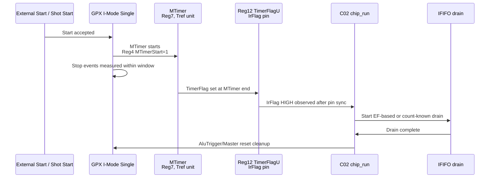

# C02 I-Mode Single IrFlag 정의 v001

- Cluster: C02_Chip_Acquisition
- 문서 목적: I-Mode single measurement에서 IrFlag가 무엇을 기준으로 결정되는지 Datasheet 기준으로 정의
- 작성/수정 시간: 2026-04-30 17:12:36 +09:00
- 기준 문서: `Doc/TDC-GPX-Datasheet.pdf`
- 적용 범위: Datasheet 2.11.1 `Single measurement` only

## 1. 결론

C02 운용에서 IrFlag는 **GPX 내부 MTimer가 종료되었음을 Reg12 `TimerFlagU` unmask를 통해 IrFlag/IntFlag pin으로 관측한 신호**로 정의한다.

따라서 C02에서 IrFlag rising edge의 의미는 다음과 같다.

1. single Start 기준 측정 window가 닫혔다.
2. 더 이상 이번 shot의 정상 stop event를 expected count에 추가하지 않는다.
3. IFIFO drain을 시작할 수 있는 상위 control event가 발생했다.
4. IrFlag 자체가 IFIFO count 또는 echo count valid를 의미하지는 않는다.

즉, IrFlag는 "이번 shot의 측정 종료 조건"이지 "echo_receiver count가 이제야 결정된다"는 의미가 아니다.

## 2. Datasheet 근거

| 항목 | Datasheet 근거 | C02 해석 |
|---|---|---|
| IrFlag pin | p.13 Pin Description: `IrFlag`는 active HIGH interrupt flag output | C02는 GPX pin을 status level로 받아 동기화한다. |
| MTimer 설정 | p.20 Register 7: `MTimer`는 Tref 배수로 설정 | 측정 window 길이는 GPX reference clock 기준이다. 40MHz ref이면 Tref=25ns. |
| MTimer 시작 조건 | p.19 Register 4: `MTimerStart`, `MTimerStop` | C02 I-Mode single에서는 Start pulse로 MTimer가 시작되는 설정을 전제로 둔다. |
| TimerFlag | p.22 Register 12: `TimerFlag`는 MTimer end flag | MTimer 종료가 status cause이다. |
| TimerFlagU | p.22 Register 12: `TimerFlagU`는 MTimer end를 interrupt flag pin으로 unmask | C02는 Reg12에서 TimerFlagU만 IrFlag source로 쓰는 계약이 필요하다. |
| I-Mode single flow | p.29, 2.11.1 Single measurement example | 예제는 `while(IrFlag=Low)` 후 EF 기반 IFIFO drain, 이후 AluTrigger/Master reset 순서이다. |

## 3. C02 운용 계약

| 계약 ID | 계약 |
|---|---|
| IR-C02-01 | C02의 IrFlag는 Datasheet Reg12 `TimerFlagU`에 의해 발생한 MTimer-end interrupt로 해석한다. |
| IR-C02-02 | Reg12의 `IFifoIntU`, `HFifoIntU`, `Start#U`, `NotLockIntU` 등을 IrFlag source로 함께 unmask하지 않는다. |
| IR-C02-03 | Reg4는 I-Mode single에서 `MTimerStart=1`, `MTimerStop=0` 운용을 기본으로 한다. |
| IR-C02-04 | Reg7 `MTimer` 값은 측정하고자 하는 range/window를 Tref 단위로 환산해 설정한다. 40MHz ref 기준 1 tick = 25ns = 200MHz TDC clock 5 cycles. |
| IR-C02-05 | C02 `chip_run`은 IrFlag rising edge를 drain 시작 event로 사용하고, IrFlag level 자체를 data count valid로 해석하지 않는다. |
| IR-C02-06 | IrFlag는 이번 shot의 정상 stop window 종료를 의미하므로, `echo_receiver`의 final expected count는 IrFlag 이후 새로 결정되는 값이 아니다. |

## 4. Timing 정의



## 5. 시간 환산

Datasheet에서 MTimer는 Tref 배수이다. 40MHz reference clock이면 다음과 같이 해석한다.

| 항목 | 값 |
|---|---:|
| Tref | 25ns |
| FPGA `i_tdc_clk` | 200MHz = 5ns |
| MTimer 1 tick | 25ns = 5 TDC clocks |
| Reg7 `MTimer=80` | 2us = 400 TDC clocks |

따라서 사용자가 말한 "측정하고자 하는 범위에 의해 Timer로 IrFlag가 발생한다"는 해석은 맞다. 단, GPX MTimer의 기본 단위는 200MHz clock이 아니라 Tref이다. C02의 `max_range_clks`는 FPGA 200MHz clock 단위이므로 두 설정은 다음 관계로 맞춰야 한다.

```text
Reg7.MTimer ~= ceil(max_range_clks / 5)   -- 40MHz Tref, 200MHz i_tdc_clk 기준
```

이 관계가 맞지 않으면 C02의 orphan/window 판단과 GPX IrFlag 실제 발생 시점이 서로 달라질 수 있다.

## 6. RTL 근거와 현재 사용 방식

| RTL | 의미 |
|---|---|
| `tdc_gpx_config_ctrl.vhd:1490`, `tdc_gpx_config_ctrl.vhd:1496`, `tdc_gpx_config_ctrl.vhd:1783` | GPX IrFlag pin은 `bus_phy`를 거쳐 `chip_ctrl/chip_run`으로 들어간다. |
| `tdc_gpx_bus_phy.vhd:744`, `tdc_gpx_bus_phy.vhd:751`, `tdc_gpx_bus_phy.vhd:761` | IrFlag pin은 2-FF synchronizer를 통과한 level로 제공된다. |
| `tdc_gpx_chip_run.vhd:304`, `tdc_gpx_chip_run.vhd:436` | `chip_run`은 synchronized IrFlag rising edge를 감지해 `ST_DRAIN_LATCH`로 진입한다. |
| `tdc_gpx_stop_cfg_decode.vhd:18` | stop count 계약은 "IrFlag 이전 마지막 beat가 final expected count"이다. |
| `tdc_gpx_pkg.vhd:233` | `max_range_clks`는 FPGA 200MHz 기준 physical round-trip bound로 관리된다. |

## 7. `c_EXP_LATCH_SETTLE_LAST`와의 관계

IrFlag 정의가 위와 같이 닫히면 `c_EXP_LATCH_SETTLE_LAST=16clk`의 의미도 정리된다.

| 질문 | 판단 |
|---|---|
| IrFlag 이후 stop count가 물리적으로 새로 결정되는가? | 아니다. 정상 I-Mode single 계약에서는 IrFlag 이전 window의 결과이다. |
| IrFlag 때문에 echo_receiver count가 늦게 결정되는가? | 아니다. count는 stop event 경로에서 이미 누적된다. |
| 그래도 `chip_run`에서 늦게 보일 수 있는가? | 가능하다. 이유는 물리 이벤트가 아니라 AXI domain expected count가 TDC domain으로 CDC 전달되는 구현 지연이다. |
| 따라서 16clk는 무엇인가? | Datasheet 요구가 아니라 CDC 가시성 guard이다. |

## 8. 추가 검증 필요

| 검증 ID | 목적 |
|---|---|
| V-IR-01 | Reg12 IrFlag source가 TimerFlagU only인지 cfg image/TB에서 확인 |
| V-IR-02 | Reg4가 I-Mode single에서 MTimerStart=1, MTimerStop=0인지 확인 |
| V-IR-03 | Reg7.MTimer와 `max_range_clks`의 단위 환산이 일치하는지 확인 |
| V-IR-04 | IrFlag rising edge 이전 final expected count가 AXI domain에서 이미 결정되는지 확인 |
| V-IR-05 | final expected count가 IrFlag 관측 시점에 TDC domain에서 이미 stable한지 측정 |

## 9. 현재 판단

사용자의 지적대로 `c_EXP_LATCH_SETTLE_LAST`를 논하기 전에 IrFlag 정의가 먼저 닫혀야 한다. C02에서는 IrFlag를 "MTimer 종료 interrupt"로 좁게 정의해야 한다. 이 정의가 닫히면 expected count는 IrFlag 이후에 물리적으로 새로 결정되는 값이 아니므로, 16clk 대기는 GPX 물리 요구가 아니라 AXI->TDC CDC guard로만 남는다.
