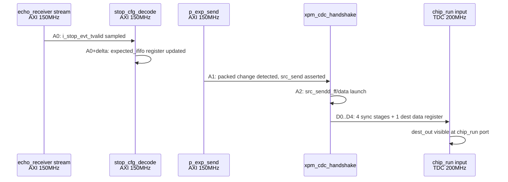

# C02 Expected Count CDC Latency 분석 v001

- Cluster: C02_Chip_Acquisition
- 문서 목적: `echo_receiver` stop event 입력부터 C02 `chip_run` expected count 사용 지점까지의 clock 소모량 산출
- 작성/수정 시간: 2026-04-30 17:20:50 +09:00
- 기준 clock:
  - `i_axis_aclk`: 150MHz, 6.667ns
  - `i_tdc_clk`: 200MHz, 5ns
- 적용 경로: `echo_receiver` stop event stream -> `tdc_gpx_stop_cfg_decode` -> `xpm_cdc_handshake` -> `tdc_gpx_chip_run`

## 1. 결론 요약

Handshake가 idle일 때 final expected count 1개가 들어오는 정상 단건 경로는 다음과 같다.

| 구간 | Clock domain | Clock 수 | 시간 |
|---|---:|---:|---:|
| echo beat sample -> `src_send` assert | 150MHz AXI | 1 clk | 6.667ns |
| echo beat sample -> XPM internal launch | 150MHz AXI | 2 clk | 13.333ns |
| XPM source launch -> destination `dest_out` valid | 200MHz TDC | 5 clk budget | 20~25ns |
| CDC `dest_out` -> `chip_run.i_expected_ififo*` port | combinational | 0 clk | 0ns |
| `chip_run` latch -> first drain decision use | 200MHz TDC | 1 clk | 5ns |

따라서 idle transfer 기준으로는 echo beat가 AXI clock에서 sample된 뒤 `chip_run` input port에 보이기까지 대략 다음과 같이 본다.

```text
2 * 6.667ns + (20~25ns) + 0ns = 약 33.3~38.3ns
```

현재 `c_EXP_LATCH_SETTLE_LAST=15`는 `ST_DRAIN_LATCH`에서 16 TDC clocks, 즉 80ns를 대기한다. **idle transfer만 놓고 보면 16clk는 과보수이다.**

단, 이전 expected-count handshake가 busy이면 final count는 즉시 CDC로 들어가지 못한다. 이 경우 지연은 1개 handshake round-trip 잔여시간에 종속되므로, 단순한 고정 delay만으로 완전 증명하기 어렵다.

## 2. RTL 근거

| 단계 | RTL 근거 | 의미 |
|---|---|---|
| stop decode 입력 | `tdc_gpx_config_ctrl.vhd:1105`, `:1110` | `i_stop_evt_tvalid/tdata/tuser`가 `i_axis_aclk` domain의 `stop_cfg_decode`로 들어간다. |
| expected count register | `tdc_gpx_stop_cfg_decode.vhd:259`, `:273`, `:276`, `:279` | stop event beat를 sample한 clock edge에서 `o_expected_ififo1/2`가 register update된다. |
| source pack | `tdc_gpx_config_ctrl.vhd:1369`, `:1371` | per-chip 8-bit count를 32-bit bundle로 pack한다. |
| source send FSM | `tdc_gpx_config_ctrl.vhd:1411`, `:1420`, `:1422` | packed count 변화가 보이면 `s_exp*_src_send_r`를 assert한다. |
| XPM CDC | `tdc_gpx_config_ctrl.vhd:1379`, `:1395` | `xpm_cdc_handshake`, `DEST_SYNC_FF=4`, `SRC_SYNC_FF=4`, `DEST_EXT_HSK=1`. |
| dest unpack | `tdc_gpx_config_ctrl.vhd:1373`, `:1375` | CDC `dest_out`을 per-chip expected count로 unpack한다. |
| chip_run 연결 | `tdc_gpx_config_ctrl.vhd:1765`, `tdc_gpx_chip_ctrl.vhd:520` | `s_expected_ififo*_tdc(i)`가 `chip_run`으로 port 연결된다. |
| chip_run latch | `tdc_gpx_chip_run.vhd:475`, `:481`, `:482` | `ST_DRAIN_LATCH`에서 `i_expected_ififo*`를 내부 register로 latch한다. |

XPM 구조 근거:

| XPM local source | 의미 |
|---|---|
| `C:\Xilinx\2025.1\data\ip\xpm\xpm_cdc\hdl\xpm_cdc.sv:575` | source-to-destination `xpm_cdc_single` uses `DEST_SYNC_FF`. |
| `...\xpm_cdc.sv:590`, `:594` | source data is registered and destination data is enabled on new request. |
| `...\xpm_cdc.sv:601` | destination-to-source ack uses `SRC_SYNC_FF`. |
| `...\xpm_cdc.sv:613`, `:623` | `DEST_EXT_HSK=1`, `dest_req` is registered external request. |

## 3. Idle transfer cycle timeline

`A0/A1/A2`는 150MHz AXI clock edge, `D0..D4`는 200MHz TDC clock edge이다.



### 3.1 echo input부터 CDC source까지

| 기준점 | AXI clock 수 | 설명 |
|---|---:|---|
| `i_stop_evt_tvalid` sample -> `o_expected_ififo*` register visible | 0 full clk / 1 register edge | 같은 AXI rising edge에서 register update 후 delta에 보임 |
| `o_expected_ififo*` visible -> `s_exp*_src_send_r=1` | 1 clk | `p_exp_send`가 다음 AXI edge에서 packed change 감지 |
| `s_exp*_src_send_r=1` -> XPM `src_sendd_ff` launch | 1 clk | XPM 내부 source register가 다음 AXI edge에서 send를 잡음 |
| 합계: input sample -> XPM internal launch | 2 clk | 13.333ns |

실무적으로 "CDC 입력 pin `src_send`까지"만 보면 1 AXI clk이고, "XPM 내부에서 destination으로 launch되는 시점"까지 보면 2 AXI clk이다.

### 3.2 CDC forward delay

현재 expected count CDC는 다음 generic이다.

```text
DEST_EXT_HSK = 1
DEST_SYNC_FF = 4
SRC_SYNC_FF  = 4
WIDTH        = 32
```

Forward path는 다음과 같이 계산한다.

| 구성 | TDC clock 수 | 설명 |
|---|---:|---|
| source send level -> destination sync output | 4 clk | `DEST_SYNC_FF=4` |
| destination data/request register | 1 clk | `dest_hsdata_ff`, `dest_req_ext_ff` |
| 합계 budget | 5 clk | 25ns budget, phase에 따라 실제 20~25ns |

따라서 CDC forward만 보면 `i_tdc_clk` 기준 약 5clk budget이다.

### 3.3 CDC output부터 실제 필요 지점까지

| 구간 | Clock 수 | 설명 |
|---|---:|---|
| `dest_out` -> `s_expected_ififo*_tdc(i)` | 0 clk | concurrent unpack |
| `s_expected_ififo*_tdc(i)` -> `chip_ctrl` -> `chip_run.i_expected_ififo*` | 0 clk | port wiring |
| `chip_run.i_expected_ififo*` -> `s_expected_ififo*_r` | scheduled latch | `ST_DRAIN_LATCH`의 특정 clock edge에서만 latch |
| latch된 expected -> `ST_DRAIN_CHECK` decision | 1 TDC clk | latch 다음 state에서 drain decision |

즉 CDC output에서 `chip_run` input port까지는 clock delay가 없다. 실제 사용 register인 `s_expected_ififo*_r`까지는 "CDC 기준 고정 지연"이 아니라 `ST_DRAIN_LATCH`가 언제 sample하느냐에 의해 결정된다.

## 4. Busy handshake일 때의 추가 지연

현재 `p_exp_send`는 outstanding handshake가 있으면 새 값을 즉시 보내지 않는다.

```vhdl
if s_exp1_src_send_r = '0' and s_expected_ififo1_src_packed /= s_exp1_d1_r then
    s_exp1_src_send_r <= '1';
    s_exp1_d1_r       <= s_expected_ififo1_src_packed;
elsif s_exp1_src_rcv = '1' then
    s_exp1_src_send_r <= '0';
end if;
```

이 구조는 running total의 중간값을 모두 보낼 필요는 없으므로 합리적이지만, final count가 이전 transfer 중에 들어오면 다음 지연이 추가될 수 있다.

| 구성 | Clock 수 | 시간 |
|---|---:|---:|
| 기존 transfer forward 잔여 | 최대 약 5 TDC clk | 최대 약 25ns |
| dest ack -> source `src_rcv` | 4 AXI clk budget | 약 26.7ns |
| `src_rcv` 처리 후 최신값 `src_send` 재assert | 1 AXI clk | 6.7ns |
| XPM internal launch | 1 AXI clk | 6.7ns |
| 최신값 forward CDC | 5 TDC clk budget | 최대 약 25ns |

최악에 가까운 직관적 budget은 다음과 같다.

```text
5*TDC + 4*AXI + 2*AXI + 5*TDC
= 25ns + 26.7ns + 13.3ns + 25ns
= 약 90ns + clock phase
```

따라서 final expected count가 이전 CDC transaction과 겹치면 `16*TDC = 80ns` guard만으로 항상 충분하다고 증명하기 어렵다. 이 경우는 고정 delay보다 **expected final valid/shot sequence 계약**으로 닫는 편이 더 논리적이다.

## 5. `c_EXP_LATCH_SETTLE_LAST=16clk`에 대한 판단

| 조건 | 판단 |
|---|---|
| final echo beat가 CDC idle 상태에서 들어옴 | 16clk는 과보수. idle path는 약 33.3~38.3ns. |
| final echo beat가 이전 expected CDC transfer와 겹침 | 16clk가 항상 충분하다고 단정하기 어렵다. 이전 transaction 잔여시간에 종속된다. |
| CDC output이 이미 `ST_DRAIN_LATCH` sample 전에 stable | `chip_run` port까지 0clk이므로 문제 없음. |
| CDC output이 `ST_DRAIN_LATCH` sample 뒤에 도착 | 현재 구조는 재sample하지 않으므로 stale expected count 위험. mismatch/fault로 검출될 수는 있으나, count-known burst 판단에는 부적합. |

## 6. 권장 보완

1. `c_EXP_LATCH_SETTLE_LAST`는 Datasheet timing이 아니라 expected-count CDC visibility guard로 문서화한다.
2. `g_EXP_LATCH_GUARD_CLKS` generic으로 바꿔 실험적으로 0/1/16clk를 비교 가능하게 한다.
3. final expected count에 `valid` 또는 `shot_seq`를 같이 CDC하여 `chip_run`이 "이번 shot의 final expected"를 확인하고 drain을 시작하게 한다.
4. TB에 다음 timestamp monitor를 추가한다.

| Timestamp | 의미 |
|---|---|
| `T_ECHO_LAST` | final `i_stop_evt_tvalid` sample edge |
| `T_SRC_SEND` | `s_exp*_src_send_r` assert |
| `T_XPM_LAUNCH` | XPM `src_sendd_ff` launch equivalent |
| `T_DEST_OUT` | `s_expected_ififo*_tdc` change |
| `T_IRFLAG_SYNC` | `chip_run` IrFlag edge detect |
| `T_EXPECT_LATCH` | `s_expected_ififo*_r` latch |

이 검증이 있으면 16clk 제거/축소 여부를 파형이 아니라 수치로 닫을 수 있다.
