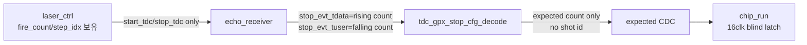
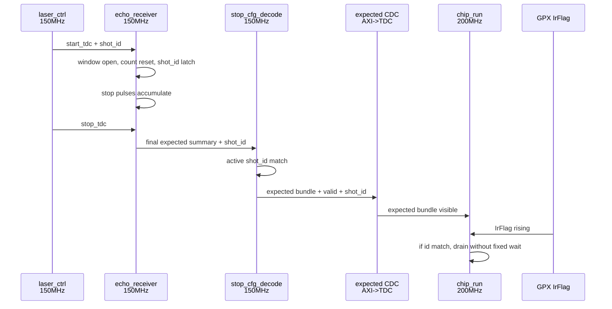
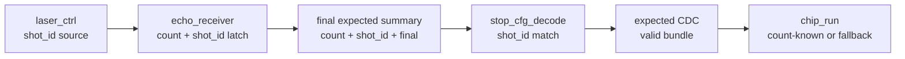

# C02 Shot/Fire Sequence Match 기반 Expected Count 구조 분석 v001

- Cluster: C02_Chip_Acquisition
- 문서 목적: `c_EXP_LATCH_SETTLE_LAST` 고정 wait 제거 가능성과 `laser_ctrl`/`echo_receiver` shot id match 구조 검토
- 작성/수정 시간: 2026-04-30 17:28:31 +09:00
- 기준: Datasheet 2.11.1 I-Mode Single measurement, 현 `laser_ctrl`, `echo_receiver`, `tdc_gpx_ctrl` RTL

## 1. 결론

사용자 제안에 동의한다. **고정 wait count로 expected count 도착을 추정하는 방식보다, shot/fire sequence가 일치할 때만 expected count를 채택하는 구조가 더 합리적이다.**

현재 `c_EXP_LATCH_SETTLE_LAST=16clk`는 Datasheet 물리 timing 요구가 아니라 AXI->TDC CDC 가시성 guard이다. 따라서 이를 제거하려면 "시간이 충분히 지났으니 맞다"가 아니라 "이번 shot의 expected count가 도착했다"를 증명하는 data/control 계약이 필요하다.

권장 구조는 다음이다.

```text
laser_ctrl shot/fire id
    -> echo_receiver가 start_tdc에서 capture
    -> echo_receiver가 stop_tdc/window close에서 final expected summary + shot/fire id 발행
    -> tdc_gpx_stop_cfg_decode가 active shot/fire id와 match 확인
    -> expected count + id + valid를 TDC domain으로 CDC
    -> chip_run은 IrFlag 후 matching valid가 있으면 count-known drain, 없으면 EF-only fallback 또는 bounded fault
```

이렇게 하면 `ST_DRAIN_LATCH`의 blind 16clk wait는 제거 가능하다. 단, deadlock 방지를 위한 watchdog은 별도 fault/ fallback 용도로 남겨야 한다.

## 2. 접근성 확인

| 모듈 | 접근 여부 | 확인 경로 |
|---|---|---|
| `laser_ctrl` | 접근 가능 | `C:\Projects\my_sp\lib\IP\laser_ctrl\HDL` |
| `echo_receiver` | 접근 가능 | `C:\Projects\my_sp\lib\IP\echo_receiver\HDL` |
| `tdc_gpx_ctrl` | 접근 가능 | 현재 workspace `C:\Projects\my_sp\lib\IP\tdc_gpx_ctrl\HDL` |

## 3. 현 RTL 근거

### 3.1 laser_ctrl에는 shot/fire identity가 있다

| 근거 | 의미 |
|---|---|
| `laser_ctrl_cfg_pkg.vhd:89` | `m_axis_tdata[15:0]`는 face 내 `fire_count`, 1-base, 16-bit이다. |
| `laser_ctrl_cfg_pkg.vhd:98`, `:99` | step/fire index field 위치는 `[15:0]`이다. |
| `laser_ctrl_result.vhd:10` | result stream의 `tdata[15:0]`는 shot 동안 고정되는 fire_count이다. |
| `laser_ctrl_result.vhd:47`, `:120`, `:146` | 내부 `i_shot_step_idx`를 latch하고 output에서는 `step_idx + 1`로 fire_count를 만든다. |
| `laser_ctrl_cfg_pkg.vhd:119` | result `tuser` 실제 width는 21-bit이다. |
| `laser_ctrl_top.vhd:323`, `:718` | debug output `o_dbg_shot_cnt`는 최근 accepted shot의 executor step_idx이다. |
| `laser_ctrl_top.vhd:704`, `:705` | `o_start_tdc`, `o_stop_tdc`가 echo_receiver와 tdc_gpx_top으로 전달되는 window control이다. |

주의: `laser_ctrl_top.vhd` 상단 주석 일부는 result `tuser[35:21]` 같은 과거/불일치 표현을 포함한다. 실제 package 기준은 `c_RES_TUSER_WIDTH=21`이고, `dec_count`는 `[20:6]`이다. 이 프로젝트 규칙상 주석보다 코드와 Datasheet/계약을 우선한다.

### 3.2 echo_receiver는 현재 shot id를 출력하지 않는다

| 근거 | 의미 |
|---|---|
| `echo_receiver_top.vhd:64`, `:65` | echo_receiver 입력은 `i_start_tdc`, `i_stop_tdc`뿐이고 shot id 입력이 없다. |
| `echo_receiver_top.vhd:78`, `:80`~`:83` | stop event stream의 `tuser`는 per-stop falling 누적 count이다. |
| `echo_receiver_core.vhd:168`, `:169` | `start_rising`, `stop_rising`으로 window를 열고 닫는다. |
| `echo_receiver_core.vhd:384`~`:390` | `start_rising`에서 count와 stop_evt output을 reset한다. |
| `echo_receiver_core.vhd:401`~`:424` | stop pulse가 있을 때만 `tvalid=1`이고, `tdata/tuser`에 rising/falling 누적 count를 pack한다. |
| `echo_receiver_core.vhd:429` | stop pulse가 없으면 `tvalid=0`, count는 유지한다. |

따라서 현재 `echo_receiver.o_stop_evt_tuser`를 "어떤 fire count의 정보인가"로 바로 쓸 수는 없다. 현재 `tuser`는 이미 falling count storage로 사용 중이다.

### 3.3 tdc_gpx_ctrl도 자체 shot sequence가 있다

| 근거 | 의미 |
|---|---|
| `tdc_gpx_face_seq.vhd:294`~`:296` | `o_shot_start_gated`에서 global shot sequence가 증가한다. |
| `tdc_gpx_config_ctrl.vhd:1722`~`:1730` | per-chip shot_seq가 TDC->AXI domain으로 `xpm_cdc_gray` 전달된다. |
| `tdc_gpx_chip_run.vhd:214`, `:481`~`:483` | 현재 expected count는 fixed 16clk wait 후 latch한다. |
| `tdc_gpx_stop_cfg_decode.vhd:276`~`:281` | 현재 expected count는 stop event beat의 count를 즉시 overwrite한다. |
| `tdc_gpx_top.vhd:104`, `:105` | 현재 top은 laser result `tvalid/tdata`만 받고 `tuser`는 받지 않는다. |
| `tdc_gpx_csr_pipeline.vhd:704`, `:705` | 현재 `i_lsr_tdata[15:0]`는 `cols_per_face` latch 용도로만 사용된다. |

즉, C02 내부도 shot sequence를 갖고 있지만 laser fire_count와 직접 match하는 계약은 아직 없다.

## 4. 현재 구조의 한계



현재 한계는 네 가지다.

1. `echo_receiver`가 `laser_ctrl`의 fire_count를 입력받지 않는다.
2. `echo_receiver.o_stop_evt_tuser`는 shot id가 아니라 falling count이다.
3. `tdc_gpx_stop_cfg_decode`는 expected count만 만들고, 해당 count가 어느 shot의 count인지 보존하지 않는다.
4. `chip_run`은 "matching shot expected valid"가 아니라 "16clk 뒤 값을 sample"한다.

따라서 사용자 제안을 적용하려면 sideband 계약을 확장해야 한다.

## 5. 제안 구조

### 5.1 권장 interface

가장 명확한 구조는 `echo_receiver`와 `tdc_gpx_ctrl` 사이에 count payload와 shot id payload를 분리하는 것이다.

| 신호 | domain | 방향 | 의미 |
|---|---|---|---|
| `i_shot_id_valid` | 150MHz axis | `laser_ctrl -> echo_receiver` | start_tdc와 같은 shot id가 유효 |
| `i_shot_face_idx` | 150MHz axis | `laser_ctrl -> echo_receiver` | face 식별자 |
| `i_shot_fire_count` | 150MHz axis | `laser_ctrl -> echo_receiver` | face 내 fire_count, 1-base |
| `o_stop_evt_tdata` | 150MHz axis | `echo_receiver -> tdc_gpx` | rising count payload 유지 |
| `o_stop_evt_tuser` | 150MHz axis | `echo_receiver -> tdc_gpx` | falling count payload 유지 |
| `o_stop_evt_shot_valid` | 150MHz axis | `echo_receiver -> tdc_gpx` | 이 beat/summary의 shot id 유효 |
| `o_stop_evt_final` | 150MHz axis | `echo_receiver -> tdc_gpx` | stop_tdc/window close 기준 final expected summary |
| `o_stop_evt_face_idx` | 150MHz axis | `echo_receiver -> tdc_gpx` | final summary의 face id |
| `o_stop_evt_fire_count` | 150MHz axis | `echo_receiver -> tdc_gpx` | final summary의 fire count |

`tuser`를 넓혀 shot id를 넣는 방법도 가능하지만, 현재 `tuser`는 falling count로 이미 의미가 확정되어 있으므로 별도 sideband가 더 안전하다.

### 5.2 final summary가 필요하다

현재 echo_receiver는 stop pulse가 발생한 clock에만 `o_stop_evt_tvalid=1`을 만든다. 하지만 expected count가 정확히 "최종값"이라는 것을 증명하려면 `stop_tdc` 또는 window close 시점에 final summary를 한 번 내보내야 한다.

필요한 이유:

| 상황 | 현재 running beat만 있을 때 | final summary가 있을 때 |
|---|---|---|
| shot 안에 stop pulse가 있음 | 마지막 stop pulse beat가 사실상 final이지만 final 표시가 없음 | `final=1`로 확정 가능 |
| shot 안에 stop pulse가 0개 | stop_evt beat가 아예 없을 수 있음 | `expected=0, final=1`을 발행 가능 |
| CDC가 busy | 어느 count가 최종인지 불명확 | final bundle만 CDC 대상으로 삼을 수 있음 |
| IrFlag와 근접 | 16clk guard 필요 | matching final_valid가 기준 |

따라서 `echo_receiver`는 running total beat와 별개로 `stop_rising`에서 final summary를 발행하는 구조가 바람직하다.

## 6. tdc_gpx 내부 변경 방향

### 6.1 stop_cfg_decode

현재:

```text
stop_evt beat -> expected_ififo overwrite
```

제안:

```text
stop_evt final summary + shot id
    -> active shot id와 비교
    -> match이면 expected_ififo snapshot + expected_valid + expected_id 저장
    -> mismatch이면 stale/orphan/late sticky set
```

### 6.2 expected CDC

현재 CDC payload:

```text
expected_ififo1[4 chips] 32b
expected_ififo2[4 chips] 32b
```

제안 CDC payload:

```text
expected_valid
expected_face_idx
expected_fire_count or shot_seq
expected_ififo1[4 chips]
expected_ififo2[4 chips]
final_seen
fault/mismatch bits
```

이 경우 `chip_run`은 `expected_valid && expected_id == current_shot_id`일 때만 count-known drain을 수행한다.

### 6.3 chip_run

현재:

```text
IrFlag rising -> ST_DRAIN_LATCH
ST_DRAIN_LATCH에서 16clk wait
wait 후 expected count latch
```

제안:

```text
IrFlag rising -> ST_EXPECT_MATCH
if expected_valid && expected_id == current_shot_id:
    latch expected immediately
    count-known drain
else:
    EF-only fallback or bounded fault policy
```

고정 `c_EXP_LATCH_SETTLE_LAST`는 제거하거나 `g_EXPECTED_MATCH_TIMEOUT_CLKS` 형태의 fault watchdog으로 재정의한다. 이 watchdog은 timing 보정용 wait가 아니라 "계약 위반 감지"용이다.

## 7. sequence id 선택

| 후보 | 장점 | 주의점 | 판단 |
|---|---|---|---|
| laser `fire_count` only | 이미 `m_axis_tdata[15:0]`에 있음 | face마다 1부터 reset되므로 face 식별자 없으면 중복 | 단독 사용 비추천 |
| `{face_idx, fire_count}` | laser_ctrl result contract와 자연스럽게 맞음 | tdc_gpx_top에 `i_lsr_tuser` 또는 별도 face id 입력 필요 | 추천 |
| tdc_gpx `global_shot_seq` | C02 내부 downstream tag와 이미 연결됨 | laser/echo 쪽에 같은 id를 전달해야 함 | 장기 추천 |
| chip별 `s_chip_shot_seq` | raw event tag와 이미 연결됨 | TDC domain 내부 counter라 echo_receiver와 직접 match 어려움 | 내부 검증용 |

현 구조에서는 `{face_idx, fire_count}`가 현실적인 1차 후보이다. 단, C02 내부 raw event/downstream tag는 이미 `shot_seq`를 쓰므로, 장기적으로는 laser/echo/tdc가 공유하는 `shot_id` 정의를 하나로 통합하는 편이 더 좋다.

## 8. Timing / Latency / Throughput / Pipeline / II 영향

### 8.1 Timing block



### 8.2 Latency

| 경로 | 현 구조 | 제안 구조 |
|---|---|---|
| IrFlag -> drain decision | 16 TDC clk fixed wait + CDC 가시성 가정 | expected match가 이미 있으면 0~1 TDC clk, 없으면 fallback/contract fault |
| echo final -> TDC expected visible | running count CDC, busy 시 stale 가능 | final-only CDC로 transaction 수 감소, stale 가능성 감소 |
| expected validity 판단 | 시간 기반 | id/valid 기반 |

### 8.3 Throughput

| 항목 | 영향 |
|---|---|
| count-known burst | matching final expected가 있으면 fixed wait 제거로 개선 가능 |
| count-unknown fallback | echo final이 없거나 mismatch면 기존 EF-only safe drain 유지 |
| CDC traffic | running total을 매 stop event마다 보내지 않고 final summary만 보내면 감소 가능 |

### 8.4 Pipeline

제안 pipeline은 다음처럼 control/data boundary가 선명해진다.



### 8.5 II

| 항목 | 현 구조 | 제안 구조 |
|---|---|---|
| expected CDC initiation | stop event마다 running total change 시 handshake | shot final summary마다 1회 handshake 권장 |
| shot-level II | previous expected CDC busy가 final count 전파를 지연 가능 | final-only라 CDC load가 줄어 shot-level II 여유 증가 |
| drain II | 16clk latch wait 포함 | matching valid가 있으면 fixed latch wait 제거 |

## 9. 위험과 완화

| 위험 | 설명 | 완화 |
|---|---|---|
| laser fire_count와 tdc_gpx global_shot_seq 불일치 | laser는 face 내 1-base, tdc_gpx는 cmd_start 후 global 증가 | `{face_idx, fire_count}` 또는 공통 `shot_id`로 통일 |
| echo_receiver tuser 재사용 오해 | 현재 `tuser`는 falling count | 별도 sideband 추가 또는 tuser width 확장 계약 명시 |
| final summary 미발행 | stop pulse가 없으면 expected=0을 알 수 없음 | `stop_tdc`에서 반드시 final summary 발행 |
| IrFlag가 final summary보다 먼저 도착 | CDC/clock phase 또는 외부 연결 오류 | count-known 요구 시 bounded wait/fault, 안전 우선 시 EF-only fallback |
| multi-face fire_count 중복 | fire_count만 쓰면 face 경계에서 중복 | face_idx 포함 |
| current top port 부족 | `tdc_gpx_top`은 `i_lsr_tuser`가 없음 | top/config/stop_decode interface 확장 필요 |

## 10. 코드 수정 후보

1. `laser_ctrl_top`
   - direct metadata output 추가 후보: `o_shot_id_valid`, `o_shot_face_idx`, `o_shot_fire_count`
   - 또는 기존 `m_axis_tdata/tuser`를 system top에서 decode하여 echo_receiver/tdc_gpx에 전달

2. `echo_receiver_top/core`
   - shot id input 추가
   - `start_rising`에서 shot id latch
   - `stop_rising`에서 final summary beat 생성
   - stop_evt count payload와 shot id payload 분리

3. `tdc_gpx_top/config_ctrl/stop_cfg_decode`
   - stop event shot id/final sideband 입력 추가
   - active shot id와 final summary id match
   - expected bundle에 `valid/id/count` 포함

4. `tdc_gpx_chip_run`
   - `c_EXP_LATCH_SETTLE_LAST` 제거 또는 `g_EXPECTED_MATCH_TIMEOUT_CLKS`로 의미 변경
   - `expected_valid && expected_id == current_shot_id`이면 즉시 count-known drain
   - mismatch/invalid이면 EF-only fallback 또는 fault policy

## 11. 현재 판단

이 방식은 C02의 운영 개념을 더 명확하게 만든다. 고정 wait는 "시간이 충분할 것이다"라는 추정이고, shot/fire id match는 "이 데이터가 이번 shot의 데이터다"라는 검증이다. 따라서 C02의 count-known burst 조건은 앞으로 `expected_ififo > 0`이 아니라 다음 조건으로 바꾸는 것이 좋다.

```text
expected_final_valid = 1
expected_shot_id == active_shot_id
expected_count is within legal range
```

이 조건이 만족되지 않으면 count-known burst가 아니라 count-unknown EF-only fallback으로 처리해야 한다.
