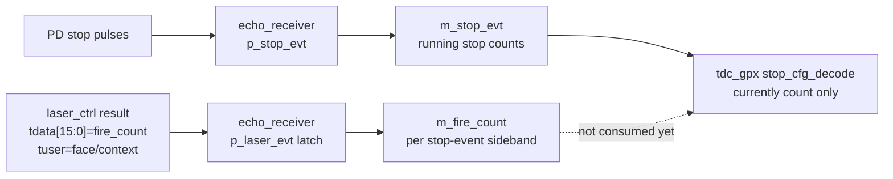
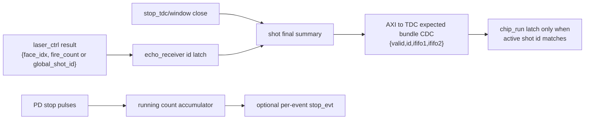

# C02 Chip Acquisition - echo_receiver Fire Count Stream 반영 검토 v001

- 작성/수정 시간: 2026-04-30 18:27:24 +09:00
- 작성 목적: echo_receiver에 추가된 fire(shot) count AXI-Stream 출력이 C02의 expected count 확정, wait guard 제거, stop-event 기반 drain pipeline 보완에 충분한지 검토한다.
- 절대 기준: `Doc/TDC-GPX-Datasheet.pdf`
- 검토 기준 문서:
  - `Doc/cluster_analysis/C02_Chip_Acquisition/C02_Chip_Acquisition_260430172831_ShotSeq_Match_Expected_Review_v001.md`
  - `Doc/cluster_analysis/C02_Chip_Acquisition/C02_Chip_Acquisition_260430172050_Expected_CDC_Latency_v001.md`
  - `Doc/cluster_analysis/C02_Chip_Acquisition/C02_Chip_Acquisition_260430171236_IrFlag_Definition_v001.md`
- echo_receiver 기준 커밋: `e254938 feat: add fire count AXIS output`
- tdc_gpx_ctrl 즉시 반영 파일: `tb_tdc_gpx_full_int.vhd`

---

## 1. 결론

echo_receiver에 fire(shot) count를 별도 Stream으로 출력하도록 만든 방향은 C02의 구조 개선 방향과 일치한다. 특히 기존 `stop_evt_tuser`가 falling count 누적값으로 사용되고 있으므로, 여기에 fire count를 섞지 않고 별도 `m_fire_count` Stream을 만든 것은 올바른 분리다.

다만 현재 구현만으로는 C02의 `c_EXP_LATCH_SETTLE_LAST` 또는 wait guard를 완전히 제거하기에는 부족하다. 현재 `m_fire_count`는 "shot final summary"가 아니라 "stop-event beat가 발생한 사이클에 동반되는 per-event sideband"이다. 따라서 stop pulse가 0회인 shot, 마지막 stop-event 이후 IrFlag까지의 최종 확정 시점, fire_count와 stop_evt의 backpressure alignment를 아직 명확히 증명할 수 없다.

즉시 반영 가능한 것은 integration TB 포트맵 정합성이다. `echo_receiver_top` 엔티티 포트가 늘었기 때문에 `tb_tdc_gpx_full_int.vhd`에서 laser_ctrl result stream을 echo_receiver의 `s_laser_evt` 입력에 연결하고, echo_receiver의 `m_fire_count` 출력을 관찰 신호로 연결했다.

---

## 2. 확인된 구현

### 2.1 echo_receiver_core 변경

근거:

- `C:/Projects/my_sp/lib/IP/echo_receiver/HDL/echo_receiver_core.vhd:30`
  - `g_FIRE_COUNT_DWIDTH : natural := 32`
- `C:/Projects/my_sp/lib/IP/echo_receiver/HDL/echo_receiver_core.vhd:47`
  - `i_laser_evt_tdata[15:0] = fire count for the current shot`
- `C:/Projects/my_sp/lib/IP/echo_receiver/HDL/echo_receiver_core.vhd:78`
  - Fire count AXI master 추가
- `C:/Projects/my_sp/lib/IP/echo_receiver/HDL/echo_receiver_core.vhd:249`
  - `p_laser_evt`에서 laser result stream의 fire count를 latch
- `C:/Projects/my_sp/lib/IP/echo_receiver/HDL/echo_receiver_core.vhd:452`
  - `p_stop_evt`에서 stop pulse가 있을 때 stop event와 fire count를 함께 출력

현재 동작:

1. `i_laser_evt_tvalid='1'`이면 `i_laser_evt_tdata[15:0]`를 `s_laser_fire_count_r`에 저장한다.
2. stop rise 또는 fall이 하나라도 발생하면 `o_stop_evt_*`가 1 beat 출력된다.
3. 같은 조건에서 `o_fire_count_tvalid='1'`, `o_fire_count_tdata[15:0]=s_laser_fire_count_r`, `o_fire_count_tlast='1'`가 출력된다.
4. stop pulse가 없는 cycle에는 `o_fire_count_tvalid='0'`이 된다.

### 2.2 echo_receiver_top 변경

근거:

- `C:/Projects/my_sp/lib/IP/echo_receiver/HDL/echo_receiver_top.vhd:118`
  - `axis_aclk` associated busifs에 `s_laser_evt:m_stop_evt:m_fire_count` 반영
- `C:/Projects/my_sp/lib/IP/echo_receiver/HDL/echo_receiver_top.vhd:120`
  - `s_laser_evt` AXI 인터페이스 추가
- `C:/Projects/my_sp/lib/IP/echo_receiver/HDL/echo_receiver_top.vhd:136`
  - `m_fire_count` AXI 인터페이스 추가

### 2.3 echo_receiver 단위 검증

근거:

- `C:/Projects/my_sp/lib/IP/echo_receiver/HDL/tb_echo_receiver_core_only.vhd:185`
  - `ps_fire(v_fire_count)` 절차 추가
- `C:/Projects/my_sp/lib/IP/echo_receiver/HDL/tb_echo_receiver_core_only.vhd:352`
  - fire count `42` 검증
- `C:/Projects/my_sp/lib/IP/echo_receiver/HDL/tb_echo_receiver_core_only.vhd:392`
  - fire count `43` 검증
- `C:/Projects/my_sp/lib/IP/echo_receiver/HDL/tb_echo_receiver_core_only.vhd:424`
  - fire count `100` 검증
- `C:/Projects/my_sp/lib/IP/echo_receiver/HDL/xsim_core_only.log:72`
  - `=== ALL DONE ===`

검증 상태:

- stop-event beat가 발생한 경우, fire_count Stream이 같은 shot의 fire count를 출력하는 기능은 단위 검증되어 있다.
- zero-stop shot에서 final expected count를 0으로 확정하는 기능은 아직 이 검증의 대상이 아니다.
- `i_fire_count_tready='0'` backpressure 상황은 아직 이 검증의 대상이 아니다.

---

## 3. C02 관점 판단

### 3.1 수락 가능한 부분

현재 fire_count Stream은 C02에서 필요한 "shot 식별자 또는 fire 순번을 echo_receiver 결과와 함께 전달한다"는 방향을 만족하기 시작했다.

특히 C02에서 다음 문제를 풀기 위한 기반이 된다.

- `IrFlag` 도착 전후에 expected count가 어느 shot의 값인지 구분
- `c_EXP_LATCH_SETTLE_LAST=16clk` 같은 고정 wait guard 의존도 감소
- laser_ctrl result와 echo_receiver result의 shot 정합성 확인
- stop-event count path와 shot id path의 책임 분리

### 3.2 아직 부족한 부분

#### F-ER-C02-01: final summary가 아니므로 zero-stop shot을 닫지 못함

현재 `o_fire_count_tvalid`는 stop pulse가 있을 때만 출력된다.

근거:

- `C:/Projects/my_sp/lib/IP/echo_receiver/HDL/echo_receiver_core.vhd:492`
  - `if v_any_rise = '1' or v_any_fall = '1' then`
- `C:/Projects/my_sp/lib/IP/echo_receiver/HDL/echo_receiver_core.vhd:498`
  - stop pulse 조건 내부에서 `s_fire_count_valid_r <= '1'`
- `C:/Projects/my_sp/lib/IP/echo_receiver/HDL/echo_receiver_core.vhd:527`
  - 이벤트가 없으면 `s_fire_count_valid_r <= '0'`

판단:

- stop pulse가 0개인 I-Mode single shot에서는 fire_count beat도 발생하지 않는다.
- C02는 이 경우 `expected_ififo=0`이 최종값인지, 아직 echo_receiver 결과가 늦게 오는 중인지 구분할 수 없다.
- 따라서 wait guard 제거를 위해서는 stop-event와 별도로 `shot final summary`가 필요하다.

권장:

- `i_stop_tdc` 상승 또는 window close 기준으로 final beat를 출력한다.
- final beat에는 최소한 `{final_valid, fire_count, face_idx 또는 global shot_id, final rising/falling count}`가 포함되어야 한다.

#### F-ER-C02-02: `tlast='1'`의 의미가 final이 아님

현재 `o_fire_count_tlast`는 stop-event beat마다 1로 출력된다.

근거:

- `C:/Projects/my_sp/lib/IP/echo_receiver/HDL/echo_receiver_core.vhd:500`
  - `s_fire_count_last_r <= '1'`
- `C:/Projects/my_sp/lib/IP/echo_receiver/HDL/echo_receiver_core.vhd:79`
  - 주석: `One beat per stop-event beat. tdata[15:0] = fire count.`

판단:

- 현재 `tlast`는 "이 fire_count sideband가 1 beat짜리다"라는 의미에 가깝다.
- C02에서 이를 "shot final"로 해석하면 오류가 된다.

권장:

- per-event sideband Stream과 shot-final Stream을 분리한다.
- 또는 하나의 Stream에 `tuser.final` bit를 추가해서 final beat만 명확히 구분한다.

#### F-ER-C02-03: fire_count Stream ready가 독립이면 stop_evt와 alignment가 깨질 수 있음

현재 `i_fire_count_tready` 포트는 존재하지만 core 내부에서 사용되는 근거가 확인되지 않는다.

근거:

- `C:/Projects/my_sp/lib/IP/echo_receiver/HDL/echo_receiver_core.vhd:80`
  - `o_fire_count_*`
- `C:/Projects/my_sp/lib/IP/echo_receiver/HDL/echo_receiver_core.vhd:84`
  - `i_fire_count_tready`
- `C:/Projects/my_sp/lib/IP/echo_receiver/HDL/echo_receiver_core.vhd:539`
  - output register 직접 연결
- `C:/Projects/my_sp/lib/IP/echo_receiver/HDL/echo_receiver_top.vhd:142`
  - `m_fire_count` 인터페이스가 `HAS_TREADY 1`로 선언됨

판단:

- downstream이 `i_fire_count_tready='0'`을 줄 수 있는 AXI-Stream으로 선언되어 있지만, source는 hold/skid를 수행하지 않는다.
- stop_evt는 소비되고 fire_count만 유실되거나, 그 반대의 독립 backpressure 모델이 생길 수 있다.

권장:

- 단순 sideband라면 `m_fire_count`는 always-ready 계약으로 고정하고 `HAS_TREADY 0` 또는 top-level contract에 `i_fire_count_tready='1' only`를 명시한다.
- 정식 AXI-Stream으로 유지한다면 stop_evt와 fire_count를 같은 ready 조건으로 묶고 skid/hold register를 구현해야 한다.

#### F-ER-C02-04: fire_count만으로는 다중 face/shot 식별이 부족할 수 있음

현재 echo_receiver는 `i_laser_evt_tuser` 전체를 입력으로 받지만, fire_count output에는 `tdata[15:0]`만 반영한다.

근거:

- `C:/Projects/my_sp/lib/IP/echo_receiver/HDL/echo_receiver_core.vhd:50`
  - `i_laser_evt_tuser : std_logic_vector(20 downto 0)`
- `C:/Projects/my_sp/lib/IP/echo_receiver/HDL/echo_receiver_core.vhd:259`
  - latch 대상은 `i_laser_evt_tdata[15:0]`
- `C:/Projects/my_sp/lib/IP/echo_receiver/HDL/echo_receiver_core.vhd:496`
  - fire output도 `tdata[15:0]`만 채움

판단:

- fire count가 face별로 반복될 수 있다면 fire_count 단독으로는 global shot identity가 되지 않는다.
- C02 matching에는 `{face_idx, fire_count}` 또는 시스템 전체에서 단조 증가하는 `global_shot_id`가 더 안전하다.

권장:

- echo_receiver가 laser result stream의 face index 또는 shot id를 함께 latch한다.
- fire_count output `tuser`를 만들거나, final summary payload에 id field를 포함한다.

#### F-ER-C02-05: tdc_gpx_ctrl 본 경로는 아직 fire_count를 소비하지 않음

근거:

- `tdc_gpx_top.vhd:104`
  - laser result 입력은 `i_lsr_tvalid`, `i_lsr_tdata`만 존재한다.
- `tdc_gpx_top.vhd:114`
  - stop event 입력은 기존 `i_stop_evt_*`만 존재한다.
- `tdc_gpx_stop_cfg_decode.vhd:101`
  - stop event decode는 fire_count 입력 없이 count만 누적한다.
- `tdc_gpx_config_ctrl.vhd:1379`
  - expected_ififo CDC는 count bundle만 handshake한다.

판단:

- fire_count Stream이 echo_receiver에서 생성되어도 C02 본 설계는 아직 이를 expected match 근거로 사용할 수 없다.
- 따라서 이번 반영은 full integration TB 포트 정합성 보완까지로 제한하고, 본 설계 반영은 final summary 계약 확정 후 진행한다.

---

## 4. 즉시 반영 내용

파일:

- `C:/Projects/my_sp/lib/IP/tdc_gpx_ctrl/HDL/tb_tdc_gpx_full_int.vhd`

반영:

1. echo_receiver fire_count 관찰 신호 추가
2. `u_er` generic map에 `g_FIRE_COUNT_DWIDTH => 32` 추가
3. laser_ctrl result stream을 echo_receiver `s_laser_evt`로 연결
4. echo_receiver `m_fire_count` 출력 포트 연결
5. fire_count beat 수를 full integration TB summary에 표시하도록 monitor 추가
6. fire_count ready는 현재 검토 기준상 always-ready로 `i_fire_count_tready => '1'` 연결

주의:

- 이는 integration TB 컴파일 정합성 반영이다.
- `tdc_gpx_top`의 C02 본 동작은 아직 fire_count Stream을 사용하지 않는다.
- 현재 TB에서도 기존 R4a workaround 때문에 `tdc_gpx_top.i_stop_evt_*`는 tie-off 상태다. 이 문제는 stop_evt packing 계약과 함께 별도 해결이 필요하다.

---

## 5. 권장 C02 구조

### 5.1 현재 구조

의미:

- stop-event가 있는 shot에서는 fire_count sideband가 생성된다.
- stop-event가 없는 shot에서는 final expected=0 확정 이벤트가 없다.

### 5.2 권장 구조

의미:

- C02가 필요한 것은 "마지막 count가 도착했을 것으로 추정하는 wait"가 아니라 "해당 shot의 final expected bundle valid"이다.
- final summary가 있으면 zero-stop shot도 `{valid=1, count=0}`으로 닫을 수 있다.

---

## 6. Latency / Throughput / Pipeline / II

### 6.1 현재 fire_count sideband

| 항목 | 현재 판단 | 근거 |
|---|---:|---|
| 입력 capture latency | laser result valid 후 1 axis clock 이내 register 반영 | `p_laser_evt`, `axis_aclk` |
| fire_count output latency | stop-event 출력 cycle과 동일한 registered output | `p_stop_evt` 내부에서 stop_evt/fire_count 동시 set |
| throughput | stop-event beat 발생률과 동일 | fire_count가 stop-event 조건 내부에서만 valid |
| II | stop-event가 매 cycle 발생 가능하면 II=1 axis clock | 별도 stall 로직 없음 |
| backpressure | 현재는 사실상 always-ready 전제 | `i_fire_count_tready` 미사용 |
| C02 wait 제거 가능성 | 단독으로는 부족 | final summary/zero-stop/id match 미정 |

### 6.2 권장 final summary 적용 시

| 항목 | 권장 판단 |
|---|---|
| 입력 capture latency | laser result valid 후 1 axis clock |
| stop count 누적 latency | 현재 stop_evt accumulator 기준 유지 |
| final summary latency | `stop_tdc` 상승 후 1~2 axis clock 목표 |
| AXI->TDC CDC latency | 기존 `xpm_cdc_handshake` 기준, idle 약 33.3~38.3ns |
| throughput | shot당 final summary 1 beat |
| II | shot 간격이 CDC handshake round-trip보다 충분히 크면 II=1 shot/window |
| C02 wait 제거 가능성 | `{valid,id,count}`가 TDC domain에 도착하면 고정 wait 제거 가능 |

---

## 7. 다음 결정 필요 항목

1. fire_count output을 계속 per-event sideband로 유지할지, shot final summary Stream으로 확장할지 결정한다.
2. C02 matching key를 `fire_count` 단독으로 할지, `{face_idx, fire_count}` 또는 `global_shot_id`로 할지 결정한다.
3. `m_fire_count`를 정식 AXI-Stream backpressure 지원으로 만들지, always-ready sideband contract로 고정할지 결정한다.
4. stop_evt packing을 echo_receiver와 tdc_gpx_stop_cfg_decode 사이에서 맞춘다.
5. final summary가 확정되면 `tdc_gpx_top -> tdc_gpx_config_ctrl -> tdc_gpx_stop_cfg_decode -> expected CDC -> chip_run` 순서로 본 설계 반영을 진행한다.

---

## 8. 검증 추가 계획

필수 검증:

1. fire_count가 stop-event beat와 같은 shot id를 유지하는지 검증
2. stop pulse 0개인 shot에서 final summary `{valid=1,count=0}`가 출력되는지 검증
3. 마지막 stop pulse 후 `stop_tdc`가 들어왔을 때 final count가 마지막 누적값과 일치하는지 검증
4. back-to-back shot에서 이전 shot fire_count가 다음 shot에 누출되지 않는지 검증
5. `i_fire_count_tready='0'` 조건을 허용한다면 stop_evt/fire_count alignment가 유지되는지 검증
6. `{face_idx, fire_count}` 또는 `global_shot_id` mismatch 시 C02가 expected latch를 거부하는지 검증
7. AXI 150MHz -> TDC 200MHz CDC 후 active shot id와 expected bundle id가 일치하는 cycle을 검증

---

## 9. 이번 버전의 판단

현재 echo_receiver 변경은 C02 구조 개선을 위한 좋은 1단계다. 다만 C02에서 wait counter를 제거하려면 "fire_count가 나왔다"가 아니라 "해당 shot의 expected count가 최종 확정되었다"는 이벤트가 필요하다. 따라서 현재 구현은 per-event sideband로 수락하고, 다음 보완은 final summary + shot id + backpressure/alignment contract로 진행하는 것이 합리적이다.
