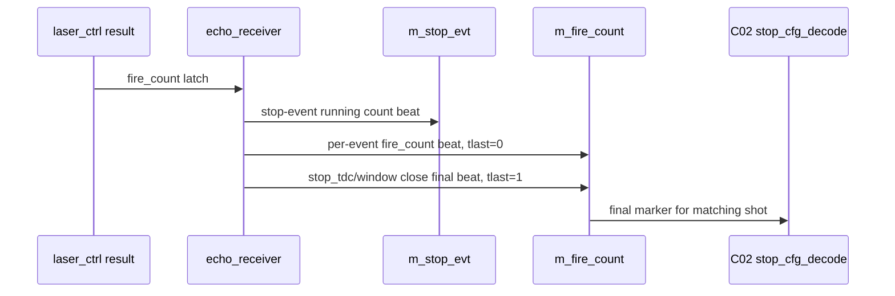

# C02 Chip Acquisition - echo_receiver Fire Count Stream 보완 반영 v002

- 작성/수정 시간: 2026-04-30 18:43:56 +09:00
- 이전 문서: `C02_Chip_Acquisition_260430182724_Echo_Fire_Count_Stream_Review_v001.md`
- 목적: v001의 Review finding 2건을 echo_receiver RTL/TB에 반영한 결과와 C02 후속 계약을 기록한다.
- 절대 기준: `Doc/TDC-GPX-Datasheet.pdf`
- 대상 모듈: `C:/Projects/my_sp/lib/IP/echo_receiver/HDL`

---

## 1. v001 Finding 반영 결과

| Finding | v001 판단 | v002 반영 |
|---|---|---|
| F-ER-C02-01 | 기존 fire_count는 stop pulse가 있을 때만 출력되어 zero-stop shot final을 닫지 못함 | `stop_tdc/window close` 시 `m_fire_count.tlast='1'` final beat 추가. stop pulse가 0개여도 final beat 출력 |
| F-ER-C02-02 | `m_fire_count`가 `HAS_TREADY=1`이지만 ready를 사용하지 않아 backpressure 계약이 불명확 | Xilinx interface metadata에서 `m_fire_count`를 `HAS_TREADY 0`로 변경. `i_fire_count_tready` 포트는 wrapper 호환용으로 유지 |

---

## 2. 새 fire_count Stream 계약

`m_fire_count`는 이제 두 종류의 beat를 가진다.

| Beat 종류 | `tvalid` | `tdata[15:0]` | `tkeep` | `tlast` | 의미 |
|---|---:|---|---|---:|---|
| Per-event sideband | 1 | 현재 shot의 fire count | `"0011"` | 0 | stop-event beat에 동반되는 관찰용 sideband |
| Shot-final summary | 1 | 현재 shot의 fire count | `"0011"` | 1 | `stop_tdc/window close`로 해당 shot의 expected count가 더 이상 증가하지 않음을 알림 |

중요한 운용 의미:

- C02는 `tlast='1'`인 fire_count beat만 "final summary"로 해석해야 한다.
- `tlast='0'` beat는 중간 관찰값이며, fixed wait 제거의 완료 조건으로 쓰면 안 된다.
- zero-stop shot에서는 `stop_evt` beat가 없어도 `m_fire_count.tlast='1'` beat가 발생한다.
- `i_fire_count_tready`는 현재 호환용 포트이며 Stream backpressure로 사용하지 않는다.

---

## 3. RTL 반영 근거

### 3.1 echo_receiver_core

파일:

- `C:/Projects/my_sp/lib/IP/echo_receiver/HDL/echo_receiver_core.vhd`

근거:

- line 79: per-event beat는 `tlast='0'`, shot-final beat는 `tlast='1'`로 주석 계약 추가
- line 174: `s_fire_final_pending_r` 추가
- line 506: stop-event 동반 fire_count는 `s_fire_count_last_r <= '0'`
- line 508~509: stop-event와 `stop_tdc`가 겹치면 final beat를 다음 cycle로 미루기 위해 pending set
- line 534~544: `s_fire_final_pending_r='1'` 또는 `stop_rising/window_active`일 때 final summary beat 출력

구조 판단:

- stop-event와 final beat가 같은 cycle에 동시에 필요할 수 있으므로 두 beat를 한 cycle에 억지로 합치지 않았다.
- stop-event beat를 먼저 내보내고, final summary를 다음 cycle로 pending 처리하는 구조가 더 명확하다.
- zero-stop shot에서는 stop-event beat가 없으므로 `stop_tdc` 검출 cycle에 final summary가 바로 출력될 수 있다.

### 3.2 echo_receiver_top

파일:

- `C:/Projects/my_sp/lib/IP/echo_receiver/HDL/echo_receiver_top.vhd`

근거:

- line 95: per-event/final `tlast` 의미 주석 추가
- line 145: `m_fire_count` Xilinx metadata를 `HAS_TREADY 0`로 변경

판단:

- fire_count Stream은 C02 기준에서 항상 소비 가능한 sideband/final 정보로 운용한다.
- downstream backpressure가 필요한 구조로 바꾸려면 stop_evt와 fire_count를 하나의 skid/hold 정책으로 묶어야 하며, 이번 v002 범위에서는 적용하지 않는다.

---

## 4. 테스트벤치 보완

파일:

- `C:/Projects/my_sp/lib/IP/echo_receiver/HDL/tb_echo_receiver_core_only.vhd`

추가/변경:

- line 210: `pe_expect_final()` procedure 추가
- line 350~351: `T8z` zero-stop shot에서 final beat 검증
- line 388: per-event fire_count는 `tlast='0'` 검증
- line 410: shot fire count 42의 final beat 검증
- line 427: shot fire count 43의 final beat 검증
- line 460: phys mode per-event fire_count는 `tlast='0'` 검증
- line 508: phys mode fire count 100의 final beat 검증

검증 명령:

```powershell
& 'C:\AMDDesignTools\2025.2.1\Vivado\bin\xvhdl.bat' --2008 echo_receiver_pkg.vhd echo_receiver_core.vhd tb_echo_receiver_core_only.vhd echo_receiver_top.vhd
& 'C:\AMDDesignTools\2025.2.1\Vivado\bin\xelab.bat' --debug typical tb_echo_receiver_core_only -s tb_core_only_snap
& 'C:\AMDDesignTools\2025.2.1\Vivado\bin\xsim.bat' tb_core_only_snap --runall --log xsim_core_only.log
```

검증 결과:

- `xvhdl`: PASS
- `xelab`: PASS
- `xsim`: PASS
- 로그 근거: `C:/Projects/my_sp/lib/IP/echo_receiver/HDL/xsim_core_only.log`
  - line 56: `=== T8: stop evt accum (sim rising) ===`
  - line 58: `T8 sim rising done`
  - line 60: `=== T8: stop evt accum (phys rise+fall) ===`
  - line 62: `T8 phys rise+fall done`
  - line 72: `=== ALL DONE ===`

---

## 5. Timing / Pipeline

### 5.1 보완 후 타이밍 블록도



### 5.2 Latency / Throughput / II

| 항목 | v002 판단 |
|---|---|
| laser result capture latency | `i_laser_evt_tvalid` 후 1 `axis_aclk` register 반영 |
| per-event fire_count latency | stop-event beat와 같은 event generation path |
| final summary latency | zero-stop이면 `stop_tdc` 검출 후 0~1 beat 관찰, stop-event와 겹치면 pending 때문에 1 cycle 추가 |
| throughput | per-event beat는 stop-event 발생률과 동일, final beat는 shot당 1회 |
| II | stop-event sideband는 event II=1 axis clock 가능, final summary는 shot II에 종속 |
| C02 wait 제거 가능성 | `tlast='1'` final beat를 C02 expected latch trigger로 사용하면 fixed wait 제거 구조로 전환 가능 |

---

## 6. C02 후속 계약

이번 v002로 C02가 받아야 할 계약은 다음과 같다.

1. C02는 `m_fire_count.tlast='1'`을 shot final marker로만 사용한다.
2. C02는 `m_fire_count.tlast='0'`을 중간 event sideband로만 취급한다.
3. zero-stop shot은 `stop_evt` 없이 `fire_count final beat`만으로 expected count final=0을 확정할 수 있어야 한다.
4. C02 본 설계에는 아직 `fire_count final` 입력이 없으므로 `tdc_gpx_top -> tdc_gpx_config_ctrl -> tdc_gpx_stop_cfg_decode` 경로 확장이 필요하다.
5. C02 matching key는 fire count 단독보다 `{face_idx, fire_count}` 또는 `global_shot_id`가 안전하다. echo_receiver가 현재 face_idx를 output에 포함하지 않는 문제는 별도 후속 항목으로 남는다.
6. stop_evt packing 불일치 문제는 아직 닫히지 않았다. final marker가 추가되어도 count payload 해석은 C02에서 별도 정합화가 필요하다.

---

## 7. 남은 위험

| 위험 | 상태 | 완화 방향 |
|---|---|---|
| face/fire id ambiguity | Open | fire_count payload 확장 또는 `tuser` 추가 검토 |
| stop_evt packing mismatch | Open | echo_receiver packing과 `tdc_gpx_stop_cfg_decode` unpack 기준 통일 |
| stop_evt TREADY 계약 | Existing Open | 기존 stop_evt도 사실상 always-ready 계약이므로 후속 interface metadata 정리 검토 |
| C02 CDC 반영 | Open | final marker + expected count bundle을 AXI 150MHz에서 TDC 200MHz로 handshake 전달 |

---

## 8. v002 결론

echo_receiver는 C02가 요구한 "wait counter 대신 shot/final 기반 확정"으로 넘어갈 수 있는 최소한의 final marker를 갖게 되었다. 이제 C02 쪽 보완은 `fire_count.tlast='1'` final marker를 받아 active shot과 매칭하고, 해당 시점의 expected count를 TDC domain으로 넘기는 구조를 추가하는 방향으로 진행하면 된다.
