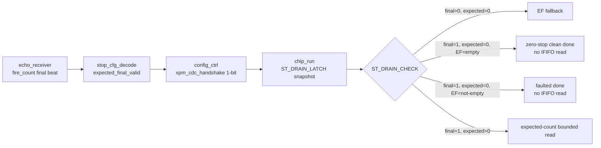

# C02 Chip Acquisition - Zero-stop Shot 보완 결과 v001

- 작성/수정 시간: 2026-04-30 19:07:11 +09:00
- Cluster: C02_Chip_Acquisition
- 목적: echo_receiver가 stop pulse가 없는 shot에서도 final summary를 내보낼 때, C02가 `expected=0`을 "정보 없음"이 아니라 "확정된 zero-stop"으로 처리하도록 RTL과 검증을 보완한다.
- 절대 기준: `Doc/TDC-GPX-Datasheet.pdf`
- 관련 선행 문서:
  - `C02_Chip_Acquisition_260430184356_Echo_Fire_Count_Stream_Review_v002.md`
  - `C02_Chip_Acquisition_260430172831_ShotSeq_Match_Expected_Review_v001.md`
  - `C02_Chip_Acquisition_260430170547_Expected_Latch_Guard_Review_v001.md`

---

## 1. 판단 결론

zero-stop shot은 별도 상태로 구분해야 한다. 기존 `expected_ififo=0`은 두 의미가 섞여 있었다.

| 값 | 기존 의미 | 문제 |
|---|---|---|
| `expected_ififo1/2 = 0` | echo count 정보 없음, EF fallback 사용 | zero-stop인지, echo_receiver 미연결/미도착인지 구분 불가 |
| `expected_ififo1/2 = 0` + `expected_final_valid = 1` | 이번 shot의 최종 expected count가 0으로 확정됨 | 이번 보완으로 추가된 계약 |

따라서 이번 보완의 핵심은 `expected_final_valid`이다. 이 신호가 `1`이면 `expected=0`도 hard bound이다. 이때 C02는 IFIFO를 읽지 않는다. 만약 GPX EF가 "not empty"를 말하면, Datasheet 기준의 정상 zero-stop과 모순되므로 IFIFO를 읽지 않고 faulted control beat로 닫는다.

---

## 2. 운용 계약

### 2.1 입력 계약

echo_receiver의 `m_fire_count.tlast='1'` beat는 해당 shot의 expected count가 더 이상 증가하지 않는 final marker이다. zero-stop shot에서는 stop event beat가 없을 수 있지만 final marker는 반드시 온다.

| 입력 | 의미 | C02 처리 |
|---|---|---|
| `i_stop_evt_tvalid=1` | 누적 stop count 갱신 | `o_expected_ififo1/2` 갱신 |
| `i_fire_count_tvalid=1`, `i_fire_count_tlast=1` | expected count final 확정 | `o_expected_final_valid=1` |
| `i_shot_start_gated=1` | 새 shot 시작 | expected count와 final valid clear |

근거:

- `tdc_gpx_stop_cfg_decode.vhd:18` - fire_count final beat 계약 주석
- `tdc_gpx_stop_cfg_decode.vhd:113` - `i_fire_count_tvalid` 입력
- `tdc_gpx_stop_cfg_decode.vhd:115` - `i_fire_count_tlast` 입력
- `tdc_gpx_stop_cfg_decode.vhd:123` - `o_expected_final_valid` 출력
- `tdc_gpx_stop_cfg_decode.vhd:272` - final beat 감지 조건
- `tdc_gpx_stop_cfg_decode.vhd:275` - active window 내부 final valid set

### 2.2 Drain 계약

`tdc_gpx_chip_run`은 `ST_DRAIN_LATCH`에서 expected count와 final valid를 함께 snapshot한다. 이후 `ST_DRAIN_CHECK`에서 final valid가 있으면 expected count를 hard bound로 사용한다.

| 조건 | 동작 | 결과 |
|---|---|---|
| `expected_final_valid=0`, `expected=0` | 기존 EF fallback | echo_receiver 정보 없음 모드 유지 |
| `expected_final_valid=1`, `expected=0`, EF empty | IFIFO read 없음 | 정상 zero-stop 완료 |
| `expected_final_valid=1`, `expected=0`, EF not-empty | IFIFO read 없음 | mismatch/faulted control beat |
| `expected_final_valid=1`, `expected>0` | expected count만큼 read | EF 조기 종료 시 mismatch/fault |

근거:

- `tdc_gpx_chip_run.vhd:117` - `i_expected_final_valid` 입력
- `tdc_gpx_chip_run.vhd:494` - `ST_DRAIN_LATCH`에서 final valid latch
- `tdc_gpx_chip_run.vhd:511` - final valid 기반 count-known 판정
- `tdc_gpx_chip_run.vhd:536` - expected zero와 EF not-empty 충돌 검출
- `tdc_gpx_chip_run.vhd:547` - mismatch/fault 조건

---

## 3. 구조 변경



상위 포트와 CDC 경로:

- `tdc_gpx_top.vhd:46` - `g_FIRE_COUNT_DWIDTH` generic 추가
- `tdc_gpx_top.vhd:123` - `i_fire_count_tvalid` top 입력 추가
- `tdc_gpx_top.vhd:126` - `i_fire_count_tlast` top 입력 추가
- `tdc_gpx_top.vhd:521` - top에서 config_ctrl로 fire_count 전달
- `tdc_gpx_config_ctrl.vhd:135` - config_ctrl fire_count 입력
- `tdc_gpx_config_ctrl.vhd:1434` - expected final valid 1-bit CDC
- `tdc_gpx_config_ctrl.vhd:1815` - per-chip chip_ctrl로 final valid 전달
- `tdc_gpx_chip_ctrl.vhd:144` - `i_expected_final_valid` 입력 추가
- `tdc_gpx_chip_ctrl.vhd:524` - chip_run으로 final valid 전달

---

## 4. Timing Block

```text
AXI/stream clock domain
T0  shot_start_gated
    - expected_ififo1/2 = 0
    - expected_final_valid = 0

T1  zero-stop shot: no stop_evt beat

T2  echo_receiver fire_count final
    - i_fire_count_tvalid=1
    - i_fire_count_tlast=1
    - stop_cfg_decode sets expected_final_valid=1

CDC
T3  config_ctrl xpm_cdc_handshake carries expected_final_valid to i_tdc_clk domain

TDC clock domain
T4  GPX IrFlag
    - chip_run enters ST_DRAIN_LATCH
    - existing settle guard waits c_EXP_LATCH_SETTLE_LAST = 15, total 16 TDC clocks

T5  ST_DRAIN_CHECK
    - expected_final_valid=1 and expected_ififo=0
    - EF empty: clean drain_done
    - EF not-empty: no IFIFO read, faulted drain_done
```

중요 해석:

- zero-stop 해결은 GPX IFIFO를 "읽어서 0임을 확인"하는 방식이 아니다.
- Datasheet 기준으로 IFIFO read는 필요한 데이터가 있을 때만 수행해야 한다. final expected count가 0으로 확정되면 read를 만들지 않는 것이 더 안전하다.
- EF not-empty와 expected zero가 충돌하면, C02는 데이터를 억지로 읽지 않고 fault로 남긴다. 이것은 데이터 보존보다 운용 정합성 위반을 명확히 보고하는 선택이다.

---

## 5. Latency / Throughput / Pipeline / II

| 항목 | 영향 |
|---|---|
| Latency | zero-stop 정상 경로는 IFIFO data read가 없으므로 bus read latency가 제거된다. IrFlag 이후에는 기존 `ST_DRAIN_LATCH` 16 TDC clocks settle guard 후 `ST_DRAIN_CHECK`에서 control beat로 완료된다. |
| Throughput | zero-stop shot은 IFIFO data beat를 만들지 않는다. 따라서 raw data stream throughput을 소비하지 않고 control beat만 발생한다. |
| Pipeline | `stop_cfg_decode -> expected_final_valid CDC -> chip_run latch -> drain check` 단계가 추가된다. data pipeline에는 새 stage가 추가되지 않는다. |
| II | data beat가 없으므로 zero-stop shot 자체의 data II는 해당 없음. 기존 data drain II는 `[16]` 회귀에서 `II_min=1clk`, `II_max=14clk`로 유지 확인했다. |

측정 근거:

- `xsim_chip_ctrl.log:68` - `[2c]` known-zero 정상 shot에서 no IFIFO read PASS
- `xsim_chip_ctrl.log:69` - `[2c]` known-zero empty shot no fault PASS
- `xsim_chip_ctrl.log:74` - `[2d]` expected zero/EF conflict에서도 no IFIFO read PASS
- `xsim_chip_ctrl.log:75` - `[2d]` conflict faulted sticky PASS
- `xsim_chip_ctrl.log:420` - chip_ctrl 전체 회귀 ALL TESTS PASSED
- `xsim_chip_ctrl.log` `[16]` - 기존 backpressure/latency/II 측정 유지

---

## 6. 검증 결과

| 검증 | 목적 | 결과 |
|---|---|---|
| `tb_tdc_gpx_stop_cfg_decode` | fire_count final marker가 zero-stop final valid를 만드는지 단품 확인 | PASS |
| `tb_tdc_gpx_chip_ctrl` `[2c]` | known-zero + EF empty 정상 완료 | PASS |
| `tb_tdc_gpx_chip_ctrl` `[2d]` | known-zero + EF not-empty 충돌 시 no-read + fault | PASS |
| `tb_tdc_gpx_config_ctrl` | config_ctrl smoke와 CDC elaboration/run 확인 | PASS |
| `tb_tdc_gpx_top_int` | top 새 포트 elaboration/run 확인 | 완료, 기존 warning 유지 |

로그 근거:

- `xsim_stop_cfg_decode.log:28` - `tb_tdc_gpx_stop_cfg_decode: ALL TESTS PASSED`
- `xsim_chip_ctrl.log:420` - `*** ALL TESTS PASSED ***`
- `xsim_config_ctrl.log:36` - `Smoke test completed successfully`
- `xsim_top_int.log:45` - integrated sim end
- `xsim_top_int.log:49` - 기존 scenario warning: rising stream beat 없음

---

## 7. 남은 항목

1. `tb_tdc_gpx_full_int`는 laser_ctrl 외부 package를 현재 work library에 같이 올리지 않아 단독 compile 범위에서 제외됐다. 이 TB 자체는 기존부터 외부 IP compile order가 필요하다.
2. `tb_tdc_gpx_full_int.vhd:857`의 주석처럼 echo_receiver stop_evt packing과 C02 stop_cfg_decode unpacking은 아직 완전히 일치하지 않는다. 그래서 full_int에서는 fire_count final을 top에 직접 연결하지 않고 tie-off 상태로 유지했다.
3. shot/fire id matching은 아직 별도 후속 항목이다. 이번 v001은 zero-stop의 final marker와 drain policy를 닫는 범위다.

---

## 8. 다음 판단

이번 보완으로 C02 내부에서는 zero-stop shot을 다음처럼 운용할 수 있다.

- final marker 없음: legacy EF fallback 유지
- final marker 있음 + expected 0: zero-stop 확정
- zero-stop 확정 + EF empty: 정상 완료
- zero-stop 확정 + EF not-empty: read 금지, fault 보고

따라서 다음 단계는 full integration에서 `stop_evt` packing 계약과 fire_count/shot id matching 계약을 닫는 것이다.
