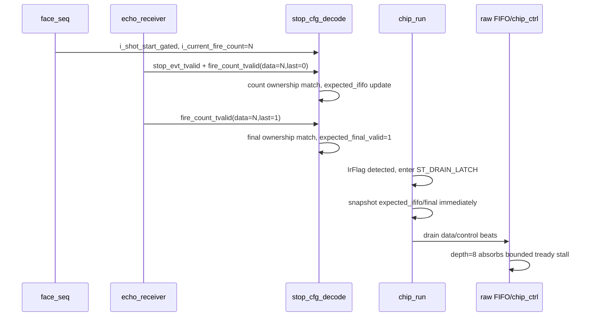

# C02 Chip Acquisition - Fire Count Ownership Fix v001

- 작성 시간: 2026-04-30 20:03:58 KST
- 수정 시간: 2026-04-30 20:03:58 KST
- 기준 Cluster: C02_Chip_Acquisition
- 기준 문서: `Doc/TDC-GPX-Datasheet.pdf`
- 연계 문서:
  - `Doc/cluster_analysis/C02_Chip_Acquisition/C02_Chip_Acquisition_260430172831_ShotSeq_Match_Expected_Review_v001.md`
  - `Doc/cluster_analysis/C02_Chip_Acquisition/C02_Chip_Acquisition_260430184356_Echo_Fire_Count_Stream_Review_v002.md`
  - `Doc/cluster_analysis/C02_Chip_Acquisition/C02_Chip_Acquisition_260430190711_Zero_Stop_Shot_v001.md`
  - `Doc/cluster_analysis/C02_Chip_Acquisition/C02_Chip_Acquisition_260430192448_Timing_Breakdown_v002.md`

## 1. 사용자 지적 사항과 판단

사용자 지적은 타당하다.

기존 설명에서 "`stop_cfg_decode`가 fire-count final beat를 받을 때"라고 표현한 것은 zero-stop shot을 닫기 위한 종료 표식 관점의 설명이었다. 그러나 C02의 실제 소유권 판정 기준은 `tlast` 자체가 아니라, `fire_count_tvalid` beat에 실려 있는 `fire(shot) count` 값이다.

따라서 보완 후 계약은 다음과 같다.

| 구분 | 수락 조건 | 의미 |
|---|---|---|
| stop_evt beat | `i_stop_evt_tvalid='1'`, `i_fire_count_tvalid='1'`, `i_fire_count_tlast='0'`, `i_fire_count_tdata[15:0]=i_current_fire_count`, active shot window | 현재 shot의 running stop count로 인정 |
| final beat | `i_fire_count_tvalid='1'`, `i_fire_count_tlast='1'`, `i_fire_count_tdata[15:0]=i_current_fire_count`, active shot window | 현재 shot의 expected count가 final임을 확정 |
| mismatch beat | `fire_count_tdata[15:0] != i_current_fire_count` | expected count 갱신 금지, ownership/orphan violation sticky |
| non-final fire_count 단독 beat | `i_fire_count_tlast='0'`인데 같은 cycle stop_evt 없음 | upstream alignment 위반으로 sticky |

핵심은 다음과 같다.

> `tlast=1`은 zero-stop 또는 non-zero shot의 "final marker"일 뿐이고, ownership key는 항상 `fire_count_tdata[15:0]`이다.

## 2. 반영된 RTL 변경

### 2.1 current shot count 생성과 전달

`tdc_gpx_face_seq`가 face-local 1-base shot/fire count를 외부로 제공한다.

- 근거: `tdc_gpx_face_seq.vhd:93`, `tdc_gpx_face_seq.vhd:439`
- 의미: `o_shot_start_gated` 이후 현재 face에서 몇 번째 shot인지 나타내며, `laser_ctrl`/`echo_receiver`가 내보내는 `fire_count_tdata[15:0]`과 비교되는 기준값이다.

`tdc_gpx_top`은 이 값을 `tdc_gpx_config_ctrl`로 전달한다.

- 근거: `tdc_gpx_top.vhd:313`, `tdc_gpx_top.vhd:537`, `tdc_gpx_top.vhd:890`

`tdc_gpx_config_ctrl`은 `stop_cfg_decode`로 전달한다.

- 근거: `tdc_gpx_config_ctrl.vhd:160`, `tdc_gpx_config_ctrl.vhd:1137`

### 2.2 stop_cfg_decode ownership 판정

`tdc_gpx_stop_cfg_decode`는 `fire_count_tdata[15:0]`가 `i_current_fire_count`와 일치할 때만 현재 shot의 정보로 수락한다.

- 계약 주석: `tdc_gpx_stop_cfg_decode.vhd:18`, `tdc_gpx_stop_cfg_decode.vhd:113`
- 포트: `tdc_gpx_stop_cfg_decode.vhd:123`
- stop ownership 판정: `tdc_gpx_stop_cfg_decode.vhd:217` ~ `tdc_gpx_stop_cfg_decode.vhd:221`
- final marker 판정: `tdc_gpx_stop_cfg_decode.vhd:294` ~ `tdc_gpx_stop_cfg_decode.vhd:298`
- expected count 갱신 gate: `tdc_gpx_stop_cfg_decode.vhd:317` ~ `tdc_gpx_stop_cfg_decode.vhd:333`

추가로 `g_FIRE_COUNT_DWIDTH >= 16` assertion을 넣어, ownership 비교에 필요한 bit 폭 계약을 명확히 했다.

- 근거: `tdc_gpx_stop_cfg_decode.vhd:194`

### 2.3 ST_DRAIN_LATCH blind wait 제거

`tdc_gpx_chip_run`의 `c_EXP_LATCH_SETTLE_LAST=15` 고정 대기는 제거했다.

- 제거 근거: `fire_count_tdata[15:0]` 일치로 final/stop ownership이 이미 upstream에서 확정되므로, `ST_DRAIN_LATCH`가 임의의 16 cycle settle을 추가할 필요가 없다.
- 반영 위치: `tdc_gpx_chip_run.vhd:473` ~ `tdc_gpx_chip_run.vhd:482`

### 2.4 raw FIFO depth 보완

blind wait 제거로 valid drain이 16 cycle 빨라졌고, 기존 6-depth raw FIFO에서는 bounded downstream backpressure와 초기 burst가 겹칠 때 data beat가 drop될 수 있었다.

이는 wait를 되살릴 문제가 아니라, early drain을 정상 운용으로 받아들이면서 raw path의 buffering을 보완할 문제로 판단했다. 따라서 `c_RAW_FIFO_DEPTH`를 6에서 8로 변경했다.

- 근거: `tdc_gpx_chip_ctrl.vhd:334`, `tdc_gpx_chip_ctrl.vhd:340`
- 유지되는 정책: data beat는 4개 이상의 free slot이 있을 때만 enqueue하여 future control beat 3개를 보존한다.
- 보완 의미: control reserve 정책은 유지하고, fixed wait 제거로 앞당겨진 data burst를 흡수한다.

## 3. Timing / Pipeline Block



## 4. Latency / Throughput / Pipeline / II

| 항목 | 보완 전 의미 | 보완 후 의미 | 검증 결과 |
|---|---|---|---|
| Zero-stop latency | `ST_DRAIN_LATCH`에서 16 cycle blind settle 포함 | final ownership이 match되면 즉시 drain decision | `output_done=7 clk` |
| Non-zero first data latency | expected latch wait가 초기 drain을 늦춤 | drain이 즉시 시작되어 raw FIFO가 초기 burst를 흡수 | bounded case `first_data=40 clk` |
| Run complete latency | drain 완료 후 control beat 전달 | fixed wait 제거 상태에서 정상 완료 | bounded case `run_complete=152 clk` |
| Output done latency | downstream backpressure에 따라 raw control handshake 시점 결정 | raw FIFO depth 8에서 drop 없이 완료 | bounded case `output_done=153 clk` |
| Throughput | fixed wait가 raw stall과 초기 burst 중첩을 숨김 | raw output은 backlog 해소 시 II=1까지 가능 | bounded case data 20 words exact |
| II | bus source와 raw sink backpressure가 섞인 관측값 | no-drop 조건에서 raw output observed II 사용 | `II_min=1 clk`, `II_max=14 clk` |

주의: 위 latency는 200 MHz `i_tdc_clk` 기준 testbench 관측값이다. GPX IC bus read timing 자체는 C01의 Datasheet 기반 bus timing 계약을 계속 따른다.

## 5. 검증 결과

### 5.1 stop_cfg_decode unit

명령:

```powershell
& 'C:\AMDDesignTools\2025.2.1\Vivado\bin\xvhdl.bat' --2008 tdc_gpx_pkg.vhd tdc_gpx_cfg_pkg.vhd tdc_gpx_stop_cfg_decode.vhd tb_tdc_gpx_stop_cfg_decode.vhd
& 'C:\AMDDesignTools\2025.2.1\Vivado\bin\xelab.bat' --debug typical tb_tdc_gpx_stop_cfg_decode -s tb_stop_cfg_decode_snap
& 'C:\AMDDesignTools\2025.2.1\Vivado\bin\xsim.bat' tb_stop_cfg_decode_snap --runall --log xsim_stop_cfg_decode.log
```

결과:

- `tb_tdc_gpx_stop_cfg_decode: ALL TESTS PASSED`
- mismatched `fire_count_tdata`는 expected count를 갱신하지 않음
- zero-stop final marker는 current fire count와 일치할 때만 `expected_final_valid`를 assert
- non-zero stop_evt는 같은 cycle의 matching fire_count beat가 있을 때만 count 갱신

### 5.2 chip_ctrl integration

명령:

```powershell
& 'C:\AMDDesignTools\2025.2.1\Vivado\bin\xvhdl.bat' --2008 tdc_gpx_pkg.vhd tdc_gpx_cfg_pkg.vhd tb_tdc_gpx_pkg.vhd tdc_gpx_bus_phy.vhd tdc_gpx_chip_init.vhd tdc_gpx_chip_reg.vhd tdc_gpx_chip_run.vhd tdc_gpx_chip_ctrl.vhd tb_tdc_gpx_chip_ctrl.vhd
& 'C:\AMDDesignTools\2025.2.1\Vivado\bin\xelab.bat' --debug typical tb_tdc_gpx_chip_ctrl -s tb_tdc_gpx_chip_ctrl_sim
& 'C:\AMDDesignTools\2025.2.1\Vivado\bin\xsim.bat' tb_tdc_gpx_chip_ctrl_sim --runall --log xsim_chip_ctrl.log
```

결과:

- `*** ALL TESTS PASSED *** (total_raw_words=258)`
- [2c] zero-stop: `output_done=7 clk`
- [2d] zero-stop conflict: `output_done=7 clk`, zero-count/EF conflict fault propagation PASS
- [16] bounded raw backpressure: 20 data words exact, no empty IFIFO read, no raw drop
- [16] latency/II: `first_data=40 clk`, `run_complete=152 clk`, `output_done=153 clk`, `output_hold=1 clk`, `II_min=1 clk`, `II_max=14 clk`

### 5.3 top/config compile boundary

`tdc_gpx_top`까지 VHDL analysis는 통과했다.

명령:

```powershell
& 'C:\AMDDesignTools\2025.2.1\Vivado\bin\xvhdl.bat' --2008 tdc_gpx_pkg.vhd tdc_gpx_cfg_pkg.vhd tdc_gpx_skid_buffer.vhd tdc_gpx_bus_phy.vhd tdc_gpx_chip_init.vhd tdc_gpx_chip_reg.vhd tdc_gpx_chip_run.vhd tdc_gpx_chip_ctrl.vhd tdc_gpx_csr_chip.vhd tdc_gpx_cmd_arb.vhd tdc_gpx_err_handler.vhd tdc_gpx_stop_cfg_decode.vhd tdc_gpx_config_ctrl.vhd tdc_gpx_decoder_i_mode.vhd tdc_gpx_raw_event_builder.vhd tdc_gpx_decode_pipe.vhd tdc_gpx_cell_builder.vhd tdc_gpx_cell_pipe.vhd tdc_gpx_face_seq.vhd tdc_gpx_face_assembler.vhd tdc_gpx_header_inserter.vhd tdc_gpx_output_stage.vhd tdc_gpx_csr_pipeline.vhd tdc_gpx_status_agg.vhd tdc_gpx_top.vhd
```

결과:

- `tdc_gpx_top` analysis PASS
- `tb_tdc_gpx_config_ctrl` elaboration은 기존 환경 의존성으로 실패:
  - `tdc_gpx_axil_csr32_chip` black box
  - XPM `glbl` 미바인딩
- 이는 이번 fire-count ownership 보완과 직접 관련된 포트/문법 실패가 아니다.

## 6. 결론

이번 보완으로 C02 expected count 확정 기준은 다음처럼 정리된다.

1. `fire_count_tdata[15:0]`가 현재 face shot count와 일치해야 한다.
2. `stop_evt` count 갱신은 같은 cycle의 non-final fire_count beat가 있어야 한다.
3. `tlast=1` final beat는 zero-stop 포함 final 확정 표식일 뿐이며, ownership key가 아니다.
4. `ST_DRAIN_LATCH`의 16 cycle blind wait는 제거한다.
5. wait 제거로 빨라진 drain은 raw FIFO depth 8로 흡수한다.

이로써 사용자가 지적한 "valid 신호에 실려 있는 fire(shot) count 정보를 가져와야 한다"는 요구는 RTL과 testbench에 반영되었다.
