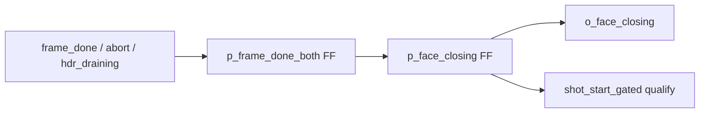
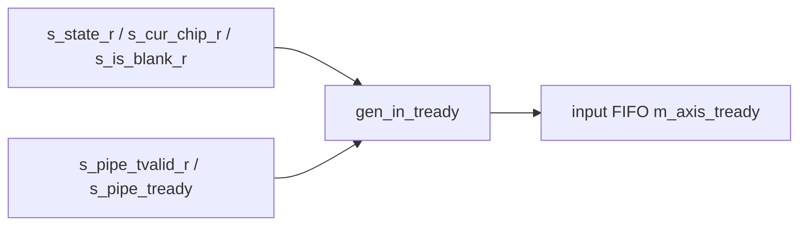
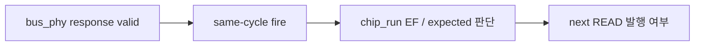

# C02 Chip Acquisition - Sequential Logic Rule Fix Result v001

## 후속 반영 추적

- 후속 반영 문서: `Doc/cluster_analysis/C02_Chip_Acquisition/C02_Chip_Acquisition_260430205146_Skid_Sync_FIFO_Fix_Result_v001.md`
- 후속 반영 시간: `2026-04-30 20:51:46 +09:00`
- 반영 내용:
  - `chip_ctrl` bus response skid를 모듈 내부로 이동
  - `chip_run` request pacing을 skid pending 기준으로 보정
  - `face_assembler` 입력 XPM FIFO 뒤에 `tdc_gpx_sync_fifo` elastic boundary 추가
  - `tdc_gpx_skid_buffer`를 2-entry registered-ready elastic buffer로 보정

- 문서 버전: `v001`
- 작성 시간: `2026-04-30 20:27:46 +09:00`
- 최종 수정 시간: `2026-04-30 20:27:46 +09:00`
- 기준 규칙: `Doc/cluster_analysis/cluster_analysis_260430201013_operating_protocol_v009.md`
- 입력 리뷰: `C02_Chip_Acquisition_260430201234_Sequential_Logic_Rule_Review_v001.md`
- 대상 코드: `tdc_gpx_face_seq.vhd`, `tdc_gpx_face_assembler.vhd`, `tdc_gpx_chip_ctrl.vhd`

## 1. 반영 요약

| ID | 대상 | 처리 결과 | 근거 위치 |
|---|---|---|---|
| R-C02-SEQ-01 | `tdc_gpx_face_seq` | 반영 완료. face closing / frame done 판단을 register stage로 닫음 | `tdc_gpx_face_seq.vhd:396`, `:427`, `:473`, `:670` |
| R-C02-SEQ-02 | `tdc_gpx_face_assembler` | 반영 완료. ready chain 중간 조합 process 제거, registered state/pipe flag 기반 단일 qualify로 축소 | `tdc_gpx_face_assembler.vhd:475`, `:485` |
| R-C02-SEQ-03 | `tdc_gpx_chip_ctrl` | 기능 보존 우선. 1-stage register 삽입은 회귀 실패로 폐기하고, bus response skid/credit refactor 전까지 문서화된 예외로 관리 | `tdc_gpx_chip_ctrl.vhd:605`, `:612`, `:620`, `:624` |

## 2. 구조 변경

### 2.1 `tdc_gpx_face_seq`

기존 구조는 `s_frame_done_both`, `s_all_shots_fired`, `s_face_closing`가 조합 chain으로 이어지고 `o_face_closing`과 shot gating에 직접 전파됐다. 이번 보완에서는 다음 register를 추가했다.

- `s_frame_done_both_r`
- `s_all_shots_fired_r`
- `s_face_closing_r`

판단 근거:

- module boundary 출력 `o_face_closing`은 `s_face_closing_r`로 구동한다.
- 마지막 shot accept 판단은 `s_shot_start_gated`와 pre-increment count로 계산해, 마지막 shot 이후 close가 늦게 풀리는 문제를 줄였다.
- `tb_tdc_gpx_face_seq`에서 1-cycle raw, multi-cycle raw, back-to-back shot, deferred shot, illegal config reject가 모두 PASS했다.

### 2.2 `tdc_gpx_face_assembler`

기존 구조는 `s_pipe_tready -> s_can_produce -> p_in_tready -> input FIFO m_axis_tready`로 보이는 조합 chain이었다. 이번 보완에서는 `p_in_tready` 조합 process를 제거하고 `gen_in_tready`에서 registered state와 pipe flag를 직접 qualify하도록 바꿨다.

판단 근거:

- output FIFO ready를 완전 register boundary로 밀면 stale ready 상황에서 입력 FIFO beat가 pop될 수 있다.
- 별도 input skid buffer 없이 ready만 register하는 것은 데이터 손실 위험이 있다.
- 따라서 이번 수정 범위에서는 중간 조합 chain을 제거하고, full register boundary는 별도 skid buffer 설계 항목으로 분리한다.

### 2.3 `tdc_gpx_chip_ctrl`

`o_s_axis_tready`, `s_bus_rsp_fire`, `s_*_rsp_valid`를 1-stage register로 닫는 시도를 수행했으나, `tb_tdc_gpx_chip_ctrl`에서 IFIFO extra read가 발생했다. 원인은 `chip_run`이 READ response accept cycle에 EF/expected 판단을 같이 소비하는 계약을 갖고 있어, `s_run_rsp_valid`를 1 clk 늦추면 drain boundary에서 한 번 더 READ가 발행되기 때문이다.

결론:

- 현재 cycle 계약은 기능상 유지한다.
- 코드에는 `v009 sequential-logic audit note`를 남겨, 이 경로가 단순 register 삽입 대상이 아님을 명확히 했다.
- 향후 strict 적용은 `bus response skid + chip_run credit/pacing`을 함께 재설계해야 한다.

## 3. Latency / Throughput / Pipeline / II 영향

| 대상 | Latency | Throughput | Pipeline | II |
|---|---:|---|---|---|
| `face_seq` | close 표시가 일부 경계에서 최대 1 clk register 반영 | 정상 shot 흐름 유지 | closing decision stage 추가 | TB 기준 back-to-back shot 유지 |
| `face_assembler` | 추가 register latency 없음 | 기존 output FIFO backpressure 계약 유지 | 중간 ready process 제거 | downstream/mask sweep PASS 기준 유지 |
| `chip_ctrl` | 기능 경로 변경 없음 | 기존 bus READ II 유지 | 예외 문서화, refactor 보류 | `tb_tdc_gpx_chip_ctrl` 측정: `II_min=1clk`, `II_max=14clk` |

## 4. 검증 결과

| Testbench | 목적 | 결과 |
|---|---|---|
| `tb_tdc_gpx_chip_ctrl` | bus response routing, EF fallback, expected count, zero-stop, backpressure, PH_RESP_DRAIN 관련 회귀 | PASS |
| `tb_tdc_gpx_face_seq` | shot edge/gating, deferred path, config reject 회귀 | PASS |
| `tb_tdc_gpx_downstream` | face_assembler + header_inserter downstream/backpressure/overrun 회귀 | PASS |
| `tb_tdc_gpx_mask_sweep` | face_seq + face_assembler active mask 조합 회귀 | PASS |
| `git diff --check` | whitespace/error marker 점검 | PASS, CRLF 변환 warning만 존재 |

## 5. 후속 항목

| ID | 항목 | 이유 |
|---|---|---|
| F-C02-SEQ-FU-01 | `tdc_gpx_chip_ctrl` bus response skid/credit refactor | 단순 register 삽입은 IFIFO extra read를 만들므로, `chip_run` pacing 계약과 함께 변경해야 함 |
| F-C02-SEQ-FU-02 | `tdc_gpx_face_assembler` input skid buffer 검토 | input FIFO `m_axis_tready`를 완전 register boundary로 만들려면 stale ready를 흡수할 local buffer가 필요함 |
| F-C02-SEQ-FU-03 | stale ready negative test 추가 | strict sequential boundary 설계가 들어갈 때 데이터 pop/drop 여부를 직접 검증해야 함 |
