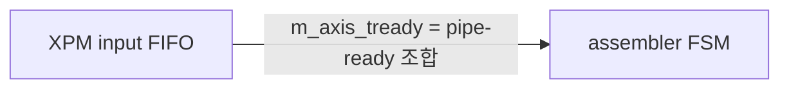
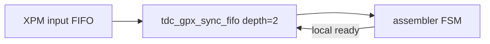
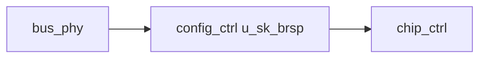
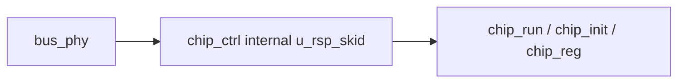

# C02 Chip Acquisition - Skid / Sync FIFO Fix Result v001

- 문서 버전: `v001`
- 작성 시간: `2026-04-30 20:51:46 +09:00`
- 최종 수정 시간: `2026-04-30 20:51:46 +09:00`
- 기준 규칙: `Doc/cluster_analysis/cluster_analysis_260430201013_operating_protocol_v009.md`
- 선행 문서: `C02_Chip_Acquisition_260430202746_Sequential_Logic_Rule_Fix_Result_v001.md`
- 목적: 조합 ready 경계를 skid/sync FIFO 기반 register boundary로 보완

## 1. 판단 요약

사용자 검토처럼 기존 skid/sync FIFO 계열을 활용하는 것이 맞다. 다만 기존 `tdc_gpx_skid_buffer`는 ready가 이전 cycle에 low였더라도 입력을 샘플할 수 있는 구조였으므로, 적극적으로 경계 모듈로 쓰기 전에 2-entry elastic FIFO 형태로 보정했다.

| 항목 | 처리 |
|---|---|
| `tdc_gpx_skid_buffer` | 입력 handshake가 `i_s_valid and registered o_s_ready`일 때만 수락되도록 2-entry FIFO형으로 보정 |
| `tdc_gpx_sync_fifo` | `backup/tdc_gpx_sync_fifo.vhd` 개념을 production root로 승격 |
| `tdc_gpx_face_assembler` | per-chip XPM input FIFO 뒤에 `tdc_gpx_sync_fifo(depth=2)` 추가 |
| `tdc_gpx_chip_ctrl` | bus response skid를 `config_ctrl` 외부가 아니라 `chip_ctrl` 내부 계약으로 이동 |
| `tdc_gpx_chip_run` | skid latency 동안 같은 READ가 재발행되지 않도록 pending 시점에 request 조기 deassert |
| `tdc_gpx_config_ctrl` | 외부 `u_sk_brsp` 제거, bus response를 chip_ctrl 내부 skid로 직접 전달 |

## 2. 구조 변경

### 2.1 `face_assembler` 입력 경계

기존:

변경:

효과:

- XPM input FIFO의 `m_axis_tready`가 FSM pipe-ready 조합식에 직접 연결되지 않는다.
- stale ready는 `tdc_gpx_sync_fifo`의 input/output skid가 흡수한다.
- output row throughput은 `tb_tdc_gpx_downstream`, `tb_tdc_gpx_mask_sweep` 기준 PASS로 유지된다.

### 2.2 `chip_ctrl` bus response 경계

기존 실제 상위 구조:

변경:

효과:

- `chip_ctrl` 모듈 경계의 `o_s_axis_tready`가 내부 skid에 의해 register boundary가 된다.
- `chip_ctrl` 단독 TB와 상위 `config_ctrl`의 구조 계약이 일치한다.
- `config_ctrl`의 외부 `u_sk_brsp`는 제거했다.

### 2.3 `chip_run` request pacing 보정

응답 skid가 내부화되면 bus response가 bus_phy에서 skid로 들어온 뒤 `chip_run`에 1clk 늦게 보인다. 이때 기존처럼 `i_bus_rsp_valid`가 올 때까지 `s_req_valid_r`을 유지하면 bus_phy가 같은 IFIFO READ를 한 번 더 수락할 수 있다.

보정:

- `ST_DRAIN_EF1`, `ST_DRAIN_EF2`: `i_bus_rsp_pending='1'`이면 single-read request를 즉시 deassert
- `ST_DRAIN_BURST`: pending 중인 응답이 final planned burst beat이면 `s_req_burst_r`, `s_req_valid_r`을 조기 deassert

## 3. Latency / Throughput / Pipeline / II

| 대상 | Latency | Throughput | Pipeline | II |
|---|---:|---|---|---|
| `tdc_gpx_skid_buffer` | +1 clk | 1 beat/clk 유지 | 2-entry elastic register | II=1 |
| `tdc_gpx_sync_fifo` | input/output skid 설정 시 +2 clk 가능 | 1 beat/clk 유지 | skid + circular FIFO + skid | II=1 |
| `face_assembler` input | per-chip data visible latency 증가 | downstream row PASS | XPM FIFO 뒤 elastic FIFO 추가 | row beat II 유지 |
| `chip_ctrl` response | response consume 기준 +1 clk | READ overrun 없음 | module boundary skid 추가 | TB 기준 `II_min=1clk`, `II_max=15clk` |

## 4. 검증 결과

| Testbench | 목적 | 결과 |
|---|---|---|
| `tb_tdc_gpx_chip_ctrl` | internal response skid, expected count, EF fallback, burst, zero-stop, backpressure | PASS |
| `tb_tdc_gpx_downstream` | `face_assembler` + header downstream 및 backpressure | PASS |
| `tb_tdc_gpx_mask_sweep` | face_seq + face_assembler active mask 조합 | PASS |
| `tb_tdc_gpx_config_ctrl` | config_ctrl 상위 연결 smoke | PASS |
| `tb_tdc_gpx_decode_pipe` | 공통 skid 변경 영향 | PASS |
| `git diff --check` | whitespace/error marker | PASS, CRLF warning만 존재 |

## 5. 추적 위치

| 파일 | 주요 위치 |
|---|---|
| `tdc_gpx_skid_buffer.vhd` | 2-entry registered-ready elastic buffer |
| `tdc_gpx_sync_fifo.vhd` | production root 신규 승격 |
| `tdc_gpx_face_assembler.vhd` | `u_in_elastic` per-chip generate |
| `tdc_gpx_chip_ctrl.vhd` | `u_rsp_skid` internal bus response boundary |
| `tdc_gpx_chip_run.vhd` | pending 기준 request 조기 deassert |
| `tdc_gpx_config_ctrl.vhd` | external `u_sk_brsp` 제거 |
