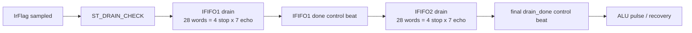

# C02 Chip Acquisition - IFIFO 4 Stop x 7 Echo Test Update v001

- 작성/수정 시간: 2026-04-30 21:02:07 +09:00
- 대상 Cluster: C02_Chip_Acquisition
- 목적: `tb_tdc_gpx_chip_ctrl.vhd`의 정상 IFIFO1/IFIFO2 검증 조건을 "각 IFIFO마다 stop 4개 채널, 채널당 7 echo"로 변경한다.
- 절대 기준: `Doc/TDC-GPX-Datasheet.pdf`

## 1. 판단

사용자 요청의 의미는 IFIFO1과 IFIFO2를 단순히 임의 word 수로 채우는 것이 아니라, I-Mode single 측정에서 각 IFIFO가 담당하는 4개 local stop channel에 대해 channel당 7개 echo가 들어온 조건을 검증해야 한다는 것이다.

따라서 정상 IFIFO 검증의 기준 count는 다음과 같이 둔다.

| 항목 | 값 | 의미 |
|---|---:|---|
| stop channel / IFIFO | 4 | IFIFO1 local channel 0..3, IFIFO2 local channel 0..3 |
| echo / stop channel | 7 | `c_MAX_HITS_PER_STOP=7` 운용 조건 |
| word / IFIFO | 28 | `4 x 7` |
| total data word | 56 | IFIFO1 28 + IFIFO2 28 |

## 2. 반영 내용

| 파일 | 위치 | 반영 |
|---|---|---|
| `tb_tdc_gpx_chip_ctrl.vhd` | line 69..74 | `c_IFIFO_STOP_CHANNELS=4`, `c_ECHOES_PER_STOP=7`, `c_IFIFO_NOMINAL_WORDS=28`, `c_IFIFO_NOMINAL_TOTAL=56` 추가 |
| `tb_tdc_gpx_chip_ctrl.vhd` | line 244..263 | chip model read data를 I-Mode raw format으로 생성하는 `fn_imode_word()` 추가 |
| `tb_tdc_gpx_chip_ctrl.vhd` | line 776, 831, 926, 977, 1032, 1345, 1373, 1454, 1501, 1531, 1575, 1605, 1634, 1707 | 정상 drain/restart/latency 계열 테스트의 FIFO load를 28/28로 변경 |
| `tb_tdc_gpx_chip_ctrl.vhd` | line 1780..1789 | `[16]` latency/II 측정 기대 data count를 56으로 변경 |

zero-stop, 1-entry, 32-entry, stale mismatch 같은 경계 테스트는 원래 목적이 깨지지 않도록 특수 조건을 유지했다.

## 3. Data Pattern

TB chip model은 이제 IFIFO read counter를 I-Mode raw word로 다음처럼 변환한다.

```text
rd_cnt = echo_index * 4 + cha_code

raw[27:26] = cha_code      -- 0,1,2,3 반복
raw[25:18] = 0             -- StartNum, single-shot에서는 reserved/0
raw[17]    = 0             -- slope
raw[16:0]  = hit pattern   -- cha_code와 echo_index로 구분
```

이 구조로 nominal 28 word는 다음 순서를 갖는다.

```text
echo 0: cha 0,1,2,3
echo 1: cha 0,1,2,3
...
echo 6: cha 0,1,2,3
```

## 4. Timing / Latency / Throughput / Pipeline / II

이번 변경은 RTL FSM이 아니라 테스트 조건과 chip model data pattern 변경이다. 따라서 bus primitive timing 계약은 바뀌지 않는다. GPX IC READ timing 판단은 계속 C01 계약과 Datasheet READ timing을 따른다.

다만 `[16]`의 정상 burst drain 측정 대상 data word가 20에서 56으로 증가했으므로 전체 drain latency는 증가한다.

| 측정 항목 | 이전 20 word 조건 | 변경 56 word 조건 |
|---|---:|---:|
| first_data | 40 clk | 40 clk |
| run_complete | 157 clk 수준 | 427 clk |
| output_done | 158 clk 수준 | 428 clk |
| output_hold | 1 clk | 1 clk |
| II_min | 1 clk | 1 clk |
| II_max | 15 clk 수준 | 15 clk |

Timing block 관점은 아래와 같다.



## 5. 검증 결과

실행 명령:

```powershell
& 'C:\AMDDesignTools\2025.2.1\Vivado\bin\xvhdl.bat' --2008 tdc_gpx_pkg.vhd tdc_gpx_cfg_pkg.vhd tdc_gpx_skid_buffer.vhd tdc_gpx_chip_init.vhd tdc_gpx_chip_reg.vhd tdc_gpx_chip_run.vhd tdc_gpx_chip_ctrl.vhd tdc_gpx_bus_phy.vhd tb_tdc_gpx_chip_ctrl.vhd
& 'C:\AMDDesignTools\2025.2.1\Vivado\bin\xelab.bat' --debug typical tb_tdc_gpx_chip_ctrl -s tb_chip_ctrl_snap
& 'C:\AMDDesignTools\2025.2.1\Vivado\bin\xsim.bat' tb_chip_ctrl_snap --runall --log xsim_chip_ctrl.log
```

검증 근거:

| 로그 위치 | 결과 |
|---|---|
| `xsim_chip_ctrl.log:101` | `[2]` legacy drain `words=56` PASS |
| `xsim_chip_ctrl.log:167` | `[2b]` EF fallback absent count `56 data words` PASS |
| `xsim_chip_ctrl.log:244` | `[3]` burst drain `words=56` PASS |
| `xsim_chip_ctrl.log:921` | `[16]` bounded backpressure `data count exact 56` PASS |
| `xsim_chip_ctrl.log:923` | `[16]` latency/II measured: `first_data=40clk`, `run_complete=427clk`, `output_done=428clk`, `II_min=1clk`, `II_max=15clk` |
| `xsim_chip_ctrl.log:937` | `ALL TESTS PASSED`, `total_raw_words=737` |

## 6. 결론

정상 IFIFO1/IFIFO2 검증은 이제 각 IFIFO마다 `4 stop channel x 7 echo = 28 word`, 총 56 data word 조건으로 수행된다. 기존 empty-read 금지, raw tuser contract, bounded backpressure, latency/II 측정은 모두 PASS로 유지됐다.
