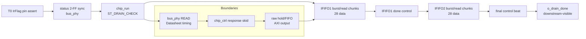

# C02 Chip Acquisition - Timing Metric Detail v001

- 작성/수정 시간: 2026-04-30 21:07:52 +09:00
- 대상 Cluster: C02_Chip_Acquisition
- 목적: `Timing / Latency / Throughput / Pipeline / II` 측정 항목을 하나의 숫자가 아니라 운용 판단 가능한 세부 지표로 분리한다.
- 절대 기준: `Doc/TDC-GPX-Datasheet.pdf`

## 1. 측정 기준점 정의

이번 문서는 `tb_tdc_gpx_chip_ctrl.vhd`의 `[16] Bounded raw AXI backpressure + latency/II measurement`를 기준으로 한다.

| 기준점 | 의미 | 측정 근거 |
|---|---|---|
| T0 | TB가 `s_irflag_pin <= '1'`로 IrFlag pin 모델을 assert한 시점 | `tb_tdc_gpx_chip_ctrl.vhd:1717..1728` |
| T1 | 첫 raw data beat가 `m_raw_axis`에서 handshake된 시점 | `xsim_chip_ctrl.log:923`, `first_data=40clk` |
| T2 | IFIFO1 마지막 data beat handshake | `xsim_chip_ctrl.log:924`, `last=211clk` |
| T3 | IFIFO1 done control beat handshake | `xsim_chip_ctrl.log:924`, `done_ctrl=218clk` |
| T4 | IFIFO2 첫 data beat handshake | `xsim_chip_ctrl.log:925`, `first=226clk` |
| T5 | IFIFO2 마지막 data beat handshake | `xsim_chip_ctrl.log:925`, `last=421clk` |
| T6 | final drain_done control beat handshake | `xsim_chip_ctrl.log:925`, `final_ctrl=428clk` |
| T7 | `o_drain_done` observable output done | `xsim_chip_ctrl.log:923`, `output_done=428clk` |
| R | chip_run 내부 drain complete pulse | `xsim_chip_ctrl.log:923`, `run_complete=427clk` |

주의: T0는 실제 GPX IC 내부 MTimer 이벤트가 아니라 TB가 GPX `IrFlag` pin을 모델링해서 올린 시점이다. Datasheet 물리 READ timing은 C01 `bus_phy` timing 계약으로 판단한다.

## 2. 세분화된 측정 결과

조건:

| 항목 | 값 |
|---|---:|
| TDC clock | 200 MHz, 5 ns |
| bus setting | `bus_clk_div=1`, `bus_ticks=5` |
| IFIFO1 load | 28 data words = 4 stop x 7 echo |
| IFIFO2 load | 28 data words = 4 stop x 7 echo |
| total data | 56 data words |
| raw output backpressure | TB loop `i >= 8 and i < 38` 구간에서 `tready=0` |

측정 결과:

| 구간 | 값 | 해석 |
|---|---:|---|
| T0 -> T1 | 40 clk | IrFlag sync, drain decision, 첫 bus read, raw output backpressure 해소가 합쳐진 first data latency |
| T1 -> T2 | 171 clk interval | IFIFO1 data 28개 출력 구간 |
| T2 -> T3 | 7 clk | IFIFO1 마지막 data 이후 IFIFO1 done control beat까지 |
| T3 -> T4 | 8 clk | IFIFO1 done control 이후 IFIFO2 첫 data까지 |
| T4 -> T5 | 195 clk interval | IFIFO2 data 28개 출력 구간 |
| T5 -> T6 | 7 clk | IFIFO2 마지막 data 이후 final control beat까지 |
| R -> T7 | 1 clk | chip_run 내부 완료 후 downstream observable done까지 |
| T6 -> T7 | 0 clk | final control beat handshake와 `o_drain_done`이 같은 cycle에 관측됨 |

## 3. Latency 분해

Latency는 최소 4종류로 분리해서 봐야 한다.

| 이름 | 계산 | 값 | 의미 |
|---|---|---:|---|
| First Data Latency | T1 - T0 | 40 clk | IrFlag부터 첫 raw data가 외부로 보이는 시간 |
| IFIFO1 Drain Latency | T3 - T1 | 178 clk | IFIFO1 data 28개와 IFIFO1 done control까지 |
| IFIFO2 Drain Latency | T6 - T4 | 202 clk | IFIFO2 data 28개와 final control까지 |
| Total Output Latency | T7 - T0 | 428 clk | IrFlag부터 downstream-visible `o_drain_done`까지 |
| Internal Drain Complete Latency | R - T0 | 427 clk | chip_run이 내부적으로 drain complete를 만든 시점 |

운용 판단:

- `output_done=428clk`는 최종 data/control beat가 downstream에서 받아진 시점이다.
- `run_complete=427clk`는 내부 chip_run 완료 시점이다.
- 두 값의 1clk 차이는 `chip_ctrl` raw/control boundary가 downstream handshake 기준으로 `o_drain_done`을 내기 때문에 발생한다.

## 4. Throughput 분해

Throughput도 "무엇을 분모로 잡는가"에 따라 다르다.

| 이름 | 계산 | 값 @200 MHz | 의미 |
|---|---|---:|---|
| 전체 drain throughput | 56 words / 428 clk | 약 26.2 Mword/s | IrFlag부터 final done까지 포함한 운용 평균 |
| raw data window throughput | 56 words / 382 clk | 약 29.3 Mword/s | 첫 data부터 마지막 data까지의 출력 평균 |
| IFIFO1 data throughput | 28 words / 172 clk | 약 32.6 Mword/s | IFIFO1 출력 평균. 초기 backpressure 해소로 일부 beat가 빠르게 방출됨 |
| IFIFO2 data throughput | 28 words / 196 clk | 약 28.6 Mword/s | IFIFO2 출력 평균. bus/read chunk cadence가 더 명확히 보임 |

여기서 382clk는 `T5 - T1 + 1`, 172clk는 `T2 - T1 + 1`, 196clk는 `T5 - T4 + 1`로 계산했다.

## 5. II(Initiation Interval) 분해

현재 `[16]`의 II는 raw output AXI-stream에서 data beat가 handshake되는 간격이다. GPX physical bus read start 간격과 동일하지 않다.

| II 종류 | 측정값 | 의미 |
|---|---:|---|
| Overall output II_min | 1 clk | raw FIFO/hold에 쌓인 beat가 backpressure 해제 후 연속 방출됨 |
| Overall output II_max | 15 clk | burst chunk 사이의 control/check/next-request gap |
| IFIFO1 output II_min | 1 clk | 첫 burst 일부가 backpressure 때문에 축적된 뒤 연속 출력 |
| IFIFO1 output II_max | 15 clk | IFIFO1 burst chunk gap |
| IFIFO2 output II_min | 5 clk | backpressure 축적 영향이 줄어든 bus-limited data cadence |
| IFIFO2 output II_max | 15 clk | IFIFO2 burst chunk gap |

해석:

- `II_min=1clk`는 설계가 GPX bus를 1clk마다 읽었다는 뜻이 아니다.
- `II_min=1clk`는 raw output boundary에서 이미 확보된 data가 downstream으로 연속 handshake된 결과다.
- GPX READ 물리 cadence는 `tdc_gpx_bus_phy.vhd`의 `bus_ticks=5`, `bus_clk_div=1` 계약과 Datasheet READ timing으로 판단해야 한다.
- IFIFO2의 `II_min=5clk`가 bus/read cadence를 더 잘 드러낸다. IFIFO1은 TB가 일부러 걸어 둔 초기 raw backpressure 때문에 output II가 더 작게 관측된다.

## 6. Pipeline 분해



Pipeline boundary 판단:

| Boundary | 역할 | 측정에 미치는 영향 |
|---|---|---|
| status sync | IrFlag pin을 TDC clock domain으로 동기화 | T0 -> T1에 포함 |
| bus_phy | GPX Reg8/Reg9 READ timing 생성 | data cadence의 물리 기준 |
| response skid | bus response ready 경계 등록화 | response pending/valid가 1 stage 분리될 수 있음 |
| raw hold/FIFO | downstream backpressure 흡수 | output II가 bus II보다 작거나 커질 수 있음 |
| control beat boundary | IFIFO1 done/final done을 data stream과 같은 raw path로 전달 | done latency와 output_done 의미를 결정 |

## 7. Timing Block

```text
T0  IrFlag pin assert
 |
 | 40 clk
 v
T1  IFIFO1 first data
 | 28 data words, II_min=1, II_max=15
 v
T2  IFIFO1 last data at 211clk
 |
 | 7 clk
 v
T3  IFIFO1 done control at 218clk
 |
 | 8 clk
 v
T4  IFIFO2 first data at 226clk
 | 28 data words, II_min=5, II_max=15
 v
T5  IFIFO2 last data at 421clk
 |
 | 7 clk
 v
T6/T7 final control + o_drain_done at 428clk
```

## 8. 검증 근거

| 근거 | 내용 |
|---|---|
| `tb_tdc_gpx_chip_ctrl.vhd:621..638` | 세분화 측정 변수 추가 |
| `tb_tdc_gpx_chip_ctrl.vhd:1739..1759` | `[16]` 측정 시작 시 IFIFO별 counter snapshot |
| `tb_tdc_gpx_chip_ctrl.vhd:1793..1842` | IFIFO1/IFIFO2 data first/last/II 측정 |
| `tb_tdc_gpx_chip_ctrl.vhd:1844..1857` | IFIFO1 done/final control cycle 측정 |
| `tb_tdc_gpx_chip_ctrl.vhd:1888..1919` | 세분화 결과 report 출력 |
| `xsim_chip_ctrl.log:923` | 기존 latency/II summary |
| `xsim_chip_ctrl.log:924` | IFIFO1 segmented result |
| `xsim_chip_ctrl.log:925` | IFIFO2 segmented result |
| `xsim_chip_ctrl.log:926` | control/gap segmented result |
| `xsim_chip_ctrl.log:940` | `ALL TESTS PASSED`, `total_raw_words=737` |

## 9. 결론

단일 `latency/II measured` 값만으로는 운용 판단이 부족하다. 앞으로 C02 timing 결과는 최소한 다음 5개 그룹으로 보고한다.

1. T0 기준 first data / internal complete / output done latency
2. IFIFO1 data 구간과 IFIFO1 done control 구간
3. IFIFO2 data 구간과 final control 구간
4. output stream II와 bus/read cadence의 구분
5. downstream backpressure가 output II에 끼치는 영향

이번 측정에서 C02 nominal 4-stop x 7-echo 조건은 `output_done=428clk`, `IFIFO1=28 words`, `IFIFO2=28 words`, `final_to_output_done=0clk`, 전체 PASS로 닫혔다.
