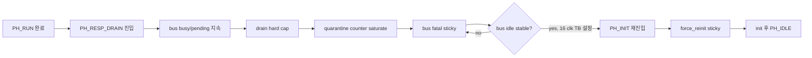
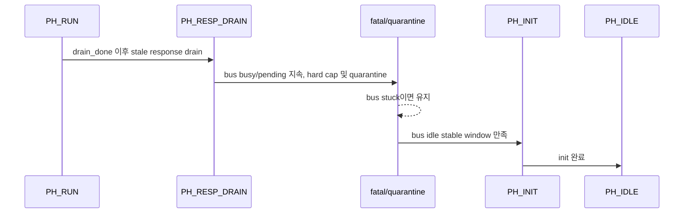

# C02 Chip Acquisition - P0 Negative / PH_RESP_DRAIN 검증 v001

- 작성/수정 시간: 2026-04-30 21:46:21 +09:00
- 기준 문서: `Doc/TDC-GPX-Datasheet.pdf`
- 기준 계획: `Doc/cluster_analysis/C02_Chip_Acquisition/C02_Chip_Acquisition_260430213118_Code_Fix_Plan_Open_Items_v001.md`
- 목적: OP-C02-01, OP-C02-02 P0 항목을 코드와 xsim 근거로 닫을 수 있는지 확인한다.

## 1. 결론

OP-C02-01과 OP-C02-02는 이번 수정으로 검증 근거가 확보되었다.

| 항목 | 판정 | 근거 |
|---|---|---|
| OP-C02-01 forced negative monitor evidence | PASS | `tb_tdc_gpx_chip_ctrl.vhd:52`, `:233..234`, `:453..458`, `:614..619`, `:839..877`, `xsim_chip_ctrl_neg_empty.log:35..40`, `xsim_chip_ctrl_neg_tuser.log:35..40` |
| OP-C02-02 PH_RESP_DRAIN stuck/fatal 장기 격리 | PASS | `tdc_gpx_chip_ctrl.vhd:839`, `:882`, `:905..919`, `tb_tdc_gpx_chip_ctrl.vhd:2251..2308`, `xsim_chip_ctrl.log:1005..1343` |
| 전체 positive regression | PASS | `xsim_chip_ctrl.log:1343` |

중요한 운용 판단은 다음과 같다. Vivado `xsim`은 VHDL `severity failure`가 로그에 찍혀도 프로세스 반환값을 0으로 돌려주는 동작을 보였다. 따라서 CI나 자동 검증에서는 `xsim` 반환값만 기준으로 삼지 않고, 로그에서 `Failure: C02 negative evidence`를 스캔하는 wrapper를 exit-code 계약으로 사용해야 한다.

## 2. RTL 보완 내용

### 2.1 fatal 이후 정상 PH_IDLE 탈출 차단

기존 RTL은 `s_err_bus_fatal_r='1'`인 상태에서도 버스가 idle로 풀리면 기존 `PH_RESP_DRAIN -> PH_IDLE` 정상 탈출 조건이 먼저 열릴 수 있었다. 이 경우 계획서가 요구한 `bus_idle_stable -> PH_INIT 재진입 -> force_reinit sticky` 경로를 거치지 않는다.

수정은 다음 두 지점이다.

| 위치 | 변경 의미 |
|---|---|
| `tdc_gpx_chip_ctrl.vhd:839` | normal drain exit 조건에 `s_err_bus_fatal_r='0'`을 추가했다. |
| `tdc_gpx_chip_ctrl.vhd:882` | hard-cap 상태에서 버스가 풀려도 fatal latch 이후에는 즉시 PH_IDLE로 빠지지 않도록 했다. |

이제 fatal latch 이후의 복구 경로는 `tdc_gpx_chip_ctrl.vhd:905..919`의 stable-window auto-reinit 경로로 단일화된다.



## 3. 테스트벤치 보완 내용

### 3.1 Negative mode generic

`tb_tdc_gpx_chip_ctrl.vhd:52`에 `g_NEGATIVE_MODE`를 추가했다.

| 값 | 의미 |
|---|---|
| `0` | positive regression |
| `1` | empty IFIFO read monitor 강제 위반 |
| `2` | raw `tuser` monitor 강제 위반 |

### 3.2 monitor 강제 주입

| 주입 | 위치 | 검증 의미 |
|---|---|---|
| empty IFIFO read monitor | `tb_tdc_gpx_chip_ctrl.vhd:233`, `:453..458`, `:839..858` | 기능 경로가 아니라 감시망 자체가 failure를 만들 수 있는지 확인 |
| raw `tuser` monitor | `tb_tdc_gpx_chip_ctrl.vhd:234`, `:614..619`, `:860..877` | raw stream sideband monitor가 위반을 놓치지 않는지 확인 |

주의: N1은 실제 chip_ctrl 정상 기능 경로를 깨는 테스트가 아니다. 실제 기능 경로에서 empty read가 발생하지 않는지는 positive `[18]`와 전체 regression에서 확인한다. N1은 감시망/CI failure 전파를 확인하기 위한 독립 negative hook이다.

## 4. xsim 결과

### 4.1 Positive

명령:

```powershell
& 'C:\AMDDesignTools\2025.2.1\Vivado\bin\xvhdl.bat' --2008 tdc_gpx_chip_ctrl.vhd tb_tdc_gpx_chip_ctrl.vhd --nolog
& 'C:\AMDDesignTools\2025.2.1\Vivado\bin\xelab.bat' --debug typical tb_tdc_gpx_chip_ctrl -s tb_chip_ctrl_snap
& 'C:\AMDDesignTools\2025.2.1\Vivado\bin\xsim.bat' tb_chip_ctrl_snap --runall --log xsim_chip_ctrl.log
```

결과:

| 로그 | 판정 |
|---|---|
| `xsim_chip_ctrl.log:1009` | `[19] drain_done observed before forced PH_RESP_DRAIN stuck` PASS |
| `xsim_chip_ctrl.log:1010` | `[19] PH_RESP_DRAIN hard cap sticky asserted` PASS |
| `xsim_chip_ctrl.log:1338` | `[19] PH_RESP_DRAIN quarantine escalated to bus fatal` PASS |
| `xsim_chip_ctrl.log:1340` | `[19] bus idle stable window triggered force-reinit sticky` PASS |
| `xsim_chip_ctrl.log:1341` | `[19] chip_ctrl returned to idle after PH_RESP_DRAIN recovery` PASS |
| `xsim_chip_ctrl.log:1343` | `*** ALL TESTS PASSED ***` |

### 4.2 Negative N1

명령:

```powershell
& 'C:\AMDDesignTools\2025.2.1\Vivado\bin\xelab.bat' --% --debug typical tb_tdc_gpx_chip_ctrl -s tb_chip_ctrl_neg_empty_snap --generic_top "g_NEGATIVE_MODE=1"
& 'C:\AMDDesignTools\2025.2.1\Vivado\bin\xsim.bat' tb_chip_ctrl_neg_empty_snap --runall --log xsim_chip_ctrl_neg_empty.log
```

결과:

| 로그 | 판정 |
|---|---|
| `xsim_chip_ctrl_neg_empty.log:35` | N1 시작 |
| `xsim_chip_ctrl_neg_empty.log:36` | TB chip model forced empty IFIFO monitor violation |
| `xsim_chip_ctrl_neg_empty.log:38` | empty-read monitor detected forced violation |
| `xsim_chip_ctrl_neg_empty.log:40` | intentional failure evidence |

### 4.3 Negative N2

명령:

```powershell
& 'C:\AMDDesignTools\2025.2.1\Vivado\bin\xelab.bat' --% --debug typical tb_tdc_gpx_chip_ctrl -s tb_chip_ctrl_neg_tuser_snap --generic_top "g_NEGATIVE_MODE=2"
& 'C:\AMDDesignTools\2025.2.1\Vivado\bin\xsim.bat' tb_chip_ctrl_neg_tuser_snap --runall --log xsim_chip_ctrl_neg_tuser.log
```

결과:

| 로그 | 판정 |
|---|---|
| `xsim_chip_ctrl_neg_tuser.log:35` | N2 시작 |
| `xsim_chip_ctrl_neg_tuser.log:36` | TB raw monitor forced raw tuser violation |
| `xsim_chip_ctrl_neg_tuser.log:38` | raw tuser monitor detected forced violation |
| `xsim_chip_ctrl_neg_tuser.log:40` | intentional failure evidence |

## 5. Exit-code 계약

실행 관찰:

| 실행 | shell 반환 |
|---|---|
| positive xsim | 0 |
| N1 xsim | 0, 단 로그에는 `Failure:` 존재 |
| N2 xsim | 0, 단 로그에는 `Failure:` 존재 |
| N1 로그 wrapper | 1 |
| N2 로그 wrapper | 1 |

wrapper 명령:

```powershell
if (Select-String -Path xsim_chip_ctrl_neg_empty.log -Pattern 'Failure: C02 negative evidence: forced empty IFIFO read' -Quiet) { exit 1 } else { exit 0 }
if (Select-String -Path xsim_chip_ctrl_neg_tuser.log -Pattern 'Failure: C02 negative evidence: forced raw tuser violation' -Quiet) { exit 1 } else { exit 0 }
```

운용 계약:

1. Positive regression은 `*** ALL TESTS PASSED ***`와 shell 반환 0을 모두 확인한다.
2. Negative regression은 `Failure: C02 negative evidence` 로그를 의도 실패로 인정한다.
3. 자동화/CI는 xsim 반환값이 아니라 로그 wrapper 반환값을 실패 전파 기준으로 사용한다.

## 6. Latency / Throughput / Pipeline / II 영향

| 항목 | 영향 |
|---|---|
| Latency | 정상 drain 경로에는 영향 없음. fatal latch 이후에만 `g_BUS_IDLE_STABLE_CLKS`만큼 PH_RESP_DRAIN에 더 머문 뒤 PH_INIT으로 간다. TB에서는 16 clk로 축소했다. RTL 기본값은 4096 clk이다. |
| Throughput | 정상 I-Mode single shot throughput에는 영향 없음. bus fatal은 정상 데이터 처리 경로가 아니라 recovery/quarantine 경로이다. |
| Pipeline | `PH_RESP_DRAIN` 이후 phase 경계가 `fatal=0 normal exit`와 `fatal=1 auto-reinit`로 분리되었다. |
| II | 정상 shot II에는 영향 없음. fatal recovery 중에는 신규 shot을 받지 않는 것이 맞다. |



## 7. 남은 항목

이번 문서는 P0 항목만 닫는다. 다음 항목은 계속 open이다.

| ID | 상태 |
|---|---|
| OP-C02-03 config_ctrl/top expected-count CDC integration | open |
| OP-C02-04 downstream 전체 AXI-stream `tuser` boundary | open |
| OP-C02-05 timing legality illegal combination matrix | open |
| OP-C02-06 stale ready negative test | open |

## 8. Lineage

`C02_Chip_Acquisition_260430213118_Code_Fix_Plan_Open_Items_v001.md`의 P0 항목 중 OP-C02-01, OP-C02-02는 본 문서의 2장부터 5장에 반영되었다. 후속 문서에서 P1/P2를 처리할 때는 본 문서의 exit-code 계약과 PH_RESP_DRAIN fatal recovery 계약을 유지해야 한다.
