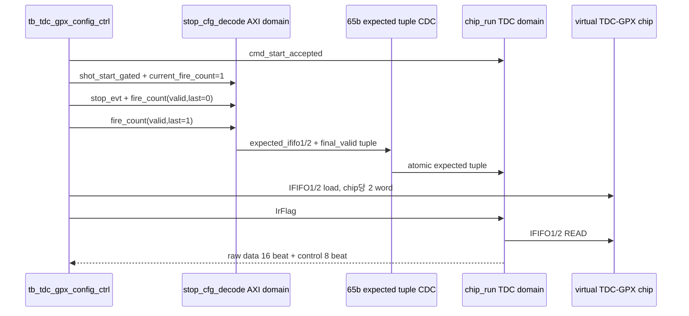

# C02 Chip Acquisition - Expected Count CDC / Top 통합 보완 결과 v001

- 생성 시각: 2026-04-30 22:12:00 KST
- 대상 Cluster: C02_Chip_Acquisition
- 작업 항목: OP-C02-03 `config_ctrl/top expected-count CDC integration`
- 절대 기준: `Doc/TDC-GPX-Datasheet.pdf`의 I-Mode single 측정 운용 흐름. 본 보완은 Datasheet의 read timing 자체를 변경하지 않고, GPX IC read 전 제어원으로 전달되는 expected-count 계약의 CDC 정합성을 보강한다.

## 1. 판단 요약

기존 `tdc_gpx_config_ctrl`는 `expected_ififo1`, `expected_ififo2`, `expected_final_valid`를 각각 독립된 `xpm_cdc_handshake`로 넘겼다. 그러나 `tdc_gpx_chip_run`은 `ST_DRAIN_LATCH`에서 세 값을 같은 사이클에 함께 래치한다. 따라서 독립 CDC는 IFIFO1 count, IFIFO2 count, final qualifier가 서로 다른 업데이트 시점에서 섞이는 torn tuple 위험이 있었다.

보완 판단은 다음과 같다.

| 항목 | 기존 | 보완 |
|---|---|---|
| CDC payload | 32b IFIFO1 + 32b IFIFO2 + 1b final, 3개 handshake | 65b tuple, 1개 handshake |
| chip_run 래치 계약 | 같은 사이클에 세 값 래치 | 같은 CDC payload에서 나온 동일 snapshot 래치 |
| read timing 영향 | 없음 | 없음 |
| control latency 영향 | 독립 CDC skew 가능 | tuple CDC latency만 존재, skew 제거 |

## 2. RTL 보완 내용

수정 파일: `tdc_gpx_config_ctrl.vhd`

근거 위치:

- `tdc_gpx_config_ctrl.vhd:682`: OP-C02-03 expected-count tuple transfer 선언
- `tdc_gpx_config_ctrl.vhd:690`: `c_EXPECTED_CDC_BITS = 65`
- `tdc_gpx_config_ctrl.vhd:1374`: expected IFIFO tuple atomic CDC packing
- `tdc_gpx_config_ctrl.vhd:1388`: 단일 `u_cdc_expected : xpm_cdc_handshake`
- `tdc_gpx_config_ctrl.vhd:1408`: 단일 `p_exp_send`

65-bit payload 배치는 다음과 같다.

| bit range | 의미 |
|---:|---|
| `[31:0]` | chip0~3 IFIFO1 expected count, chip당 8b |
| `[63:32]` | chip0~3 IFIFO2 expected count, chip당 8b |
| `[64]` | `expected_final_valid` |

이 구조에서 final beat가 도착하면 count와 final flag가 같은 CDC snapshot으로 TDC domain에 전달된다. 따라서 `chip_run.ST_DRAIN_LATCH`가 관측하는 값은 동일 shot/fire-count에 대해 일관된 tuple이다.

## 3. 검증 보완 내용

수정 파일: `tb_tdc_gpx_config_ctrl.vhd`

근거 위치:

- `tb_tdc_gpx_config_ctrl.vhd:216`: 4-chip virtual TDC-GPX model 추가
- `tb_tdc_gpx_config_ctrl.vhd:307`: raw data/control beat monitor 추가
- `tb_tdc_gpx_config_ctrl.vhd:464`: `emit_expected_counts` procedure 추가
- `tb_tdc_gpx_config_ctrl.vhd:528`: OP-C02-03 통합 시나리오 시작
- `tb_tdc_gpx_config_ctrl.vhd:563`: stop_evt + fire_count final 주입
- `tb_tdc_gpx_config_ctrl.vhd:610`: PASS report

검증 시나리오는 다음과 같다.

검증 결과:

| 검증 | 명령/로그 | 결과 |
|---|---|---|
| config_ctrl expected CDC 통합 | `xsim_config_expected_cdc.log:32` | `PASS -- expected-count tuple CDC/top integration completed, data=16 ctrl=8` |
| chip_ctrl 기존 회귀 | `xsim_chip_ctrl_regression.log:1343` | `*** ALL TESTS PASSED *** (total_raw_words=796)` |
| top_int 컴파일 | `tb_tdc_gpx_top_int.vhd` 재분석 | PASS. 단, 기존 top_int는 VDMA smoke 성격이라 drain count mismatch는 fatal이 아닌 warning으로 유지 |

## 4. Latency / Throughput / Pipeline / II 영향

| 항목 | 영향 판단 |
|---|---|
| Latency | expected-count control path에는 단일 tuple CDC latency가 존재한다. count beat와 final beat가 연속으로 바뀌면 최종 final tuple 전달까지 두 번의 handshake가 필요할 수 있다. 운용 계약은 `IrFlag` 이전에 final beat가 도착해야 한다. |
| Throughput | GPX read throughput에는 영향 없음. read FSM과 bus timing은 변경하지 않았다. |
| Pipeline | AXI stop event accumulation → 65b tuple CDC → TDC-domain `ST_DRAIN_LATCH`로 경계가 명확해졌다. |
| II | IFIFO read II에는 영향 없음. 변경은 drain 시작 전 expected-count control 전달 경로에 한정된다. |

검증 TB에서는 final tuple 안정화를 위해 `IrFlag` 전 80 clk 여유를 두었다. 이는 기능 검증용 guard이며, 실제 운용에서는 echo_receiver fire-count final beat가 MTimer 기반 `IrFlag`보다 충분히 앞서 도착한다는 계약을 유지해야 한다.

## 5. 남은 판단 항목

1. `tb_tdc_gpx_full_int`의 echo_receiver stop_evt packing은 여전히 별도 계약 검토가 필요하다. 현재 C02 stop_cfg_decode는 per-chip `[IFIFO2|IFIFO1]` layout을 요구한다.
2. output stream CDC 전체 재설계는 C02 후속 검토 항목으로 유지한다.
3. top-level VDMA full integration은 C03/C04 경계와 함께 별도 closure가 필요하다.

