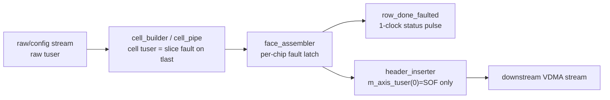
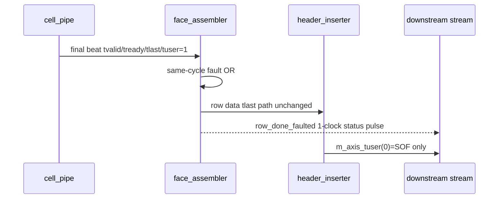

# C02 Chip Acquisition - Downstream TUSER Boundary Fix v001

- 작성/수정 시간: 2026-04-30 22:42:33 +09:00
- 기준 문서: `Doc/TDC-GPX-Datasheet.pdf`
- 기준 계획: `Doc/cluster_analysis/C02_Chip_Acquisition/C02_Chip_Acquisition_260430213118_Code_Fix_Plan_Open_Items_v001.md`
- 대상 항목: OP-C02-04 downstream 전체 AXI-stream `tuser` boundary 검증
- 결과 PPT: `Doc/cluster_analysis/C02_Chip_Acquisition/C02_Chip_Acquisition_260430224233_Downstream_TUSER_Boundary_Fix_v001.pptx`

## 1. 결론

OP-C02-04는 이번 수정으로 C02 내부 downstream `tuser` 전달 경계가 검증 가능 상태로 보완되었다.

핵심 판단은 다음과 같다.

| 항목 | 판단 | 근거 |
|---|---|---|
| cell fault 정보 전달 | PASS | `tdc_gpx_cell_pipe` 출력 `o_cell_*_tuser`를 TB에서 직접 관측하도록 보완했다. |
| same-cycle `tlast/tuser` fault 반영 | RTL 수정 필요 및 반영 | `tdc_gpx_face_assembler.vhd:543`, `:580..597`, `:896` |
| `row_done_faulted` 펄스 계약 | RTL 수정 필요 및 반영 | `tdc_gpx_face_assembler.vhd:580`에서 1클럭 기본 clear 추가 |
| output header `m_axis_tuser(0)` 의미 | SOF 전용 유지 | header stage의 `m_axis_tuser(0)`는 frame SOF이며, cell fault는 status pulse로 분리한다. |
| xsim 검증 | PASS | `xsim_cell_pipe_tuser.log:28`, `xsim_output_stage_tuser.log:42`, `:56` |

Datasheet는 GPX IC read/measurement 운용의 절대 기준이다. 다만 이번 항목은 GPX read timing 자체가 아니라 C02 내부 AXI-stream sideband 계약이므로, Datasheet에서 직접 정의하지 않는 내부 계약을 RTL/TB 근거로 보완했다. GPX IC 접근 속도, I-Mode single 범위, 200 MHz 기준 read 제어 조건은 변경하지 않았다.

## 2. Downstream TUSER 경계 정의

이번 정리 후 C02 downstream `tuser` 의미는 아래처럼 구분된다.

| 경계 | `tuser` 의미 | 검증/근거 |
|---|---|---|
| raw/config side | raw data/control 분류 및 fault monitor | 기존 raw boundary 검증 문서와 chip_ctrl TB |
| `cell_pipe` 출력 | `o_cell_rise_tuser(i)=1` 또는 `o_cell_fall_tuser(i)=1`이면 해당 chip slice의 마지막 beat가 faulted임 | `tb_tdc_gpx_cell_pipe.vhd:135`, `:166`, `:228`, `:293` |
| `face_assembler` 입력 | per-chip 마지막 `tlast` 소비 시점의 `tuser`를 해당 row fault 후보로 latch | `tdc_gpx_face_assembler.vhd:589..597` |
| `face_assembler` 상태 출력 | `o_row_done_faulted`는 `o_row_done`과 같은 성격의 1클럭 row fault pulse | `tdc_gpx_face_assembler.vhd:580`, `:896` |
| `header_inserter` 출력 stream | `m_axis_tuser(0)`는 SOF 전용 | `tb_tdc_gpx_output_stage.vhd:296`, `:411..419` |
| frame fault status | `frame_done_faulted`는 header drain watchdog synthetic close 전용 | `tb_tdc_gpx_output_stage.vhd:421..422`, `:549..551` |



## 3. 발견된 코드 결함과 보완

### 3.1 same-cycle `tlast/tuser` fault 누락

기존 `face_assembler`는 chip slice 마지막 beat에서 `tlast=1`과 `tuser=1`이 같은 클럭에 들어오면, pending register에는 다음 클럭에 반영되지만 row completion 판단은 같은 클럭의 이전 pending 값을 보고 있었다. 그 결과 active chip이 하나뿐이거나 마지막 active chip에서 fault가 발생하면 `row_done_faulted`가 누락될 수 있었다.

수정은 순차 프로세스 내부 변수 `v_faulted_this_cycle`로 이번 클럭에 소비된 faulted tlast를 함께 OR하는 방식이다.

| 위치 | 수정 내용 |
|---|---|
| `tdc_gpx_face_assembler.vhd:543` | `v_faulted_this_cycle` 변수 추가 |
| `tdc_gpx_face_assembler.vhd:583` | 매 클럭 기본값 `(others => '0')`로 초기화 |
| `tdc_gpx_face_assembler.vhd:596..597` | `tvalid/tready/tlast/tuser` 동시 소비 시 pending과 same-cycle 변수 동시 set |
| `tdc_gpx_face_assembler.vhd:896` | row completion 시 `pending or same-cycle`로 fault 판정 |

이 변경은 출력 조합 경로를 만들지 않는다. 모든 판정은 `i_clk` 상승엣지의 순차 프로세스 내부에서 닫힌다.

### 3.2 `row_done_faulted` 1클럭 펄스 계약 누락

`o_row_done_faulted`는 포트 주석과 운용 계약상 1클럭 펄스다. 기존 코드에는 reset clear는 있었지만 정상 동작 클럭의 기본 clear가 없어서 한번 set된 후 레벨처럼 유지될 수 있었다.

수정은 `tdc_gpx_face_assembler.vhd:580`에서 `s_row_done_faulted_r <= '0';`를 기본 clear에 추가한 것이다. 이후 각 fault 조건에서 해당 클럭에만 다시 set된다.

## 4. 테스트벤치 보완

### 4.1 `tb_tdc_gpx_cell_pipe`

`cell_pipe` 출력의 `tuser`를 명시적으로 검증하도록 보완했다.

| 위치 | 보완 |
|---|---|
| `tb_tdc_gpx_cell_pipe.vhd:135` | `o_cell_rise_tuser`, `o_cell_fall_tuser` 연결 |
| `tb_tdc_gpx_cell_pipe.vhd:166` | drain control `tuser` 생성 함수에 `faulted` 인자 추가 |
| `tb_tdc_gpx_cell_pipe.vhd:228` | final drain_done에 `faulted='1'` 주입 |
| `tb_tdc_gpx_cell_pipe.vhd:293` | `tlast`와 함께 faulted `tuser`가 관측되어야 PASS |
| `tb_tdc_gpx_cell_pipe.vhd:309..313` | non-tlast 조기 `tuser` assert를 FAIL로 감시 |

### 4.2 `tb_tdc_gpx_output_stage`

`output_stage`에서 cell fault가 stream SOF와 섞이지 않고 row status pulse로 전달되는지 검증했다.

| 위치 | 보완 |
|---|---|
| `tb_tdc_gpx_output_stage.vhd:190`, `:273..274` | cell `tuser` 입력과 row fault status 출력 연결 |
| `tb_tdc_gpx_output_stage.vhd:317..326` | row/frame fault pulse monitor 추가 |
| `tb_tdc_gpx_output_stage.vhd:387` | scenario 1 마지막 beat에 rise `tuser=1` 주입 |
| `tb_tdc_gpx_output_stage.vhd:419..422` | rise row fault 1회, fall row fault 0회, frame fault 0회 검증 |
| `tb_tdc_gpx_output_stage.vhd:431..438` | scenario 2 독립성을 위해 scenario 1 fall 잔여 상태를 abort/idle 정리 |
| `tb_tdc_gpx_output_stage.vhd:543..551` | scenario 2에서 clean rise row가 추가 row fault를 만들지 않고, fall abort가 frame fault를 만들지 않음을 검증 |

## 5. Timing / Latency / Throughput / Pipeline / II

이번 수정은 GPX bus read timing 또는 raw drain data path의 beat 수를 바꾸지 않는다.

| 항목 | 영향 |
|---|---|
| Latency | 데이터 beat latency 변화 없음. `row_done_faulted` 상태 pulse의 정확도만 보완했다. |
| Throughput | AXI-stream data throughput 변화 없음. `tready/tvalid` 경로에 신규 조합 backpressure를 추가하지 않았다. |
| Pipeline | `cell_pipe -> face_assembler -> header` pipeline 구조 유지. same-cycle fault 판정은 face_assembler 순차 프로세스 내부 변수로 닫힌다. |
| II(Initiation Interval) | row/frame 시작 가능 간격 변화 없음. 신규 wait state 없음. |
| Timing risk | 조합 출력 경로 추가 없음. 내부 변수 OR는 등록 프로세스 내부 판정이며, 기존 row completion 엣지에서만 사용된다. |



## 6. xsim 결과

### 6.1 `cell_pipe` tuser boundary

명령:

```powershell
& 'C:\AMDDesignTools\2025.2.1\Vivado\bin\xelab.bat' --debug typical tb_tdc_gpx_cell_pipe -s tb_cell_pipe_tuser --nolog
& 'C:\AMDDesignTools\2025.2.1\Vivado\bin\xsim.bat' tb_cell_pipe_tuser --runall --log xsim_cell_pipe_tuser.log
```

결과:

| 로그 | 결과 |
|---|---|
| `xsim_cell_pipe_tuser.log:28` | `PASS: Rising cell output appeared with valid tdata, tlast, and faulted tuser.` |

### 6.2 `output_stage` downstream boundary

명령:

```powershell
& 'C:\AMDDesignTools\2025.2.1\Vivado\bin\xvlog.bat' C:\AMDDesignTools\2025.2.1\Vivado\ids_lite\ISE\verilog\src\glbl.v --nolog
& 'C:\AMDDesignTools\2025.2.1\Vivado\bin\xelab.bat' --debug typical tb_tdc_gpx_output_stage glbl -s tb_output_stage_tuser --nolog
& 'C:\AMDDesignTools\2025.2.1\Vivado\bin\xsim.bat' tb_output_stage_tuser --runall --log xsim_output_stage_tuser.log
```

결과:

| 로그 | 결과 |
|---|---|
| `xsim_output_stage_tuser.log:38` | scenario 1 SOF count = 1 |
| `xsim_output_stage_tuser.log:40` | scenario 1 row_faulted_rise count = 1 |
| `xsim_output_stage_tuser.log:42` | scenario 1 PASS |
| `xsim_output_stage_tuser.log:54` | scenario 2 SOF count = 2 |
| `xsim_output_stage_tuser.log:56` | scenario 2 PASS |

## 7. 다음 판단

OP-C02-04는 기능적으로 close 가능하다. 남은 open item 우선순위는 다음과 같다.

| ID | 다음 조치 |
|---|---|
| OP-C02-05 | timing legality illegal combination matrix 검증 |
| OP-C02-06 | stale ready negative test |

