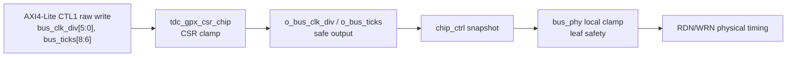
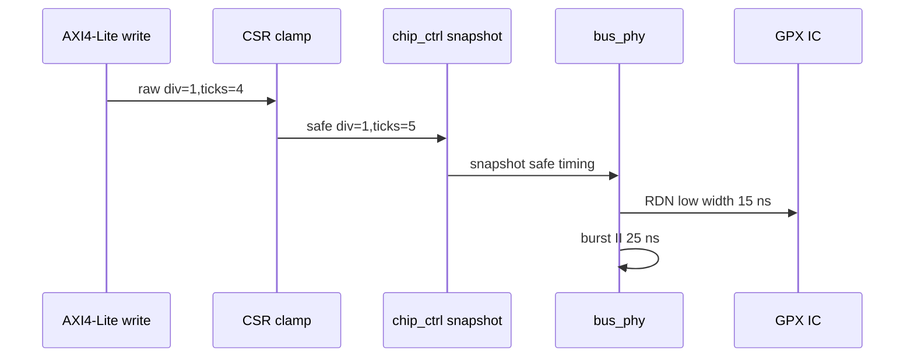

# C02 Chip Acquisition - Timing Legality Matrix Fix v001

- 작성/수정 시간: 2026-04-30 22:56:44 +09:00
- 기준 문서: `Doc/TDC-GPX-Datasheet.pdf`
- C01 인계 기준: `Doc/cluster_analysis/C01_GPX_Bus_Read/C01_GPX_Bus_Read_20260429_v009.md`
- 기준 계획: `Doc/cluster_analysis/C02_Chip_Acquisition/C02_Chip_Acquisition_260430213118_Code_Fix_Plan_Open_Items_v001.md`
- 대상 항목: OP-C02-05 timing legality illegal combination matrix
- 결과 PPT: `Doc/cluster_analysis/C02_Chip_Acquisition/C02_Chip_Acquisition_260430225644_Timing_Legality_Matrix_Fix_v001.pptx`

## 1. 결론

OP-C02-05는 이번 보완으로 close 가능하다. RTL timing clamp 자체는 이미 존재했고, 이번 수정은 그 방어를 CSR matrix와 Bus_Phy physical timing test로 증명하는 것이다.

| 항목 | 판단 | 근거 |
|---|---|---|
| Datasheet timing 기준 | 유지 | `Doc/TDC-GPX-Datasheet.pdf`, C01 v009 `:61..62`, `:162..188`, `:1039..1045` |
| CSR clamp matrix | PASS | `tb_tdc_gpx_csr_chip_clamp.vhd:301..337`, `xsim_csr_chip_timing_matrix.log:570`, `:574` |
| Bus_Phy local clamp | PASS | `tb_tdc_gpx_bus_phy_c01_contract.vhd:286..289`, `xsim_bus_phy_c01_timing_matrix.log:28..42` |
| AXI4-Lite TB rule | 준수 | `tb_tdc_gpx_csr_chip_clamp.vhd:224`, `:348`에서 `px_utility_pkg.vhd`의 writer/reader 사용 |
| RTL 변경 필요성 | 없음 | `tdc_gpx_csr_chip.vhd:848..862`, `tdc_gpx_bus_phy.vhd:166..179`, `:430..516`에 방어 로직 존재 |

## 2. Datasheet 기준식

이번 검증의 절대 기준은 Datasheet의 GPX read timing이다. C01 v009는 Datasheet p.7 READ timing과 p.27 28-bit readout rate를 다음처럼 C01 계약으로 정리했다.

| 기준 | 내용 | 추적 근거 |
|---|---|---|
| `tPW-RL` | RDN low pulse width >= 6 ns | C01 v009 `:62`, `:363` |
| `tV-DR` | data valid delay after RDN low max 11.8 ns | C01 v009 `:62`, `:365` |
| readout rate | 28-bit bus readout은 40 MHz, 즉 25 ns보다 빠르지 않게 운용 | C01 v009 `:194`, `:198`, `:1040` |
| 200 MHz 최단 정상 | `div=1,ticks=5`는 burst period 25 ns로 40 MHz 경계 | C01 v009 `:198`, `:1039..1045` |
| illegal 대표 | `div=1,ticks=4`는 20 ns period, 50 MHz 및 `tV-DR` 위반 | C01 v009 `:960`, `:1110` |

RTL 기준식은 `tdc_gpx_cfg_pkg.vhd:275..300`에 기록되어 있다.

```text
RDN low -> IOB FF capture = ((ticks - 3) * div + 1) * 5 ns
RDN low pulse width       = (ticks - 2) * div * 5 ns
burst low-edge period     = ticks * div * 5 ns

200 MHz legality:
  div = 1  -> ticks >= 5
  div >= 2 -> ticks >= 4
```

## 3. 보완한 검증 구조



검증을 두 층으로 분리했다.

| 층 | 목적 | 테스트 |
|---|---|---|
| CSR boundary | SW/CSR가 illegal 값을 써도 downstream 설정 출력은 legal로 clamp되는지 확인 | `tb_tdc_gpx_csr_chip_clamp.vhd` |
| Bus_Phy leaf boundary | CSR을 우회하거나 leaf가 illegal 입력을 직접 받아도 physical strobe timing이 legal로 clamp되는지 확인 | `tb_tdc_gpx_bus_phy_c01_contract.vhd` |

## 4. 코드 보완 내용

### 4.1 CSR matrix

`tb_tdc_gpx_csr_chip_clamp.vhd`에 exhaustive matrix를 추가했다.

| 위치 | 내용 |
|---|---|
| `tb_tdc_gpx_csr_chip_clamp.vhd:301..337` | `div=0..5`, `ticks=0..7` 전체와 `div=63`, `ticks=0..7` edge sweep |
| `tb_tdc_gpx_csr_chip_clamp.vhd:224` | AXI write는 `px_axi_lite_writer` 사용 |
| `tb_tdc_gpx_csr_chip_clamp.vhd:348` | AXI readback은 `px_axi_lite_reader` 사용 |
| `tb_tdc_gpx_csr_chip_clamp.vhd:342..350` | raw CSR register는 마지막 write `div=63,ticks=7`을 그대로 보존하는지 확인 |

CSR clamp 기대값은 다음 공식으로 계산했다.

```text
exp_div = max(raw_div, c_BUS_CLK_DIV_MIN)

if exp_div = 1:
    exp_ticks_min = c_BUS_READ_PERIOD_MIN_CLKS = 5
else:
    exp_ticks_min = c_BUS_TICKS_MIN = 4

exp_ticks = max(raw_ticks, exp_ticks_min)
```

RTL 근거는 `tdc_gpx_csr_chip.vhd:848..862`이다.

### 4.2 Bus_Phy local clamp timing

`tb_tdc_gpx_bus_phy_c01_contract.vhd`에 runtime `tick_en` divider와 local clamp sample을 추가했다.

| 위치 | 내용 |
|---|---|
| `tb_tdc_gpx_bus_phy_c01_contract.vhd:83..100` | `s_dyn_div` 기반 `i_tick_en` 생성 |
| `tb_tdc_gpx_bus_phy_c01_contract.vhd:225..273` | `check_dyn_read_low()`로 RDN low width 측정 |
| `tb_tdc_gpx_bus_phy_c01_contract.vhd:286` | `div=0,ticks=0` -> local clamp, RDN low 15 ns |
| `tb_tdc_gpx_bus_phy_c01_contract.vhd:287` | `div=1,ticks=4` -> local clamp, RDN low 15 ns |
| `tb_tdc_gpx_bus_phy_c01_contract.vhd:288` | `div=2,ticks=3` -> local clamp, RDN low 20 ns |
| `tb_tdc_gpx_bus_phy_c01_contract.vhd:289` | `div=3,ticks=4` -> legal timing, RDN low 30 ns |
| `tb_tdc_gpx_bus_phy_c01_contract.vhd:291..305` | `div=1,ticks=5` burst READ II 25 ns 확인 |

RTL 근거는 `tdc_gpx_bus_phy.vhd:166..179`, `:430..516`이다.

## 5. 검증 결과

### 5.1 Bus_Phy local clamp

명령:

```powershell
& 'C:\AMDDesignTools\2025.2.1\Vivado\bin\xelab.bat' --debug typical tb_tdc_gpx_bus_phy_c01_contract -s tb_bus_phy_c01_timing_matrix --nolog
& 'C:\AMDDesignTools\2025.2.1\Vivado\bin\xsim.bat' tb_bus_phy_c01_timing_matrix --runall --log xsim_bus_phy_c01_timing_matrix.log
```

결과:

| 로그 | 의미 |
|---|---|
| `xsim_bus_phy_c01_timing_matrix.log:28..30` | `div=0,ticks=0` clamp warning, expected RDN low 15 ns |
| `xsim_bus_phy_c01_timing_matrix.log:32..34` | `div=1,ticks=4` clamp warning, expected RDN low 15 ns |
| `xsim_bus_phy_c01_timing_matrix.log:36..38` | `div=2,ticks=3` clamp warning, expected RDN low 20 ns |
| `xsim_bus_phy_c01_timing_matrix.log:42` | `tb_tdc_gpx_bus_phy_c01_contract PASS` |

### 5.2 CSR clamp matrix

명령:

```powershell
& 'C:\AMDDesignTools\2025.2.1\Vivado\bin\xvhdl.bat' --2008 ..\tdc_gpx_ctrl.gen\sources_1\ip\tdc_gpx_axil_csr32_chip\src\axil_fsm_32.vhd ..\tdc_gpx_ctrl.gen\sources_1\ip\tdc_gpx_axil_csr32_chip\src\axil_ctrl_regs_32.vhd ..\tdc_gpx_ctrl.gen\sources_1\ip\tdc_gpx_axil_csr32_chip\src\axil_stat_regs_32.vhd ..\tdc_gpx_ctrl.gen\sources_1\ip\tdc_gpx_axil_csr32_chip\src\axil_intr_32.vhd ..\tdc_gpx_ctrl.gen\sources_1\ip\tdc_gpx_axil_csr32_chip\src\my_axil_csr32_top.vhd ..\tdc_gpx_ctrl.gen\sources_1\ip\tdc_gpx_axil_csr32_chip\sim\tdc_gpx_axil_csr32_chip.vhd --nolog
& 'C:\AMDDesignTools\2025.2.1\Vivado\bin\xvlog.bat' C:\AMDDesignTools\2025.2.1\Vivado\ids_lite\ISE\verilog\src\glbl.v --nolog
& 'C:\AMDDesignTools\2025.2.1\Vivado\bin\xelab.bat' --debug typical tb_tdc_gpx_csr_chip_clamp glbl -s tb_csr_chip_timing_matrix --nolog
& 'C:\AMDDesignTools\2025.2.1\Vivado\bin\xsim.bat' tb_csr_chip_timing_matrix --runall --log xsim_csr_chip_timing_matrix.log
```

결과:

| 로그 | 의미 |
|---|---|
| `xsim_csr_chip_timing_matrix.log:212` | `div=1,ticks=4` -> `div=1,ticks=5` clamp PASS |
| `xsim_csr_chip_timing_matrix.log:556` | `div=63,ticks=7` large divider edge PASS |
| `xsim_csr_chip_timing_matrix.log:564` | raw CTL1 readback 성공 |
| `xsim_csr_chip_timing_matrix.log:570` | 68 pass, 0 fail |
| `xsim_csr_chip_timing_matrix.log:574` | `*** ALL TESTS PASSED *** (cases=68)` |

## 6. Timing / Latency / Throughput / Pipeline / II 영향

이번 수정은 RTL data path를 바꾸지 않고 TB evidence를 확장했다. 따라서 C02 runtime 동작 영향은 없다.

| 항목 | 영향 |
|---|---|
| Latency | RTL latency 변화 없음. 검증상 최단 정상 200 MHz `div=1,ticks=5`는 C01 기준 `tick0->capture=20 ns`, `RDN low->capture=15 ns`이다. |
| Throughput | RTL throughput 변화 없음. CSR clamp가 `div=1,ticks<5`를 `ticks=5`로 올리므로 200 MHz에서 GPX readout은 40 MHz보다 빨라지지 않는다. |
| Pipeline | CSR raw register -> clamped config output -> chip_ctrl snapshot -> bus_phy local clamp 구조 유지. |
| II | Burst READ II 공식은 `bus_ticks * bus_clk_div * 5 ns`이며, 최단 정상 `1*5*5ns=25ns`이다. |
| Timing diagram | 아래 block timing처럼 illegal 입력은 CSR/Bus_Phy에서 legal timing으로 정규화된다. |



## 7. 다음 판단

OP-C02-05는 close 가능하다. 남은 open item은 OP-C02-06 stale ready negative test이다.

