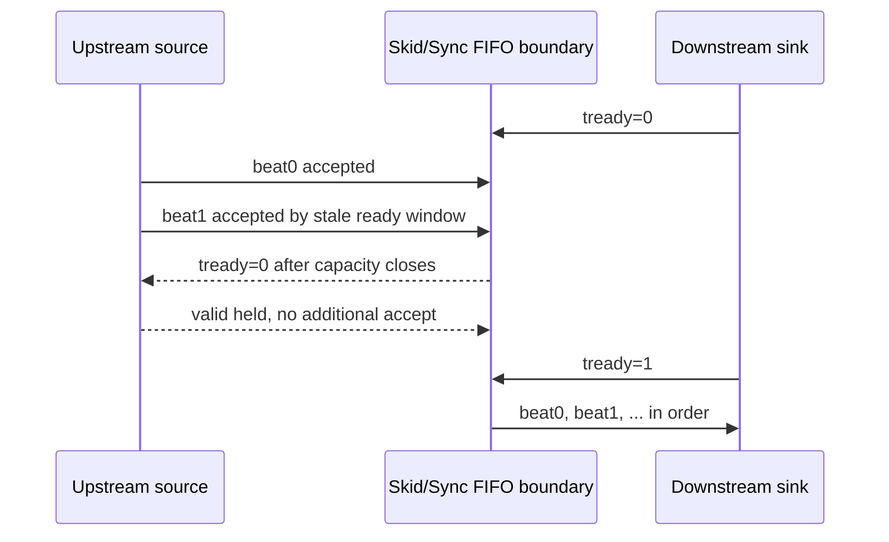

# C02 Chip Acquisition - Stale Ready Negative Fix v001

- 문서 버전: `v001`
- 작성 시간: `2026-04-30 23:07:32 +09:00`
- 최종 수정 시간: `2026-04-30 23:07:32 +09:00`
- 기준 규칙: `Doc/cluster_analysis/cluster_analysis_260430201013_operating_protocol_v009.md`
- 절대 기준: `Doc/TDC-GPX-Datasheet.pdf`
- 선행 문서: `C02_Chip_Acquisition_260430205146_Skid_Sync_FIFO_Fix_Result_v001.md`
- 대상 항목: `OP-C02-06 stale ready negative test`

## 1. 결론

OP-C02-06은 `반영`으로 닫아도 된다. 이번 보완은 RTL data path를 변경하지 않고, `tdc_gpx_skid_buffer`와 `tdc_gpx_sync_fifo`의 registered-ready 경계가 downstream backpressure 중에도 데이터를 초과 수용하거나, release 후 pop/drop/duplicate를 만들지 않는지 전용 TB로 검증했다.

| 검증 대상 | blocked 상태 기대 | release 후 기대 | 결과 |
|---|---:|---|---|
| `tdc_gpx_skid_buffer` | 2 beat만 수용 후 `ready=0` | 8 beat 순서 보존 | PASS |
| `tdc_gpx_sync_fifo(depth=2, in/out skid)` | 최대 6 beat 수용 후 `ready=0` | 12 beat 순서 보존 | PASS |

## 2. Datasheet 기준과 이번 검증의 관계

이번 항목은 GPX IC 핀 타이밍을 직접 바꾸는 항목은 아니다. 그러나 Datasheet 기준으로 읽어온 IFIFO 데이터가 C02 내부 backpressure 경계에서 손실되면, Datasheet에 맞춰 수행한 READ 운용 자체의 의미가 깨진다.

| 기준 | 적용 |
|---|---|
| GPX READ timing | C01/C02 상위 계약에서 Datasheet p.7 READ timing과 p.27 40 MHz readout 제한을 따른다. |
| C02 stream boundary | Datasheet 기준으로 확보한 raw/event beat가 AXI valid/ready backpressure에서 보존되어야 한다. |
| stale ready 허용 조건 | registered-ready가 1 clock 늦게 low로 내려가도 elastic capacity 안에서만 추가 수용되어야 한다. |

## 3. 수정 내용

| 파일 | 내용 |
|---|---|
| `tb_tdc_gpx_stale_ready.vhd:23` | `tb_tdc_gpx_stale_ready` 전용 testbench 추가 |
| `tb_tdc_gpx_stale_ready.vhd:30` | sync FIFO blocked 수용 상한 `c_FIFO_MAX_BLOCKED_ACCEPT=6` 명시 |
| `tb_tdc_gpx_stale_ready.vhd:117` | skid buffer stale-ready negative scenario 시작 |
| `tb_tdc_gpx_stale_ready.vhd:198` | sync FIFO stale-ready negative scenario 시작 |
| `tb_tdc_gpx_stale_ready.vhd:235` | blocked 중 FIFO over-accept 방지 assertion |
| `tb_tdc_gpx_stale_ready.vhd:278` | sync FIFO PASS 로그 |
| `tb_tdc_gpx_stale_ready.vhd:281` | 전체 PASS 로그 |

## 4. Timing Block



sync FIFO는 input skid 2 entry, core FIFO 2 entry, output skid 2 entry를 사용하므로 blocked 상태에서 최대 6 beat까지는 합법적으로 수용될 수 있다. 검증 로그도 `blocked accepts=6`으로 이 구조적 상한과 일치한다.

## 5. Latency / Throughput / Pipeline / II

| 항목 | 판단 |
|---|---|
| Latency | 기존 skid/sync FIFO 구조의 latency는 변하지 않는다. 이번 변경은 TB 추가이며 RTL latency 변화는 없다. |
| Throughput | downstream ready가 유지되면 skid/sync FIFO 모두 1 beat/clk throughput을 유지하는 계약이다. |
| Pipeline | `source -> registered-ready elastic boundary -> sink` 경계가 명확히 검증되었다. |
| II | 정상 ready 구간 II는 1 clock이다. backpressure 구간에서는 sink가 release될 때까지 II가 sink ready에 의해 제한된다. |
| Negative 의미 | ready가 stale-high인 동안에도 수용량을 초과하지 않고, release 후 순서가 보존된다. |

## 6. xsim 검증 결과

실행 명령:

```powershell
& 'C:\AMDDesignTools\2025.2.1\Vivado\bin\xvhdl.bat' --2008 .\tdc_gpx_skid_buffer.vhd .\tdc_gpx_sync_fifo.vhd .\tb_tdc_gpx_stale_ready.vhd --nolog
& 'C:\AMDDesignTools\2025.2.1\Vivado\bin\xelab.bat' --debug typical tb_tdc_gpx_stale_ready -s tb_tdc_gpx_stale_ready_snap --nolog
& 'C:\AMDDesignTools\2025.2.1\Vivado\bin\xsim.bat' tb_tdc_gpx_stale_ready_snap --runall --log xsim_stale_ready.log
```

| 로그 | 의미 |
|---|---|
| `xsim_stale_ready.log:30` | skid buffer stale-ready PASS |
| `xsim_stale_ready.log:34` | sync FIFO stale-ready PASS, `blocked accepts=6` |
| `xsim_stale_ready.log:36` | `tb_tdc_gpx_stale_ready: ALL TESTS PASSED` |

## 7. 다음 판단

OP-C02-06은 close 가능하다. 현재 open item 중 실질적으로 다음 우선순위는 `OP-C02-03 config_ctrl/top expected-count CDC integration`이다.
