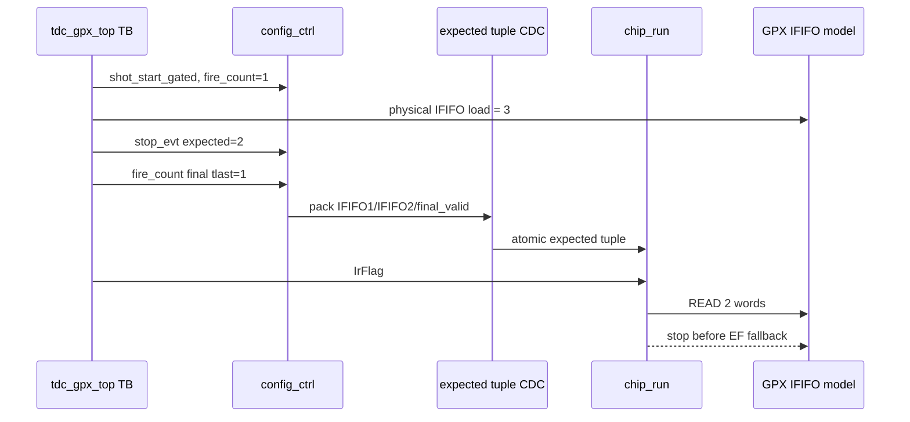

# C02 Chip Acquisition - Config/Top Expected CDC Fix v001

- 문서 버전: `v001`
- 작성 시간: `2026-04-30 23:19:04 +09:00`
- 최종 수정 시간: `2026-04-30 23:19:04 +09:00`
- 기준 규칙: `Doc/cluster_analysis/cluster_analysis_260430201013_operating_protocol_v009.md`
- 절대 기준: `Doc/TDC-GPX-Datasheet.pdf`
- 대상 항목: `OP-C02-03 config_ctrl/top expected-count CDC integration`

## 1. 결론

OP-C02-03은 `반영`으로 닫아도 된다. 기존 `tdc_gpx_config_ctrl`의 expected tuple CDC는 이미 `xpm_cdc_handshake` 기반으로 구현되어 있었지만, top 통합에서 fire-count final expected 계약이 실제 chip drain을 제한하는지 증명이 부족했다.

이번 보완은 `tb_tdc_gpx_top_int.vhd`에서 물리 IFIFO를 expected보다 1 word 더 많이 채운 뒤, top-level `stop_evt/fire_count` 포트로 expected final을 주입한다. 검증 결과 각 shot에서 READ는 expected 개수인 2 word에서 멈추고, 물리 FIFO에는 1 word가 남았다. 따라서 EF fallback이 아니라 expected-count bounded drain이 동작했음을 확인했다.

## 2. Datasheet 기준과 이번 검증의 관계

Datasheet 기준 READ timing 자체는 C01/C02 기존 검증에서 닫혔다. 이번 항목의 초점은 Datasheet 기준으로 읽을 IFIFO word 수를 결정하는 운영 계약이다.

| 기준 | 적용 |
|---|---|
| Datasheet READ timing | Bus_Phy/C01 계약이 보장한다. 이번 변경은 READ pulse timing을 바꾸지 않는다. |
| I-Mode single 운용 | C02 범위는 I-Mode single만 다룬다. Quiet/M/Continuous는 제외다. |
| expected count final | fire-count가 현재 face shot count와 일치하고 `tlast=1`일 때만 known final로 인정한다. |
| count-known drain | expected final이 있으면 EF까지 읽지 않고 expected 개수에서 READ를 멈춰야 한다. |

## 3. 수정 내용

| 파일 | 내용 |
|---|---|
| `tb_tdc_gpx_top_int.vhd:640` | top-level per-chip expected-count stream driver 설명 추가 |
| `tb_tdc_gpx_top_int.vhd:646` | `emit_expected_counts()` 추가 |
| `tb_tdc_gpx_top_int.vhd:726` | 물리 IFIFO를 `expected+1`로 load |
| `tb_tdc_gpx_top_int.vhd:728` | stop_evt + fire_count final expected 주입 |
| `tb_tdc_gpx_top_int.vhd:747` | IFIFO1 READ count가 expected와 같은지 assertion |
| `tb_tdc_gpx_top_int.vhd:753` | IFIFO2 READ count가 expected와 같은지 assertion |
| `tb_tdc_gpx_top_int.vhd:758` | IFIFO1 leftover가 1인지 assertion |
| `tb_tdc_gpx_top_int.vhd:762` | IFIFO2 leftover가 1인지 assertion |
| `tb_tdc_gpx_top_int.vhd:836`, `:847` | shot 1/2 모두 expected-count 검증으로 실행 |

## 4. Timing Block



핵심 판정은 `physical=3`, `expected=2`, `leftover=1`이다. fallback이면 leftover가 0이 되어야 하므로, leftover 1은 expected-count bounded drain의 직접 근거다.

## 5. Latency / Throughput / Pipeline / II

| 항목 | 판단 |
|---|---|
| Latency | RTL latency 변화 없음. TB가 expected stream 주입과 assertion을 강화했다. |
| Throughput | READ throughput은 기존 C01/C02 timing legality 계약을 그대로 따른다. |
| Pipeline | `top stop_evt/fire_count -> stop_cfg_decode -> expected tuple CDC -> chip_run` 경로가 end-to-end로 검증되었다. |
| II | shot 간 II는 기존 face_seq/shot_period 조건을 따른다. expected tuple CDC는 shot capture 중 80 clk settle 후 IrFlag를 주입하여 ST_DRAIN_LATCH snapshot 전에 안정화했다. |
| Backpressure 영향 | raw stream은 top 기본 `ASYNC raw_cdc` 경로로 지나며, expected-count bounded drain과 충돌하지 않았다. |

## 6. xsim 검증 결과

실행 명령:

```powershell
& 'C:\AMDDesignTools\2025.2.1\Vivado\bin\xsim.bat' tb_tdc_gpx_config_ctrl_op_c02_03_snap --runall --log xsim_config_ctrl_op_c02_03.log
& 'C:\AMDDesignTools\2025.2.1\Vivado\bin\xsim.bat' tb_tdc_gpx_top_int_op_c02_03_snap --runall --log xsim_top_int_op_c02_03.log
```

| 로그 | 의미 |
|---|---|
| `xsim_config_ctrl_op_c02_03.log:30` | config_ctrl OP-C02-03 scenario 실행 |
| `xsim_config_ctrl_op_c02_03.log:32` | config_ctrl expected tuple CDC PASS, `data=16 ctrl=8` |
| `xsim_top_int_op_c02_03.log:75` | shot1 `expected=2 physical=3 leftover=1` PASS |
| `xsim_top_int_op_c02_03.log:79` | shot2 `expected=2 physical=3 leftover=1` PASS |
| `xsim_top_int_op_c02_03.log:84..87` | top output stream emitted, PASS |

## 7. 다음 판단

OP-C02-03은 close 가능하다. OP-C02-01부터 OP-C02-06까지 모두 반영되었으므로, 다음 단계는 C02 closure 문서와 C03/C04 인계 계약 정리다.
