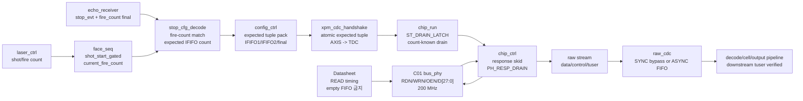
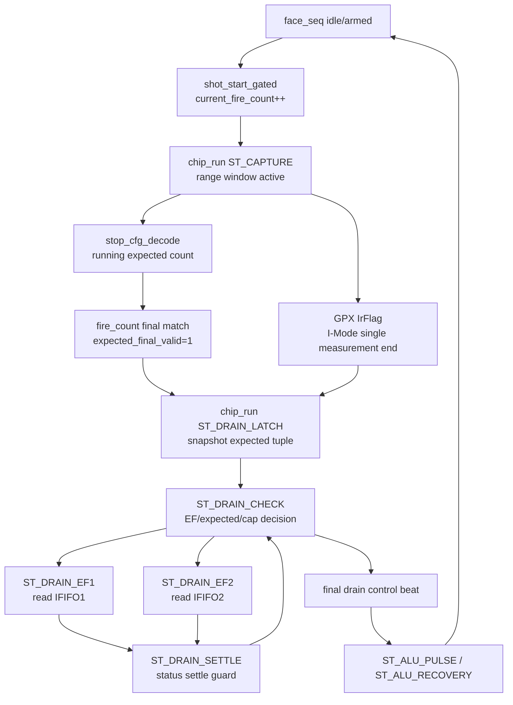
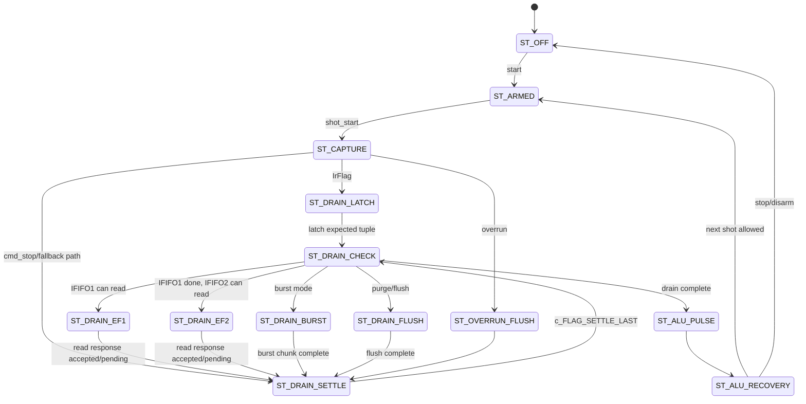
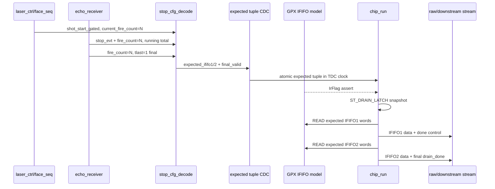

# C02 Chip Acquisition - Cluster2 Readiness Review v001

- 문서 버전: `v001`
- 작성 시간: `2026-04-30 23:32:13 +09:00`
- 최종 수정 시간: `2026-04-30 23:32:13 +09:00`
- 대상 Cluster: `C02_Chip_Acquisition`
- 목적: C02의 타이밍도, 상태머신 관계도, 파이프라인, latency, throughput, II(Initiation Interval), 검증 완성도를 종합해 다음 Cluster로 넘어갈 수 있는지 판단한다.
- 절대 기준: `Doc/TDC-GPX-Datasheet.pdf`
- 운영 기준: `Doc/cluster_analysis/cluster_analysis_260430201013_operating_protocol_v009.md`

## 0. 최종 판정

판정은 `조건부 GO`이다. C02 내부 RTL/TB 관점에서 `I-Mode single`, `28-bit bus`, `200 MHz TDC/Bus_Phy clock`, `expected-count 기반 count-known drain`, `raw stream CDC`, `downstream tuser boundary`, `timing legality`, `stale-ready boundary`는 다음 Cluster로 넘길 수 있을 만큼 닫혔다.

조건부라고 적는 이유는 C02 내부 결함 때문이 아니라, 다음 Cluster가 반드시 받아야 하는 계약과 제외 범위가 남아 있기 때문이다.

| 구분 | 판정 | 이유 |
|---|---|---|
| C02 내부 기능 | GO | OP-C02-01부터 OP-C02-06까지 xsim 근거로 닫힘 |
| Datasheet READ timing | GO | C01에서 확정한 `div=1,ticks=5` fastest legal READ가 유지됨 |
| I-Mode single 운용 | GO | Quiet/M/Continuous는 C02 범위에서 제외한다고 확정됨 |
| expected-count drain | GO | top 통합 TB에서 physical IFIFO를 `expected+1`로 채워도 READ가 expected에서 멈춤 |
| output stream CDC 전체 재설계 | HANDOFF | C02 직접 code-fix 범위 밖이며 C03/C04 인계 항목 |
| echo_receiver full_int packing | HANDOFF | `tb_tdc_gpx_full_int.vhd`는 stop_evt/fire_count를 tie-off하고 있어 실제 echo_receiver 포맷 통합은 별도 인계 필요 |
| 16-bit bus mode | EXCLUDED | 28-bit close 이후 별도 검토 |

따라서 다음 Cluster 진입 기준은 다음과 같다.

1. 다음 Cluster는 C02의 primary mode를 `I-Mode single + 28-bit + 200 MHz Bus_Phy + expected-count final`로 받아야 한다.
2. 다음 Cluster는 `stop_evt/fire_count -> stop_cfg_decode -> expected tuple CDC -> chip_run` 계약을 유지해야 한다.
3. 실제 `echo_receiver_top`의 stop_evt packing과 `tdc_gpx_top`의 per-chip expected packing 정합성은 cross-IP integration handoff로 받아야 한다.
4. output stream CDC 전체 재설계는 C02 closure의 blocker가 아니라 C03/C04 설계 판단 항목으로 다룬다.

## 1. 분석 범위와 기준

### 1.1 Datasheet 기준

C02는 GPX IC에서 측정 완료 후 IFIFO를 읽어오는 Cluster이다. 따라서 C02의 하위 bus 동작은 C01에서 정리한 Datasheet READ timing을 상속한다.

| Datasheet 항목 | C02에서의 의미 | 추적 근거 |
|---|---|---|
| `tPW-RL >= 6 ns` | RDN low 폭은 최소 6 ns 이상이어야 한다. | `Doc/TDC-GPX-Datasheet.pdf` p.7 Read Operations, `tdc_gpx_cfg_pkg.vhd:270` |
| `tPW-RH >= 6 ns` | burst read 사이 RDN high gap도 최소 6 ns 이상이어야 한다. | `Doc/TDC-GPX-Datasheet.pdf` p.7 Read Operations, `tdc_gpx_cfg_pkg.vhd:272` |
| `tV-DR <= 11.8 ns` | RDN low 이후 data valid가 늦어도 11.8 ns 안에 도착하므로, FPGA capture는 그 이후에 잡아야 한다. | `Doc/TDC-GPX-Datasheet.pdf` p.7 Read Operations, `tdc_gpx_bus_phy.vhd:36..46` |
| `tS-EF <= 11.8 ns` | last data read 이후 EF가 늦게 set될 수 있으므로, EF-only fallback에서는 status settle guard가 필요하다. count-known path에서는 expected count가 우선이다. | `Doc/TDC-GPX-Datasheet.pdf` p.7 Read Operations, `tdc_gpx_chip_run.vhd:876..879` |
| 28-bit data bus 40 MHz | fastest legal burst READ II는 25 ns 이상이어야 한다. | `Doc/TDC-GPX-Datasheet.pdf` p.27, `tdc_gpx_cfg_pkg.vhd:300` |
| Empty FIFO read 금지 | fill/expected/EF 판단 없이 IFIFO를 읽으면 안 된다. | `Doc/TDC-GPX-Datasheet.pdf` p.7 Read Operations, `tdc_gpx_chip_run.vhd:494..516` |

### 1.2 현재 C02 운용 범위

| 항목 | 현재 결정 |
|---|---|
| 측정 모드 | `I-Mode single`만 C02 closure 범위 |
| 제외 모드 | Quiet mode, M-mode, I-Mode continuous measurement |
| bus mode | 28-bit bus |
| Bus_Phy / chip control clock | 200 MHz, `Tclk = 5 ns` |
| stream clock | 기본 `g_STREAM_CLK_MODE="ASYNC"`, TDC 200 MHz -> AXI-Stream 150 MHz 경계는 `xpm_fifo_async` |
| OEN | 정상 연결과 High 고정/pull-up/not-connected만 검토 대상. Low 고정은 unsupported |
| expected count source | `echo_receiver`의 stop_evt/fire_count 계약. top 통합 TB에서는 직접 per-chip expected stream으로 검증 |

## 2. 전체 파이프라인



해석:

- `face_seq`는 현재 shot의 소유권 번호인 `s_face_shot_count_r`를 만든다. top 연결은 `tdc_gpx_top.vhd:841..890`이다.
- `stop_cfg_decode`는 stop event와 fire-count sideband가 현재 shot count와 일치할 때만 expected count를 갱신하고, `tlast=1` final beat가 현재 shot과 일치할 때만 `o_expected_final_valid`를 올린다. 계약 설명은 `tdc_gpx_stop_cfg_decode.vhd:10..23`, 구현은 `tdc_gpx_stop_cfg_decode.vhd:216..221`, `:292..304`이다.
- `config_ctrl`는 IFIFO1/IFIFO2/final_valid를 하나의 65-bit CDC payload로 묶는다. 근거는 `tdc_gpx_config_ctrl.vhd:682..692`, `:1374..1405`이다.
- `chip_run`은 IrFlag 이후 `ST_DRAIN_LATCH`에서 expected tuple을 1회 snapshot한다. 고정 wait counter를 두지 않는 이유는 final ownership이 fire-count match로 이미 결정되기 때문이다. 근거는 `tdc_gpx_chip_run.vhd:26..28`, `:473..482`이다.
- `chip_ctrl`는 bus response skid와 `PH_RESP_DRAIN`을 소유해 stale response가 다음 phase로 새는 것을 막는다. 근거는 `tdc_gpx_chip_ctrl.vhd:609..656`, `:829..864`이다.
- raw stream clock crossing은 `g_STREAM_CLK_MODE="ASYNC"`에서 `xpm_fifo_async`로 처리한다. 근거는 `tdc_gpx_config_ctrl.vhd:21..26`, `:1794..1863`이다.

## 3. 상태머신 관계도

### 3.1 Cluster 관점 상태 관계



핵심 관계:

- `IrFlag`는 GPX IC의 I-Mode single 측정 완료 이벤트이다. C02는 이 시점부터 IFIFO drain을 시작한다.
- expected count는 IrFlag를 기다렸다가 계산하는 값이 아니다. `shot_start_gated` 이후 echo/stop event가 들어오는 동안 이미 누적되고, fire-count final beat로 현재 shot의 최종값임을 확정한다.
- 따라서 `ST_DRAIN_LATCH`에는 더 이상 `c_EXP_LATCH_SETTLE_LAST` 같은 고정 wait가 필요하지 않다. 현재 코드도 blind wait 없이 snapshot한다. 근거는 `tdc_gpx_chip_run.vhd:473..482`이다.
- `ST_DRAIN_SETTLE`은 expected count 안정화 wait가 아니다. READ 이후 EF/LF/status가 GPX/Datasheet timing과 synchronizer를 거쳐 안정화될 시간을 주고 다시 `ST_DRAIN_CHECK`로 돌아가는 guard이다. 근거는 `tdc_gpx_chip_run.vhd:876..879`이다.

### 3.2 chip_run 상세 상태



상태 정의 근거는 `tdc_gpx_chip_run.vhd:11..13`, `tdc_gpx_chip_run.vhd:187..198`이다.

## 4. 타이밍도

### 4.1 Datasheet READ timing 상속

200 MHz에서 `Tclk=5 ns`, C02 fastest legal READ는 `div=1`, `ticks=5`이다.

```text
tick0       tick1          tick2          tick3          tick4          tick5
ADR setup   RDN low        RDN low        RDN low        RDN high       rsp_valid
            |<------ tPW-RL = (ticks-2)*div*Tclk = 15 ns ------>|
            |<------ RDN low -> IOB capture = ((ticks-3)*div+1)*Tclk = 15 ns
                           sample_en                   IOB FF capture
            |<---------------- burst READ II = ticks*div*Tclk = 25 ns ---------------->|

burst inter-read RDN high gap = 2 ticks * div * Tclk = 10 ns
```

검증 의미:

- `tV-DR <= 11.8 ns`보다 capture delay 15 ns가 늦으므로 data valid 이후 sampling한다.
- `tPW-RL = 15 ns`, `tPW-RH = 10 ns`이므로 Datasheet 최소 6 ns를 만족한다.
- `burst READ II = 25 ns`이므로 28-bit bus 최대 40 MHz보다 빠르게 읽지 않는다.

코드 근거:

- timing 공식: `tdc_gpx_bus_phy.vhd:36..52`, `tdc_gpx_cfg_pkg.vhd:274..290`
- local clamp: `tdc_gpx_bus_phy.vhd:430..458`, `:490..516`
- 검증 로그: `xsim_bus_phy_c01_timing_matrix.log:28..42`, `xsim_csr_chip_timing_matrix.log:570..574`

### 4.2 expected-count 기반 drain timing



top 통합 검증에서 물리 IFIFO는 `expected+1`로 채웠다. 결과가 `read=expected`, `leftover=1`이면 EF fallback이 아니라 expected-count bounded drain이 동작한 것이다.

| 시점 | 의미 | 근거 |
|---|---|---|
| shot_start | face-local shot count 증가, expected tracking reset | `tdc_gpx_top.vhd:535..537`, `tdc_gpx_top.vhd:841..890` |
| expected final | fire-count match + `tlast=1`일 때만 final valid | `tdc_gpx_stop_cfg_decode.vhd:18..23`, `:292..304` |
| atomic CDC | IFIFO1/IFIFO2/final_valid가 같은 payload로 crossing | `tdc_gpx_config_ctrl.vhd:1374..1405` |
| latch | `ST_DRAIN_LATCH`에서 expected tuple snapshot | `tdc_gpx_chip_run.vhd:473..482` |
| bounded read | final valid이면 expected count 이상 읽지 않음 | `tdc_gpx_chip_run.vhd:494..516` |
| top 검증 | shot1/shot2 모두 `read=2,leftover=1` | `xsim_top_int_op_c02_03.log:75`, `:79` |

## 5. Latency / Throughput / Pipeline / II

### 5.1 측정 기준

`xsim_chip_ctrl.log`의 `[16]` 측정은 4 stop channel x 7 echo를 가정해 IFIFO1 28 word, IFIFO2 28 word, 총 56 data word drain을 관측한다.

| 기준점 | 의미 | 로그 |
|---|---|---|
| T0 | TB가 GPX `IrFlag` pin을 assert한 시점 | `xsim_chip_ctrl.log:921` 주변 |
| T1a | 첫 raw valid가 내부에서 준비된 시점 | `first_valid=16clk`, `xsim_chip_ctrl.log:921` |
| T1b | 첫 raw data가 downstream에서 accepted된 시점 | `first_accept=40clk`, `xsim_chip_ctrl.log:987..988` |
| T2 | IFIFO1 마지막 data accepted | `last=211clk`, `xsim_chip_ctrl.log:989` |
| T3 | IFIFO1 done control accepted | `done_ctrl=218clk`, `xsim_chip_ctrl.log:989` |
| T4 | IFIFO2 첫 data accepted | `first=226clk`, `xsim_chip_ctrl.log:990` |
| T5 | IFIFO2 마지막 data accepted | `last=421clk`, `xsim_chip_ctrl.log:990` |
| T6/T7 | final control 및 output done | `final_ctrl=428clk`, `output_done=428clk`, `xsim_chip_ctrl.log:987..991` |

### 5.2 latency 분해

| 구간 | 값 | 해석 |
|---|---:|---|
| T0 -> T1a | 16 clk | IrFlag sync, drain latch/check, 첫 bus read, bus response 생성까지의 내부 first-valid latency |
| T1a -> T1b | 24 clk | 테스트벤치가 일부러 raw backpressure를 걸어 첫 accepted가 늦어진 구간 |
| T0 -> T1b | 40 clk | downstream 관점 첫 data accepted latency |
| T1b -> T2 | 171 clk interval | IFIFO1 data 28 word accepted window |
| T2 -> T3 | 7 clk | IFIFO1 마지막 data 이후 IFIFO1 done control beat |
| T3 -> T4 | 8 clk | IFIFO1 done 이후 IFIFO2 첫 data까지 전환 gap |
| T4 -> T5 | 195 clk interval | IFIFO2 data 28 word accepted window |
| T5 -> T6 | 7 clk | IFIFO2 마지막 data 이후 final control beat |
| T0 -> T7 | 428 clk | IrFlag부터 downstream-visible drain done까지의 전체 latency |

주의:

- `T0 -> T1b = 40 clk`는 설계가 40 clk를 모두 소비한다는 뜻이 아니다. 내부 first-valid는 16 clk이고, 나머지 24 clk는 TB backpressure 때문에 accepted가 지연된 것이다. 근거는 `xsim_chip_ctrl.log:988`의 `valid_to_accept=24clk`, `ready_release=40clk`, `release_to_accept=0clk`이다.
- count-known path에서는 expected tuple이 IrFlag 전에 CDC되어 있어야 한다. top 통합 TB는 `emit_expected_counts()` 후 IrFlag 전에 충분한 settle을 둔다. 근거는 `tb_tdc_gpx_top_int.vhd:728..731`이다.

### 5.3 throughput

200 MHz 기준으로 계산한다.

| 항목 | 계산 | 값 | 의미 |
|---|---:|---:|---|
| GPX physical READ max | 1 word / 25 ns | 40 Mword/s per bus | Datasheet p.27 40 MHz와 일치 |
| T0 -> output_done 평균 | 56 word / 428 clk | 약 26.2 Mword/s | 전체 overhead 포함 |
| raw data accepted window | 56 word / 382 clk | 약 29.3 Mword/s | first data부터 last data까지 |
| IFIFO1 data window | 28 word / 172 clk | 약 32.6 Mword/s | backpressure 해소 후 burst가 압축되어 보임 |
| IFIFO2 data window | 28 word / 196 clk | 약 28.6 Mword/s | bus cadence와 control gap이 더 잘 보임 |

해석:

- C02 throughput 병목은 GPX Datasheet READ cadence이다.
- raw AXI output에서는 skid/FIFO에 쌓인 beat가 downstream ready 이후 `II_min=1clk`로 보일 수 있다. 이것은 GPX bus를 1clk마다 읽었다는 뜻이 아니라, 이미 도착한 raw beat를 stream boundary가 연속 방출했다는 뜻이다.

### 5.4 II(Initiation Interval)

| II 종류 | 측정/계약 | 판단 |
|---|---|---|
| GPX bus READ II | `ticks * div * Tclk = 5 * 1 * 5 ns = 25 ns` | Datasheet 40 MHz 한계 만족 |
| raw output II_min | 1 clk | FIFO/skid에 저장된 beat가 downstream ready에서 연속 accepted 가능 |
| raw output II_max | 15 clk | burst chunk/control/check/next-request gap 포함 |
| IFIFO1 output II | min 1 clk, max 15 clk | `xsim_chip_ctrl.log:989` |
| IFIFO2 output II | min 5 clk, max 15 clk | `xsim_chip_ctrl.log:990` |
| shot-level II | face_seq `shot_period`와 chip busy/armed 상태가 결정 | C02는 shot 간 overlap 없이 single 측정으로 닫음 |

다음 Cluster에서 사용할 운영 해석:

- bus-level II와 stream-level II를 섞으면 안 된다.
- Datasheet 준수 판단은 bus-level II 25 ns로 판단한다.
- downstream 처리량 판단은 stream-level II와 CDC/FIFO backpressure로 판단한다.

## 6. 검증 완성도 Matrix

| 항목 | 상태 | 핵심 근거 |
|---|---|---|
| OP-C02-01 forced empty/tuser negative | CLOSE | `C02_Chip_Acquisition_260430214621_P0_Negative_PHRespDrain_Verify_v001.md`, `xsim_chip_ctrl_neg_empty.log:35..40`, `xsim_chip_ctrl_neg_tuser.log:35..40` |
| OP-C02-02 PH_RESP_DRAIN stuck/fatal | CLOSE | `xsim_chip_ctrl.log:1005..1343`, 특히 `:1010`, `:1338..1343` |
| OP-C02-03 expected-count CDC/top integration | CLOSE | `xsim_config_ctrl_op_c02_03.log:30..32`, `xsim_top_int_op_c02_03.log:75..87` |
| OP-C02-04 downstream AXI-stream tuser boundary | CLOSE | `xsim_cell_pipe_tuser.log:28`, `xsim_output_stage_tuser.log:42`, `:56` |
| OP-C02-05 timing legality matrix | CLOSE | `xsim_csr_chip_timing_matrix.log:570..574`, `xsim_bus_phy_c01_timing_matrix.log:28..42` |
| OP-C02-06 stale-ready boundary | CLOSE | `xsim_stale_ready.log:30`, `:34`, `:36` |
| zero-stop known final | CLOSE | `xsim_chip_ctrl.log:171..179` |
| 4 stop x 7 echo nominal IFIFO load | CLOSE | `xsim_chip_ctrl.log:987..991` |
| top stream emission | CLOSE | `xsim_top_int_op_c02_03.log:84..87` |

## 7. 남은 리스크와 인계 계약

### 7.1 다음 Cluster가 받아야 하는 계약

| 계약 | 설명 | 근거 |
|---|---|---|
| C02 primary mode | I-Mode single만 유효하다. Quiet/M/Continuous는 제외다. | `Doc/cluster_analysis/C02_Chip_Acquisition/C02_Chip_Acquisition_260430213118_Code_Fix_Plan_Open_Items_v001.md:43..45` |
| count-known 우선 | expected final이 있으면 EF fallback보다 expected count가 drain 종료 기준이다. | `tdc_gpx_chip_run.vhd:494..516` |
| zero-stop 의미 | expected=0은 final_valid가 있을 때만 known-zero이다. final_valid가 없으면 legacy EF fallback이다. | `tdc_gpx_chip_run.vhd:492..497` |
| fire-count ownership | stop/final beat는 현재 `i_current_fire_count`와 일치해야 한다. | `tdc_gpx_stop_cfg_decode.vhd:18..23`, `:216..221` |
| atomic CDC | IFIFO1/IFIFO2/final_valid는 하나의 handshake payload로 넘어간다. | `tdc_gpx_config_ctrl.vhd:1374..1405` |
| bus timing | C02는 C01의 Datasheet timing clamp를 상속한다. | `tdc_gpx_bus_phy.vhd:430..516`, `tdc_gpx_cfg_pkg.vhd:298..300` |
| raw stream CDC | async mode에서는 `xpm_fifo_async`, sync mode에서는 constrained synchronous clock pair가 필요하다. | `tdc_gpx_config_ctrl.vhd:1794..1863` |

### 7.2 blocker가 아닌 후속 항목

| 항목 | 현재 판단 |
|---|---|
| output stream CDC 전체 재설계 | 후속 검토. C02의 raw CDC는 동작 검증됐지만, 전체 output stream architecture 재설계는 C03/C04에서 판단한다. |
| 실제 echo_receiver packing 통합 | `tb_tdc_gpx_full_int.vhd:858..876`에서 stop_evt/fire_count가 tie-off되어 있다. C02 top/config/chip path는 닫혔지만, full_int cross-IP packing 정합성은 다음 통합 항목이다. |
| OEN board default | 정상 연결과 High 고정/pull-up/not-connected 두 경우만 통합 검토한다. Low 고정은 금지한다. |
| 16-bit bus mode | 28-bit 기능이 완전히 close된 뒤 검토한다. |
| 250 MHz retiming | 현재 C02 범위에서 제외한다. |

## 8. 다음 Cluster 진입 판단 기준

다음 항목에 모두 동의하면 C03/C04로 넘어가도 된다.

| 체크 | 기준 | 판정 |
|---|---|---|
| Datasheet timing | 200 MHz, `div=1,ticks=5` 이상 legal timing만 사용 | PASS |
| mode scope | I-Mode single만 다음 Cluster 입력 계약으로 사용 | PASS |
| expected count | fire-count final 기반 expected tuple을 C02 drain 계약으로 수락 | PASS |
| zero-stop | final_valid 없는 expected=0은 fallback, final_valid 있는 expected=0은 known-zero로 해석 | PASS |
| pipeline/II | bus-level II와 stream-level II를 분리해 다음 Cluster에서 사용 | PASS |
| stale-ready | skid/sync FIFO boundary가 drop/duplicate 없이 동작 | PASS |
| handoff | echo_receiver full_int packing과 output stream CDC 전체 재설계는 후속 항목으로 명시 | PASS_WITH_HANDOFF |

No-Go 조건은 하나뿐이다. 다음 Cluster가 “실제 `echo_receiver_top`의 stop_evt/fire_count가 `tb_tdc_gpx_full_int`에서 tie-off 없이 `tdc_gpx_top`까지 end-to-end 연결된 상태”를 C02 closure의 필수 조건으로 요구한다면, 현재는 No-Go이다. 그러나 C02 내부 drain controller와 top/config/chip contract 기준으로는 Go가 맞다.

## 9. 근거 목록

### 9.1 RTL 근거

| 파일 | 근거 |
|---|---|
| `tdc_gpx_bus_phy.vhd` | `:36..52` READ timing 공식, `:430..516` local clamp, `:585..612` RDN/sample/burst high gap |
| `tdc_gpx_cfg_pkg.vhd` | `:270..300` Datasheet-derived legal timing table |
| `tdc_gpx_stop_cfg_decode.vhd` | `:10..23` echo_receiver 계약, `:216..221` stop ownership, `:292..304` final ownership |
| `tdc_gpx_config_ctrl.vhd` | `:682..692`, `:1374..1405` expected tuple CDC, `:1794..1863` raw stream sync/async CDC |
| `tdc_gpx_chip_run.vhd` | `:187..198` 상태 정의, `:473..482` expected latch, `:494..516` count-known drain decision, `:876..879` settle guard |
| `tdc_gpx_chip_ctrl.vhd` | `:609..656` response skid/routing, `:829..864` PH_RESP_DRAIN, `:1259..1260` busy includes drain/init |
| `tdc_gpx_top.vhd` | `:115..126` stop/fire-count top port, `:517..537` config_ctrl 연결, `:841..890` face_seq shot count 연결 |
| `tb_tdc_gpx_top_int.vhd` | `:646`, `:711..728`, `:746..762`, `:769`, `:836`, `:847` expected-count top integration 검증 |
| `tb_tdc_gpx_stale_ready.vhd` | `:115..192` skid negative, `:196..281` sync FIFO stale-ready negative |
| `tb_tdc_gpx_full_int.vhd` | `:858..876` actual echo_receiver stop_evt/fire_count tie-off caveat |

### 9.2 xsim 근거

| 로그 | 근거 |
|---|---|
| `xsim_chip_ctrl.log` | `:171..179` zero-stop, `:921..991` latency/II, `:1005..1343` PH_RESP_DRAIN stuck/fatal/recovery |
| `xsim_config_ctrl_op_c02_03.log` | `:30..32` expected-count tuple CDC/top integration PASS |
| `xsim_top_int_op_c02_03.log` | `:28` ASYNC raw_cdc active, `:75`, `:79` expected-count bounded drain, `:84..87` top stream PASS |
| `xsim_stale_ready.log` | `:30`, `:34`, `:36` skid/sync FIFO stale-ready PASS |
| `xsim_csr_chip_timing_matrix.log` | `:570..574` timing matrix 68 pass / 0 fail |
| `xsim_bus_phy_c01_timing_matrix.log` | `:28..42` Bus_Phy local clamp PASS |
| `xsim_cell_pipe_tuser.log` | `:28` cell pipe tuser PASS |
| `xsim_output_stage_tuser.log` | `:42`, `:56` output stage tuser PASS |

## 10. 결론

C02는 다음 Cluster로 넘겨도 된다. 다만 넘기는 것은 “완전히 열린 통합 시스템”이 아니라, 명확히 닫힌 C02 계약이다.

넘길 계약은 다음 한 문장으로 요약된다.

> C02는 Datasheet READ timing을 만족하는 200 MHz bus control 아래에서, I-Mode single shot의 fire-count final expected tuple을 기준으로 GPX IFIFO를 empty-read 없이 drain하고, raw/downstream stream 경계까지 tuser/CDC/backpressure가 검증된 상태이다.

다음 Cluster는 이 계약을 받아서 output stream CDC 전체 구조, 실제 echo_receiver packing 통합, board OEN 운용 결정, C03/C04 downstream 소비 계약을 확정하면 된다.
