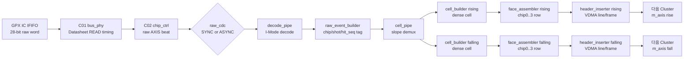
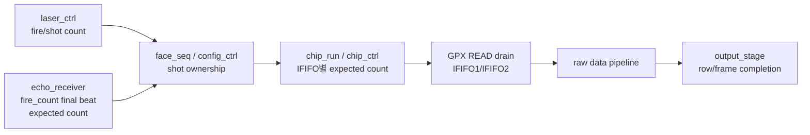
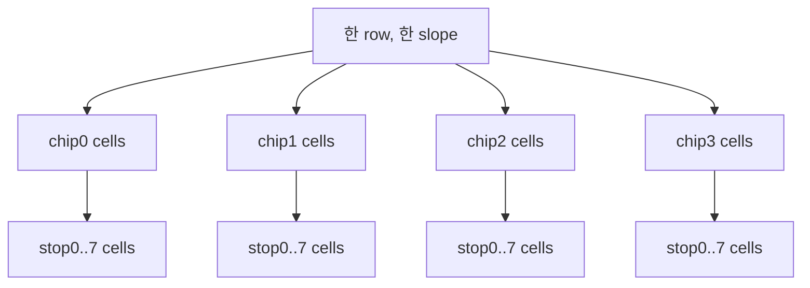
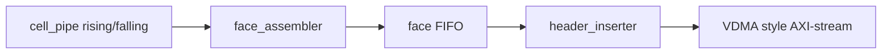

# C02 Chip Acquisition Data Flow Review v001

- Cluster: C02_Chip_Acquisition
- 문서 목적: GPX IC에서 읽은 측정 데이터가 C02 내부 파이프라인을 거쳐 다음 Cluster로 넘어갈 때, 원하는 데이터와 품질 정보가 어디에서 생성, 변환, 보존, 소실될 수 있는지 판단한다.
- 작성/수정 시간: 2026-04-30 23:44:42 KST
- 문서 생성 규칙: `C02_Chip_Acquisition_YYMMDDHHMMSS_Data_Flow_Review_vNNN`
- 절대 기준: `Doc/TDC-GPX-Datasheet.pdf`
- 코드 기준: 현재 작업 트리의 VHDL 코드 및 C02 검증 로그

## 1. 결론

C02 데이터 플로우는 다음 두 흐름을 분리해서 이해해야 한다.

1. 측정 데이터 흐름
   - GPX IFIFO 28-bit word를 `chip_ctrl`이 읽고, `decode_pipe`가 I-Mode single 의미로 해석한다.
   - `raw_event_builder`가 chip/shot/hit 순번을 추가한다.
   - `cell_pipe`가 rising/falling slope를 분리하고, stop/shot 단위 dense cell로 누적한다.
   - `output_stage`가 chip slice를 face row로 조립하고, header를 붙여 rising/falling AXI-stream 두 개로 다음 Cluster에 넘긴다.

2. 제어/소유권 흐름
   - laser/fire count와 echo_receiver expected count가 현재 shot의 소유권을 결정한다.
   - C02는 이 expected count를 기준으로 IFIFO read 개수와 drain 종료를 판단한다.
   - 이 경로가 틀리면 측정 데이터 자체보다 먼저 "어느 shot의 데이터를 몇 개 읽을 것인가"가 틀어진다.

운영상 다음 Cluster가 반드시 받아야 할 핵심 계약은 4개다.

- 최종 출력은 rising/falling 2개 stream이다.
- 최종 stream의 `tuser(0)`는 SOF이며, fault flag가 아니다.
- fault/degraded 정보는 cell metadata, status pulse, CSR/status 경로로 추적해야 한다.
- raw hit는 현재 cell format에서 16-bit slot으로 저장된다. GPX raw word의 Hit field는 17-bit이므로, 17-bit 전체 보존이 필요한 다음 단계는 format 확장 검토가 필요하다.

## 2. 전체 데이터 플로우

판정 관점에서는 `raw_hit`, `chip_id`, `stop_id`, `slope`, `shot_seq`, `hit_seq`, `faulted/error_fill`, `tlast`가 단계별로 어디에 있는지를 추적하면 된다.

## 3. 제어/소유권 플로우

중요한 판단은 다음과 같다.

- echo_receiver의 expected count는 "몇 개의 IFIFO word를 읽을지"를 결정하는 제어 데이터다.
- fire count final beat가 zero-stop shot까지 포함해야 expected=0 shot도 정상 종료할 수 있다.
- C02는 fire count 기반 expected match 구조로 보완되었기 때문에, 과거 `c_EXP_LATCH_SETTLE_LAST`류의 임의 대기보다 shot 소유권이 명확하다.
- 그러나 다음 Cluster에서는 최종 stream만 보고 expected count를 복원할 수 없다. 필요하면 CSR/status 또는 별도 sideband 계약이 필요하다.

## 4. 단계별 데이터 의미

### 4.1 GPX IFIFO raw word

GPX I-Mode raw word는 28-bit로 다룬다.

| Field | Bit | 의미 | 근거 |
|---|---:|---|---|
| ChaCode | `[27:26]` | GPX channel code | `tdc_gpx_pkg.vhd:103..111` |
| StartNum | `[25:18]` | single shot에서는 예약/미사용 취급 | `tdc_gpx_pkg.vhd:103..111` |
| Slope | `[17]` | rising/falling 분리 기준 | `tdc_gpx_pkg.vhd:103..111` |
| Hit | `[16:0]` | GPX 측정 raw hit | `tdc_gpx_pkg.vhd:103..111` |

### 4.2 chip_ctrl raw AXI

`tdc_gpx_chip_ctrl`은 GPX read response를 raw AXI beat로 만든다.

| Signal | 의미 | 근거 |
|---|---|---|
| `m_axis_tdata[27:0]` | GPX 28-bit raw word | `tdc_gpx_chip_ctrl.vhd:182..198`, `1060..1079` |
| `m_axis_tdata[31:28]` | 0 padding | `tdc_gpx_chip_ctrl.vhd:182..198` |
| `m_axis_tuser[0]` | IFIFO ID, `0=IFIFO1`, `1=IFIFO2` | `tdc_gpx_chip_ctrl.vhd:156..162` |
| `m_axis_tuser[5]` | control beat에서 faulted | `tdc_gpx_chip_ctrl.vhd:156..162`, `1205..1219` |
| `m_axis_tuser[7]` | control/drain_done beat | `tdc_gpx_chip_ctrl.vhd:156..162`, `1205..1219` |

이 단계의 핵심은 raw 데이터와 drain_done control beat가 같은 stream 안에 있지만 `tuser[7]`로 구분된다는 점이다.

### 4.3 decode_pipe / decoder_i_mode

`tdc_gpx_decoder_i_mode`는 28-bit raw word를 I-Mode event로 재해석한다.

| Output | 의미 | 근거 |
|---|---|---|
| `tdata[16:0]` | raw hit | `tdc_gpx_decoder_i_mode.vhd:17..26`, `89..113` |
| `tuser[0]` | slope | `tdc_gpx_decoder_i_mode.vhd:17..26`, `89..113` |
| `tuser[2:1]` | raw channel code | `tdc_gpx_decoder_i_mode.vhd:17..26`, `89..113` |
| `tuser[5:3]` | local stop id | `tdc_gpx_decoder_i_mode.vhd:17..26`, `89..113` |
| `tuser[6]` | IFIFO ID | `tdc_gpx_decoder_i_mode.vhd:17..26`, `89..113` |
| `tuser[7]` | drain_done/control beat | `tdc_gpx_decoder_i_mode.vhd:17..26`, `89..113` |

`decode_pipe`는 raw stream을 `decoder_i_mode`와 `raw_event_builder`로 연결하는 wrapper다. 근거는 `tdc_gpx_decode_pipe.vhd:3..6`, `82..157`.

### 4.4 raw_event_builder

`raw_event_builder`는 decode 결과에 chip/shot/hit 순번을 붙인다.

| Output | 의미 | 근거 |
|---|---|---|
| `tdata[16:0]` | raw hit | `tdc_gpx_raw_event_builder.vhd:24..27`, `129..166` |
| `tuser[0]` | slope | `tdc_gpx_raw_event_builder.vhd:63..77`, `129..166` |
| `tuser[2:1]` | chip id | `tdc_gpx_raw_event_builder.vhd:63..77`, `129..166` |
| `tuser[5:3]` | stop id local | `tdc_gpx_raw_event_builder.vhd:63..77`, `129..166` |
| `tuser[6]` | IFIFO id | `tdc_gpx_raw_event_builder.vhd:63..77`, `129..166` |
| `tuser[7]` | drain_done/control beat | `tdc_gpx_raw_event_builder.vhd:63..77`, `129..166` |
| `tuser[10:8]` | hit sequence local | `tdc_gpx_raw_event_builder.vhd:63..77`, `129..166` |
| `tuser[15:11]` | shot sequence lower 5 bits | `tdc_gpx_raw_event_builder.vhd:63..77`, `129..166` |

주의할 점은 `tuser[5]`가 data beat에서는 `stop_id_local[2]`이고, control beat에서는 faulted 의미로 쓰인다는 점이다. control beat 여부는 `tuser[7]`로 먼저 판정해야 한다.

### 4.5 cell_pipe / cell_builder

`cell_pipe`는 `tuser[0]` slope를 기준으로 raw event를 rising/falling builder로 나눈다. drain_done control beat는 양쪽 slope builder로 전달되어 각 slope가 shot 종료를 알 수 있게 한다. 근거는 `tdc_gpx_cell_pipe.vhd:145..151`, `210..228`.

`cell_builder`는 stop/shot 단위 dense cell을 만든다.

| 정보 | 보존 위치 | 근거 |
|---|---|---|
| hit value | `hit_slot[]`, 현재 16-bit slot | `tdc_gpx_pkg.vhd:48`, `563..578`, `619..628` |
| hit valid | `hit_valid[]` bitmap | `tdc_gpx_pkg.vhd:563..578` |
| slope | slope별 output stream 및 `slope_vec[]` | `tdc_gpx_pkg.vhd:563..578` |
| hit count | `hit_count_actual` | `tdc_gpx_pkg.vhd:563..578` |
| overflow | `hit_dropped` | `tdc_gpx_pkg.vhd:573..576` |
| synthetic/blank | `error_fill` | `tdc_gpx_pkg.vhd:573..576` |
| chip id | metadata beat | `tdc_gpx_face_assembler.vhd:310..325` |
| faulted | chip slice `tuser(0)` on tlast | `tdc_gpx_cell_builder.vhd:167..177`, `1034..1038`, `1056..1060` |

중요한 데이터 변환은 raw hit 17-bit 중 cell slot에는 16-bit가 저장된다는 점이다. 현재 `c_HIT_SLOT_DATA_WIDTH=16`이며, 코드 주석도 Zynq-7000 format으로 정의하고 있다. 따라서 다음 Cluster가 GPX Hit `[16:0]` 전체를 요구하면 C02 output format 확장이 필요하다.

### 4.6 face_assembler

`face_assembler`는 chip0부터 chip3까지 정해진 순서로 chip cell slice를 조립해 한 row를 만든다.

특징은 다음과 같다.

- active chip만 조립한다.
- chip data가 timeout되면 blank cell을 만들고 metadata의 `error_fill`을 1로 둔다.
- row 완료 시 `o_row_done`이 발생한다.
- synthetic/blank/partial 데이터가 포함되면 `o_row_done_faulted`가 발생한다.

근거는 `tdc_gpx_face_assembler.vhd:6..26`, `28..34`, `96..128`, `772..802`, `821..897`, `1012..1026`.

### 4.7 output_stage / header_inserter

`output_stage`는 rising/falling 각각에 대해 다음 구조를 가진다.

`header_inserter`는 각 VDMA line 앞에 48-byte header prefix를 붙인다. 최종 출력의 `tuser(0)`는 첫 line 첫 beat의 SOF다. 즉, 최종 stream의 `tuser(0)`는 fault가 아니다.

| 최종 출력 신호 | 의미 | 근거 |
|---|---|---|
| `m_axis_*_tdata` | header prefix + cell data | `tdc_gpx_header_inserter.vhd:7..26`, `39..53` |
| `m_axis_*_tlast` | VDMA line end, EOL | `tdc_gpx_header_inserter.vhd:493..505` |
| `m_axis_*_tuser(0)` | SOF, first line first beat only | `tdc_gpx_header_inserter.vhd:124..129`, `472..480` |
| `frame_done_faulted` | frame close fault pulse | `tdc_gpx_header_inserter.vhd:538..540`, `tdc_gpx_output_stage.vhd:156..161` |

header는 face_start 시점의 snapshot이다. post-drain error는 현재 header가 아니라 다음 header, status register, cell metadata로 확인한다. 근거는 `tdc_gpx_header_inserter.vhd:11..25`, `627..672`.

## 5. `tuser` 의미 변화 표

| 단계 | `tuser` 의미 | 판단 포인트 |
|---|---|---|
| chip_ctrl raw | IFIFO id, faulted control, drain_done control | `tuser[7]=1`이면 control beat |
| decoder_i_mode | slope, channel, stop, IFIFO, drain_done | raw word를 I-Mode event로 해석 |
| raw_event_builder | slope, chip, stop, IFIFO, drain_done, hit_seq, shot_seq | data/control 의미를 `tuser[7]`로 먼저 분기 |
| cell_builder output | per-chip slice `tuser(0)=faulted`, tlast cycle에서 유효 | chip slice 품질 플래그 |
| face_assembler status | `row_done_faulted` pulse | row 품질 플래그, 최종 AXIS tuser가 아님 |
| header_inserter final | `tuser(0)=SOF` | 다음 Cluster가 fault로 해석하면 안 됨 |

## 6. 데이터가 바뀌거나 소실될 수 있는 지점

| 지점 | 현상 | 의도/위험 | 다음 Cluster 판단 |
|---|---|---|---|
| GPX raw hit -> cell slot | 17-bit hit 중 16-bit slot 저장 | 현재 Zynq-7000 format 의도 | 17-bit 전체 필요 시 format 변경 필요 |
| raw_event_builder stop decode | stop id 범위 오류 시 error pulse | 잘못된 raw decode 방어 | `o_stop_id_error`/status 추적 필요 |
| cell_builder hit overflow | max hits 초과 hit drop | cell 크기 고정 | `hit_dropped` metadata 확인 |
| IFIFO2 미도착 | synthetic EOS, faulted tuser | wedge 방지 | cell/row faulted 확인 |
| face_assembler timeout | blank cell, `error_fill=1` | frame size 보존 | cell metadata와 row_done_faulted 확인 |
| output header | post-drain error가 현 header에 바로 안 들어감 | face_start snapshot 정책 | status/다음 header/metadata 같이 확인 |

## 7. 원하는 데이터 전달 확인 체크리스트

| 확인 대상 | 어디서 확인할 수 있는가 | 판정 |
|---|---|---|
| GPX raw hit | chip_ctrl raw, decoder/raw_event, cell hit_slot | cell에서는 16-bit slot 한계 확인 |
| chip id | raw_event `tuser[2:1]`, cell metadata | face_assembler는 chip0..3 순서 보장 |
| stop id | decoder/raw_event `tuser[5:3]`, cell row 내부 stop 순서 | IFIFO1/2를 통해 stop0..7 구성 |
| slope | raw_event `tuser[0]`, rising/falling stream 분리 | 최종 stream 자체가 slope 의미를 가진다 |
| shot ownership | raw_event `tuser[15:11]`, header shot snapshot, control path expected count | lower 5-bit tag 한계 주의 |
| hit order | raw_event `tuser[10:8]`, cell hit_slot 순서 | max hits 초과 시 `hit_dropped` |
| clean/faulted | cell metadata, row_done_faulted, frame_done_faulted, CSR/status | 최종 `tuser(0)`가 fault가 아님 |
| frame/line boundary | final `tuser(0)=SOF`, `tlast=EOL` | VDMA style parsing 기준 |

## 8. Timing / Latency / Throughput / Pipeline / II 관점

이번 문서는 데이터 의미 추적 문서이므로 기존 C02 readiness 수치를 변경하지 않는다. 현재까지 닫힌 기준은 다음과 같다.

| 항목 | 현재 판정 | 근거 |
|---|---|---|
| GPX READ II | 25 ns 이상, Datasheet 40 MHz 이하 계약 | C01/C02 timing legality 분석 |
| raw stream II | 정상 backpressure 없음 기준 1 beat/clk 가능, bus read가 상위 병목 | `tdc_gpx_chip_ctrl` raw FIFO와 `chip_run` drain 구조 |
| `T0 -> first raw data` | TB 관측상 16 clk 또는 backpressure 포함 40 clk로 분리 관리 | C02 timing breakdown 및 top integration 로그 |
| output frame completion | 대표 TB에서 output_done 428 clk 관측 | C02 readiness 문서 |
| final stream throughput | rising/falling 각각 독립 AXIS, header+cell line 구조 | `tdc_gpx_output_stage.vhd`, `tdc_gpx_header_inserter.vhd` |

데이터 플로우 관점의 II 병목은 세 군데다.

1. GPX bus read legality
   - GPX IC Datasheet가 40 MHz 이하 read timing을 요구하므로, 내부 200 MHz 제어 클럭이 있어도 실제 read strobe는 25 ns 이상 간격을 유지해야 한다.

2. raw/control beat 혼합 FIFO
   - raw data beat와 drain_done control beat가 같은 stream에 존재한다.
   - `tuser[7]` 기반 control 분기가 깨지면 data/control boundary가 무너진다.

3. face/output stage
   - chip slice를 row로 조립하고 header를 붙이는 구간이다.
   - final output `tuser`는 SOF로 재정의되므로, fault 전달은 sideband/status/metadata를 함께 봐야 한다.

## 9. 검증 근거

| 검증/로그 | 확인 내용 |
|---|---|
| `xsim_top_int_op_c02_03.log:28` | ASYNC raw_cdc active |
| `xsim_top_int_op_c02_03.log:75`, `79` | expected-count bound PASS |
| `xsim_top_int_op_c02_03.log:84..87` | rising/falling stream 각각 60 beats, `tlast=2`, PASS |
| `xsim_cell_pipe_tuser.log:28` | cell output tdata/tlast/faulted tuser PASS |
| `xsim_output_stage_tuser.log:42`, `56` | output stage tuser/status scenario PASS |

## 10. 다음 Cluster 인계 계약

다음 Cluster는 다음 계약을 명시적으로 받아야 한다.

1. 입력 stream은 rising/falling 두 개다.
2. 최종 `tuser(0)`는 SOF다.
3. line boundary는 `tlast`로 판정한다.
4. fault/degraded는 final stream `tuser`가 아니라 cell metadata, row/frame fault pulse, CSR/status와 함께 판정한다.
5. header는 face_start snapshot이다. 현재 frame에서 발생한 post-drain error가 같은 header에 즉시 반영된다고 가정하면 안 된다.
6. cell payload는 fixed-size dense format이며, stop/channel별 `hit_valid`, `slope_vec`, `hit_count_actual`, `hit_dropped`, `error_fill`을 해석해야 한다.
7. 현재 hit slot width는 16-bit다. 17-bit GPX raw hit 전체 보존 요구가 있으면 C02 format 또는 다음 Cluster 계약을 재검토해야 한다.

## 11. C02 GO 판단

데이터 플로우 관점에서 C02는 다음 Cluster 진입이 가능하다. 단, "데이터가 잘 넘어갔다"의 기준은 최종 stream beat 수만으로 닫으면 부족하다. 다음 Cluster 준비 문서에는 반드시 다음 3종 확인을 포함해야 한다.

- 최종 AXI-stream: SOF/EOL/frame 구조 확인
- cell metadata: stop별 hit/valid/drop/error_fill 확인
- status/sideband: row_done_faulted/frame_done_faulted/CSR error 확인

이 세 가지를 같이 보는 조건에서 C02 데이터 플로우 계약은 조건부 GO로 판단한다.
