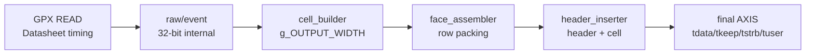

# C02 AXI4-Stream Width Standardization Review v001

- Cluster: C02_Chip_Acquisition
- 문서 목적: C02 및 관련 서브모듈의 AXI4-Stream 인터페이스를 표준 비트폭 기반으로 유연하게 변경할 수 있는지 검토하고, 수정 가능한 단계와 위험을 정리한다.
- 작성/수정 시간: 2026-04-30 23:57:08 KST
- 문서 생성 규칙: `C02_Chip_Acquisition_YYMMDDHHMMSS_AXI4_Stream_Width_Standardization_Review_vNNN`
- 절대 기준: `Doc/TDC-GPX-Datasheet.pdf`
- 코드 기준: 현재 작업 트리 VHDL 코드

## 1. 결론

수정 가능하다. 다만 한 번에 전체 AXI4-Stream을 임의 폭으로 바꾸는 것은 위험하다. 추천 전략은 다음 3단계다.

1. Phase A: output/cell stream을 32/64/128-bit full-keep 표준 AXI4-Stream으로 정리
   - 최종 외부 `m_axis`에 `tkeep/tstrb`를 추가한다.
   - `g_OUTPUT_WIDTH` 허용 범위를 32/64/128로 명시한다.
   - 모든 beat는 full valid byte이므로 `tkeep=(others=>'1')` 정책으로 시작한다.

2. Phase B: raw/event/stop/fire stream의 폭 상수를 역할별로 분리
   - raw/event 내부 AXIS는 32-bit data를 유지하되, hard-coded `31 downto 0`, `7 downto 0`, `15 downto 0`를 package constant로 관리한다.
   - stop event의 `tuser` 폭을 `tdata` 폭과 분리한다.

3. Phase C: 256-bit 이상 또는 임의 byte 폭 지원
   - header 48-byte가 256-bit, 즉 32-byte beat와 정수로 맞지 않는다.
   - 이 단계는 partial `tkeep`를 실제 의미 있게 생성, 전달, 검증해야 하므로 별도 설계 변경으로 다루는 것이 맞다.

즉, "유연하게 대응"하려면 먼저 32/64/128-bit 표준 폭을 안전하게 닫고, 그 다음 partial `tkeep` 기반 완전 유연화를 검토하는 방식이 합리적이다.

## 2. AXI4-Stream 표준화 기준

본 프로젝트에서 사용할 표준 AXI4-Stream 규칙은 다음처럼 잡는 것이 좋다.

| 항목 | 규칙 | 설명 |
|---|---|---|
| `TDATA_WIDTH` | 8의 배수 | AXI4-Stream byte lane 기준 |
| `TKEEP_WIDTH` | `TDATA_WIDTH/8` | byte valid mask |
| `TSTRB_WIDTH` | `TDATA_WIDTH/8` | byte strobe, 초기에는 `tkeep`와 동일 |
| `TUSER_WIDTH` | stream 역할별 독립 | AXI 표준상 `tuser`는 byte 폭과 묶이지 않는다 |
| `TLAST` | packet/line boundary가 있는 stream만 필수 | raw/event control beat는 `tuser` control marker로 유지 가능 |
| `TID/TDEST` | 현재 C02 내부에서는 미사용 | 외부 통합 필요 시 별도 generic으로 추가 |

권장 constant 이름은 다음과 같다.

| Constant | 권장값 | 역할 |
|---|---:|---|
| `c_AXIS_DATA_WIDTH_MIN` | 8 | byte lane 최소 단위 |
| `c_BUS_RSP_TDATA_WIDTH` | 32 | bus_phy response |
| `c_BUS_RSP_TUSER_WIDTH` | 8 | read/write, address tag |
| `c_RAW_AXIS_TDATA_WIDTH` | 32 | chip_ctrl raw output |
| `c_RAW_AXIS_TUSER_WIDTH` | 8 | IFIFO/control/fault |
| `c_EVT_AXIS_TDATA_WIDTH` | 32 | decoded event raw hit |
| `c_EVT_AXIS_TUSER_WIDTH` | 16 | slope/chip/stop/shot/hit_seq |
| `c_CELL_AXIS_TUSER_WIDTH` | 1 | cell slice faulted |
| `c_M_AXIS_TUSER_WIDTH` | 1 | final SOF |

## 3. 현재 코드 상태

### 3.1 Output/Cell 계열

| 모듈 | 현재 상태 | 근거 |
|---|---|---|
| `tdc_gpx_top` | `g_OUTPUT_WIDTH` 존재, 최종 output은 `tdata/tvalid/tlast/tuser/tready`만 있음. `tkeep/tstrb` 없음 | `tdc_gpx_top.vhd:36`, `145..157` |
| `tdc_gpx_cell_pipe` | cell output `tdata`는 `g_OUTPUT_WIDTH`, `tuser`는 chip별 1-bit vector | `tdc_gpx_cell_pipe.vhd:21`, `51..89` |
| `tdc_gpx_cell_builder` | `g_TDATA_WIDTH` 32/64 전제 주석, output `tdata/tvalid/tlast/tuser/tready` | `tdc_gpx_cell_builder.vhd:88..95`, `121`, `167..178` |
| `tdc_gpx_face_assembler` | `g_TDATA_WIDTH` 32/64 전제 주석, XPM FIFO는 내부적으로 `tkeep/tstrb` all-ones 처리 후 open | `tdc_gpx_face_assembler.vhd:11..20`, `351..366`, `424..447` |
| `tdc_gpx_output_stage` | XPM FIFO에서 `tkeep/tstrb` all-ones, output으로는 전달하지 않음 | `tdc_gpx_output_stage.vhd:323..347`, `367..391` |
| `tdc_gpx_header_inserter` | `g_TDATA_WIDTH` 32/64 전제, final `tuser(0)=SOF`, `tkeep/tstrb` 없음 | `tdc_gpx_header_inserter.vhd:29..31`, `124..129`, `463..480` |

판정:

- 32/64는 이미 어느 정도 고려되어 있다.
- 128-bit는 수식상 가능성이 높지만, 주석/검증/일부 range가 32/64 전제라서 명시 검증이 필요하다.
- 256-bit 이상은 header 48-byte와 정수 beat가 맞지 않아 partial `tkeep` 없이는 불가능하다.

### 3.2 Raw/Event 계열

| 모듈 | 현재 상태 | 근거 |
|---|---|---|
| `tdc_gpx_bus_phy` | 32-bit `tdata`, 4-bit `tkeep`, 8-bit `tuser` 고정 | `tdc_gpx_bus_phy.vhd:131..149`, `714..717` |
| `tdc_gpx_chip_ctrl` | bus response slave 32/8, raw master 32/8 고정 | `tdc_gpx_chip_ctrl.vhd:156..196`, `343..351` |
| `tdc_gpx_config_ctrl` | raw CDC payload가 `tdata(32)+tuser(8)=40-bit`로 고정 | `tdc_gpx_config_ctrl.vhd:358..377`, `1854..1862` |
| `tdc_gpx_decode_pipe` | raw 32/8, event 32/16, skid pack 40/48-bit 고정 | `tdc_gpx_decode_pipe.vhd:25..39`, `101..154` |
| `tdc_gpx_decoder_i_mode` | input/output `tdata=32`, `tuser=8` 고정 | `tdc_gpx_decoder_i_mode.vhd:51..60` |
| `tdc_gpx_raw_event_builder` | input 32/8, output 32/16 고정 | `tdc_gpx_raw_event_builder.vhd:44..77` |

판정:

- raw/event는 GPX Datasheet 28-bit raw word와 내부 decode 의미가 고정이므로, 굳이 output 폭처럼 넓힐 필요는 낮다.
- 하지만 hard-coded 폭은 유지보수 위험이다. package constant로 이름을 부여해서 "표준 32-bit 내부 event stream"으로 관리하는 것이 좋다.

### 3.3 Stop/Event 및 Fire Count 계열

| 인터페이스 | 현재 상태 | 문제 |
|---|---|---|
| stop event | `g_STOP_EVT_DWIDTH`, `tkeep=g_STOP_EVT_DWIDTH/8`, `tuser=g_STOP_EVT_DWIDTH` | `tuser`가 data width에 묶여 있음 |
| fire count | `g_FIRE_COUNT_DWIDTH`, `tkeep=g_FIRE_COUNT_DWIDTH/8`, `tlast` 있음 | `tuser` 없음, fire count는 `[15:0]`만 실제 사용 |

근거:

- `tdc_gpx_top.vhd:114..126`
- `tdc_gpx_config_ctrl.vhd:129..137`
- `tdc_gpx_stop_cfg_decode.vhd:106..118`, `216..220`

판정:

- stop event는 tdata/tuser가 서로 다른 의미다. 현재 구조처럼 둘 다 같은 폭을 쓰면 폭 확장 시 의미가 흐려진다.
- `g_STOP_EVT_TUSER_WIDTH`를 별도 generic으로 분리하는 것이 맞다.
- fire count도 향후 표준화를 위해 `tuser`를 선택적으로 추가할지 검토할 수 있으나, 현재는 `tdata[15:0]` + `tlast` 계약이 명확하므로 우선순위는 낮다.

## 4. 폭별 영향 분석

### 4.1 Header/Cell beat 수

현재 header prefix는 48 bytes, cell은 기본 32 bytes다.

| `TDATA_WIDTH` | Byte/beat | Header beats | Cell beats | Full-keep 가능 여부 |
|---:|---:|---:|---:|---|
| 32 | 4 | 12 | 8 | 가능 |
| 64 | 8 | 6 | 4 | 가능 |
| 128 | 16 | 3 | 2 | 가능 |
| 256 | 32 | 1.5 | 1 | 불가, partial `tkeep` 필요 |

따라서 Phase A의 안전한 허용 폭은 32/64/128이다.

### 4.2 한 row의 output beat 수

한 slope stream 기준, active chip 4개, stop 8개, cell 32 bytes라고 보면 cell payload는 `4 chips * 8 stops * 32 bytes = 1024 bytes`다. header 48 bytes를 포함하면 line 총량은 1072 bytes다.

| `TDATA_WIDTH` | Row bytes | Row beats | 32-bit 대비 beat 감소 |
|---:|---:|---:|---:|
| 32 | 1072 | 268 | 기준 |
| 64 | 1072 | 134 | 50% |
| 128 | 1072 | 67 | 75% |
| 256 | 1072 | 33.5 | partial 필요 |

폭을 넓히면 output latency와 frame drain cycle은 줄어든다. 하지만 GPX IC read 자체는 Datasheet READ timing에 묶이므로 bus read II는 변하지 않는다.

## 5. Timing / Latency / Throughput / Pipeline / II

| 항목 | 영향 |
|---|---|
| GPX READ latency | 변경 없음. Datasheet 기반 GPX read timing이 최상위 제약 |
| raw/event pipeline latency | Phase A에서는 변경 없음 |
| cell/output latency | beat 수 감소에 따라 row/frame drain cycle 감소 |
| Throughput | output byte throughput은 동일 clock에서 `TDATA_WIDTH`에 비례해 증가 가능 |
| II | 각 AXI stage의 beat II는 1 clk 유지 가능. 다만 bus read II는 기존처럼 25 ns 이상 유지 |
| Timing closure | 넓은 `TDATA_WIDTH`는 datapath fanout/packing mux 증가. 128-bit부터 header/cell mux timing 재검증 필요 |



Phase A에서는 B 이전은 그대로 두고 C 이후를 표준 AXI4-Stream 폭으로 정리한다. 이 접근이 기능 리스크와 검증 범위를 가장 작게 만든다.

## 6. 수정 방향

### 6.1 Phase A: output/cell stream 표준화

목표:

- 최종 외부 AXI4-Stream을 표준형으로 만든다.
- 32/64/128-bit를 지원한다.
- 모든 output beat는 full valid byte로 시작한다.

수정 대상:

| 파일 | 수정 내용 |
|---|---|
| `tdc_gpx_pkg.vhd` | AXIS width helper와 `fn_axis_keep_width`, `fn_axis_full_keep` 추가 |
| `tdc_gpx_top.vhd` | rise/fall output에 `o_m_axis_tkeep`, `o_m_axis_tstrb` 추가 |
| `tdc_gpx_output_stage.vhd` | rise/fall output keep/strb 포트 추가 및 header_inserter 연결 |
| `tdc_gpx_header_inserter.vhd` | output `tkeep/tstrb` 추가, full keep 생성, `g_TDATA_WIDTH in {32,64,128}` assert |
| `tdc_gpx_face_assembler.vhd` | 내부 XPM FIFO keep/strb 정책을 명시하고, 필요 시 output keep/strb 전달 준비 |
| TBs | 32/64/128 width matrix 추가 |

권장 top 포트:

```vhdl
o_m_axis_tdata   : out std_logic_vector(g_OUTPUT_WIDTH - 1 downto 0);
o_m_axis_tkeep   : out std_logic_vector(g_OUTPUT_WIDTH/8 - 1 downto 0);
o_m_axis_tstrb   : out std_logic_vector(g_OUTPUT_WIDTH/8 - 1 downto 0);
o_m_axis_tvalid  : out std_logic;
o_m_axis_tlast   : out std_logic;
o_m_axis_tuser   : out std_logic_vector(c_M_AXIS_TUSER_WIDTH - 1 downto 0);
i_m_axis_tready  : in  std_logic;
```

### 6.2 Phase B: 내부 raw/event 폭 상수화

목표:

- hard-coded `32/8/16/40/48` pack width를 이름 있는 constant로 바꾼다.
- raw/event stream의 의미 폭을 output stream 폭과 분리한다.

수정 대상:

| 파일 | 수정 내용 |
|---|---|
| `tdc_gpx_pkg.vhd` | `c_RAW_AXIS_TDATA_WIDTH`, `c_RAW_AXIS_TUSER_WIDTH`, `c_EVT_AXIS_TDATA_WIDTH`, `c_EVT_AXIS_TUSER_WIDTH`, pack width constants |
| `tdc_gpx_chip_ctrl.vhd` | raw record width constant 적용 |
| `tdc_gpx_config_ctrl.vhd` | raw CDC `40-bit`를 `c_RAW_AXIS_PACK_WIDTH`로 치환 |
| `tdc_gpx_decode_pipe.vhd` | skid pack 40/48 hard-code 제거 |
| `tdc_gpx_decoder_i_mode.vhd` | 32/8 constant 적용 |
| `tdc_gpx_raw_event_builder.vhd` | 32/8/16 constant 적용 |

### 6.3 Phase C: partial `tkeep` 기반 완전 유연화

목표:

- 256-bit 이상 또는 header/cell size가 beat width와 정수로 맞지 않는 경우 지원.

추가 필요 사항:

- `header_inserter`가 마지막 header beat의 partial `tkeep`를 생성해야 한다.
- `face_assembler`와 `output_stage`가 `tkeep/tstrb`를 보존해야 한다.
- 다음 Cluster가 partial beat parsing을 받아야 한다.
- VDMA 또는 downstream IP가 partial `tkeep`를 합법적으로 처리하는지 확인해야 한다.

Phase C는 C02 단독 변경이 아니라 다음 Cluster와 output consumer 계약 변경이다.

## 7. 검증 계획

| ID | 검증 항목 | Phase |
|---|---|---|
| AXIS-W-01 | `g_OUTPUT_WIDTH=32` 기존 동작 회귀 | A |
| AXIS-W-02 | `g_OUTPUT_WIDTH=64` 기존 top integration 회귀 | A |
| AXIS-W-03 | `g_OUTPUT_WIDTH=128` 신규 compile/sim | A |
| AXIS-W-04 | final `tkeep/tstrb` all ones 확인 | A |
| AXIS-W-05 | `tuser(0)=SOF`, `tlast=EOL` 의미 유지 | A |
| AXIS-W-06 | header beats: 12/6/3 확인 | A |
| AXIS-W-07 | cell beats: 8/4/2 확인 | A |
| AXIS-W-08 | raw/event width constant 적용 후 decode_pipe PASS | B |
| AXIS-W-09 | stop_evt tdata/tuser width 분리 후 expected count PASS | B |
| AXIS-W-10 | partial `tkeep` negative/positive test | C |

## 8. 위험과 완화

| 위험 | 설명 | 완화 |
|---|---|---|
| `tuser` 의미 혼동 | 최종 `tuser(0)`는 SOF, cell `tuser(0)`는 faulted | stream role별 `TUSER_WIDTH`와 bit map 문서화 |
| 128-bit 미검증 | 수식상 가능하지만 기존 주석/검증은 32/64 중심 | Phase A에서 128-bit TB 추가 |
| 256-bit header misalignment | 48 bytes가 32-byte beat와 정수로 맞지 않음 | Phase C로 분리하고 partial `tkeep` 설계 |
| downstream 계약 변경 | 최종 output에 `tkeep/tstrb` 추가 시 포트 연결 변경 필요 | wrapper 또는 compatibility generic 제공 |
| raw/event 과도한 generic화 | GPX 28-bit 의미는 고정인데 불필요한 폭 확장으로 복잡도 증가 | raw/event는 32-bit 표준 내부 stream으로 유지 |
| timing closure | 폭 확장으로 header/cell packing mux 증가 | 128-bit xsim 후 synthesis timing 별도 확인 |

## 9. 추천 결정

바로 코딩 수정에 들어간다면 다음 순서가 가장 안전하다.

1. Phase A부터 진행한다.
   - C02 output/cell path에 `tkeep/tstrb`를 추가한다.
   - `g_OUTPUT_WIDTH`를 32/64/128로 검증한다.

2. Phase A PASS 후 Phase B를 진행한다.
   - raw/event/stop/fire의 hard-coded width를 package constant로 정리한다.
   - 이 단계는 기능 변경보다 유지보수성 개선이다.

3. Phase C는 다음 Cluster의 수락 계약이 정해진 뒤 진행한다.
   - 256-bit 이상을 실제로 쓸 계획이 없다면 Phase C는 보류해도 된다.

최종 판정: C02 구조는 AXI4-Stream 표준 비트폭 대응이 가능하다. 단, GPX Datasheet 기반 raw 데이터 의미는 28-bit로 고정이며, output stream 폭 확장은 bus read II를 개선하지 않고 output drain 효율만 개선한다.
