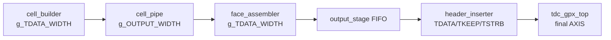
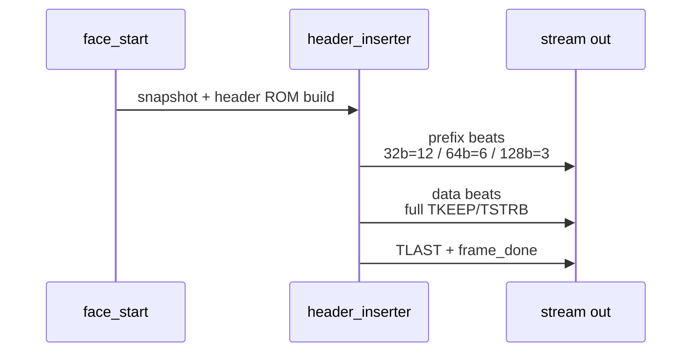

# C02 AXI4-Stream Width Standardization Phase A 보완 결과 v001

- 문서 생성/수정 시간(KST): 2026-05-01 00:21:08
- 대상 Cluster: C02_Chip_Acquisition
- 작업 Phase: Phase A - 최종 Output/Cell Stream 32/64/128-bit full-keep 지원
- 절대 기준: `Doc/TDC-GPX-Datasheet.pdf`
- 코드 기준: `tdc_gpx_top` 출력 AXI4-Stream 및 C02 이후 cell/output stream 계약

## 1. 판단 기준

이번 Phase A는 GPX IC의 물리 READ 타이밍을 변경하지 않는다. 따라서 Datasheet 직접 항목은 `Bus_Phy` READ cycle이 아니라, C01/C02에서 이미 확정한 “GPX IC에서 읽은 28-bit raw data가 downstream packet으로 손실 없이 전달되어야 한다”는 운용 계약이다.

AXI4-Stream 출력 폭 표준화의 직접 기준은 다음과 같다.

| 항목 | Phase A 판단 |
|---|---|
| 지원 폭 | 32 / 64 / 128 bit만 허용 |
| TKEEP/TSTRB | 최종 output stream의 모든 accepted beat에서 full-one |
| Partial keep | Phase A 제외. 256-bit 이상 또는 부분 beat는 Phase C 검토 |
| GPX read timing 영향 | 없음. C01 bus read timing 계약 유지 |
| Pipeline/II 영향 | 새 payload register 추가 없음. 기존 ready/valid pipeline 유지 |

## 2. 코드 반영 요약

### 2.1 최종 AXI4-Stream 포트 보완

최종 output stream에 `tkeep/tstrb`를 추가했다.

| 파일 | 근거 위치 | 반영 내용 |
|---|---:|---|
| `tdc_gpx_top.vhd` | line 147, 778 | rising `o_m_axis_tkeep/tstrb` 추가 및 output_stage 연결 |
| `tdc_gpx_top.vhd` | line 156, 786 | falling `o_m_axis_fall_tkeep/tstrb` 추가 및 output_stage 연결 |
| `tdc_gpx_output_stage.vhd` | line 98, 107, 434, 477 | header_inserter에서 전달되는 keep/strb를 top으로 전파 |
| `tdc_gpx_header_inserter.vhd` | line 128, 303 | `g_TDATA_WIDTH/8` 폭의 keep/strb 생성 |

### 2.2 폭 guard 추가

32/64/128 이외 폭은 elaboration 단계에서 failure로 차단한다.

| 파일 | 근거 위치 |
|---|---:|
| `tdc_gpx_top.vhd` | line 409 |
| `tdc_gpx_output_stage.vhd` | line 216 |
| `tdc_gpx_header_inserter.vhd` | line 291 |
| `tdc_gpx_cell_pipe.vhd` | line 145 |
| `tdc_gpx_cell_builder.vhd` | line 439 |
| `tdc_gpx_face_assembler.vhd` | line 332 |
| `tdc_gpx_face_seq.vhd` | line 186 |
| `tdc_gpx_csr_pipeline.vhd` | line 273 |

### 2.3 공통 helper 추가

`tdc_gpx_pkg.vhd`에 `fn_axis_keep_width(tdata_width)`를 추가했다. 기준은 byte lane 수이므로 `tdata_width / 8`이다.

## 3. 폭별 구조 비교

| TDATA width | TKEEP/TSTRB width | Header prefix beats | Max beats/cell | Phase A 상태 |
|---:|---:|---:|---:|---|
| 32 bit | 4 bit | 12 | 8 | 지원 |
| 64 bit | 8 bit | 6 | 4 | 지원 |
| 128 bit | 16 bit | 3 | 2 | 신규 지원 |

Header prefix는 항상 48 byte로 유지된다. 폭이 커질수록 beat 수만 줄어든다.

## 4. Latency / Throughput / Pipeline / II

| 분석 항목 | Phase A 영향 |
|---|---|
| Latency | `tkeep/tstrb`는 registered valid에서 파생되므로 payload latency 추가 없음 |
| Throughput | downstream ready가 유지되면 1 beat/clk 유지 |
| Pipeline | 기존 `cell_builder -> face_assembler -> FIFO -> header_inserter` 구조 유지 |
| II(Initiation Interval) | beat 단위 II=1 유지. 다만 동일 byte payload 기준 총 beat 수는 128-bit에서 감소 |
| Timing | 새 wide mux를 추가하지 않고 full keep 상수 생성만 추가 |

운용 관점에서는 “clock당 beat 처리율”은 동일하지만, 같은 byte payload를 보내는 데 필요한 beat 수가 줄어든다. 따라서 128-bit는 header와 cell payload의 stream 점유 시간이 줄어드는 방향이다.

## 5. 테스트 보강

새 테스트벤치 `tb_tdc_gpx_header_inserter_widths.vhd`를 추가했다.

검증 의도:

| 검증 | 근거 위치 |
|---|---:|
| 32/64/128 header_inserter 동시 인스턴스 | line 93, 131, 169 |
| 각 accepted beat의 full tkeep/tstrb 검사 | line 282, 298, 314 |
| 폭별 header prefix beat 수 검사 | line 353, 354, 355 |
| PASS report | line 361 |

기존 테스트벤치 보강:

| 파일 | 보강 내용 |
|---|---|
| `tb_tdc_gpx_downstream.vhd` | header output keep/strb full-one 검사 |
| `tb_tdc_gpx_output_stage.vhd` | `G_OUTPUT_WIDTH` generic화, accepted beat keep/strb 검사 |
| `tb_tdc_gpx_top_int.vhd` | top output keep/strb 검사 |
| `tb_tdc_gpx_full_int.vhd` | full integration output keep/strb 검사 |

## 6. 검증 결과와 한계

실행한 정적 검증:

- `git diff --check`: 공백 오류 없음. CRLF 변환 warning만 확인됨.
- 포트 연결 검색: `tdc_gpx_top`, `tdc_gpx_output_stage`, `tdc_gpx_header_inserter` 인스턴스의 신규 keep/strb 연결 확인.
- 잔여 문자열 검색: `32 or 64`, `32|64)` 등 과거 2폭 전용 설명 제거 확인.

미실행 항목:

- 현재 작업 환경 PATH에 `xvhdl`, `vivado`, `ghdl`이 없어 xsim은 실행하지 못했다.
- Vivado 프로젝트 스크립트는 `HDL/scripts`가 현재 writable root 밖이라 이번 코드 patch 범위에 포함하지 않았다. Vivado sim set에 `tb_tdc_gpx_header_inserter_widths.vhd`를 추가해서 실행해야 한다.

## 7. 다음 Phase 진입 판단

Phase A 코드 반영은 완료 상태로 판단한다. 다음 Phase는 raw/event 내부 stream 폭 상수화와, 필요 시 Vivado sim script에 신규 width matrix TB를 포함하는 단계로 진행하면 된다.
