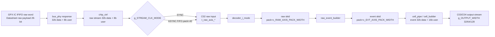

# C02 Chip Acquisition - AXI4-Stream Phase B 결과 v001

- 작성 시각: 2026-05-01 00:51:02 KST
- 수정 시각: 2026-05-01 00:51:02 KST
- 기준 문서: `Doc/TDC-GPX-Datasheet.pdf`
- 기준 코드: `tdc_gpx_pkg.vhd`, `tdc_gpx_bus_phy.vhd`, `tdc_gpx_chip_ctrl.vhd`, `tdc_gpx_config_ctrl.vhd`, `tdc_gpx_decode_pipe.vhd`, `tdc_gpx_cell_pipe.vhd`, `tdc_gpx_top.vhd`
- 목적: AXI4-Stream 출력 폭 64-bit 성공 이후, C01/C02 내부 raw/event/stop/fire 경계의 폭 계약을 명시 상수와 타입으로 분리한다.

## 1. 판단 요약

Phase B는 기능 변경이 아니라 폭 계약 정리이다. 출력 스트림은 계속 `g_OUTPUT_WIDTH = 32/64/128`로 확장 가능하고, GPX IC에서 읽어 온 raw/event 내부 경계는 Datasheet 기반 28-bit raw word를 32-bit AXIS beat로 정렬하는 기존 구조를 유지한다.

핵심 보완은 다음과 같다.

| 경계 | Phase B 계약 | 적용 근거 |
|---|---:|---|
| bus response mirror | `tdata=32`, `tuser=8`, `tkeep=4`, pack=40 | `tdc_gpx_pkg.vhd:80`, `tdc_gpx_bus_phy.vhd:146`, `tdc_gpx_chip_ctrl.vhd:617` |
| raw IFIFO stream | `tdata=32`, `tuser=8`, pack=40 | `tdc_gpx_pkg.vhd:86`, `tdc_gpx_decode_pipe.vhd:104`, `tdc_gpx_config_ctrl.vhd:1852` |
| decoded event stream | `tdata=32`, `tuser=16`, pack=48 | `tdc_gpx_pkg.vhd:91`, `tdc_gpx_decode_pipe.vhd:142`, `tdc_gpx_cell_pipe.vhd:30` |
| stop event stream | `tdata=32`, `tuser=32` 기본값이지만 generic 분리 | `tdc_gpx_pkg.vhd:97`, `tdc_gpx_top.vhd:46`, `tdc_gpx_config_ctrl.vhd:69`, `tdc_gpx_stop_cfg_decode.vhd:80` |
| fire count stream | `tdata=32`, `tkeep=4` 기본 계약 명시 | `tdc_gpx_pkg.vhd:99` |

## 2. 코드 반영 내용

### 2.1 폭 계약 상수와 타입

`tdc_gpx_pkg.vhd`에 AXI4-Stream boundary width constants를 추가했다.

- `c_BUS_RSP_*`: bus_phy to chip_ctrl response mirror
- `c_RAW_AXIS_*`: chip_ctrl to decoder_i_mode raw stream
- `c_EVT_AXIS_*`: raw_event_builder to cell_pipe event stream
- `c_STOP_EVT_TUSER_WIDTH`: stop event `tuser`를 `tdata`와 분리
- `t_bus_rsp_*`, `t_raw_axis_*`, `t_evt_axis_*` subtype 및 per-chip array type

추적 위치:

- `tdc_gpx_pkg.vhd:73`
- `tdc_gpx_pkg.vhd:193`
- `tdc_gpx_pkg.vhd:202`

### 2.2 C01 to C02 raw 경계

`tdc_gpx_config_ctrl.vhd`의 raw output과 raw CDC FIFO 폭을 `c_RAW_AXIS_PACK_WIDTH` 기준으로 바꿨다. 따라서 SYNC/ASYNC 모드 모두 raw stream payload 계약이 같은 상수를 기준으로 유지된다.

추적 위치:

- `tdc_gpx_config_ctrl.vhd:184`
- `tdc_gpx_config_ctrl.vhd:973`
- `tdc_gpx_config_ctrl.vhd:1852`
- `tdc_gpx_config_ctrl.vhd:1865`

### 2.3 C02 decode/event 경계

`tdc_gpx_decode_pipe.vhd`는 raw skid 40-bit와 event skid 48-bit를 직접 숫자로 쓰지 않고, 각각 `c_RAW_AXIS_PACK_WIDTH`, `c_EVT_AXIS_PACK_WIDTH`를 사용하도록 변경했다.

추적 위치:

- `tdc_gpx_decode_pipe.vhd:26`
- `tdc_gpx_decode_pipe.vhd:104`
- `tdc_gpx_decode_pipe.vhd:142`
- `tdc_gpx_decode_pipe.vhd:153`

### 2.4 stop event tuser 분리

`g_STOP_EVT_TUSER_WIDTH`를 `tdc_gpx_top -> tdc_gpx_config_ctrl -> tdc_gpx_stop_cfg_decode`로 전달하도록 추가했다. 현재 기본값은 32-bit라 동작은 기존과 동일하지만, 이후 stop event `tdata`와 `tuser`를 독립 확장할 수 있다.

`stop_cfg_decode`에는 다음 방어 assert도 추가했다.

- `g_STOP_EVT_DWIDTH >= c_N_CHIPS * 8`
- `g_STOP_EVT_TUSER_WIDTH >= c_N_CHIPS * 8`

추적 위치:

- `tdc_gpx_top.vhd:46`
- `tdc_gpx_top.vhd:481`
- `tdc_gpx_config_ctrl.vhd:69`
- `tdc_gpx_config_ctrl.vhd:1112`
- `tdc_gpx_stop_cfg_decode.vhd:204`

## 3. 데이터 흐름도

## 4. Timing / Latency / Throughput / Pipeline / II

Phase B는 폭 이름과 타입 경계를 명시한 작업이므로 datapath register stage를 추가하지 않았다.

| 항목 | 영향 |
|---|---|
| Latency | 변화 없음. 신규 FF, FIFO depth, state wait 추가 없음 |
| Throughput | 변화 없음. raw/event pack width는 기존 40/48-bit와 동일 |
| Pipeline | 구조 변화 없음. 기존 `bus_phy -> chip_ctrl -> raw CDC/skid -> decode -> event -> cell` 유지 |
| II(Initiation Interval) | 변화 없음. handshake 및 state transition 조건 변경 없음 |
| Timing 분석성 | 개선. magic width 제거로 C01/C02/C03 경계 추적이 쉬워짐 |

## 5. 검증 결과

Vivado xsim 기준 경로: `C:\AMDDesignTools\2025.2.1\Vivado`

| 검증 | 결과 | 핵심 로그 |
|---|---|---|
| `tb_tdc_gpx_decode_pipe_phaseb` | PASS | `ALL TESTS PASSED (5 checks)` |
| `tb_tdc_gpx_stop_cfg_phaseb` | PASS | `tb_tdc_gpx_stop_cfg_decode: ALL TESTS PASSED` |
| `tb_tdc_gpx_config_ctrl_phaseb` | PASS | `expected-count tuple CDC/top integration completed, data=16 ctrl=8` |
| `tb_tdc_gpx_cell_pipe_phaseb` | PASS | `Rising cell output appeared with valid tdata, tlast, and faulted tuser` |
| `tb_tdc_gpx_top_int_phaseb64` | PASS | 64-bit integrated sim, rising `beats=60/tlast=2`, falling `beats=60/tlast=2` |

## 6. 다음 Phase 판단

Phase B 기준으로 64-bit 출력 성공을 깨지 않고 raw/event/stop/fire stream의 폭 계약이 분리되었다. 다음 Phase는 Phase C로 넘어갈 수 있다.

다만 Phase C가 256-bit 이상 또는 partial `tkeep`까지 포함한다면, 현재 Phase A에서 정한 full-keep 32/64/128 제한을 먼저 재검토해야 한다.

