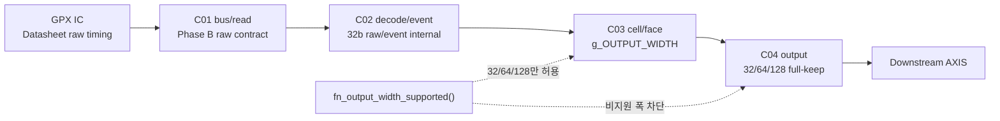
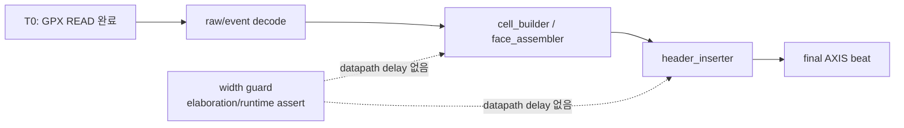

# C02 Chip Acquisition - AXI4-Stream Phase C 계약 종료 v001

- 작성 시각: 2026-05-01 01:02:57 KST
- 수정 시각: 2026-05-01 01:02:57 KST
- 기준 문서: `Doc/TDC-GPX-Datasheet.pdf`
- 사용자 지시: 다음 Phase 진행. 단, 256-bit는 반영하지 않음.
- 목적: Phase A/B에서 정리한 AXI4-Stream 폭 표준화를 32/64/128-bit full-keep 계약으로 닫고, 비지원 폭이 설계에 섞이지 않도록 중앙 guard를 추가한다.

## 1. 결론

이번 Phase C에서는 256-bit 확장이나 partial `tkeep` 설계를 구현하지 않았다. 대신 공식 지원 폭을 32/64/128-bit로 고정하고, 그 정책을 패키지 함수 `fn_output_width_supported()`로 중앙화했다.

따라서 다음 계약이 성립한다.

| 항목 | Phase C 계약 |
|---|---|
| 공식 output stream 폭 | 32, 64, 128-bit |
| `tkeep/tstrb` 정책 | 모든 output beat full-keep/full-strb |
| 비지원 폭 | helper 함수와 각 모듈 assert에서 차단 |
| GPX READ / raw/event 경계 | Phase B 계약 유지 |
| Latency / Throughput / Pipeline / II | 기존 지원 폭에서 변화 없음 |

## 2. 코드 보완 내용

### 2.1 지원 폭 판단 함수 중앙화

`tdc_gpx_pkg.vhd`에 `fn_output_width_supported(tdata_width)`를 추가했다.

추적 근거:

- `tdc_gpx_pkg.vhd:62`: 함수 선언
- `tdc_gpx_pkg.vhd:744`: 함수 구현

지원 조건은 다음과 같다.

```vhdl
return (tdata_width = 32) or (tdata_width = 64) or (tdata_width = 128);
```

### 2.2 helper 함수 방어 assert

아래 산술 helper는 output width가 잘못 들어오면 즉시 failure를 발생시킨다.

- `fn_slots_per_beat`
- `fn_hit_data_beats`
- `fn_meta_beat_idx`
- `fn_beats_per_cell`
- `fn_hdr_prefix_beats`
- `fn_axis_keep_width`
- `fn_beats_per_cell_rt`

추적 근거:

- `tdc_gpx_pkg.vhd:751`
- `tdc_gpx_pkg.vhd:759`
- `tdc_gpx_pkg.vhd:767`
- `tdc_gpx_pkg.vhd:775`
- `tdc_gpx_pkg.vhd:783`
- `tdc_gpx_pkg.vhd:791`
- `tdc_gpx_pkg.vhd:806`

### 2.3 모듈별 guard 통일

각 모듈에 흩어져 있던 `(width=32) or (width=64) or (width=128)` 조건을 모두 `fn_output_width_supported()` 호출로 바꿨다.

| 모듈 | 근거 |
|---|---|
| `tdc_gpx_top` | `tdc_gpx_top.vhd:409` |
| `tdc_gpx_output_stage` | `tdc_gpx_output_stage.vhd:216` |
| `tdc_gpx_header_inserter` | `tdc_gpx_header_inserter.vhd:290` |
| `tdc_gpx_cell_builder` | `tdc_gpx_cell_builder.vhd:438` |
| `tdc_gpx_cell_pipe` | `tdc_gpx_cell_pipe.vhd:144` |
| `tdc_gpx_face_assembler` | `tdc_gpx_face_assembler.vhd:331` |
| `tdc_gpx_face_seq` | `tdc_gpx_face_seq.vhd:185` |
| `tdc_gpx_csr_pipeline` | `tdc_gpx_csr_pipeline.vhd:272` |

## 3. 데이터 흐름 계약



중요한 점은 Datasheet 기준 GPX read timing과 raw/event 해석은 그대로 유지되고, output stream의 폭 정책만 계약으로 닫혔다는 것이다.

## 4. Timing / Latency / Throughput / Pipeline / II

Phase C는 계산 함수와 assert를 정리한 guard 작업이므로 datapath register, FIFO depth, state wait, handshake 조건을 바꾸지 않았다.

| 항목 | 영향 |
|---|---|
| Latency | 변화 없음. 신규 pipeline stage 없음 |
| Throughput | 변화 없음. 32/64/128-bit full-keep 기준 유지 |
| Pipeline | 변화 없음. C01/C02/C03/C04 구조 유지 |
| II | 변화 없음. AXIS beat 기준 II=1 조건 유지 |
| Timing 분석성 | 개선. 지원 폭 판단 위치가 패키지 함수로 단일화됨 |

### Timing Block



## 5. 검증 결과

Vivado xsim 기준 경로: `C:\AMDDesignTools\2025.2.1\Vivado`

| 검증 | 결과 | 핵심 로그 |
|---|---|---|
| 전체 compile | PASS | `tdc_gpx_top`, `tb_tdc_gpx_top_int`까지 분석 완료 |
| `tb_tdc_gpx_header_widths_phasec` | PASS | `tb_tdc_gpx_header_inserter_widths PASS` |
| `tb_tdc_gpx_output_stage_phasec` | PASS | Scenario 1/2 PASS |
| `tb_tdc_gpx_top_int_phasec64` | PASS | rising/falling 각 `beats=60`, `tlast_cnt=2` |

추가 검증:

- `tb_tdc_gpx_header_inserter_widths.vhd:344`: 32-bit 지원 확인
- `tb_tdc_gpx_header_inserter_widths.vhd:345`: 64-bit 지원 확인
- `tb_tdc_gpx_header_inserter_widths.vhd:346`: 128-bit 지원 확인
- `tb_tdc_gpx_header_inserter_widths.vhd:347`: 256-bit 미지원 정책 확인

## 6. 다음 판단

AXI4-Stream 폭 표준화는 32/64/128-bit full-keep 범위에서 닫혔다. 다음 단계에서는 C02의 기능적 데이터 경계, 특히 GPX read 결과가 cell/output으로 넘어가는 의미 정보와 downstream 소비 계약을 기준으로 넘어가면 된다.

