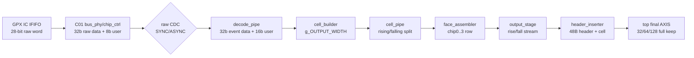
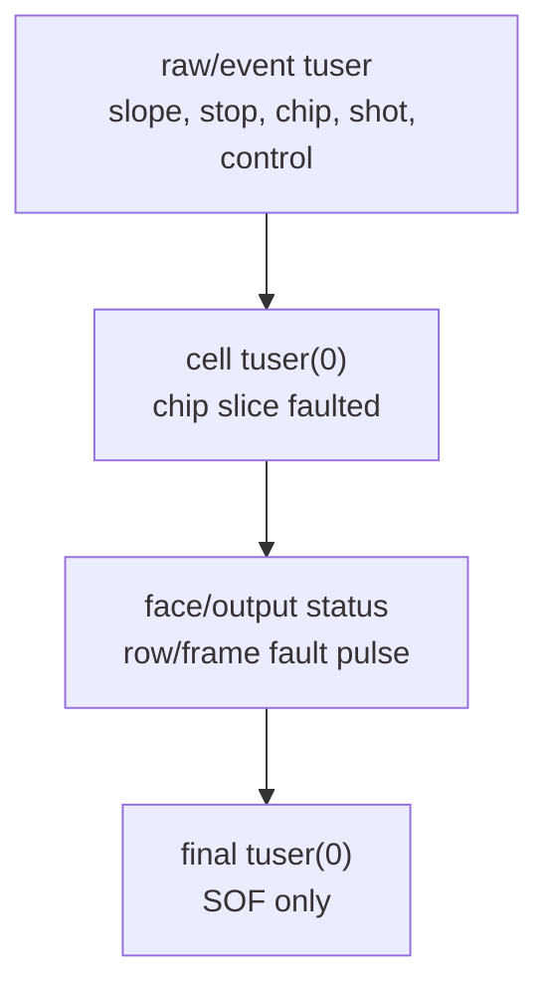
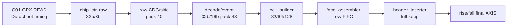

# C02 Chip Acquisition Data Flow Review v002

- Cluster: `C02_Chip_Acquisition`
- 문서 목적: C02 데이터 플로우를 32/64/128-bit AXI4-Stream 출력 폭 기준으로 다시 검토한다. v001의 raw/data/control 의미 추적을 유지하면서, Phase A/B/C 보완 이후의 폭별 데이터 흐름, beat 수, tkeep/tstrb 계약, 남은 검증 경계를 명확히 분리한다.
- 작성 시간: `2026-05-01 01:13:13 +09:00`
- 최종 수정 시간: `2026-05-01 01:13:13 +09:00`
- 절대 기준: `Doc/TDC-GPX-Datasheet.pdf`
- 코드 기준: `tdc_gpx_pkg.vhd`, `tdc_gpx_top.vhd`, `tdc_gpx_config_ctrl.vhd`, `tdc_gpx_chip_ctrl.vhd`, `tdc_gpx_decode_pipe.vhd`, `tdc_gpx_cell_builder.vhd`, `tdc_gpx_face_assembler.vhd`, `tdc_gpx_output_stage.vhd`, `tdc_gpx_header_inserter.vhd`
- v001 반영 이력: `C02_Chip_Acquisition_260430234442_Data_Flow_Review_v001.md`의 데이터 의미 추적을 유지하고, 32/64/128-bit 폭 표준화 이후의 출력 경로 판단을 본 v002의 `3~8장`에 반영했다.

---

## 1. 결론

현재 C02 데이터 플로우는 32/64/128-bit 출력 폭에 대해 논리적으로 같은 데이터를 전달한다. 그리고 넓은 bus는 빨라지는 것이 맞다. 다만 빨라지는 위치는 **GPX READ/raw/event 수집 구간이 아니라 `cell_builder` 이후 output serialization 및 downstream transfer 구간**이다.

따라서 판단은 다음처럼 나누어야 한다.

- 32 -> 64 -> 128-bit로 넓어지면 같은 byte payload를 내보내는 beat 수가 줄어들고, output byte throughput은 증가한다.
- GPX IC에서 raw word를 읽는 속도와 raw/event 내부 의미는 그대로 유지된다.
- end-to-end frame 완료 시간이 실제로 얼마나 줄어드는지는 `GPX READ 병목`, `expected-count drain`, `face assembly`, `downstream ready` 중 어느 구간이 병목인지에 따라 결정된다.

핵심 판단은 다음과 같다.

| 항목 | 판단 |
|---|---|
| GPX READ 및 raw/event 해석 | 출력 폭과 독립. GPX 28-bit raw word를 내부 32-bit raw/event stream으로 운반한다. |
| 출력 폭 지원 범위 | 32/64/128-bit만 공식 지원. 256-bit는 사용자 지시에 따라 미반영이며 guard에서 차단한다. |
| `tkeep/tstrb` | 최종 출력 valid beat에서는 full-one, invalid 구간에서는 zero. partial keep 설계는 없다. |
| header 정렬 | 48 byte header는 32/64/128-bit에서 각각 12/6/3 beat로 정수 정렬된다. |
| cell 정렬 | static cell envelope는 32 byte이고, 32/64/128-bit에서 8/4/2 beat이다. 다만 실제 emit beat는 `max_hits_cfg`에 따라 더 짧아질 수 있으므로 문서/검증에서 구분해야 한다. |
| 속도 효과 | output serialize 구간은 폭에 비례해 빨라진다. 64-bit는 32-bit 대비 byte/beat 2배, 128-bit는 4배이다. |
| 검증 상태 | 64-bit top integrated xsim PASS 근거가 있고, header width TB는 32/64/128 지원과 256 미지원 guard를 확인한다. 32/128 top integrated 전체 시뮬레이션은 별도 close 항목으로 남긴다. |

---

## 2. 기준 데이터 플로우

폭 변경의 경계는 `cell_builder` 이후이다.

| 구간 | 폭 계약 | 폭 변경 영향 |
|---|---:|---|
| GPX IC -> C01 bus read | GPX raw 28-bit | 없음. 데이터시트 READ timing과 raw word 의미가 기준이다. |
| bus response / raw stream | `tdata=32`, `tuser=8`, `pack=40` | 없음. 출력 폭과 독립이다. |
| decoded event stream | `tdata=32`, `tuser=16`, `pack=48` | 없음. hit/slope/stop/chip/shot tag 의미 유지. |
| cell/face/output/header | `g_OUTPUT_WIDTH=32/64/128` | beat 수가 줄고, byte throughput이 증가하며, output serialization 시간이 감소한다. |
| final top output | `tdata=g_OUTPUT_WIDTH`, `tkeep/tstrb=g_OUTPUT_WIDTH/8`, `tuser=1` | downstream이 직접 받는 표준 AXI4-Stream 폭이다. |

근거:

- `tdc_gpx_pkg.vhd:81-101`: bus/raw/event/stop/fire stream 폭 상수화
- `tdc_gpx_top.vhd:36`: `g_OUTPUT_WIDTH` 공식 출력 폭 generic
- `tdc_gpx_top.vhd:147-158`: rising/falling final AXIS `tdata/tkeep/tstrb`
- `tdc_gpx_pkg.vhd:744-747`: 32/64/128만 지원하는 `fn_output_width_supported()`

---

## 3. 폭별 구조 비교

### 3.1 AXI beat 및 keep/strb

| `g_OUTPUT_WIDTH` | Byte/beat | `tkeep/tstrb` width | 공식 지원 | partial keep 필요 여부 |
|---:|---:|---:|---|---|
| 32 bit | 4 byte | 4 bit | 지원 | 없음 |
| 64 bit | 8 byte | 8 bit | 지원 | 없음 |
| 128 bit | 16 byte | 16 bit | 지원 | 없음 |
| 256 bit | 32 byte | 32 bit | 미지원 | header 48 byte가 정수 beat가 아니므로 partial keep 설계 필요 |

`tkeep/tstrb`는 최종 출력에서 valid beat마다 full-one으로 나온다. 즉 현재 설계는 "모든 출력 beat가 완전한 byte lane을 가진다"는 계약으로 닫혀 있다.

근거:

- `tdc_gpx_pkg.vhd:789-795`: `fn_axis_keep_width(tdata_width) = tdata_width / 8`
- `tdc_gpx_header_inserter.vhd:298-304`: valid일 때 keep/strb full-one, invalid일 때 zero
- `tdc_gpx_header_inserter.vhd:290-295`: 지원 폭 및 byte lane guard

### 3.2 Header prefix

Header prefix는 48 byte 고정이다.

| `g_OUTPUT_WIDTH` | Header byte | Header beat 수 | 정렬 판단 |
|---:|---:|---:|---|
| 32 bit | 48 | 12 | 정수 정렬 |
| 64 bit | 48 | 6 | 정수 정렬 |
| 128 bit | 48 | 3 | 정수 정렬 |

근거:

- `tdc_gpx_pkg.vhd:183-184`: `c_HDR_PREFIX_BYTES=48`, 기본 32-bit 기준 12 beat
- `tdc_gpx_pkg.vhd:781-786`: generic 폭별 header beat 계산
- `tdc_gpx_header_inserter.vhd:471-484`: 32-bit word ROM을 32/64/128-bit beat로 packing

### 3.3 Cell payload

Cell의 의미 단위는 stop별 dense cell이다. 현재 cell payload의 원천은 7개 hit slot과 metadata이다.

| 항목 | 값 | 근거 |
|---|---:|---|
| chip 수 | 4 | `tdc_gpx_pkg.vhd:45` |
| stop/chip 최대 수 | 8 | `tdc_gpx_pkg.vhd:46` |
| hit/stop 최대 수 | 7 | `tdc_gpx_pkg.vhd:47` |
| hit slot 폭 | 16 bit | `tdc_gpx_pkg.vhd:48` |
| static cell envelope | 32 byte | `tdc_gpx_pkg.vhd:652-654` |

Static envelope 기준 beat 수:

| `g_OUTPUT_WIDTH` | Static cell envelope | Static beats/cell |
|---:|---:|---:|
| 32 bit | 32 byte | 8 |
| 64 bit | 32 byte | 4 |
| 128 bit | 32 byte | 2 |

Runtime emit 기준 beat 수는 `i_max_hits_cfg`에 따라 달라진다. 현재 `cell_builder`는 output 시작 시 `fn_beats_per_cell_rt(max_hits, g_TDATA_WIDTH)`로 `s_rt_last_beat_r`를 latch하고, 마지막 beat에 metadata를 배치한다.

| `max_hits_cfg` | 32-bit emit beats | 64-bit emit beats | 128-bit emit beats |
|---:|---:|---:|---:|
| 1 | 2 | 2 | 2 |
| 2 | 2 | 2 | 2 |
| 3 | 3 | 2 | 2 |
| 4 | 3 | 2 | 2 |
| 5 | 4 | 3 | 2 |
| 6 | 4 | 3 | 2 |
| 7 또는 0 alias | 5 | 3 | 2 |

주의할 점:

- `fn_beats_per_cell()`은 32-byte static envelope 기준이다.
- `fn_beats_per_cell_rt()`는 runtime `max_hits_cfg` 기준으로 실제 emit beat 수를 줄일 수 있다.
- 따라서 문서와 검증에서 `cell capacity`, `serializer emit beats`, `row/frame final beats`를 같은 말처럼 쓰면 안 된다.

근거:

- `tdc_gpx_cell_builder.vhd:317-326`: generic-derived beat layout 및 runtime last beat register
- `tdc_gpx_cell_builder.vhd:935-944`: `i_max_hits_cfg`별 runtime beat 수 latch
- `tdc_gpx_cell_builder.vhd:393-426`: `fn_cell_beat()`가 hit-data beat와 마지막 metadata beat를 생성
- `tdc_gpx_pkg.vhd:803-821`: `fn_beats_per_cell_rt()`

---

## 4. 폭별 데이터 의미 보존

폭이 바뀌어도 보존되어야 하는 데이터 의미는 다음과 같다.

| 정보 | 생성/보존 위치 | downstream 판단 |
|---|---|---|
| raw hit | decoder/event에서 `tdata[16:0]`, cell hit slot에 저장 | 현재 cell slot은 16-bit이므로 GPX raw hit 17-bit 전체가 필요한 경우 후속 format 확장 필요 |
| slope | event `tuser[0]`, 이후 rising/falling stream 분리 | 최종 stream 자체가 rising/falling으로 나뉘므로 final `tuser`로 slope를 다시 판단하지 않는다. |
| chip id | raw_event tag 및 cell metadata | face row에서 chip0..3 순서 조립 |
| stop id | raw_event stop tag, cell row 내 stop 순서 | IFIFO1/2를 통해 stop0..7 구성 |
| shot ownership | fire-count/expected-count match, event shot_seq lower bits | 데이터가 어느 shot에 속하는지 결정하는 제어 계약 |
| fault/degraded | cell metadata, row/frame fault pulse, CSR/status | final `tuser(0)`는 fault가 아니라 SOF |
| frame/line boundary | header_inserter final `tuser(0)=SOF`, `tlast=EOL` | downstream은 VDMA-style stream으로 파싱 |

특히 final stream의 `tuser(0)` 의미는 중간 stream의 `tuser`와 다르다.

근거:

- `tdc_gpx_pkg.vhd:92-94`: event stream `tdata=32`, `tuser=16`
- `tdc_gpx_cell_builder.vhd:948-961`: chip slice 마지막 beat에서 faulted `tuser(0)` 설정
- `tdc_gpx_header_inserter.vhd:493-498`: final stream `tuser`는 첫 line 첫 beat의 SOF

---

## 5. 폭별 throughput / latency / pipeline / II

### 5.1 Throughput

AXI ready가 유지되고 `i_axis_aclk` nominal 150 MHz 기준이면, beat II=1일 때 이론적 byte throughput은 다음과 같다.

| `g_OUTPUT_WIDTH` | Byte/beat | Beat II | 150 MHz 기준 byte throughput |
|---:|---:|---:|---:|
| 32 bit | 4 | 1 clk | 600 MB/s |
| 64 bit | 8 | 1 clk | 1.2 GB/s |
| 128 bit | 16 | 1 clk | 2.4 GB/s |

이 값은 output stream serializer 기준 이론값이다. 64-bit는 32-bit 대비 2배, 128-bit는 32-bit 대비 4배의 output byte throughput을 가진다.

다만 전체 시스템 throughput은 여전히 GPX READ timing, expected-count drain, face assembly, downstream ready에 의해 제한될 수 있다. 즉 "넓은 bus가 빠르다"는 판단은 맞지만, 그 효과는 output 구간에서 먼저 발생하며 전체 frame 완료 시간은 병목 위치를 함께 봐야 한다.

폭별 output 구간 speed-up:

| 비교 | Byte/beat speed-up | Header beat 감소 | Static cell beat 감소 | max_hits=7 runtime cell beat 감소 |
|---|---:|---:|---:|---:|
| 64-bit vs 32-bit | 2.0x | 12 -> 6, 50% 감소 | 8 -> 4, 50% 감소 | 5 -> 3, 40% 감소 |
| 128-bit vs 32-bit | 4.0x | 12 -> 3, 75% 감소 | 8 -> 2, 75% 감소 | 5 -> 2, 60% 감소 |

구간별 속도 영향:

| 구간 | 32/64/128 폭 변경 효과 | 판단 |
|---|---|---|
| GPX READ | 없음 | 데이터시트 READ timing과 C01 bus period 계약이 결정 |
| raw/event decode | 없음 | 내부 32-bit raw/event 계약 유지 |
| cell serialization | 있음 | 같은 cell을 더 적은 beat로 내보냄 |
| header insertion | 있음 | 48-byte header가 12/6/3 beat로 감소 |
| final AXIS transfer | 있음 | 같은 clock에서 byte/beat가 4/8/16으로 증가 |

근거:

- `tdc_gpx_top.vhd:20`: `i_axis_aclk` nominal 150 MHz 주석
- `tdc_gpx_top.vhd:51-57`: AXI-stream domain과 GPX control clock domain 분리
- `tdc_gpx_top.vhd:42`: `g_STREAM_CLK_MODE`가 `ASYNC`/`SYNC` 구조를 결정

### 5.2 Latency

폭 변경 자체는 새 CDC/FIFO/state wait를 추가하지 않는다. 따라서 같은 데이터가 output serializer에 도착한 뒤 downstream으로 나가는 latency는 beat 수 감소에 의해 짧아지는 방향이다.

| 구간 | 32-bit | 64-bit | 128-bit | 판단 |
|---|---:|---:|---:|---|
| Header prefix | 12 beats | 6 beats | 3 beats | 폭 증가에 따라 감소 |
| Static cell envelope | 8 beats/cell | 4 beats/cell | 2 beats/cell | 폭 증가에 따라 감소 |
| Runtime max_hits=7 cell emit | 5 beats/cell | 3 beats/cell | 2 beats/cell | runtime config에 따라 감소 |

### 5.3 Pipeline

폭 변경이 직접 영향을 주는 stage는 `P4~P7`이다. `P0~P3`는 GPX raw/event 의미를 보존하는 고정 폭 구간이다.

### 5.4 II(Initiation Interval)

| 항목 | 판단 |
|---|---|
| AXI beat II | ready가 유지되면 1 clock 유지 |
| GPX READ II | 출력 폭과 무관. C01/C02 GPX bus timing 계약이 상위 병목 |
| cell emit II | beat 단위 II=1. 단, cell boundary마다 `ST_O_LOAD` 1-clock bubble이 존재한다. |
| row/frame II | face_assembler/output/header의 row/frame 완료 조건과 downstream ready에 의존 |

근거:

- `tdc_gpx_cell_builder.vhd:948-961`: `ST_O_LOAD`에서 beat mux 후 `ST_O_ACTIVE` 진입
- `tdc_gpx_cell_builder.vhd:963-1011`: accepted beat마다 다음 beat 또는 다음 cell로 진행
- `tdc_gpx_face_assembler.vhd:345-413`: input FIFO와 2-depth elastic FIFO boundary
- `tdc_gpx_output_stage.vhd:412-478`: rising/falling header_inserter 연결

---

## 6. 폭별 downstream 파싱 관점

downstream은 다음 순서로 파싱해야 한다.

1. Rising stream과 falling stream을 별개 AXI4-Stream으로 본다.
2. `tuser(0)=1`인 첫 beat를 SOF로 본다.
3. `tlast=1`을 line end로 본다.
4. 첫 line의 앞 48 byte를 header로 파싱한다.
5. 이후 cell payload는 `g_OUTPUT_WIDTH`에 따라 beat 수가 달라질 수 있음을 반영한다.
6. fault/degraded 판단은 final `tuser`가 아니라 cell metadata, row/frame fault pulse, CSR/status와 함께 본다.

폭별 header 위치:

| `g_OUTPUT_WIDTH` | Header beat index | Data 시작 beat |
|---:|---|---:|
| 32 bit | 0..11 | 12 |
| 64 bit | 0..5 | 6 |
| 128 bit | 0..2 | 3 |

---

## 7. 검증 근거와 남은 검증 경계

현재 확인된 근거:

| 항목 | 근거 | 상태 |
|---|---|---|
| 32/64/128 지원 guard | `tdc_gpx_pkg.vhd:744-747`, `tb_tdc_gpx_header_inserter_widths.vhd:344-347` | 코드/TB 기준 확인 |
| header width 32/64/128 instance | `tb_tdc_gpx_header_inserter_widths.vhd:92-169` | TB 기준 확인 |
| final keep/strb full-one | `tb_tdc_gpx_header_inserter_widths.vhd:282-315`, `tdc_gpx_header_inserter.vhd:303-304` | TB/RTL 기준 확인 |
| 64-bit top integrated | `xsim.log` 마지막 실행: `rising beats=60`, `falling beats=60`, `tlast_cnt=2`, PASS note | xsim 기준 확인 |
| Phase C contract close | `C02_Chip_Acquisition_260501010257_AXI4_Stream_PhaseC_Contract_Close_v001.md` | 문서 기준 확인 |

남은 검증 경계:

| ID | 남은 항목 | 이유 |
|---|---|---|
| DF-C02-W-01 | 32-bit top integrated xsim 재실행 | header width TB는 있지만 full top 흐름 32-bit 최신 로그를 별도 close하면 좋다. |
| DF-C02-W-02 | 128-bit top integrated xsim 재실행 | 128-bit header/cell 폭은 지원되지만 full top 흐름 로그를 별도 close하면 좋다. |
| DF-C02-W-03 | runtime `max_hits_cfg`별 final beat 수 matrix | static envelope와 runtime emit beat 수가 다르므로, downstream parser 계약을 확정하려면 max_hits별 row beat 수를 계측해야 한다. |
| DF-C02-W-04 | GPX raw hit 17-bit 전체 보존 여부 | 현재 cell slot은 16-bit이다. 다음 Cluster가 17-bit hit 전체를 요구하면 cell format 확장이 필요하다. |

---

## 8. v002 판단

32/64/128-bit 폭에 대한 데이터 플로우는 다음 조건에서 다음 단계로 넘길 수 있다.

- downstream은 `g_OUTPUT_WIDTH`를 알고 header beat 수를 12/6/3 중 하나로 해석한다.
- downstream은 `tkeep/tstrb`가 full-one인 full-beat stream으로만 받는다고 계약한다.
- downstream은 final `tuser(0)`를 fault가 아니라 SOF로 해석한다.
- fault/degraded 정보는 cell metadata, row/frame fault pulse, CSR/status 경로와 함께 추적한다.
- 256-bit와 partial `tkeep`는 현재 범위 밖으로 둔다.

단, 32/128-bit full top integrated xsim과 runtime `max_hits_cfg`별 final beat 수 matrix는 C02 width contract의 최종 검증 문서에서 닫는 것이 좋다.
