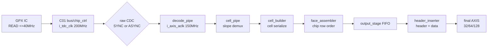
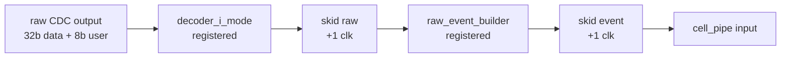
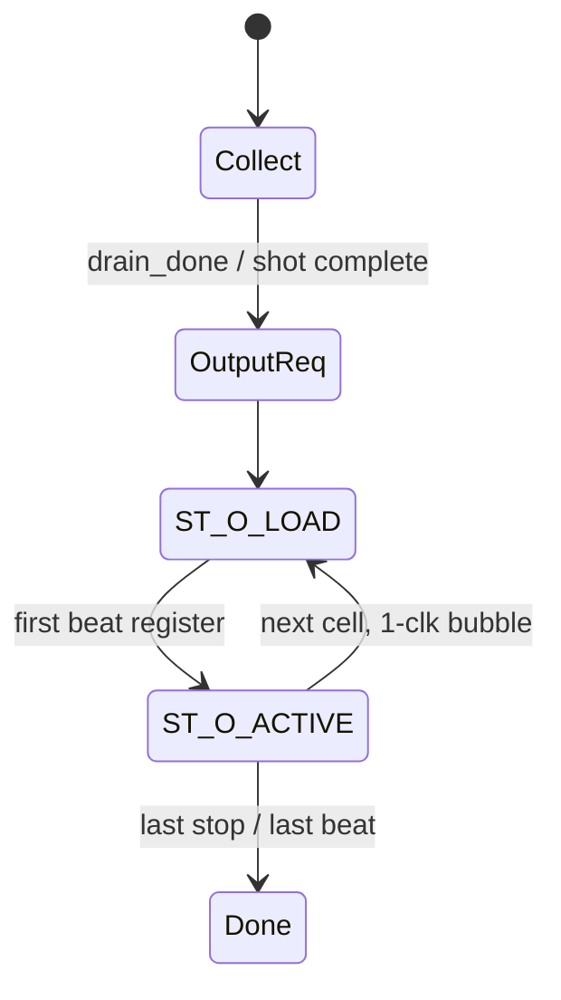
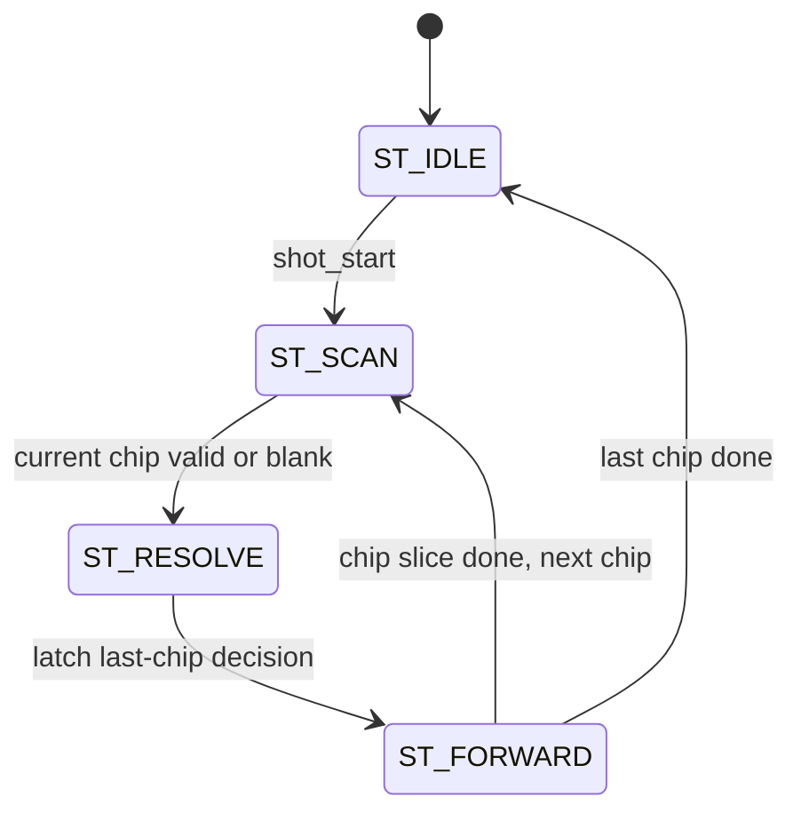
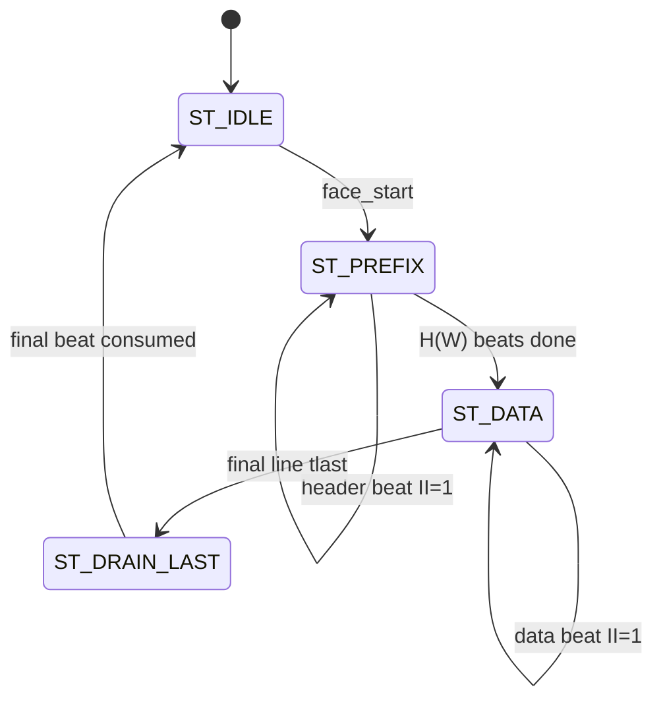
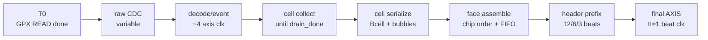

# C02 Chip Acquisition Timing / Pipeline / II Analysis v001

- Cluster: `C02_Chip_Acquisition`
- 문서 목적: 32/64/128-bit output width 변경이 Pipeline, Latency, Throughput, II(Initiation Interval)에 미치는 영향을 구간별로 분석한다.
- 작성 시간: `2026-05-01 01:24:35 +09:00`
- 최종 수정 시간: `2026-05-01 01:24:35 +09:00`
- 절대 기준: `Doc/TDC-GPX-Datasheet.pdf`
- 연계 문서: `C02_Chip_Acquisition_260501011313_Data_Flow_Review_v002.md`
- 코드 기준: `tdc_gpx_top.vhd`, `tdc_gpx_pkg.vhd`, `tdc_gpx_config_ctrl.vhd`, `tdc_gpx_decode_pipe.vhd`, `tdc_gpx_cell_pipe.vhd`, `tdc_gpx_cell_builder.vhd`, `tdc_gpx_face_assembler.vhd`, `tdc_gpx_output_stage.vhd`, `tdc_gpx_header_inserter.vhd`

---

## 1. 결론

넓은 bus는 빨라지는 것이 맞다. 단, 빨라지는 구간은 `GPX READ/raw/event 수집`이 아니라 `cell_builder 이후 output serialize 및 final AXIS 전송` 구간이다.

타이밍 판단은 다음 3개 층으로 분리해야 한다.

| 층 | 병목 후보 | 32/64/128 폭 영향 |
|---|---|---|
| GPX READ 공급 | GPX datasheet READ timing, C01 bus period | 영향 없음 |
| raw/event decode | 32-bit raw/event internal stream, skid, CDC | 의미/폭 영향 없음. II=1 처리 여유가 GPX READ보다 큼 |
| cell/output serialize | cell beat 수, header beat 수, downstream ready | 직접 빨라짐. 64/128-bit에서 beat 수 감소 |

즉 output 구간의 byte/beat capacity는 32->64에서 2배, 32->128에서 4배가 된다. 하지만 실제 line/frame latency 개선율은 `max_hits_cfg`, cell boundary bubble, face_assembler chip scheduler, downstream ready에 의해 2배/4배보다 낮아질 수 있다.

---

## 2. Clock Domain 및 Pipeline Stage



| Stage | Clock | 역할 | Width 영향 |
|---|---|---|---|
| GPX READ / chip_ctrl | `i_tdc_clk`, 현재 기준 200 MHz | GPX IFIFO raw word read, raw stream 생성 | 없음 |
| raw CDC | `i_tdc_clk -> i_axis_aclk` | 40-bit raw payload CDC | 없음 |
| decode_pipe | `i_axis_aclk`, nominal 150 MHz | raw decode, event tag, skid | 없음 |
| cell_pipe | `i_axis_aclk` | slope demux, registered tready | 없음 |
| cell_builder | `i_axis_aclk` | stop별 cell 생성 및 beat serialize | 있음 |
| face_assembler | `i_axis_aclk` | chip0..3 strict order row 구성 | 있음 |
| output_stage/header | `i_axis_aclk` | face FIFO, header prefix, final AXIS | 있음 |

근거:

- `tdc_gpx_top.vhd:20`: `i_axis_aclk` nominal 150 MHz
- `tdc_gpx_top.vhd:42`: `g_STREAM_CLK_MODE`
- `tdc_gpx_top.vhd:51-57`: `i_axis_aclk`, `i_tdc_clk`
- `tdc_gpx_config_ctrl.vhd:1846-1867`: ASYNC raw CDC FIFO
- `tdc_gpx_decode_pipe.vhd:101-155`: raw/event skid stages
- `tdc_gpx_cell_pipe.vhd:138-193`: registered tready slope demux
- `tdc_gpx_output_stage.vhd:320-405`: rising/falling face FIFO
- `tdc_gpx_header_inserter.vhd:459-530`: prefix/data FSM

---

## 3. 기본 수식

정의:

| Symbol | 의미 |
|---|---|
| `W` | final output width: 32, 64, 128 bit |
| `Bpb(W)` | byte per beat = `W/8` |
| `H(W)` | header prefix beats = `48 / Bpb(W)` |
| `S(W)` | hit slots per beat = `W / 16` |
| `Bcell(max_hits, W)` | runtime cell emit beats = `ceil(max_hits / S(W)) + 1 metadata beat` |
| `C` | active chip 수, 보통 4 |
| `N` | stops per chip, 보통 8 |

폭별 header:

| W | Byte/beat | Header beats `H(W)` |
|---:|---:|---:|
| 32 | 4 | 12 |
| 64 | 8 | 6 |
| 128 | 16 | 3 |

폭별 runtime cell emit beats:

| `max_hits_cfg` | 32-bit | 64-bit | 128-bit |
|---:|---:|---:|---:|
| 1 | 2 | 2 | 2 |
| 2 | 2 | 2 | 2 |
| 3 | 3 | 2 | 2 |
| 4 | 3 | 2 | 2 |
| 5 | 4 | 3 | 2 |
| 6 | 4 | 3 | 2 |
| 7 또는 0 alias | 5 | 3 | 2 |

한 line/slope의 final AXIS 전송 beat 수, 데이터가 이미 준비되어 있고 downstream ready가 계속 1이라고 가정:

```text
LineBeats(W) = H(W) + C * N * Bcell(max_hits, W)
```

`C=4`, `N=8` 기준:

| `max_hits_cfg` | 32-bit line beats | 64-bit line beats | 128-bit line beats |
|---:|---:|---:|---:|
| 1 | 76 | 70 | 67 |
| 3 | 108 | 70 | 67 |
| 5 | 140 | 102 | 67 |
| 7 | 172 | 102 | 67 |

해석:

- `max_hits_cfg`가 낮으면 cell이 최소 2 beat로 이미 짧기 때문에 64/128 폭 효과가 제한된다.
- `max_hits_cfg`가 높을수록 32-bit의 hit-data beat 수가 늘어나므로 64/128 효과가 커진다.
- 128-bit는 header가 3 beat로 줄고 cell도 대부분 2 beat로 수렴한다.

근거:

- `tdc_gpx_pkg.vhd:45-48`: 4 chip, 8 stop, 7 hit, 16-bit hit slot
- `tdc_gpx_pkg.vhd:183-184`: 48-byte header
- `tdc_gpx_pkg.vhd:744-795`: 32/64/128 지원 및 keep width
- `tdc_gpx_pkg.vhd:803-821`: runtime cell beat 계산
- `tdc_gpx_cell_builder.vhd:935-944`: `max_hits_cfg`별 runtime beat latch

---

## 4. Pipeline 분석

### 4.1 Raw/Event 구간

Raw/event 구간은 output width와 독립이다.



Pipeline 특징:

- `decoder_i_mode`는 registered output 구조이다.
- `tdc_gpx_skid_buffer`는 throughput 1 beat/cycle, latency +1 cycle로 명시되어 있다.
- `raw_event_builder`도 registered output 구조이다.
- 따라서 CDC 이후 raw beat가 decode/event pipeline을 통과하는 순수 처리 latency는 대략 `4 * i_axis_aclk`이다. ASYNC CDC latency는 XPM FIFO/clock phase에 따라 별도이며 width 변경과 무관하다.

근거:

- `tdc_gpx_decoder_i_mode.vhd:86-119`
- `tdc_gpx_decode_pipe.vhd:101-155`
- `tdc_gpx_raw_event_builder.vhd:124-170`
- `tdc_gpx_skid_buffer.vhd:6-13`

### 4.2 Cell Builder 구간

`cell_builder`는 collection과 output serialization을 분리한다.



Timing 특징:

- 한 cell 내부 beat는 ready 유지 시 II=1이다.
- cell과 cell 사이에는 `ST_O_LOAD`에 의한 1-clock bubble이 있다.
- 따라서 cell 단위 effective II는 `Bcell + 1`에 가깝다. 마지막 cell 뒤에는 다음 cell bubble이 없으므로 line 전체에서는 `(N - 1)`개의 cell-boundary bubble을 별도로 본다.

근거:

- `tdc_gpx_cell_builder.vhd:948-961`: `ST_O_LOAD`
- `tdc_gpx_cell_builder.vhd:963-1011`: `ST_O_ACTIVE`

### 4.3 Face Assembler 구간

`face_assembler`는 chip0 -> chip1 -> chip2 -> chip3 strict order로 row를 만든다.



Timing 특징:

- chip slice forwarding 중에는 output pipe가 비어 있거나 handshake되면 beat II=1이다.
- chip 전환에는 `ST_SCAN` + `ST_RESOLVE` scheduler overhead가 들어간다.
- input side에는 XPM FIFO와 `tdc_gpx_sync_fifo` elastic boundary가 있어 ready path를 닫는다.
- 따라서 row latency는 단순 `C*N*Bcell`보다 크며, chip switch overhead와 FIFO latency가 포함된다.

근거:

- `tdc_gpx_face_assembler.vhd:345-413`: input FIFO + elastic FIFO
- `tdc_gpx_face_assembler.vhd:515-532`: `s_can_produce`, `s_in_tready`
- `tdc_gpx_face_assembler.vhd:705-762`: `ST_SCAN`, `ST_RESOLVE`
- `tdc_gpx_face_assembler.vhd:769-889`: `ST_FORWARD`

### 4.4 Header Inserter / Final AXIS 구간



Timing 특징:

- first line은 face_start 후 header ROM build 1-clock defer가 있다.
- header prefix는 `H(W)` beats이며, output ready가 유지되면 II=1이다.
- data pass-through도 face FIFO valid와 downstream ready가 유지되면 II=1이다.
- final `frame_done`은 마지막 beat가 downstream에 소비된 뒤 발생한다.

근거:

- `tdc_gpx_header_inserter.vhd:315-326`: flow control
- `tdc_gpx_header_inserter.vhd:459-507`: prefix emit
- `tdc_gpx_header_inserter.vhd:514-530`: data pass-through
- `tdc_gpx_header_inserter.vhd:550-563`: last-beat drain 후 frame_done
- `tdc_gpx_header_inserter.vhd:636-702`: face_start latch 및 ROM build defer

---

## 5. II(Initiation Interval) 분석

| 구간 | II | 폭 영향 | 설명 |
|---|---:|---|---|
| GPX READ | >= 25 ns/read | 없음 | 데이터시트 40 MHz 이하 READ timing 계약이 상위 기준 |
| raw CDC write | raw beat 입력 속도 기준 | 없음 | GPX READ가 공급 병목 |
| decode_pipe | 1 `i_axis_aclk`/beat | 없음 | registered decode + skid, ready 유지 시 II=1 |
| cell_pipe demux | 1 `i_axis_aclk`/beat | 없음 | slope target ready 시 II=1, drain_done은 양쪽 slope ready 필요 |
| cell_builder cell 내부 | 1 `i_axis_aclk`/beat | 있음 | `Bcell`이 폭에 따라 감소 |
| cell_builder cell 간 | `Bcell + 1` 근사 | 있음 | `ST_O_LOAD` bubble 1 clock |
| face_assembler forwarding | 1 `i_axis_aclk`/beat | 있음 | beat 수 감소. chip switch overhead는 별도 |
| header_inserter prefix/data | 1 `i_axis_aclk`/beat | 있음 | header/data beat 수 감소 |
| final AXIS | 1 beat/clk | 있음 | byte/beat가 4/8/16으로 증가 |

중요 판단:

- "AXIS beat II=1"과 "cell 또는 line II"는 다르다.
- 넓은 bus는 beat II를 줄이는 것이 아니라, **같은 semantic payload를 더 적은 beat로 보냄으로써 cell/line/frame 완료 시간을 줄인다.**
- GPX READ II는 output width와 독립이다.

---

## 6. Latency 분석

### 6.1 구간별 latency 성격

| 구간 | Latency 성격 | 폭 영향 |
|---|---|---|
| GPX READ 완료까지 | expected-count, IFIFO fill, bus timing 의존 | 없음 |
| raw CDC | clock crossing, XPM FIFO phase 의존 | 없음 |
| raw/event decode | 대략 4 `i_axis_aclk` 처리 pipeline | 없음 |
| event collect -> cell output start | drain_done/shot boundary 의존 | 직접 영향 작음 |
| cell output start -> chip slice done | `N * Bcell + (N - 1)` 근사 | 큼 |
| row assembly | chip slice 수, chip scheduler overhead 의존 | 큼 |
| header + line output | `H(W) + data beats` | 큼 |

### 6.2 한 line 전송 latency 모델

데이터가 이미 face FIFO에 준비되어 있고 downstream ready가 계속 1이라고 가정하면:

```text
LineTransferCycles(W) = H(W) + C * N * Bcell(max_hits, W)
LineTransferTime = LineTransferCycles / F_axis
```

`F_axis=150 MHz`, `C=4`, `N=8` 기준:

| `max_hits_cfg` | Width | Line cycles | Line time |
|---:|---:|---:|---:|
| 7 | 32-bit | 172 | 1.147 us |
| 7 | 64-bit | 102 | 0.680 us |
| 7 | 128-bit | 67 | 0.447 us |
| 5 | 32-bit | 140 | 0.933 us |
| 5 | 64-bit | 102 | 0.680 us |
| 5 | 128-bit | 67 | 0.447 us |
| 3 | 32-bit | 108 | 0.720 us |
| 3 | 64-bit | 70 | 0.467 us |
| 3 | 128-bit | 67 | 0.447 us |
| 1 | 32-bit | 76 | 0.507 us |
| 1 | 64-bit | 70 | 0.467 us |
| 1 | 128-bit | 67 | 0.447 us |

해석:

- high-hit 조건에서는 128-bit가 32-bit 대비 line transfer cycle을 크게 줄인다.
- low-hit 조건에서는 cell이 이미 최소 2 beat이므로 64/128 개선 폭이 작다.
- 이 표는 final AXIS 전송 bound이다. live pipeline에서는 cell_builder cell-boundary bubble과 face_assembler chip switch overhead가 추가될 수 있다.

---

## 7. Throughput 분석

### 7.1 Final AXIS capacity

`i_axis_aclk=150 MHz`, downstream ready 유지 기준:

| Width | Byte/beat | Max beat rate | Wire throughput / stream |
|---:|---:|---:|---:|
| 32-bit | 4 | 150 Mbeat/s | 600 MB/s |
| 64-bit | 8 | 150 Mbeat/s | 1.2 GB/s |
| 128-bit | 16 | 150 Mbeat/s | 2.4 GB/s |

Rising/falling은 별도 AXI stream이므로, 두 stream이 동시에 활성이고 downstream도 각각 ready면 외부 전송 capacity는 stream당 capacity의 합으로 본다.

### 7.2 Semantic payload 관점

Final AXIS는 full-keep이다. 따라서 metadata beat의 남는 byte lane도 전송 byte로 계산된다. semantic payload 관점의 효율은 `max_hits_cfg`와 width에 따라 달라진다.

`max_hits_cfg=7` 기준:

| Width | Cell emit beats | Wire bytes/cell | 의미 |
|---:|---:|---:|---|
| 32-bit | 5 | 20 | 4 hit-data beat + 1 metadata beat |
| 64-bit | 3 | 24 | 2 hit-data beat + 1 metadata beat |
| 128-bit | 2 | 32 | 1 hit-data beat + 1 metadata beat |

따라서 128-bit는 beat 수가 가장 적어 빠르지만, full-keep metadata padding도 같이 전송한다. 현재 설계는 partial `tkeep`를 쓰지 않기로 했기 때문에 의도된 trade-off이다.

### 7.3 Live serializer throughput

`cell_builder`가 live로 데이터를 밀어주는 구간에서는 cell 사이 1-clock `ST_O_LOAD` bubble이 있다. 따라서 max_hits=7 기준 cell 단위 live cycles는 다음에 가깝다.

| Width | `Bcell` | Cell live cycles 근사 `Bcell+1` | 32-bit 대비 cell live speed-up |
|---:|---:|---:|---:|
| 32-bit | 5 | 6 | 1.00x |
| 64-bit | 3 | 4 | 1.50x |
| 128-bit | 2 | 3 | 2.00x |

이 값이 final AXIS capacity의 2x/4x보다 낮은 이유는 metadata beat와 cell boundary bubble 때문이다. 따라서 output bus 폭을 넓히면 빨라지지만, RTL serializer 구조의 overhead 때문에 end-to-end 개선율은 workload에 따라 달라진다.

---

## 8. Timing Block Diagram



폭 영향:

- `T0~T3`: 거의 없음. GPX timing, CDC, raw/event meaning이 지배한다.
- `T4~T7`: 큼. `Bcell`, header beats, final wire bytes/beat가 변한다.

---

## 9. 검증 및 남은 확인

현재 문서 기반 판단은 RTL 구조 분석과 기존 xsim 64-bit 결과에 근거한다.

| 항목 | 상태 | 근거 |
|---|---|---|
| 64-bit top integrated | PASS 확인 | `xsim.log`: rising/falling 각각 `beats=60`, `tlast_cnt=2` |
| header width 32/64/128 | PASS 확인 | `tb_tdc_gpx_header_inserter_widths.vhd:92-169`, `344-347` |
| full keep/tstrb | PASS 확인 | `tdc_gpx_header_inserter.vhd:303-304`, TB assert |
| 32-bit full top timing matrix | 추가 필요 | 최신 width matrix top 로그 필요 |
| 128-bit full top timing matrix | 추가 필요 | 128-bit line/frame beat 수 실제 계측 필요 |
| `max_hits_cfg`별 final beat count | 추가 필요 | line transfer formula 검증 및 downstream parser 계약 확정 |

추가 코드 리뷰 메모:

| ID | 내용 | 영향 |
|---|---|---|
| TD-C02-T-01 | `tdc_gpx_pkg.vhd:810-818` 주석은 17-bit slot 기준 설명이 남아 있으나 현재 상수는 `c_HIT_SLOT_DATA_WIDTH=16`이다. | 동작 문제는 아니지만 타이밍/beat 수 해석을 헷갈리게 하므로 주석 보완 필요 |

---

## 10. 다음 판단

32/64/128-bit 폭 변경의 타이밍 효과는 다음처럼 정리한다.

- output wire capacity는 32/64/128에서 각각 600 MB/s, 1.2 GB/s, 2.4 GB/s이다.
- high-hit 조건에서는 128-bit가 line transfer cycle을 크게 줄인다.
- low-hit 조건에서는 minimum metadata beat 때문에 64/128의 차이가 작아진다.
- GPX READ가 전체 병목이면 output 폭을 넓혀도 frame end-to-end 개선은 제한된다.
- output/downstream이 병목이면 64/128-bit 전환 효과가 크다.
- 최종 결정을 위해서는 32/64/128 top integrated xsim에서 `line beats`, `first output latency`, `frame_done latency`, `max_hits_cfg별 beat count`를 계측해야 한다.
