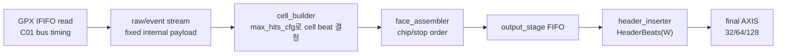

# C02 Chip Acquisition Width / Timing Verification v001

- Cluster: `C02_Chip_Acquisition`
- 문서 목적: Data Flow v002와 Timing / Pipeline / II 분석에서 남아 있던 미검증 항목을 코드 보완과 Vivado xsim 결과로 닫는다.
- 작성 시간: `2026-05-01 01:47:28 +09:00`
- 최종 수정 시간: `2026-05-01 01:51:19 +09:00`
- 절대 기준: `Doc/TDC-GPX-Datasheet.pdf`
- 선행 문서:
  - `C02_Chip_Acquisition_260501011313_Data_Flow_Review_v002.md`
  - `C02_Chip_Acquisition_260501012435_Timing_Pipeline_II_Analysis_v001.md`

---

## 1. 결론

Data Flow와 Timing Pipeline 문서에서 남아 있던 검증 공백은 아래처럼 보완했다.

| 항목 | 상태 | 판단 |
|---|---:|---|
| 32-bit top 통합 xsim | PASS | `max_hits_cfg=3` 설정 후 rising/falling 각각 72 beats, `tlast=2` |
| 64-bit top 통합 xsim | PASS | rising/falling 각각 44 beats, `tlast=2` |
| 128-bit top 통합 xsim | PASS | rising/falling 각각 38 beats, `tlast=2` |
| max_hits_cfg별 beat 산식 | PASS | 새 TB `tb_tdc_gpx_width_timing_matrix.vhd`로 1~7 및 32/64/128 전체 assert |
| 17-bit raw hit 보존성 | 계약 명확화 | 현재 C02 cell format은 lower 16-bit 저장이다. full 17-bit 보존은 후속 format 변경 필요 |
| stale timing/comment | 보완 | `tdc_gpx_pkg.vhd`, `tdc_gpx_cell_builder.vhd` 주석을 16-bit slot 기준으로 수정 |

중요한 발견도 있었다. 기존 top 통합 TB는 거리 기준으로 `C_MAX_HITS=3`을 계산했지만, chip CSR `CTL21[18:16]`에 `max_hits_cfg`를 쓰지 않아 실제 runtime cell 출력은 기본값 7 기준으로 동작했다. 이번 보완에서 `CTL21 = 0x0003_0000`을 쓰도록 TB를 수정했고, 이 후 32/64-bit 출력 beat가 실제로 감소했다.

운영 계약: 32/64/128 폭에서 throughput 이득을 얻으려면 상위 제어 또는 SW가 거리/운용 조건에 맞는 `CTL21.max_hits_cfg`를 반드시 설정해야 한다. 설정하지 않으면 기본값 7이 적용되어 안전하지만 output beat 감소 효과는 제한된다.

---

## 2. 보완된 코드

| 파일 | 보완 내용 | 근거 |
|---|---|---|
| `tdc_gpx_pkg.vhd` | `c_HIT_SLOT_DATA_WIDTH=16` 계약 주석 명확화, `fn_beats_per_cell_rt` 설명을 16-bit slot 기준으로 수정 | `tdc_gpx_pkg.vhd:48-50`, `tdc_gpx_pkg.vhd:805-820` |
| `tdc_gpx_cell_builder.vhd` | runtime beat 예시 표를 metadata 포함 total beat 기준으로 수정 | `tdc_gpx_cell_builder.vhd:62-72`, `tdc_gpx_cell_builder.vhd:91-96` |
| `tb_tdc_gpx_top_int.vhd` | `CTL21.max_hits_cfg` write 추가, width별 expected beat assert 추가 | `tb_tdc_gpx_top_int.vhd:131-140`, `tb_tdc_gpx_top_int.vhd:305-314`, `tb_tdc_gpx_top_int.vhd:843`, `tb_tdc_gpx_top_int.vhd:911-934` |
| `tb_tdc_gpx_width_timing_matrix.vhd` | max_hits/width/header/line beat matrix 신규 검증 | `tb_tdc_gpx_width_timing_matrix.vhd:1-138` |

---

## 3. Data Flow 검증 결과

### 3.1 Top 통합 시나리오

공통 조건:

| 항목 | 값 |
|---|---:|
| active chips | 4 |
| stops per chip | 2 |
| cols per face | 2 |
| range-derived max_hits | 3 |
| chip CSR max_hits_cfg | `CTL21[18:16] = 3`, write value `0x0003_0000` |
| output stream | rising/falling 각각 동일 검증 |

폭별 기대 beat 산식:

```text
ExpectedBeats = cols_per_face *
                (HeaderBeats(W) +
                 active_chips * stops_per_chip * Bcell(max_hits_cfg, W))
```

`max_hits_cfg=3`일 때:

| W | Header beats | Bcell(3, W) | Expected beats / slope | xsim result |
|---:|---:|---:|---:|---|
| 32 | 12 | 3 | 72 | PASS, rising/falling 72 |
| 64 | 6 | 2 | 44 | PASS, rising/falling 44 |
| 128 | 3 | 2 | 38 | PASS, rising/falling 38 |

근거:

- `xsim_top_int_width32.log:55`: `CTL21 = 0x0003_0000` write
- `xsim_top_int_width32.log:88-92`: expected/rising/falling beat PASS
- `xsim_top_int_width64.log:55`: `CTL21 = 0x0003_0000` write
- `xsim_top_int_width64.log:88-92`: expected/rising/falling beat PASS
- `xsim_top_int_width128.log:55`: `CTL21 = 0x0003_0000` write
- `xsim_top_int_width128.log:88-92`: expected/rising/falling beat PASS

### 3.2 Data Flow 의미



검증 결과의 의미:

- GPX read와 raw/event 내부 payload 폭은 32/64/128 output 폭에 의해 빨라지지 않는다.
- output 폭이 넓어질수록 header beat와 cell beat가 줄어 final AXIS 점유 시간이 감소한다.
- 단, cell beat 감소는 `max_hits_cfg`가 실제로 설정되어야 발생한다.
- `max_hits_cfg=3` 조건에서 32->64는 72에서 44 beat로 줄고, 32->128은 72에서 38 beat로 줄었다.

---

## 4. Timing / Pipeline / II 검증 결과

### 4.1 Matrix TB

새 TB `tb_tdc_gpx_width_timing_matrix.vhd`는 다음을 assert한다.

| 검증 축 | 확인 값 |
|---|---|
| 지원 폭 | 32/64/128 지원, 256 제외 |
| `tkeep` 폭 | 4/8/16 |
| header beats | 12/6/3 |
| `Bcell(max_hits,W)` | max_hits 1~7 전체 |
| line beats | C=4, N=8 기준 max_hits 1/3/5/7 전체 |

대표 산식:

| max_hits_cfg | 32-bit line beats | 64-bit line beats | 128-bit line beats |
|---:|---:|---:|---:|
| 1 | 76 | 70 | 67 |
| 3 | 108 | 70 | 67 |
| 5 | 140 | 102 | 67 |
| 7 | 172 | 102 | 67 |

근거:

- `xsim_width_timing_matrix.log:30-42`: 16-bit slot, keep/header PASS
- `xsim_width_timing_matrix.log:44-84`: max_hits 1~7 cell beats PASS
- `xsim_width_timing_matrix.log:86-108`: line beats PASS
- `xsim_width_timing_matrix.log:110`: 최종 PASS

### 4.2 Latency / Throughput / Pipeline / II

최종 AXIS가 항상 ready이고 `i_axis_aclk=150 MHz`라고 보면 output 전송 구간의 이론 시간은 다음과 같다. 아래 값은 top 통합 TB 조건인 `max_hits_cfg=3`, active chips 4, stops/chip 2, cols 2, slope 1개 기준이다.

| W | Beats / slope | 150 MHz 기준 전송 시간 | TB 200 MHz 기준 전송 시간 | 의미 |
|---:|---:|---:|---:|---|
| 32 | 72 | 0.480 us | 0.360 us | 기준 |
| 64 | 44 | 0.293 us | 0.220 us | 32-bit 대비 output 구간 약 39% 감소 |
| 128 | 38 | 0.253 us | 0.190 us | 32-bit 대비 output 구간 약 47% 감소 |

II 관점:

- GPX read II는 C01 bus timing과 Datasheet READ timing이 제한한다.
- raw/event decode 구간은 output 폭과 독립이며, 내부 skid/registered ready 기준으로 II=1 처리 여유가 있다.
- cell_builder 이후 output serialize 구간은 final AXIS ready가 유지되면 beat 단위 II=1이다.
- output 폭 증가는 II 자체를 1보다 작게 만들지는 않는다. 대신 필요한 beat 수를 줄여 pipeline 점유 시간과 downstream backpressure 노출 시간을 줄인다.

---

## 5. 17-bit Raw Hit 계약

TDC-GPX I-Mode raw hit은 코드 계약상 17-bit이다.

- `tdc_gpx_pkg.vhd:110`: `c_RAW_HIT_WIDTH = 17`
- `tdc_gpx_pkg.vhd:589`: raw_event는 17-bit raw hit을 가진다.
- `tdc_gpx_cell_builder.vhd:133-135`: slave input은 `tdata[16:0]` raw hit을 받는다.

하지만 현재 C02 cell format은 16-bit hit slot이다.

- `tdc_gpx_pkg.vhd:48-50`: C02 cell format은 lower 16-bit 저장임을 명시했다.
- `tdc_gpx_cell_builder.vhd:644`: 저장 시 `i_s_axis_tdata(c_HIT_SLOT_DATA_WIDTH-1 downto 0)`만 저장한다.
- `xsim_width_timing_matrix.log:30`: `hit slot data width = 16 PASS`

따라서 이번 보완의 결론은 “17-bit full preservation 검증 PASS”가 아니라 “현재 C02는 16-bit 저장 계약으로 명확히 닫음”이다. full 17-bit 보존이 필요하면 cell payload format, metadata, header/consumer 계약, downstream parser를 함께 바꾸는 별도 변경이 필요하다.

---

## 6. 닫힌 항목과 남은 계약

| ID | 이전 상태 | 이번 결론 |
|---|---|---|
| DF-C02-W-01 | 32-bit top xsim 미검증 | PASS |
| DF-C02-W-02 | 128-bit top xsim 미검증 | PASS |
| DF-C02-W-03 | runtime max_hits final beat matrix 미검증 | PASS |
| DF-C02-W-04 | 17-bit raw hit preservation 불명확 | 16-bit cell 계약으로 명확화, full 17-bit는 후속 |
| TD-C02-T-01 | 17-bit slot stale comment | 16-bit slot 기준으로 보완 |

남은 운영 계약:

1. 거리/운용 모드에 맞는 `CTL21.max_hits_cfg`를 shot/face 시작 전에 설정해야 output width 이득이 반영된다.
2. `max_hits_cfg=000`은 RTL에서 7로 alias된다. 이것은 안전 기본값이며, throughput 최적화값이 아니다.
3. full 17-bit hit 보존은 C02 완료 후 별도 format 변경으로 검토한다.
