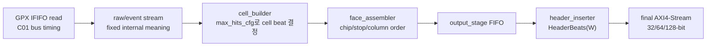
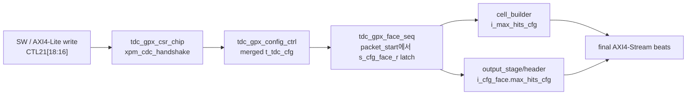
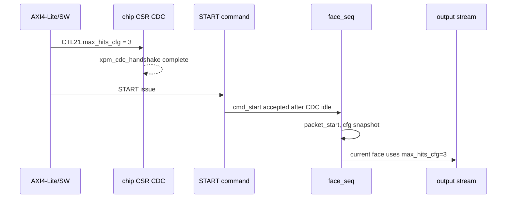
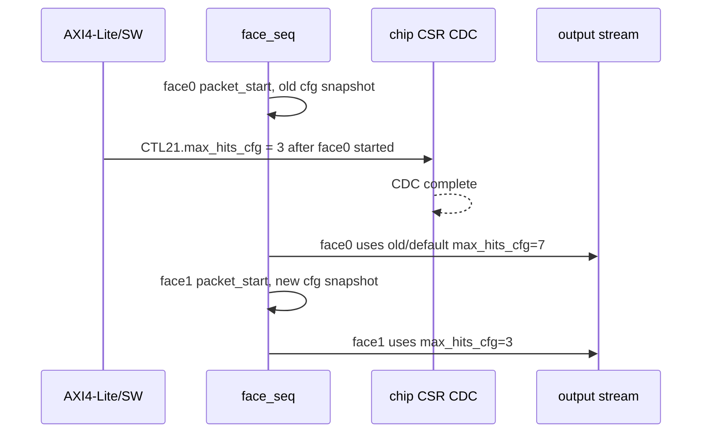
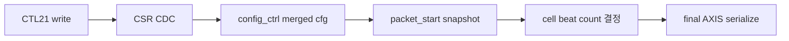
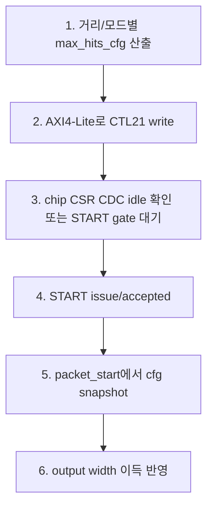

# C02 Chip Acquisition CTL21 Max Hits Timing Contract v001

- Cluster: `C02_Chip_Acquisition`
- 문서 목적: 거리/운용 모드에 맞는 `CTL21.max_hits_cfg`를 언제 설정해야 32/64/128-bit output width 이득이 실제 출력에 반영되는지 검토하고, 운용 계약과 검증 근거를 기록한다.
- 작성 시간: `2026-05-01 02:03:59 +09:00`
- 최종 수정 시간: `2026-05-01 02:07:23 +09:00`
- 절대 기준: `Doc/TDC-GPX-Datasheet.pdf`
- 연계 문서:
  - `C02_Chip_Acquisition_260501011313_Data_Flow_Review_v002.md`
  - `C02_Chip_Acquisition_260501012435_Timing_Pipeline_II_Analysis_v001.md`
  - `C02_Chip_Acquisition_260501014728_Width_Timing_Verification_v001.md`

---

## 1. 결론

`CTL21.max_hits_cfg`는 output width 이득을 실제로 만들기 위한 필수 runtime 계약이다.

32/64/128-bit 폭 자체는 final AXI4-Stream 직렬화 구간의 beat 수를 줄일 수 있다. 하지만 cell payload가 몇 hit까지 담아야 하는지는 `max_hits_cfg`가 결정한다. 따라서 거리/운용 모드에 맞는 `CTL21.max_hits_cfg`가 face 시작 전에 설정되지 않으면, RTL은 안전 기본값인 7-hit alias로 동작하고 64-bit 폭에서도 기대한 beat 감소가 나오지 않는다.

이번 xsim 검증 결과는 다음과 같다.

| 케이스 | CTL21 설정 시점 | 64-bit 기대 beat | xsim 결과 | 판단 |
|---|---|---:|---:|---|
| early | 첫 `packet_start` 이전 `max_hits_cfg=3` write | 44 | 44 | 현재 face부터 width 이득 반영 |
| unset | CTL21 미설정 | 60 | 60 | 기본 alias 7 적용, width 이득 제한 |
| zero | 첫 `packet_start` 이전 `max_hits_cfg=0` write | 60 | 60 | 0은 alias 7, 안전 기본값 |
| late | 첫 `packet_start` 이후 `max_hits_cfg=3` write | 104 | 104 | face0=60, face1=44. 현재 face는 변경 안 됨 |

따라서 운용 계약은 아래처럼 정리한다.

1. 거리/운용 모드에서 필요한 `max_hits_cfg`를 shot/face 시작 전에 `CTL21[18:16]`에 설정한다.
2. `CTL21` write가 chip CSR CDC를 통과한 뒤 START가 받아들여져야 한다.
3. 현재 RTL은 CSR pipeline에서 `cmd_start`를 chip CSR CDC idle에 gate하므로, CTL21 write가 START보다 먼저 issued 되면 START acceptance는 CDC idle 이후로 밀린다.
4. `packet_start` 이후 CTL21을 변경해도 현재 face에는 반영되지 않는다. 다음 face의 `packet_start` snapshot부터 반영된다.
5. `CTL21.max_hits_cfg=000`은 0-hit이 아니라 7-hit alias이다. 이것은 안전 기본값이지 throughput 최적값이 아니다.

---

## 2. 검토 기준

이번 검토는 "넓은 bus가 빠른가"가 아니라 "넓은 bus가 빨라지기 위한 runtime 조건이 무엇인가"를 확인하는 것이다.

기존 Data Flow / Timing 분석에서 도출된 구조는 다음과 같다.

핵심 판단은 다음과 같다.

| 항목 | 판단 |
|---|---|
| GPX read | Datasheet READ timing과 C01 bus timing이 상위 제약이다. |
| raw/event 내부 의미 | 32/64/128-bit output width와 무관하게 고정이다. |
| cell beat 수 | `max_hits_cfg`와 output width가 함께 결정한다. |
| final AXIS beat 수 | `HeaderBeats(W) + line/cell beats`로 결정된다. |
| width 이득 조건 | `max_hits_cfg`가 실제 운용 거리/모드 값으로 설정되어야 한다. |

---

## 3. 설정 경로

`CTL21.max_hits_cfg`의 설정 경로는 아래처럼 해석된다.

근거 위치:

| 근거 | 위치 | 의미 |
|---|---|---|
| CTL21 bit 정의 | `tdc_gpx_csr_chip.vhd:19` | `CTL21[18:16] = max_hits_cfg` |
| CTL21 CDC | `tdc_gpx_csr_chip.vhd:596-615` | AXI clock에서 axis clock으로 handshake CDC |
| 0 alias 처리 | `tdc_gpx_csr_chip.vhd:873-876` | `max_hits_cfg=0`이면 7로 alias |
| CDC idle 생성 | `tdc_gpx_csr_chip.vhd:751-758` | CTL21 포함 CDC busy/idle 판단 |
| START gate | `tdc_gpx_csr_pipeline.vhd:40-43`, `tdc_gpx_csr_pipeline.vhd:607-610`, `tdc_gpx_csr_pipeline.vhd:670` | chip CSR CDC idle 이후 start 전달 |
| cfg snapshot | `tdc_gpx_face_seq.vhd:378-384`, `tdc_gpx_face_seq.vhd:490` | `packet_start` 시점에 face cfg latch |
| top 연결 | `tdc_gpx_top.vhd:683`, `tdc_gpx_top.vhd:765`, `tdc_gpx_top.vhd:913` | latched face cfg가 cell/output에 전달 |

---

## 4. 타이밍 계약

### 4.1 Early 설정

결론: 현재 face의 cell beat 수가 `max_hits_cfg=3` 기준으로 줄어든다. 64-bit top 통합 TB 기준 rising/falling 각각 44 beats가 검증되었다.

### 4.2 Late 설정

결론: `packet_start` 이후 write는 현재 face를 바꾸지 않는다. late xsim은 2-face 조건에서 `60 + 44 = 104` beats를 확인했다.

---

## 5. xsim 검증 결과

TB는 `G_MAX_HITS_WRITE_MODE` generic을 추가해 CTL21 설정 시점별 결과를 분리했다.

| Mode | 의미 | 기대 | 검증 로그 |
|---:|---|---:|---|
| 0 | CTL21 unset, alias 7 기대 | 60 | `xsim_top_ctl21_unset64.log:31`, `:55`, `:85`, `:89` |
| 1 | CTL21 early write, `max_hits_cfg=3` | 44 | `xsim_top_ctl21_early64.log:31`, `:55`, `:89`, `:93` |
| 2 | CTL21 early write 0, alias 7 기대 | 60 | `xsim_top_ctl21_zero64.log:31`, `:55`, `:89`, `:93` |
| 3 | CTL21 late write after first `packet_start` | 104 | `xsim_top_ctl21_late64.log:31`, `:55`, `:78`, `:98`, `:102` |

검증 요약:

| 케이스 | 조건 | rising stream | falling stream | TLAST | 결과 |
|---|---|---:|---:|---:|---|
| early64 | 1 face, 2 cols, `max_hits_cfg=3` | 44 | 44 | 2 / 2 | PASS |
| unset64 | 1 face, 2 cols, alias 7 | 60 | 60 | 2 / 2 | PASS |
| zero64 | 1 face, 2 cols, alias 7 | 60 | 60 | 2 / 2 | PASS |
| late64 | 2 faces, face0 alias 7, face1 cfg 3 | 104 | 104 | 4 / 4 | PASS |

TB 보완 위치:

| 항목 | 위치 | 내용 |
|---|---|---|
| mode generic | `tb_tdc_gpx_top_int.vhd:74-80` | unset/early/zero/late 설정 모드 |
| expected beat 계산 | `tb_tdc_gpx_top_int.vhd:161`, `tb_tdc_gpx_top_int.vhd:362-364` | mode별 기대 beat 계산 |
| mode 유효성 assert | `tb_tdc_gpx_top_int.vhd:875-879` | late mode는 2 faces 이상 필요 |
| CTL21 write 분기 | `tb_tdc_gpx_top_int.vhd:907-918` | mode별 write 정책 |
| late write 위치 | `tb_tdc_gpx_top_int.vhd:954-964` | 첫 packet/shot 이후 CTL21 write |
| 결과 assert | `tb_tdc_gpx_top_int.vhd:993-1022` | beat/tlast 최종 검증 |

추가로 late mode 검토 중 중요한 운용 계약이 하나 더 확인되었다. `fire_count` / expected-count matching은 전체 run global shot count가 아니라 face-local shot count 기준으로 맞아야 한다. late mode를 2-face로 확장할 때 global count를 쓰면 face1에서 expected-count mismatch가 발생했고, `do_shot(c + 1, ...)`로 face-local count를 유지해야 정상 동작했다.

---

## 6. Latency / Throughput / Pipeline / II 영향

### 6.1 Output serialization beat 영향

이번 CTL21 검토는 GPX bus read 속도를 바꾸는 항목이 아니다. output stream으로 serialize되는 beat 수를 바꾸는 항목이다.

64-bit, active chips 4, stops/chip 2, cols/face 2 조건에서 비교하면 다음과 같다.

| 상태 | max_hits 적용 | beats / slope | 150 MHz 기준 output time | 판단 |
|---|---:|---:|---:|---|
| 미설정 또는 0 alias | 7 | 60 | 0.400 us | 안전하지만 width 이득 제한 |
| early 설정 | 3 | 44 | 0.293 us | output 구간 약 26.7% 감소 |
| late 2-face | face0=7, face1=3 | 104 | 0.693 us | 현재 face는 old cfg, 다음 face부터 개선 |

### 6.2 Pipeline 해석

Pipeline 관점에서 `D: packet_start snapshot`이 경계이다. 이 경계를 지나면 현재 face의 `max_hits_cfg`는 고정된다.

### 6.3 II 해석

| 구간 | II 영향 |
|---|---|
| GPX read / drain | `CTL21.max_hits_cfg` 설정 시점이 직접 II를 바꾸지 않는다. Datasheet READ timing과 C01 bus timing이 상위 제약이다. |
| raw/event 처리 | 내부 event 의미는 width와 무관하게 유지된다. |
| cell/output serialize | final AXIS ready가 유지되면 beat 단위 II=1이다. `max_hits_cfg`와 width는 II를 낮추는 것이 아니라 필요한 beat 수를 줄인다. |
| face 전환 | late 설정은 현재 face를 재타이밍하지 않고 다음 face snapshot에 반영된다. |

---

## 7. 운용 규칙 제안

새 운용 규칙으로 아래 항목을 C02 계약에 추가한다.

| ID | 규칙 |
|---|---|
| OP-C02-CTL21-01 | 거리/운용 모드에 맞는 `CTL21.max_hits_cfg`는 START 또는 face `packet_start` 이전에 설정한다. |
| OP-C02-CTL21-02 | `CTL21.max_hits_cfg=000`은 0-hit이 아니라 7-hit alias로 해석한다. |
| OP-C02-CTL21-03 | 현재 face 중간에 CTL21을 변경해도 현재 face에는 반영되지 않는다. 다음 face부터 반영되는 것으로 운용한다. |
| OP-C02-CTL21-04 | output width 이득을 검증할 때는 폭 generic만 보지 말고, runtime `CTL21.max_hits_cfg` write 여부를 함께 확인한다. |
| OP-C02-CTL21-05 | multi-face run에서 dynamic max_hits 변경이 필요하면 다음 face `packet_start` 전까지 CDC가 완료되도록 sequence를 제한한다. |

권장 sequence:

---

## 8. 후속 판단

이번 항목은 코드 datapath 수정이 아니라 운용 계약과 검증 보완으로 닫는 것이 합리적이다. 이유는 다음과 같다.

1. RTL은 이미 `packet_start`에서 face cfg를 register boundary로 닫고 있다.
2. CSR pipeline은 chip CSR CDC idle을 START gate에 반영하고 있다.
3. CTL21이 face 중간에 바뀌어 현재 face 출력 형식이 흔들리는 것보다, 다음 face부터 반영되는 현재 구조가 timing 분석과 데이터 해석에 더 유리하다.

남은 위험은 상위 제어/SW가 CTL21을 쓰지 않거나, START 이후에 쓰면서 현재 face에 반영된다고 오해하는 경우이다. 이를 막기 위해 top 통합 TB에 unset/zero/late negative 성격의 케이스를 남겼고, `Width_Timing_Verification` 계열 문서에서는 width 이득 조건에 `CTL21.max_hits_cfg` 설정을 필수 조건으로 연결해야 한다.
