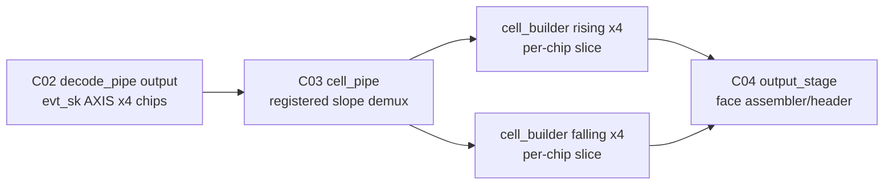

# C02 Chip Acquisition -> C03 Cell Pipe Handoff v001

- Cluster: `C02_Chip_Acquisition`
- 문서 목적: C02에서 설계/구현/검증된 범위와 C03로 넘겨야 할 계약을 정리하고, C03 진입 가능 여부를 판단한다.
- 작성 시간: `2026-05-01 02:10:13 +09:00`
- 최종 수정 시간: `2026-05-01 02:10:13 +09:00`
- 절대 기준: `Doc/TDC-GPX-Datasheet.pdf`
- 다음 Cluster: `C03_Cell_Pipe`
- 다음 Cluster 기준 RTL: `tdc_gpx_top.vhd:14`, `tdc_gpx_cell_pipe.vhd`, `tdc_gpx_cell_builder.vhd`

---

## 1. C03 진입 판단

판단: C03 진입 가능.

C02는 GPX IC acquisition에서 raw/event stream을 만들고, 그 결과가 cell pipeline으로 들어가기 위한 주요 계약을 닫았다. C03에서 분석해야 할 대상은 `cell_pipe`와 `cell_builder`가 C02 event stream을 받아 per-chip/per-slope cell slice로 변환하는 구간이다.

단, C03 진입 전제는 아래 계약을 유지하는 것이다.

| ID | C02 종료 계약 | C03 적용 의미 |
|---|---|---|
| H-C02C03-01 | C02는 I-Mode single 측정만 유효 범위로 닫았다. | C03도 I-Mode single event/cell 변환부터 검증한다. |
| H-C02C03-02 | Quiet/M-mode/Continuous measurement는 범위 제외다. | C03 분석에서 해당 mode를 지원 가정으로 넣지 않는다. |
| H-C02C03-03 | `CTL21.max_hits_cfg`는 START 또는 face `packet_start` 이전에 설정되어야 한다. | C03 `cell_builder`의 runtime beat 수는 face snapshot된 `max_hits_cfg` 기준으로 해석한다. |
| H-C02C03-04 | `max_hits_cfg=000`은 0-hit이 아니라 7-hit alias다. | cell beat 산출식은 effective max_hits 1..7 기준으로 작성한다. |
| H-C02C03-05 | 현재 face 중간 CTL21 변경은 현재 face가 아니라 다음 face부터 반영된다. | C03에서는 shot 중 runtime beat 수가 흔들리지 않는다는 전제로 타이밍을 분석한다. |
| H-C02C03-06 | C02 event stream의 raw hit 의미는 17-bit이지만 현재 cell slot 저장은 lower 16-bit 계약이다. | C03에서 full 17-bit 보존 여부를 별도 finding으로 관리한다. |
| H-C02C03-07 | expected-count / fire-count matching은 face-local shot count 기준이다. | C03 shot_start와 buffer ownership 검증도 face-local count 기준으로 맞춘다. |
| H-C02C03-08 | 32/64/128-bit output width는 지원 대상이고 256-bit는 제외다. | C03 cell beat 산출과 TB는 32/64/128만 대상으로 한다. |
| H-C02C03-09 | final AXIS ready 유지 시 output serialize 구간은 beat 단위 II=1로 해석했다. | C03에서는 cell slice 생성 자체의 II와 backpressure 흡수 능력을 따로 산출한다. |
| H-C02C03-10 | Datasheet가 주석보다 상위 기준이다. | C03 raw hit/cell 의미가 Datasheet와 충돌하면 Datasheet 기준으로 판정한다. |

---

## 2. C02 완료 범위

### 2.1 설계/구현 범위

| 항목 | 완료 내용 | 근거 |
|---|---|---|
| AXI4-Stream 폭 표준화 | final output width를 32/64/128-bit로 표준화하고 관련 helper 계약을 정리 | `tdc_gpx_pkg.vhd:45-50`, `tdc_gpx_pkg.vhd:808-820` |
| Cell beat 산출 주석 정정 | `cell_builder`의 runtime max_hits별 beat table을 실제 helper 공식과 맞춤 | `tdc_gpx_cell_builder.vhd:64-94` |
| Top 통합 TB 폭 검증 | 32/64/128-bit top 통합 TB에서 expected beat/tlast assert | `tb_tdc_gpx_top_int.vhd:993-1022` |
| Width matrix TB | max_hits 1~7, 32/64/128 width beat 산출 검증 | `tb_tdc_gpx_width_timing_matrix.vhd` |
| CTL21 timing mode TB | unset/early/zero/late 설정 시점별 top 검증 | `tb_tdc_gpx_top_int.vhd:74-80`, `tb_tdc_gpx_top_int.vhd:907-918`, `tb_tdc_gpx_top_int.vhd:954-964` |

### 2.2 검증 결과

| 검증 | 결과 | 근거 |
|---|---|---|
| 32-bit top 통합 | PASS, rising/falling 72 beats | `xsim_top_int_width32.log:92` |
| 64-bit top 통합 | PASS, rising/falling 44 beats | `xsim_top_int_width64.log:92` |
| 128-bit top 통합 | PASS, rising/falling 38 beats | `xsim_top_int_width128.log:92` |
| width/max_hits matrix | PASS | `xsim_width_timing_matrix.log:30-110` |
| CTL21 early | PASS, 44 beats | `xsim_top_ctl21_early64.log:89`, `xsim_top_ctl21_early64.log:93` |
| CTL21 unset | PASS, alias 7, 60 beats | `xsim_top_ctl21_unset64.log:85`, `xsim_top_ctl21_unset64.log:89` |
| CTL21 zero | PASS, alias 7, 60 beats | `xsim_top_ctl21_zero64.log:89`, `xsim_top_ctl21_zero64.log:93` |
| CTL21 late | PASS, face0 60 + face1 44 = 104 beats | `xsim_top_ctl21_late64.log:98`, `xsim_top_ctl21_late64.log:102` |

---

## 3. C02 산출 문서

| 문서 | 역할 |
|---|---|
| `C02_Chip_Acquisition_260501011313_Data_Flow_Review_v002.md/.pptx` | 32/64/128-bit data flow와 raw/event/cell/output 의미 분리 |
| `C02_Chip_Acquisition_260501012435_Timing_Pipeline_II_Analysis_v001.md/.pptx` | timing, latency, throughput, pipeline, II 분석 |
| `C02_Chip_Acquisition_260501014728_Width_Timing_Verification_v001.md/.pptx` | width/max_hits 검증 결과 |
| `C02_Chip_Acquisition_260501020359_CTL21_Max_Hits_Timing_Contract_v001.md/.pptx` | CTL21 설정 시점과 face snapshot 계약 |
| `C02_Chip_Acquisition_260501021013_C03_Handoff_v001.md/.pptx` | C03 인계 계약 |

---

## 4. C02 -> C03 데이터 경계

C03 입력 event stream 계약:

| Signal | 의미 | 근거 |
|---|---|---|
| `i_evt_sk_tvalid[3:0]` | chip별 decoded event valid | `tdc_gpx_cell_pipe.vhd:25-28` |
| `i_evt_sk_tdata` | event payload, lower 17-bit raw hit 의미 포함 | `tdc_gpx_cell_builder.vhd:123-126` |
| `i_evt_sk_tuser[0]` | slope, 1=rising, 0=falling | `tdc_gpx_cell_builder.vhd:127` |
| `i_evt_sk_tuser[2:1]` | chip_id | `tdc_gpx_cell_builder.vhd:128` |
| `i_evt_sk_tuser[5:3]` | stop_id_local | `tdc_gpx_cell_builder.vhd:129` |
| `i_evt_sk_tuser[6]` | ififo_id | `tdc_gpx_cell_builder.vhd:130` |
| `i_evt_sk_tuser[7]` | drain_done control beat | `tdc_gpx_cell_builder.vhd:131` |
| `i_evt_sk_tuser[10:8]` | hit_seq_local | `tdc_gpx_cell_builder.vhd:132` |
| `i_evt_sk_tuser[15:11]` | shot_seq[4:0] | `tdc_gpx_cell_builder.vhd:133` |

C03 출력 cell stream 계약:

| Signal | 의미 | 근거 |
|---|---|---|
| `o_cell_rise_tdata_0..3` | chip별 rising cell slice data | `tdc_gpx_cell_pipe.vhd:43-47` |
| `o_cell_rise_tvalid/tlast` | chip별 rising slice handshake/end | `tdc_gpx_cell_pipe.vhd:48-50` |
| `o_cell_fall_tdata_0..3` | chip별 falling cell slice data | `tdc_gpx_cell_pipe.vhd:53-57` |
| `o_cell_fall_tvalid/tlast` | chip별 falling slice handshake/end | `tdc_gpx_cell_pipe.vhd:58-60` |
| `o_cell_rise/fall_tuser` | tlast beat에서 faulted flag 전달 | `tdc_gpx_cell_pipe.vhd:89-97` |

---

## 5. C03에서 반드시 확인할 질문

| ID | 질문 | 이유 |
|---|---|---|
| Q-C03-01 | slope demux의 registered ready가 upstream skid와 함께 AXI 계약을 완전히 만족하는가? | C02에서 조합 ready chain을 줄이는 규칙을 세웠기 때문 |
| Q-C03-02 | drain_done control beat가 rising/falling 양쪽 cell_builder에 동시에, 손실 없이 전달되는가? | 한 slope 누락 시 face completion이 깨질 수 있음 |
| Q-C03-03 | `cell_builder` dual buffer ownership이 shot_start 간격과 IFIFO1/IFIFO2 split output에서 overflow/drop을 올바르게 처리하는가? | C03의 핵심 pipeline/II 판단 |
| Q-C03-04 | runtime `max_hits_cfg`가 output start 시점에 안정적으로 latch되고, shot 중 변경 영향을 받지 않는가? | C02 CTL21 계약의 C03 적용점 |
| Q-C03-05 | lower 16-bit hit slot 계약이 데이터 의미상 허용 가능한가, full 17-bit 보존이 필요한가? | C02에서 후속 검토로 넘긴 항목 |
| Q-C03-06 | slice timeout, quarantine, shot drop, hit drop, stop_id error가 data/control boundary에서 구분되어 전달되는가? | C03 output integrity 판단 |
| Q-C03-07 | 32/64/128-bit별 cell slice latency, throughput, pipeline, II가 TB로 재현 가능한가? | C03 완료 조건 |

---

## 6. C03 진입 조건

C03는 아래 조건으로 시작한다.

1. Datasheet를 상위 기준으로 I-Mode raw hit/cell 의미를 먼저 확인한다.
2. C03 분석 범위는 `tdc_gpx_cell_pipe.vhd`, `tdc_gpx_cell_builder.vhd`, `tdc_gpx_pkg.vhd`의 cell helper, 그리고 상하위 경계인 `tdc_gpx_decode_pipe.vhd`, `tdc_gpx_output_stage.vhd` 연결부로 제한한다.
3. 모든 결과는 Markdown과 PPT로 남긴다.
4. 문서에는 생성/수정 시간, 코드 line 근거, xsim log 근거를 포함한다.
5. 각 결과에는 latency, throughput, pipeline, II와 timing diagram 또는 timing block diagram을 포함한다.
6. 코드 보완이 발생하면 git commit으로 묶어 버전 관리한다.

---

## 7. C02 종료 판단

C02는 C03로 넘어갈 수 있다. 남은 항목은 C02 blocker가 아니라 C03 분석 입력 또는 후속 Cluster 검토 항목으로 분리한다.

| 항목 | 상태 | 다음 처리 |
|---|---|---|
| 17-bit full preservation | 미결정 | C03 finding 후보 |
| 16-bit bus mode | 제외 | 28-bit path close 이후 검토 |
| 250 MHz retiming | 제외 | 별도 retiming 검토 |
| Quiet/M-mode/Continuous | 제외 | 현재 프로젝트 범위 밖 |
| output stream CDC 전체 재설계 | 후속 검토 | C04 output_stage 또는 system integration에서 판단 |
