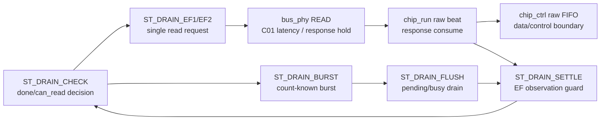

# C02_Chip_Acquisition Code Fix Plan v002

문서 버전: `v002`  
작성일: `2026-04-30`  
최종 수정 시간: `2026-04-30 13:38:32 +09:00`  
작성 목적: `C02_Chip_Acquisition_Code_Fix_Plan_Review_20260430_v001.md`의 사용자 검토 의견 8건을 반영하여, C02 RTL/TB/문서 보완 계획을 기능 검증 경계, pipeline/II 분석, risk-control, 승인 matrix 중심으로 재작성한다.

---

## 1. 계획 기준

본 계획은 코드 변경 전 사용자 승인용 계획 문서이다. 아직 RTL/TB를 수정하지 않는다.

| 기준 | 적용 방식 |
|---|---|
| `Doc/TDC-GPX-Datasheet.pdf` | 최상위 절대 기준. 특히 empty Interface FIFO read 금지, EF/LF active HIGH, GPX data bus 40 MHz readout 제한을 따른다. |
| `C01_GPX_Bus_Read_20260429_v009.md:1023-1058` | C01에서 C02로 넘긴 32개 계약 원본. C02는 32개 계약 번호를 삭제하지 않고 추적한다. |
| `C02_Chip_Acquisition_C01_Handoff_20260430_v002.md` | C01 계약 32건 전체 수락 matrix. |
| `C02_Chip_Acquisition_Code_Fix_Plan_Review_20260430_v001.md` | 본 Plan v002에 반영할 사용자 검토 의견 R-C02-P001-01~08. |
| 현재 RTL/TB | `tdc_gpx_chip_run.vhd`, `tdc_gpx_chip_ctrl.vhd`, `tdc_gpx_bus_phy.vhd`, `tb_tdc_gpx_chip_ctrl.vhd`, 필요 시 `tdc_gpx_config_ctrl.vhd`. |

## 2. Review 반영 요약

| Review ID | Plan v002 반영 |
|---|---|
| R-C02-P001-01 | `echo_receiver`/`expected_ififo`로 count를 아는 count-known burst와, count를 모르는 EF-only non-burst fallback을 분리한다. |
| R-C02-P001-02 | 목표 B를 결론형 guard 조정이 아니라 현재 drain pipeline/II 분석 -> 보완 후보 비교 -> 선택 기준 순서로 재구성한다. |
| R-C02-P001-03 | C02 운용 범위는 Quiet/M-mode가 아니라 I-Mode single measurement only로 확정한다. |
| R-C02-P001-04 | 검증 항목을 테스트 목록이 아니라 기능 검증 경계 `VB-C02-xx` matrix로 재구성한다. |
| R-C02-P001-05 | EF fallback settle을 raw EF pin, 2-FF sync, chip_ctrl 전달, chip_run decision point로 분리한다. |
| R-C02-P001-06 | 범위 제외/후속 항목을 완전 제외, 후속 검토, 조건부 후속으로 재분류한다. |
| R-C02-P001-07 | 위험과 완화를 risk register `RK-C02-xx`로 재구성하고 승인 판단점을 둔다. |
| R-C02-P001-08 | 승인 요청 항목을 검증 경계와 위험 항목에 매핑하는 `AP-C02-xx` matrix로 재작성한다. |

---

## 3. 운용 범위와 Handoff 계약 우선순위

### 3.1 C02 운용 범위

| 항목 | 결정 |
|---|---|
| 지원 측정 모드 | I-Mode single measurement only |
| Quiet/M-mode | 운용하지 않음. C02 구현/후속 구현 대상에서 제외 |
| GPX bus width | 28-bit only. 16-bit mode는 28-bit closure 이후 조건부 검토 |
| 기본 clock | `i_tdc_clk=200 MHz`, `Tclk=5 ns` |
| GPX readout 상한 | 데이터시트 기준 40 MHz 이하 |
| OEN | 정상 연결과 OEN High 고정/pull-up/not-connected 계열을 후속 검토. OEN Low fixed는 unsupported |

### 3.2 C01 계약 우선순위

| 우선순위 | C01 계약 ID | C02 처리 |
|---|---|---|
| P0 데이터시트 금지 조건 | C01-C11, C01-C14, C01-C21, C01-C22 | empty FIFO read 0회, 40 MHz 이하, `tS-EF + 2FF + decision guard` 검증 |
| P0 response/phase 안정성 | C01-C5, C01-C6, C01-C7, C01-C17, C01-C28, C01-C31 | pending/response hold, PH_RESP_DRAIN, burst/non-burst II 검증 |
| P1 drain/data 경계 | C01-C3, C01-C8, C01-C18, C01-C29 | READ response, status sync level, raw/data/control stream 경계 검증 |
| P1 timing legality | C01-C9, C01-C10, C01-C13, C01-C19 | 200 MHz 기준 timing legality, tick/capture 기준점, `div=1=>ticks>=5` 계약 확인 |
| P2 mode/board/CDC | C01-C12, C01-C15, C01-C16, C01-C20 | 28-bit/OEN/stream CDC 계약 유지. 일부는 후속 검토로 분리 |
| 제외 retiming | C01-C23~C01-C27, C01-C30 | 250 MHz retiming은 구현/후속 후보에서 제외. C01 분석은 근거로만 보존 |
| 산출물 규칙 | C01-C32 | latency, throughput, pipeline, II, timing diagram/block diagram 필수 |

---

## 4. 수정 목표

### 목표 A. Count-known burst와 count-unknown EF-only non-burst를 분리한다

배경:

- `echo_receiver` 또는 동등 경로가 `expected_ififo1/2`를 제공하면 burst 가능한 count-known 운용이 가능하다.
- `echo_receiver` 기능이 없거나 count를 신뢰할 수 없으면 burst count를 알 수 없고, EF-only non-burst fallback으로 운용해야 한다.
- 이 두 운용은 empty FIFO read 위험과 II가 다르므로 같은 검증 기준으로 묶으면 안 된다.

| 운용 분기 | 조건 | 주요 위험 | 보완 방향 |
|---|---|---|---|
| Count-known burst | `expected_ififo > 0`, count가 fresh/stable | stale count로 hard bound가 틀릴 수 있음 | expected snapshot log, mismatch sticky, expected 초과 read 금지 |
| Count-unknown EF-only non-burst | `expected_ififo = 0` 또는 count invalid | EF sync 지연으로 empty read 가능 | `tS-EF + 2FF + decision guard` 엄격 적용, single read loop II 산출 |

수정 계획:

1. TB monitor는 `data_beat_count`, `control_beat_count`, `empty_read_count`, `expected_count_snapshot`을 분리한다.
2. 기존 `12..16`, `24..28` 같은 extra read 허용 pass 기준은 폐기한다.
3. Count-known test와 count-unknown fallback test를 별도 scenario로 만든다.
4. empty FIFO read는 운용 분기와 관계없이 1회라도 FAIL이다.

### 목표 B. 현재 drain pipeline/II를 분석한 뒤 보완 방법을 선택한다

Plan v001의 "5 clocks 권장"은 바로 구현 결론으로 쓰지 않는다. Plan v002에서는 먼저 현재 pipeline과 II를 분해하고, 보완 후보를 비교한 뒤 승인된 후보를 구현한다.

#### 4.2.1 현재 drain pipeline



| Stage | RTL 근거 | 의미 | II 영향 |
|---|---|---|---|
| `ST_DRAIN_CHECK` | `tdc_gpx_chip_run.vhd:482-496` | EF/expected/raw_busy 상태로 다음 read 또는 done 결정 | decision overhead |
| `ST_DRAIN_EF1/EF2` | `tdc_gpx_chip_run.vhd:625-682` | single IFIFO read response 처리 | non-burst read latency |
| `ST_DRAIN_BURST` | `tdc_gpx_chip_run.vhd:713-730` | count-known burst response 처리 | burst beat II |
| `ST_DRAIN_FLUSH` | `tdc_gpx_chip_run.vhd:762-805` | burst 이후 pending/busy drain | response tail latency |
| `ST_DRAIN_SETTLE` | `tdc_gpx_chip_run.vhd:817-822` | 다음 decision 전 EF 관측 대기 | guarded II 증가 |
| raw FIFO | `tdc_gpx_chip_ctrl.vhd:998-1164` | data/control beat buffering | backpressure II 증가 |

#### 4.2.2 II 산출 프레임

기호:

- `T = 5 ns` at 200 MHz
- `N = bus_ticks`
- `D = bus_clk_div`
- `L_rd = C01 single READ request -> response consumed latency`
- `G = EF fallback decision guard clocks`
- `B = N * D * T`, C01 burst beat period

| 운용 모드 | 현재 II 구성 | 보완 후보 II 구성 | 판단 포인트 |
|---|---|---|---|
| Count-known burst | `B + response/raw ready tail` | `B + hard-bound check + flush tail` | 40 MHz 이하 유지, expected 초과 read 금지 |
| Count-unknown EF-only non-burst | `L_rd + 3*T + decision` | `L_rd + G*T + decision` | `G`가 raw EF, 2-FF sync, decision point를 덮는지 검증 |
| Raw backpressure | 위 II + raw FIFO stall | 위 II + measured stall cycles | no data/control drop, PH_RESP_DRAIN 계약 |
| Pending response stall | 위 II + pending hold | 위 II + pending hold monitor | pending 중 new request stall 확인 |

#### 4.2.3 보완 후보

| 후보 | 설명 | 장점 | 위험 | 추천 |
|---|---|---|---|---|
| A guard-only | 모든 fallback에 guard만 증가 | 단순 | count-known burst의 불필요한 II 증가 | 비추천 |
| B expected hard bound + guard | count-known은 hard bound, count-unknown은 guard | 안전성과 throughput 균형 | expected stale 검증 필요 | 추천 |
| C EF-only strict fallback only | expected count를 쓰지 않고 EF guard 강화 | count stale 위험 없음 | throughput/II 손실 큼 | fallback 전용 |

권장안:

> Count-known burst는 expected hard bound로 닫고, count-unknown EF-only fallback은 raw EF + 2-FF sync + control decision guard를 계산해 엄격하게 닫는다.

### 목표 C. EF fallback settle 기준점을 raw input부터 control decision까지 분리한다

| Stage | 기준점 | 현재 RTL 근거 | 의미 | 판단 포인트 |
|---|---|---|---|---|
| S0 | 마지막 IFIFO data read가 GPX 내부 FIFO를 empty로 만듦 | GPX/TB chip model | `tS-EF` 계산 시작점 | Datasheet `tS-EF max 11.8 ns` |
| S1 | raw `EF1/EF2` pin HIGH | GPX pin | GPX가 empty를 pin에 반영 | 200 MHz 기준 raw guard 최소 `ceil(11.8/5)=3 clocks` |
| S2 | `bus_phy` meta FF sample | `tdc_gpx_bus_phy.vhd:740-741` | asynchronous pin 1단 샘플 | edge alignment 고려 |
| S3 | `bus_phy` sync FF update | `tdc_gpx_bus_phy.vhd:747-758` | C02가 보는 synchronized EF level | raw EF 대비 2-FF 관측 지연 |
| S4 | `chip_ctrl` pass-through | `tdc_gpx_chip_ctrl.vhd:166-167`, `:532-533` | EF sync를 `chip_run`에 전달 | 현재 별도 FF 없음 |
| S5 | `chip_run ST_DRAIN_CHECK` decision | `tdc_gpx_chip_run.vhd:482-496` | 실제 read/done 제어 판단 | empty read 방지 최종 판단점 |
| S6 | `ST_DRAIN_SETTLE` guard | `tdc_gpx_chip_run.vhd:202`, `:817-822` | 다음 decision 전 대기 | 현재 `c_FLAG_SETTLE_LAST=2`, 즉 3 clocks로 해석 |

```text
T0         : last data read completes / FIFO becomes empty
T0+11.8ns : GPX raw EF pin must be HIGH by datasheet max
clk N      : bus_phy meta FF may sample raw EF
clk N+1    : bus_phy sync FF updates o_ef*_sync
same cycle : chip_ctrl/chip_run see i_ef*_sync if pass-through
next ST_DRAIN_CHECK : chip_run uses EF_sync for done/can_read decision
```

Plan v002에서 승인받을 내용:

- `G`를 단일 "5 clocks"로 고정하기 전에 S0~S6 경로를 기준으로 계산한다.
- 구현 후보는 `g_EF_SYNC_GUARD_CLKS` 또는 local constant/generic으로 둔다.
- 권장 기본 후보는 EF-only fallback에 한해 5 clocks이며, count-known burst는 hard bound가 1차 보호 수단이다.

### 목표 D. Response/backpressure/PH_RESP_DRAIN 계약을 검증한다

| 항목 | 계획 |
|---|---|
| response hold | `i_s_axis_tvalid`, `o_s_axis_tready`, `i_bus_rsp_pending` monitor 추가 |
| raw backpressure | raw FIFO full/stall 조건에서 data/control drop이 없는지 확인 |
| PH_RESP_DRAIN | per-shot drain이 아니라 stale response flush/quarantine 단계로 검증 |
| fatal/auto-recover | hard cap, bus fatal, idle-stable recovery transcript 근거 확보 |

### 목표 E. 결과 산출물은 Handoff v002와 검증 경계 기준으로 재작성한다

| 산출물 | 계획 |
|---|---|
| `C02_Chip_Acquisition_Code_Verify_20260430_v001.md` | xsim positive/negative 결과, VB/RK/AP closure 표, latency/II 측정 결과 기록 |
| `C02_Chip_Acquisition_20260430_v002.md` | C02 분석 v002. I-Mode single, pipeline/II, finding closure 반영 |
| `C02_Chip_Acquisition_20260430_v002.pptx` | I-Mode single timing diagram, drain pipeline/II block, risk/approval 요약 포함 |

---

## 5. 진행 순서

| Step | 목적 | 작업 | 산출물 |
|---|---|---|---|
| 0 Baseline | 현재 PASS 기준과 허용된 over-read 조건을 보존 | 기존 xsim 가능 여부 확인, current TB pass 기준 기록 | baseline log 또는 실행 불가 사유 |
| 1 TB-first strict monitor | 데이터시트 위반을 TB가 놓치지 않게 함 | empty read monitor, data/control count 분리, count-known/count-unknown scenario 분리 | Step 1 결과는 FAIL 가능, 의도된 진단 실패로 기록 |
| 2 Pipeline/II 계측 | 현재 설계의 cycle/II를 보이게 함 | decision/read/response/settle/raw FIFO timestamp log 추가 | II table, waveform/log marker |
| 3 RTL 보완 | 승인된 보호 방식 구현 | expected hard bound, EF-only guard, 필요 시 generic/constant 정리 | RTL diff, unit TB |
| 4 Backpressure/PH_RESP_DRAIN | response 계약 검증 | raw stall, pending, PH_RESP_DRAIN fatal/recovery scenario | transcript evidence |
| 5 Regression/evidence | 실패 전파와 재현성 확보 | C02 positive/negative regression entrypoint | exit code 0/1 evidence |
| 6 Result docs/PPT | 사용자가 추적 가능한 closure | Code_Verify v001, Analysis v002, PPT v002 | final report + commit |

---

## 6. 기능 검증 경계 Matrix

검증 항목은 테스트 케이스 목록이 아니라 기능 점검 경계 목록이다. 테스트 케이스는 각 경계를 닫기 위한 수단이며, 각 경계는 데이터시트 근거와 C01 handoff 계약에 연결한다.

| Boundary ID | 목적 | 포함 범위 | 제외 범위 | 핵심 pass/fail 기준 |
|---|---|---|---|---|
| VB-C02-01 I-Mode single | 프로젝트 지원 모드 고정 | I-Mode single shot start, IrFlag, IFIFO drain, cleanup | Quiet/M-mode, R-mode quiet | single measurement sequence만 실행 |
| VB-C02-02 Datasheet 금지 조건 | empty FIFO read 절대 금지 | Reg8/Reg9 read, EF active HIGH, fill=0 monitor | 성능 최적화 판단 | fill=0 read가 1회라도 있으면 FAIL |
| VB-C02-03 Count-known burst | count 신뢰 시 drain 검증 | expected_ififo>0, burst, hard bound, 40 MHz readout | count unknown fallback | expected 초과 read 없음, data/control count 정확 |
| VB-C02-04 Count-unknown EF-only | count 모름 시 safe drain | expected_ififo=0, EF-only, strict guard, single read loop | burst optimization | empty read 0, `tS-EF + 2FF + guard` 만족 |
| VB-C02-05 Pipeline/II | 현 설계와 보완안 cycle/II 검증 | ST_DRAIN loop, bus_phy latency, raw FIFO | decoder 의미론 | best-case/guarded/backpressure II 분리 |
| VB-C02-06 Response/backpressure | C01 response 계약 유지 | pending, tvalid/tready, raw FIFO full, PH_RESP_DRAIN | no-stall 단순 테스트만 보는 것 | no data/control drop, PH_RESP_DRAIN/fatal 추적 가능 |
| VB-C02-07 Data/control boundary | raw data와 control beat 분리 | `tuser(7)`, data count, control count, ififo id | hit decoding | data/control count 독립 PASS |
| VB-C02-08 Negative/fail propagation | 검증 실패 전파 확인 | forced empty read, forced monitor fail, exit code | RTL 성공 판단 | negative run exit code 1 |
| VB-C02-09 Timing legality | C01 bus timing 계약 유지 | 200 MHz, 40 MHz, `div=1=>ticks>=5` | 250 MHz retiming 구현 | illegal readout 조합 없음 |
| VB-C02-10 Evidence boundary | 사용자가 결정 가능한 보고 보장 | Markdown/PPT, timing diagram, pipeline/II, logs | 구두 closure | 각 VB PASS/FAIL/보류 추적 가능 |

### 기존 V-C02 항목 재배치

| 기존 ID | v002 경계 |
|---|---|
| V-C02-01 Empty FIFO read strict assertion | VB-C02-02, VB-C02-04 |
| V-C02-02 Data/control beat 분리 count | VB-C02-07 |
| V-C02-03 Fill 8/4 drain | VB-C02-03 또는 VB-C02-04로 mode 분리 |
| V-C02-04 Fill 16/8 drain | VB-C02-03 |
| V-C02-05 EF=1 empty start | VB-C02-02, VB-C02-04 |
| V-C02-06 expected_ififo hard bound | VB-C02-03 |
| V-C02-07 raw backpressure | VB-C02-06 |
| V-C02-08 PH_RESP_DRAIN stuck/fatal path | VB-C02-06 |
| V-C02-09 Negative forced empty read | VB-C02-08 |
| V-C02-10 Latency/Throughput/Pipeline/II 산출 | VB-C02-05, VB-C02-10 |

---

## 7. Latency / Throughput / Pipeline / II 분석 계획

### 7.1 산출 대상

| 산출값 | 기준점 | 설명 |
|---|---|---|
| raw EF guard | S0 last read -> S1 raw EF HIGH | 데이터시트 `tS-EF max 11.8 ns`를 clock으로 덮는 시간 |
| sync observation latency | S1 raw EF -> S3 `o_ef*_sync` | bus_phy 2-FF sync 관측 지연 |
| control decision guard | S3/S4 EF_sync -> S5 ST_DRAIN_CHECK | chip_run이 read/done을 판단하는 시점 |
| count-known burst II | consecutive burst beat start 간격 | `N * D * T`, 단 response/raw ready 조건 필요 |
| EF-only non-burst II | single read loop 간격 | `L_rd + G*T + decision` |
| backpressure II | raw FIFO/pending stall 포함 | best-case II와 분리 측정 |

### 7.2 후보별 영향

| 후보 | Count-known burst | Count-unknown EF-only | Throughput | Safety |
|---|---|---|---|---|
| A guard-only | 불필요한 guard로 느려질 수 있음 | 보호 가능 | 낮음 | 중간 |
| B hard bound + fallback guard | expected 초과 read 방지, burst 유지 | guard로 보호 | 균형 | 높음 |
| C EF-only strict | burst 최적화 사용 안 함 | 가장 보수적 | 낮음 | 높음 |

권장 후보는 B이다. 단, expected count stale risk를 TB와 mismatch sticky로 검출해야 한다.

---

## 8. 범위 제외 / 후속 항목

| 항목 | 분류 | 처리 방향 |
|---|---|---|
| Quiet/M-mode full sequence 지원 | 완전 제외 | 프로젝트 운용 범위가 I-Mode single only로 확정되었으므로 구현/후속 계획에서 제외. CSR/config mode check만 남긴다. |
| 250 MHz retiming | 완전 제외 | 본 프로젝트/C02 보완 범위에서 제외. C01 v009 분석은 판단 근거로만 보존한다. |
| output stream CDC 전체 재설계 | 후속 검토 | C01 ASYNC evidence는 닫혔지만 raw/stream 경계 전체 CDC 검토는 C03/C04 후보로 유지한다. |
| 16-bit bus mode 지원 | 조건부 후속 | 28-bit 기능이 완전히 close된 이후에만 검토. 현재 Reg14[4] 차단/unsupported 계약 유지. |
| OEN board default 최종 결정 | 후속 검토 | OEN 정상 연결, OEN High 고정/pull-up/not-connected 두 경우를 검토. OEN Low fixed는 unsupported 유지. |

---

## 9. Risk-Control Plan

| Risk ID | 위험 | 원인 | 조기 검출 | 완화 옵션 | 승인 판단점 |
|---|---|---|---|---|---|
| RK-C02-01 | empty FIFO read 발생 | EF raw pin 반영 지연, 2-FF sync 관측 지연, EF-only fallback loop | fill=0 Reg8/Reg9 assertion, empty_read_count | guard 강화, expected hard bound, mode 분리 | empty read 0을 절대 PASS 조건으로 둘 것인가? 권장 Yes |
| RK-C02-02 | guard 강화로 non-burst II 증가 | EF-only fallback에서 매 read 후 settle 필요 | pipeline/II table, timestamp monitor | count-known burst는 hard bound, EF-only는 안전 우선 | throughput보다 데이터시트 금지 조건을 우선할 것인가? 권장 Yes |
| RK-C02-03 | expected_ififo stale 또는 echo count 불신 | echo_receiver/CDC/count latch timing | expected snapshot log, mismatch sticky | expected=0 fallback 분리, stale 검출 시 hard bound 제한 | hard bound 조건을 어떻게 둘 것인가? 조건부 승인 |
| RK-C02-04 | data/control count 혼동 | `tuser(7)` control beat가 raw count에 섞임 | data/control counter | monitor 분리, range pass 제거 | 기존 pass 기준 폐기 여부. 권장 Yes |
| RK-C02-05 | PH_RESP_DRAIN/pending 해석 오류 | response hold/backpressure와 phase exit 혼동 | pending/tvalid/tready/phase log | PH_RESP_DRAIN monitor, fatal transcript | stale flush/quarantine으로 고정할 것인가? 권장 Yes |
| RK-C02-06 | I-Mode single 외 모드 활성화 | CSR/config가 Quiet/M-mode를 열 가능성 | mode bit/config image check | I-Mode only contract, mode assertion/문서 제한 | 사용자 확정 Yes |
| RK-C02-07 | output stream CDC 경계 불명확 | 전체 raw/stream boundary 검토 남음 | config_ctrl mode log, async FIFO evidence | C03/C04 후속 검토 | 후속 검토로 유지할 것인가? 권장 Yes |
| RK-C02-08 | OEN board mode 미결정 | OEN 정상 연결과 OEN High 고정 조건 차이 | board mode matrix, generic check | 두 board mode 후속 검토 | OEN Low fixed unsupported 유지? 권장 Yes |
| RK-C02-09 | 검증 실패 전파 누락 | PASS 문구만 보고 실패 놓침 | negative run, integrated exit code | forced fail hook, empty-read negative test | C02도 positive/negative evidence 남길 것인가? 권장 Yes |

---

## 10. 사용자 승인 요청 Matrix

### 10.1 승인 종류

| 승인 종류 | 의미 |
|---|---|
| 정책 승인 | 운용/범위/위험 수용 기준 결정 |
| 실행 승인 | RTL/TB/script/doc 작업 진행 허용 |

### 10.2 승인 항목

| Approval ID | 승인 항목 | 연결 검증 경계 | 연결 Risk | 연결 기존 V-C02 | 추천 |
|---|---|---|---|---|---|
| AP-C02-01 | C02 운용 범위를 I-Mode single measurement only로 lock한다. | VB-C02-01 | RK-C02-06 | 목표 D | 승인 |
| AP-C02-02 | empty FIFO read 0회를 절대 PASS 기준으로 둔다. | VB-C02-02, VB-C02-04 | RK-C02-01 | V-C02-01, V-C02-05 | 승인 |
| AP-C02-03 | echo/count-known burst와 count-unknown EF-only non-burst를 분리 검증한다. | VB-C02-03, VB-C02-04 | RK-C02-02, RK-C02-03 | V-C02-03, V-C02-04, V-C02-06 | 승인 |
| AP-C02-04 | `expected_ififo` hard bound는 count-known 조건에서만 적용하고 stale 가능성을 검증한다. | VB-C02-03 | RK-C02-03 | V-C02-06 | 조건부 승인 |
| AP-C02-05 | EF fallback guard는 raw EF, 2-FF sync, control decision 경로 계산 후 적용한다. | VB-C02-04, VB-C02-05 | RK-C02-01, RK-C02-02 | V-C02-10 | 승인 |
| AP-C02-06 | data/control beat count를 분리하고 기존 range pass 기준을 제거한다. | VB-C02-07 | RK-C02-04 | V-C02-02~04 | 승인 |
| AP-C02-07 | PH_RESP_DRAIN은 stale response flush/quarantine으로 검증하고 per-shot drain으로 해석하지 않는다. | VB-C02-06 | RK-C02-05 | V-C02-07, V-C02-08 | 승인 |
| AP-C02-08 | C02 positive/negative regression entrypoint와 exit code evidence를 만든다. | VB-C02-08 | RK-C02-09 | V-C02-09 | 승인 |
| AP-C02-09 | output stream CDC 전체 재설계는 C02 code-fix 범위 밖이지만 후속 검토로 유지한다. | VB-C02-10 | RK-C02-07 | 후속 | 승인 |
| AP-C02-10 | OEN 정상 연결과 OEN High 고정 두 board mode를 후속 검토하고 OEN Low fixed는 unsupported로 유지한다. | VB-C02-10 | RK-C02-08 | 후속 | 승인 |
| AP-C02-11 | 16-bit mode는 28-bit closure 이후 조건부 후속 검토로 둔다. | VB-C02-10 | 범위 risk | 후속 | 승인 |
| AP-C02-12 | 250 MHz retiming은 본 프로젝트/C02 보완 범위에서 제외한다. | VB-C02-09 | 범위 risk | timing legality | 승인 |

---

## 11. Git 운영 계획

| 단계 | Commit 단위 |
|---|---|
| Plan v002 작성 | `docs: revise C02 fix plan with review boundaries` |
| TB-first 보강 | `test: add strict C02 drain boundary monitors` |
| RTL guard 보완 | `rtl: harden C02 IFIFO drain guards` |
| regression/script | `test: add C02 regression evidence flow` |
| 결과 문서/PPT | `docs: report C02 verification closure` |

각 commit 전후로 `git status --short`를 확인하고, unrelated untracked 파일은 포함하지 않는다.

---

## 12. Version Lineage

| 항목 | 내용 |
|---|---|
| 이전 계획 | `C02_Chip_Acquisition_Code_Fix_Plan_20260430_v001.md` |
| 사용자 Review | `C02_Chip_Acquisition_Code_Fix_Plan_Review_20260430_v001.md` |
| 본 계획 | `C02_Chip_Acquisition_Code_Fix_Plan_20260430_v002.md` |
| 다음 단계 | 사용자 승인 후 RTL/TB/script/doc 보완 진행 |
| 판단 변화 | 6개 승인 항목 중심 계획에서 10개 검증 경계, 9개 risk, 12개 approval matrix 중심 계획으로 변경 |
