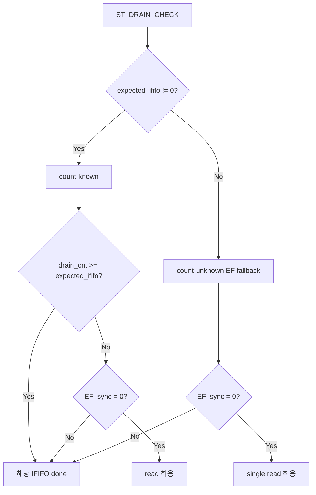
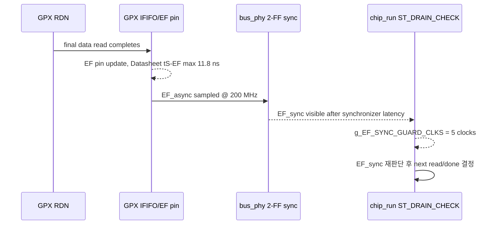
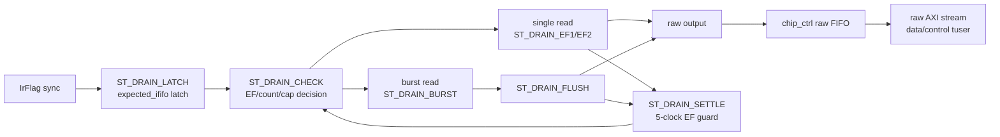

# C02_Chip_Acquisition Code Fix Result v001

문서 버전: `v001`  
작성일: `2026-04-30`  
최종 수정 시간: `2026-04-30 15:11:52 +09:00`  
작성 목적: `C02_Chip_Acquisition_Code_Fix_Plan_20260430_v004.md`를 기준으로 실제 RTL/TB 보완 내용, Datasheet 기준 판단, xsim 검증 결과, 남은 계약/주의점을 기록한다.

---

## 1. 기준과 결론

| 구분 | 내용 |
|---|---|
| 절대 기준 | `Doc/TDC-GPX-Datasheet.pdf`: Interface FIFO empty 상태에서 read 금지, EF/LF status pin 의미, GPX readout 40 MHz 이하 운용 |
| C01 인계 기준 | `C01_GPX_Bus_Read_20260429_v009.md`, `C02_Chip_Acquisition_C01_Handoff_20260430_v002.md` |
| C02 수정 기준 | `C02_Chip_Acquisition_Code_Fix_Plan_20260430_v004.md` |
| RTL 결과 | count-known drain hard bound, count-unknown EF fallback guard, raw `tuser` 주석 정합화 반영 |
| TB 결과 | 빈 IFIFO read 즉시 FAIL monitor, raw data/control beat 분리, raw `tuser` bit contract monitor 추가 |
| xsim 결과 | `tb_tdc_gpx_chip_ctrl` compile/elab/run PASS, `*** ALL TESTS PASSED *** (total_raw_words=231)` |

판단 결론:

1. `expected_ififo1/2`가 0이 아닌 경우는 count-known으로 보고, 해당 count 이상으로는 더 이상 IFIFO read를 발행하지 않도록 hard bound를 걸었다.
2. `expected_ififo1/2 = 0`은 echo_receiver 부재 또는 count unknown fallback 의미로 유지했다. 이 경우 burst를 쓰지 않고 EF sync 기반 single-read loop로 동작한다.
3. EF fallback은 Datasheet `tS-EF max 11.8 ns`와 200 MHz 2-FF synchronizer 지연을 고려해 read 후 EF 재판단 guard를 기본 5 clocks로 확장했다.
4. 테스트벤치는 기존 “sync latency extra read 허용” 관점을 제거하고, 모델 FIFO occupancy가 0인 순간 Reg8/Reg9 read가 1회라도 발생하면 실패하도록 강화했다.

---

## 2. RTL 변경 요약

| 변경 ID | 파일/근거 | 변경 내용 | 판단 근거 |
|---|---|---|---|
| C02-FIX-01 | `tdc_gpx_chip_run.vhd:79`, `:207` | `g_EF_SYNC_GUARD_CLKS` generic 추가, 기본 5 clocks | Datasheet `tS-EF max 11.8 ns`, 200 MHz `Tclk=5 ns`, 2-FF status sync 이후 판단 필요 |
| C02-FIX-02 | `tdc_gpx_chip_run.vhd:498-521` | expected count가 non-zero이면 count-known hard bound 적용 | empty IFIFO read 금지, C01 계약 C01-C11/C01-C14/C01-C21 |
| C02-FIX-03 | `tdc_gpx_chip_run.vhd:618-621` | mismatch fault는 expected count가 non-zero인 lane에만 적용 | expected=0은 count unknown fallback 의미이므로 정상 fallback drain을 faulted로 오판하지 않도록 분리 |
| C02-FIX-04 | `tdc_gpx_chip_ctrl.vhd:1033-1039` | raw control beat `tuser(0)`를 이전 raw-data IFIFO id가 아니라 `s_run_drain_done`으로 생성 | IFIFO1-done control은 `0`, final drain_done control은 `1`이어야 decoder/raw_event_builder가 shot boundary를 정확히 해석 |
| C02-FIX-05 | `tdc_gpx_raw_event_builder.vhd:27`, `tdc_gpx_cell_builder.vhd:85`, `:142` | `tuser[15:11] = shot_seq[4:0]` 주석 정합화 | Plan v004의 전체 AXI-stream `tuser` contract와 코드 구현 정합화 |

### 2.1 Count-Known Drain 판단식



주의: 현재 인터페이스에는 “expected count valid” bit가 없다. 따라서 `expected=0`은 “진짜 0개”와 “count unknown”을 구분하지 못한다. 본 수정은 기존 C02 계획에 맞춰 `expected=0`을 fallback encoding으로 유지한다. 추후 zero-count까지 count-known으로 엄격히 다루려면 `expected_valid` 계약이 별도 필요하다.

### 2.2 EF Fallback Timing Block



200 MHz 기준 5 clocks는 25 ns이다. `tS-EF max 11.8 ns` 자체는 3 clocks 이상이면 시간상 포괄되지만, C02에서는 status synchronizer와 decision point를 포함해 5 clocks를 기본값으로 둔다.

---

## 3. TB 변경 요약

| 변경 ID | 파일/근거 | 변경 내용 | 검증 목적 |
|---|---|---|---|
| C02-TB-01 | `tb_tdc_gpx_chip_ctrl.vhd:167-200`, `:259-260` | expected count signal을 TB에서 직접 구동 | count-known burst와 count-unknown fallback을 분리 검증 |
| C02-TB-02 | `tb_tdc_gpx_chip_ctrl.vhd:405-417` | Reg8/Reg9 read 시 모델 FIFO fill=0이면 assertion error 및 counter 증가 | Datasheet empty IFIFO read 금지 조건 검증 |
| C02-TB-03 | `tb_tdc_gpx_chip_ctrl.vhd:478-499` | raw data beat/control beat 분리, `tuser` reserved bit monitor 추가 | Plan v004 VB-C02-07 sideband contract 검증 |
| C02-TB-04 | `tb_tdc_gpx_chip_ctrl.vhd:592-602`, `:718-750` | `[2b] EF fallback drain` scenario 추가 | echo_receiver 부재 시 non-burst fallback 검증 |
| C02-TB-05 | `tb_tdc_gpx_chip_ctrl.vhd:1480-1505` | `[16]` global monitor summary 추가 | 전체 시나리오 동안 empty read 0, `tuser` error 0, IFIFO1-done/final-done control ID class 관측 보장 |

### 3.1 검증 시나리오 핵심 결과

| Scenario | 목적 | 기대 | xsim 결과 |
|---|---|---:|---|
| `[2]` Legacy count-known drain | FIFO1=8, FIFO2=4 | data 12, empty read 0 | PASS |
| `[2b]` EF fallback drain | expected=0/0, FIFO1=3, FIFO2=2 | data 5, empty read 0 | PASS |
| `[3]` Burst drain | FIFO1=16, FIFO2=8 | data 24, empty read 0 | PASS |
| `[4]` drain cap | cap=2, 8 reads/IFIFO | data 16, empty read 0 | PASS |
| `[7]` both EF=1 | FIFO1=0, FIFO2=0 | data 0 | PASS |
| `[9a]` minimum non-zero | FIFO1=1, FIFO2=1 | data 2, empty read 0 | PASS |
| `[9b]` full depth | FIFO1=32, FIFO2=32 | data 64, empty read 0 | PASS |
| `[16]` global monitor | 전체 run | empty read 0, tuser error 0, control ID class 관측 | PASS |

---

## 4. Latency / Throughput / Pipeline / II 영향

| 구분 | 수정 전 | 수정 후 | 영향 |
|---|---|---|---|
| Count-known latency | EF sync가 보일 때까지 추가 read 가능 | expected count 도달 시 즉시 IFIFO done 가능 | count-known에서는 불필요한 tail latency와 extra read 제거 |
| EF fallback latency | read 후 3 clocks settle | read 후 기본 5 clocks settle | count-unknown fallback에서 IFIFO 간 read 간격 증가 |
| Burst throughput | expected count가 있어야 burst 가능 | 동일. 단 hard bound가 더 명확 | count-known burst throughput 유지 |
| Non-burst throughput | single read + settle 반복 | single read + 5-clock guard 반복 | empty read 방지를 위해 II 증가 |
| II | bus read transaction latency + 3 settle | count-known: count hard bound, fallback: bus read transaction latency + 5 settle | fallback II는 보수화, count-known burst는 유지 |

### 4.1 Pipeline Block



---

## 5. xsim 검증 기록

실행 명령:

```powershell
& 'C:\Xilinx\2025.1\Vivado\bin\xvhdl.bat' --2008 .\tdc_gpx_pkg.vhd .\tdc_gpx_cfg_pkg.vhd .\tb_tdc_gpx_pkg.vhd .\tdc_gpx_chip_init.vhd .\tdc_gpx_chip_run.vhd .\tdc_gpx_chip_reg.vhd .\tdc_gpx_chip_ctrl.vhd .\tdc_gpx_bus_phy.vhd .\tb_tdc_gpx_chip_ctrl.vhd
& 'C:\Xilinx\2025.1\Vivado\bin\xelab.bat' --debug typical tb_tdc_gpx_chip_ctrl -s tb_tdc_gpx_chip_ctrl_sim
& 'C:\Xilinx\2025.1\Vivado\bin\xsim.bat' tb_tdc_gpx_chip_ctrl_sim -runall
```

최종 결과:

```text
PASS: [16] No IFIFO read occurred when the modeled FIFO was empty
PASS: [16] Raw AXI tuser contract clean
PASS: [16] Raw control beat IDs observed: ififo1_done=14 final_done=16
*** ALL TESTS PASSED *** (total_raw_words=231)
```

중간 검증에서 발견해 바로 수정한 문제:

| 항목 | 원인 | 조치 |
|---|---|---|
| `[9a]`가 data 4로 계산됨 | snapshot 변수가 `s_raw_word_cnt` 기준으로 남아 있어 이전 scenario data를 포함 | `s_raw_data_cnt` snapshot으로 수정 |
| `[15]` concurrent read/write가 empty IFIFO read로 검출됨 | test 목적은 reg read queue 확인인데 read addr가 Reg8(IFIFO1)이었음 | Reg0 read로 변경하여 IFIFO strict monitor와 목적 충돌 제거 |
| IFIFO1-done control beat가 `tuser(0)=1`로 관측됨 | `chip_ctrl` raw FIFO가 control beat ID를 이전 `s_run_ififo_id`에 의존 | control beat semantic에 맞춰 `s_run_drain_done`을 `tuser(0)`로 사용하고 `[16]`에서 ID class를 감시 |

---

## 6. 남은 계약과 주의점

1. `expected=0`은 현재 count unknown fallback encoding이다. “known zero”를 별도 검증하려면 `expected_valid` 또는 동등한 sideband/contract가 필요하다.
2. 본 검증은 `tb_tdc_gpx_chip_ctrl` 단위 PASS이다. C02 전체 close 전에는 `tb_tdc_gpx_config_ctrl`와 top/full integration에서 expected count CDC, downstream raw stream, error handler 전파를 추가 확인해야 한다.
3. 250 MHz retiming은 C02 구현 범위에서 제외했다. 본 결과는 200 MHz `i_tdc_clk` 기준이다.
4. OEN board option은 C02 본 수정 범위에 포함하지 않았다. C01/C02 계약대로 OEN connected와 OEN High fixed 계열만 후속 검토한다.

---

## 7. Lineage

| 이전 문서/계획 | 본 결과 반영 위치 |
|---|---|
| `C02_Chip_Acquisition_Code_Fix_Plan_20260430_v004.md` 목표 A | 본 문서 2.1, 3.1 `[2]`, `[2b]`, `[3]` |
| `C02_Chip_Acquisition_Code_Fix_Plan_20260430_v004.md` 목표 B | 본 문서 4, 4.1 |
| `C02_Chip_Acquisition_Code_Fix_Plan_20260430_v004.md` 목표 C | 본 문서 2.2 |
| `C02_Chip_Acquisition_Code_Fix_Plan_20260430_v004.md` VB-C02-02 | 본 문서 3 C02-TB-02, 3.1 `[16]` |
| `C02_Chip_Acquisition_Code_Fix_Plan_20260430_v004.md` VB-C02-07 | 본 문서 3 C02-TB-03, 5 xsim 결과 |
