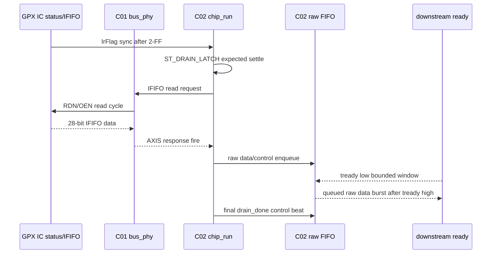

# C02_Chip_Acquisition Code Verify v001

문서 버전: `v001`  
작성일: `2026-04-30`  
최종 수정 시간: `2026-04-30 15:58:25 +09:00`  
작성 목적: Plan v004 / VB Closure v001에서 남아 있던 C02 검증 항목 중 `raw backpressure`, `stale expected-count`, `latency/throughput/pipeline/II`를 실제 xsim 증거로 보강하고, 검증 중 발견된 RTL 결함과 보완 결과를 기록한다.

---

## 1. 결론

이번 추가 검증은 PASS로 종료되었다.

검증 중 `expected_ififo`가 실제 GPX IFIFO fill보다 크게 들어온 경우, RTL이 EF 기준으로 빈 read는 막지만 최종 `drain_done`을 faulted로 표시하지 않는 결함을 발견했다. 이는 데이터 유실을 만들지는 않지만, echo_receiver/CDC count가 stale일 때 프레임 품질을 상위 제어로 전달하지 못하는 문제다.

보완 후 결과:

| 항목 | 결과 |
|---|---|
| bounded raw AXI backpressure | PASS |
| raw FIFO drop/overflow 없음 | PASS |
| stale expected-count에서 empty read 없음 | PASS |
| stale expected-count faulted `drain_done` 전파 | PASS |
| latency / pipeline / II 계측 | PASS |
| 전체 `tb_tdc_gpx_chip_ctrl` | `*** ALL TESTS PASSED *** (total_raw_words=256)` |

---

## 1.1 산출물

| 산출물 | 내용 |
|---|---|
| `C02_Chip_Acquisition_Code_Verify_20260430_v001.md` | 본 상세 검증 기록 |
| `C02_Chip_Acquisition_Code_Verify_20260430_v001.pptx` | 핵심 흐름/판단 공유용 PPT |
| `build_C02_Chip_Acquisition_Code_Verify_20260430_v001_ppt.js` | UTF-8 PPT 재생성 스크립트 |
| `C02_Chip_Acquisition_VB_Closure_Check_20260430_v002.md` | Plan v004 VB matrix 최신 상태 |

PPT 한글 검증:

```text
추가 검증 결과 : FOUND in slide1.xml
발견 결함과 보완 : FOUND in slide3.xml
Latency / Pipeline / II : FOUND in slide4.xml
VB Matrix 업데이트 : FOUND in slide5.xml
다음 검증 포커스 : FOUND in slide6.xml
double_question_count=0
```

---

## 2. 변경 요약

### 2.1 RTL 보완

파일: `tdc_gpx_chip_run.vhd`

| 위치 | 보완 내용 |
|---|---|
| `tdc_gpx_chip_run.vhd:323` | `v_drain_mismatch` 판단 변수를 추가 |
| `tdc_gpx_chip_run.vhd:524-534` | non-purge 완료 경로 전체에서 expected-vs-actual mismatch를 계산 |
| `tdc_gpx_chip_run.vhd:552-554` | 정상 completion 경로에서도 mismatch면 `s_err_drain_mismatch_r`와 `s_drain_done_faulted_r`를 set |
| `tdc_gpx_chip_run.vhd:633-643` | 기존 fallback completion mismatch 판정을 공통 변수로 정리 |

판단 근거:

- Datasheet 기준으로 EF는 IFIFO empty 의미다. 따라서 EF가 1이면 추가 read를 하지 않는 것이 우선이다.
- 다만 expected count가 non-zero인데 EF로 먼저 종료되면, 실제 read data는 안전하게 닫혔더라도 "예상 count와 실제 drain count 불일치" 상태다.
- 이 상태는 downstream data/control boundary에서 `tuser[5]=faulted`로 전달되어야 C02 이후 Cluster가 프레임 품질을 판정할 수 있다.

### 2.2 테스트벤치 보완

파일: `tb_tdc_gpx_chip_ctrl.vhd`

| 위치 | 보완 내용 |
|---|---|
| `tb_tdc_gpx_chip_ctrl.vhd:169-177` | raw/drop/faulted/error 출력 모니터 신호 추가 |
| `tb_tdc_gpx_chip_ctrl.vhd:209` | faulted control beat 카운터 추가 |
| `tb_tdc_gpx_chip_ctrl.vhd:657` | 실제 fill과 expected count를 분리하는 helper 추가 |
| `tb_tdc_gpx_chip_ctrl.vhd:1549-1665` | `[16]` bounded raw backpressure + latency/II 계측 추가 |
| `tb_tdc_gpx_chip_ctrl.vhd:1667-1710` | `[17]` stale expected-count mismatch 검증 추가 |
| `tb_tdc_gpx_chip_ctrl.vhd:1718-1751` | `[18]` global monitor summary 업데이트 |

---

## 3. 검증 결과

실행 명령:

```powershell
& 'C:\Xilinx\2025.1\Vivado\bin\xvhdl.bat' -2008 tdc_gpx_chip_run.vhd tdc_gpx_chip_ctrl.vhd tb_tdc_gpx_chip_ctrl.vhd
& 'C:\Xilinx\2025.1\Vivado\bin\xelab.bat' --debug typical tb_tdc_gpx_chip_ctrl -s tb_tdc_gpx_chip_ctrl_sim
& 'C:\Xilinx\2025.1\Vivado\bin\xsim.bat' tb_tdc_gpx_chip_ctrl_sim -runall
```

핵심 로그:

```text
PASS: [16] drain_done received under bounded raw backpressure, words=20
PASS: [16] data count exact 20 and no empty IFIFO reads
PASS: [16] raw FIFO absorbed bounded backpressure without drop
PASS: [16] latency/II measured: first_data=40clk, run_complete=167clk, output_done=168clk, output_hold=1clk, II_min=1clk, II_max=14clk
PASS: [17] stale expected count stopped at EF without empty read
PASS: [17] mismatch propagated via raw tuser fault flag and sticky
PASS: [18] No IFIFO read occurred when the modeled FIFO was empty
PASS: [18] Raw AXI tuser contract clean
PASS: [18] Raw/drop and PH_RESP_DRAIN fatal indicators clean
*** ALL TESTS PASSED *** (total_raw_words=256)
```

---

## 4. Latency / Throughput / Pipeline / II

검증 조건:

- 기준 clock: `i_tdc_clk = 200 MHz`, 1 clock = 5 ns
- raw output downstream backpressure: bounded stall window 적용
- 데이터량: IFIFO1 12 word + IFIFO2 8 word = 20 data word
- `bus_clk_div=1`, `bus_ticks=5`

| 계측 항목 | 결과 | 시간 환산 |
|---|---:|---:|
| GPX IrFlag pin assert -> first raw data accepted | 40 clk | 200 ns |
| GPX IrFlag pin assert -> chip_run internal drain complete | 167 clk | 835 ns |
| GPX IrFlag pin assert -> output `drain_done` accepted | 168 clk | 840 ns |
| internal drain complete -> output `drain_done` accepted | 1 clk | 5 ns |
| accepted raw data II min | 1 clk | 5 ns |
| accepted raw data II max | 14 clk | 70 ns |

해석:

- `II_min=1clk`는 GPX bus read II가 아니라 raw output FIFO가 backpressure 해제 후 이미 보유한 data를 연속 handshaking한 출력 측 II다.
- GPX IC read timing의 절대 기준은 C01에서 정한 Datasheet read timing과 bus_phy 설정이다.
- C02는 GPX IC를 더 빠르게 읽는 것이 아니라, C01 bus response를 받아 raw AXI output으로 전달하는 drain pipeline이다.

---

## 5. Timing Block



Timing 관찰값:

```text
T0  = GPX IrFlag pin assert
T1  = first raw data accepted              = T0 + 40 clk
T2  = chip_run internal drain complete     = T0 + 167 clk
T3  = final output drain_done accepted     = T0 + 168 clk
T3-T2 = raw output hold latency            = 1 clk
Output accepted-data II range              = 1..14 clk
```

---

## 6. VB Matrix 업데이트

| Boundary ID | 이번 검증 반영 |
|---|---|
| VB-C02-03 Count-known burst | stale expected-count가 실제 fill보다 큰 경우를 검증했다. EF가 우선하여 empty read를 막고, mismatch는 faulted control beat로 전파된다. |
| VB-C02-05 Pipeline/II | bounded backpressure 조건에서 latency / pipeline split / accepted-output II를 cycle 단위로 계측했다. |
| VB-C02-06 Response/backpressure | bounded raw output backpressure는 PASS. 단, PH_RESP_DRAIN stuck/fatal 장기 격리 검증은 아직 별도 항목이다. |
| VB-C02-08 Negative/fail propagation | stale expected mismatch의 fault propagation은 PASS. forced empty read 또는 forced `tuser` violation의 negative exit-code 검증은 아직 별도 항목이다. |
| VB-C02-10 Evidence boundary | 본 문서와 xsim 로그 기준으로 추가 증거가 생성되었다. |

아직 보류:

- forced empty read / forced `tuser` violation negative TB
- PH_RESP_DRAIN stuck/fatal 장기 격리 검증
- config_ctrl/top expected-count CDC integration 검증
- downstream 전체 AXI-stream `tuser` boundary 검증
- timing legality illegal combination clamp/assertion matrix

---

## 7. Lineage

| 기준 문서/결과 | 본 문서 반영 |
|---|---|
| `C02_Chip_Acquisition_Code_Fix_Plan_20260430_v004.md` | 목표 B, 기능 검증 경계 Matrix, latency/throughput/pipeline/II 요구를 추가 검증으로 반영 |
| `C02_Chip_Acquisition_VB_Closure_Check_20260430_v001.md` | 미검증/부분검증 항목 중 VB-C02-03/05/06/08/10을 보강 |
| `C02_Chip_Acquisition_Code_Fix_Result_20260430_v002.md` | 기존 PASS 범위에 추가 verification 결과를 누적 |
| `tdc_gpx_chip_run.vhd` | stale expected-count fault propagation 결함 보완 |
| `tb_tdc_gpx_chip_ctrl.vhd` | 추가 시나리오 `[16]`, `[17]`, `[18]`로 검증 |
