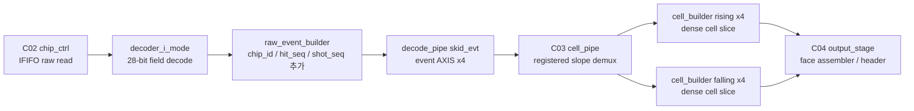
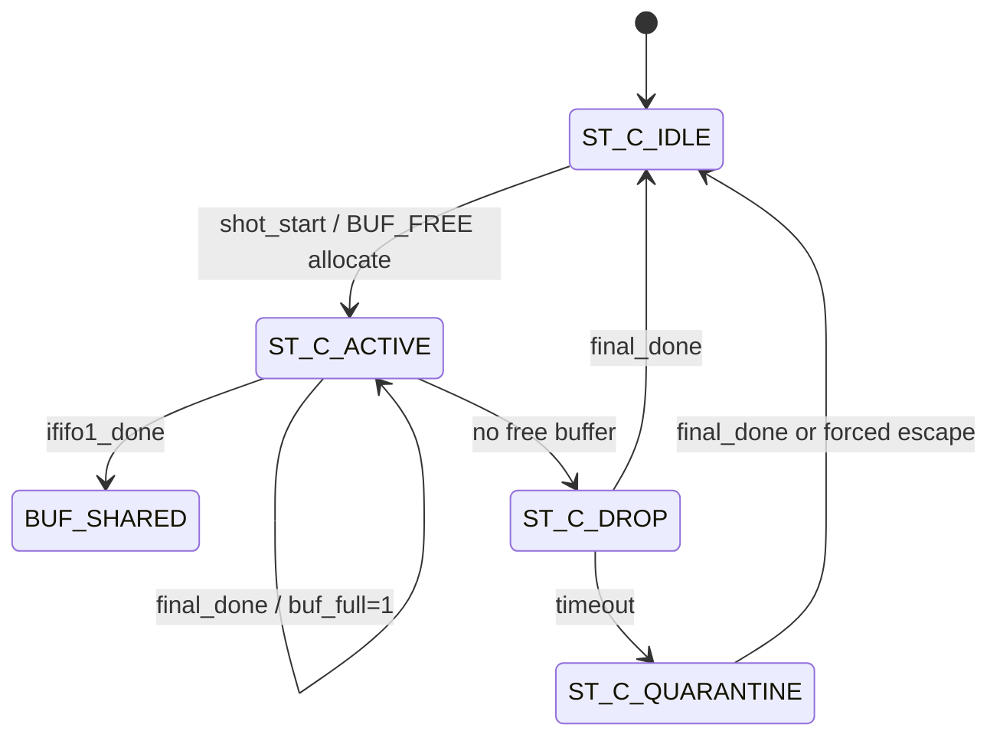
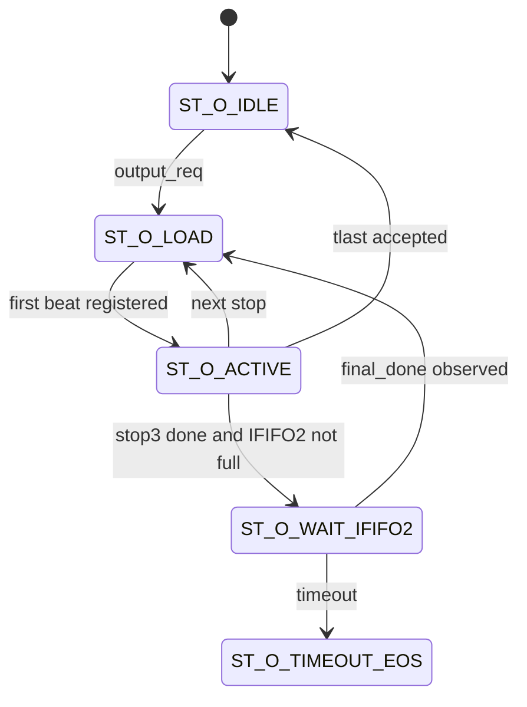
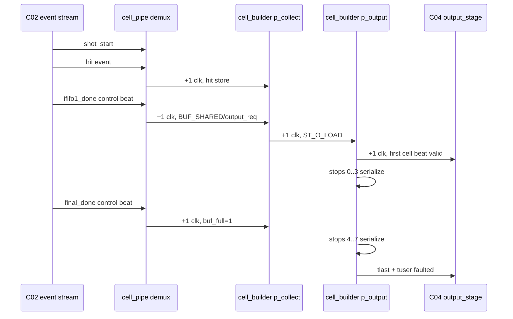

# C03 Cell Pipe Analysis v001

- Cluster: `C03_Cell_Pipe`
- 문서 목적: C02 decoded event stream을 `cell_pipe` / `cell_builder`가 어떻게 per-chip/per-slope cell slice로 변환하는지 분석하고, C03 보완 전 판단 근거를 기록한다.
- 작성 시간: `2026-05-01 02:22:23 +09:00`
- 최종 수정 시간: `2026-05-01 02:22:23 +09:00`
- 절대 기준: `Doc/TDC-GPX-Datasheet.pdf`
- 직전 문서:
  - `Doc/cluster_analysis/C02_Chip_Acquisition/C02_Chip_Acquisition_260501021013_C03_Handoff_v001.md`
  - `Doc/cluster_analysis/C03_Cell_Pipe/C03_Cell_Pipe_260501021013_Plan_v001.md`

---

## 1. 결론

C03는 구조적으로 다음 단계 분석과 보완으로 진행 가능하다. 다만 C03를 close 하기 전에는 아래 3개 위험을 먼저 닫아야 한다.

| ID | 판단 | 우선순위 | 요약 |
|---|---|---:|---|
| F-C03-01 | Finding | P1 | Datasheet I-Mode hit는 17-bit인데 현재 cell slot은 lower 16-bit만 저장한다. |
| F-C03-02 | Finding | P1 | `cell_pipe` registered ready가 1-cycle stale ready를 만들 수 있어, cell_builder가 not-ready일 때 event beat 손실 가능성이 있다. |
| F-C03-03 | Finding | P2 | per-slope abort는 cell_builder에는 들어가지만 demux holding register reset 조건에는 반영되지 않는다. |
| F-C03-04 | Verification Gap | P2 | 기존 `tb_tdc_gpx_cell_pipe`는 단일 rising happy path만 확인한다. C03 closure에는 부족하다. |

기존 xsim baseline은 PASS다. 하지만 검증 범위가 매우 좁으므로 C03 완료 증거로는 사용할 수 없고, "현재 정상 rising 1-hit 경로가 살아 있다"는 smoke test로만 본다.

---

## 2. Datasheet 기준

Datasheet 기준으로 C03가 보존해야 하는 I-Mode data structure는 다음과 같다.

| Datasheet 근거 | 내용 | C03 의미 |
|---|---|---|
| `Doc/TDC-GPX-Datasheet.pdf`, PDF page 20, section `1.7.2 Read registers` | I-Mode Register 8/9는 `IFIFO1/2` read word를 제공한다. bit 0..16은 time interval data, bit 17은 slope, bit 18..25는 Start#, bit 26..27은 ChaCode다. | C03 입력 event의 raw hit 원본 의미는 17-bit다. |
| `Doc/TDC-GPX-Datasheet.pdf`, PDF page 23, section `2.1 Block diagram I-Mode` | I-Mode는 Hit FIFO, pipelined post-processing, Interface FIFO 28x256, 28-bit data bus 구조다. | C03는 GPX post-processing 이후의 interface FIFO 결과를 cell로 재포장한다. |
| `Doc/TDC-GPX-Datasheet.pdf`, PDF page 25, section `2.3 I-Mode Basics` | I-Mode는 8 stop channels, selectable rising/falling edge sensitivity, Start# 기반 range 확장을 가진다. | C03는 stop별, slope별 hit 배열을 정확히 분리해야 한다. |
| `Doc/TDC-GPX-Datasheet.pdf`, PDF page 26, section `Internal Data Processing` | stop event raw value에 slope bit가 추가되고, post-processing이 Start selection, Stop-Start subtraction, Start# 추가를 수행한다. | C03에서 slope와 Start#/shot identity를 잃으면 downstream data 의미가 깨진다. |
| `Doc/TDC-GPX-Datasheet.pdf`, PDF page 27, section `2.4 Data structure` | 28-bit output 구조는 `ChaCode[27:26]`, `Start#[25:18]`, `Slope[17]`, `Hit[16:0]`이다. | `Hit[16]` 보존 여부는 C03에서 명시적으로 결정해야 한다. |
| `Doc/TDC-GPX-Datasheet.pdf`, PDF page 27 | Interface FIFO transfer rate는 40 MHz가 상한이다. | C03 내부 output 폭이 커져도 GPX read 자체의 상한은 바뀌지 않는다. |

---

## 3. C02 -> C03 -> C04 Data Flow



C03 입력 event stream은 `tdc_gpx_raw_event_builder.vhd`가 다음처럼 만든다.

| Field | 의미 | 근거 |
|---|---|---|
| `tdata[16:0]` | raw hit, 17-bit measurement | `tdc_gpx_raw_event_builder.vhd:63-65`, `tdc_gpx_raw_event_builder.vhd:146-159` |
| `tuser[0]` | slope, 1=rising, 0=falling | `tdc_gpx_raw_event_builder.vhd:66`, `tdc_gpx_raw_event_builder.vhd:160` |
| `tuser[2:1]` | chip_id | `tdc_gpx_raw_event_builder.vhd:67`, `tdc_gpx_raw_event_builder.vhd:161` |
| `tuser[5:3]` | stop_id_local | `tdc_gpx_raw_event_builder.vhd:68`, `tdc_gpx_raw_event_builder.vhd:162` |
| `tuser[5]` | drain_done beat에서 faulted flag | `tdc_gpx_raw_event_builder.vhd:69`, `tdc_gpx_raw_event_builder.vhd:140-142` |
| `tuser[6]` | ififo_id | `tdc_gpx_raw_event_builder.vhd:70`, `tdc_gpx_raw_event_builder.vhd:163` |
| `tuser[7]` | drain_done control beat | `tdc_gpx_raw_event_builder.vhd:71`, `tdc_gpx_raw_event_builder.vhd:129-143` |
| `tuser[10:8]` | hit_seq_local | `tdc_gpx_raw_event_builder.vhd:72`, `tdc_gpx_raw_event_builder.vhd:165` |
| `tuser[15:11]` | shot_seq[4:0] | `tdc_gpx_raw_event_builder.vhd:73`, `tdc_gpx_raw_event_builder.vhd:166` |

---

## 4. C03 구조 분석

### 4.1 cell_pipe

`tdc_gpx_cell_pipe.vhd`는 chip별 event stream을 slope별로 분리한다.

```mermaid
flowchart TD
    I["event AXIS per chip"] --> R["registered slope demux"]
    R -->|tuser[0]=1 or drain_done| CR["rise cell_builder"]
    R -->|tuser[0]=0 or drain_done| CF["fall cell_builder"]
    CR --> OR["rise cell slice"]
    CF --> OF["fall cell slice"]
```

핵심 코드 근거:

| 기능 | 근거 |
|---|---|
| output width는 32/64/128만 허용 | `tdc_gpx_cell_pipe.vhd:144-146` |
| drain_done은 양 slope로 전달되어야 함 | `tdc_gpx_cell_pipe.vhd:149-155` |
| tready는 register boundary로 닫힘 | `tdc_gpx_cell_pipe.vhd:181-193` |
| demux holding register가 valid/tdata/tuser를 저장 | `tdc_gpx_cell_pipe.vhd:196-237` |
| rising/falling builder x4 instance | `tdc_gpx_cell_pipe.vhd:287-346` |
| tuser faulted bit은 per-chip vector로 mapping | `tdc_gpx_cell_pipe.vhd:364-368` |

### 4.2 cell_builder

`tdc_gpx_cell_builder.vhd`는 하나의 chip, 하나의 slope에 대한 sparse event를 dense cell slice로 만든다.





핵심 코드 근거:

| 기능 | 근거 |
|---|---|
| dual buffer ownership | `tdc_gpx_cell_builder.vhd:249-257` |
| collect FSM | `tdc_gpx_cell_builder.vhd:467-861` |
| output FSM | `tdc_gpx_cell_builder.vhd:870-1059` |
| hit store와 overflow | `tdc_gpx_cell_builder.vhd:623-651` |
| IFIFO1 done -> `BUF_SHARED`, output start | `tdc_gpx_cell_builder.vhd:654-675` |
| final_done -> `buf_full`, faulted capture | `tdc_gpx_cell_builder.vhd:676-698` |
| shot_start 중 buffer switch/drop | `tdc_gpx_cell_builder.vhd:701-734` |
| output start에서 max_hits beat count latch | `tdc_gpx_cell_builder.vhd:915-945` |
| cell boundary, IFIFO2 wait | `tdc_gpx_cell_builder.vhd:976-985`, `tdc_gpx_cell_builder.vhd:1026-1052` |
| registered outputs | `tdc_gpx_cell_builder.vhd:1061-1073` |

---

## 5. Timing Diagram

정상 경로의 최소 timing은 아래처럼 해석한다. 기준 clock은 200 MHz, 5 ns다.



최소 latency 분해:

| 구간 | 최소 지연 | 의미 |
|---|---:|---|
| C03 input hit accepted -> cell buffer store | 1 clk | demux holding register를 거쳐 cell_builder가 저장 |
| C03 input `ififo1_done` accepted -> first output valid | 약 3 clk | demux 1 clk, collect output_req 1 clk, output LOAD 1 clk |
| output request -> first output valid | 1 clk | `ST_O_IDLE -> ST_O_LOAD -> ST_O_ACTIVE` |
| same-cell beat interval | II=1 | `i_m_axis_tready=1`이면 beat마다 연속 출력 |
| cell boundary | 1 invalid cycle | 다음 stop cell을 `ST_O_LOAD`에서 다시 MUX |
| stop3 -> stop4 | 0 또는 wait | IFIFO2 final_done이 이미 오면 진행, 아니면 `ST_O_WAIT_IFIFO2` |

---

## 6. Latency / Throughput / Pipeline / II

### 6.1 Cell Beat 공식

현재 C03 cell format은 16-bit hit slot과 1 metadata beat로 구성된다.

```text
Bcell(max_hits, W) = ceil(max_hits / (W / 16)) + 1 metadata beat
```

근거:

| 항목 | 근거 |
|---|---|
| 16-bit hit slot | `tdc_gpx_pkg.vhd:50`, `tdc_gpx_pkg.vhd:609-610` |
| 17-bit raw event | `tdc_gpx_pkg.vhd:589` |
| runtime helper | `tdc_gpx_pkg.vhd:805-820` |
| output start에서 latch | `tdc_gpx_cell_builder.vhd:936-944` |

| max_hits | Bcell 32-bit | Bcell 64-bit | Bcell 128-bit |
|---:|---:|---:|---:|
| 1 | 2 | 2 | 2 |
| 3 | 3 | 2 | 2 |
| 5 | 4 | 3 | 2 |
| 7 | 5 | 3 | 2 |

### 6.2 Chip Slice Throughput

아래 표는 `stops_per_chip=8`, output ready 항상 1, IFIFO2 wait 없음 기준이다.

`cell-stream cycles = valid beats + inter-cell bubbles`, 여기서 inter-cell bubble은 stop cell 사이 7개다. output_req setup 1 clk와 downstream stall은 제외했다.

| max_hits | width | valid beats/chip/slope | cell-stream cycles | 200 MHz 시간 |
|---:|---:|---:|---:|---:|
| 1 | 32/64/128 | 16 | 23 | 115 ns |
| 3 | 32 | 24 | 31 | 155 ns |
| 3 | 64/128 | 16 | 23 | 115 ns |
| 5 | 32 | 32 | 39 | 195 ns |
| 5 | 64 | 24 | 31 | 155 ns |
| 5 | 128 | 16 | 23 | 115 ns |
| 7 | 32 | 40 | 47 | 235 ns |
| 7 | 64 | 24 | 31 | 155 ns |
| 7 | 128 | 16 | 23 | 115 ns |

해석:

- 128-bit는 현재 16-bit slot, max_hits<=7 구조에서 모든 hit slot과 metadata가 2 beat/cell로 끝난다.
- 64-bit는 max_hits 1~4에서는 2 beat/cell, max_hits 5~7에서는 3 beat/cell이다.
- 32-bit는 max_hits에 따라 2~5 beat/cell로 증가한다.
- C03 내부 cell stream에는 stop cell 사이 1-cycle bubble이 있다. C04/final AXIS에서 보이는 frame beat 수와 C03 cell stream valid cycle 수는 같은 값이 아니다.

### 6.3 II

| 구간 | II 판단 | 조건 |
|---|---|---|
| event accept, best case | II=1 per chip | target slope builder가 ready이고 demux holding slot이 비어 있음 |
| drain_done accept | 양 slope ready 필요 | drain_done은 rise/fall 양쪽 builder로 복제됨 |
| same-cell output beat | II=1 | `i_m_axis_tready=1` |
| cell boundary | 1-cycle bubble | 다음 stop cell load를 위해 `ST_O_LOAD`가 필요 |
| shot-level II | dual buffer가 결정 | 다른 buffer가 free면 다음 shot collect 가능, 둘 다 busy면 drop |
| IFIFO1/2 split | data-dependent wait | stop3 이후 IFIFO2 final_done까지 `ST_O_WAIT_IFIFO2` 가능 |

---

## 7. Code Review Findings

### F-C03-01: 17-bit raw hit가 16-bit cell slot으로 잘린다

- Priority: P1
- 근거:
  - Datasheet PDF page 20, 27: I-Mode `Hit`는 bit 0..16, 17-bit다.
  - `tdc_gpx_pkg.vhd:50`: `c_HIT_SLOT_DATA_WIDTH = 16`
  - `tdc_gpx_pkg.vhd:589`: raw event는 17-bit다.
  - `tdc_gpx_cell_builder.vhd:644`: `i_s_axis_tdata(c_HIT_SLOT_DATA_WIDTH - 1 downto 0)`만 저장한다.
- 영향:
  - `Hit[16]`이 1인 거리/시간 구간에서 cell payload가 wrap 또는 손실된다.
  - 16-bit slot 기준 81 ps BIN이면 약 5.3 us까지만 직접 보존된다. 더 긴 range는 Start# 또는 별도 metadata 보존 없이 복원할 수 없다.
- 제안:
  - C03에서 `Hit[16]`을 metadata flag로 보존할지, slot을 17-bit/18-bit로 확장할지, 또는 운용 range를 16-bit 이내로 제한할지 결정해야 한다.

### F-C03-02: cell_pipe registered ready가 stale-ready beat loss를 만들 수 있다

- Priority: P1
- 근거:
  - `tdc_gpx_cell_pipe.vhd:170-179`: `s_can_accept_comb`는 현재 valid/free/tuser로 계산된다.
  - `tdc_gpx_cell_pipe.vhd:181-193`: `o_evt_sk_tready`는 `s_can_accept_r`로 1-clock register 된다.
  - `tdc_gpx_cell_pipe.vhd:196-237`: 실제 load는 현재 cycle의 `v_can_load`가 true일 때만 수행된다.
- 위험 시나리오:
  - 직전 cycle 기준 ready가 1로 register 되어 upstream은 현재 beat를 accepted로 본다.
  - 같은 cycle에 demux holding slot이 full이고 cell_builder ready가 0이면 `v_can_load=false`라서 beat가 저장되지 않는다.
  - AXI handshake 관점에서는 accepted 되었지만 내부 register에는 들어가지 않아 data loss가 가능하다.
- 제안:
  - C03 보완 단계에서 기존 skid/sync FIFO 패턴을 사용해 demux 앞 또는 slope별 builder 입력에 2-entry skid를 두거나, registered-ready와 load condition이 같은 계약을 보장하도록 구조를 바꾼다.
  - stale-ready negative TB를 C03 전용으로 추가한다.

### F-C03-03: per-slope abort가 demux holding register를 clear하지 않는다

- Priority: P2
- 근거:
  - `tdc_gpx_cell_pipe.vhd:159-160`: `s_abort_rise/fall`은 per-slope abort를 OR한다.
  - `tdc_gpx_cell_pipe.vhd:185`, `tdc_gpx_cell_pipe.vhd:200`: tready register와 demux valid reset은 global `i_abort`만 본다.
  - `tdc_gpx_cell_pipe.vhd:300-332`: per-slope abort는 cell_builder에는 전달된다.
- 영향:
  - rise-only 또는 fall-only abort 시 해당 slope builder는 reset되지만 demux holding register의 stale valid/data는 남을 수 있다.
  - abort 해제 후 stale beat가 새 shot으로 재주입될 가능성이 있다.
- 제안:
  - rise/fall holding register clear 조건에 `s_abort_rise/fall`을 반영하거나, slope별 demux register를 분리 reset한다.
  - per-slope abort negative TB를 추가한다.

### F-C03-04: 기존 C03 TB는 closure 기준으로 부족하다

- Priority: P2
- 근거:
  - `tb_tdc_gpx_cell_pipe.vhd:6-10`: 단일 rising hit + drain_done sequence만 설명한다.
  - `tb_tdc_gpx_cell_pipe.vhd:29-31`: 64-bit 단일 폭만 사용한다.
  - `tb_tdc_gpx_cell_pipe.vhd:291-294`: rising output/tlast/faulted tuser만 PASS 조건이다.
  - baseline xsim: `xsim_c03_cell_pipe_base.log:28` PASS.
- 부족한 검증:
  - falling slope
  - 32/64/128 width matrix
  - max_hits 1/3/5/7 matrix
  - stale ready/backpressure
  - dual buffer next-shot II
  - IFIFO2 wait/timeout
  - shot drop/quarantine
  - 17-bit hit preservation decision

---

## 8. C03 보완 방향

우선순위는 다음과 같이 제안한다.

| 순서 | 목표 | 내용 |
|---:|---|---|
| 1 | Data contract 결정 | 17-bit raw hit 보존 방식을 결정한다. |
| 2 | Handshake 안전화 | `cell_pipe` demux ready/valid를 skid 기반으로 보완한다. |
| 3 | Abort 안전화 | per-slope abort가 demux holding register까지 clear하도록 보완한다. |
| 4 | TB 확장 | width/max_hits/backpressure/dual-buffer/timeout matrix를 추가한다. |
| 5 | Timing 재측정 | 수정 후 latency/throughput/pipeline/II를 xsim log로 닫는다. |

---

## 9. 사용자 확인 필요

| ID | 질문 | 선택이 필요한 이유 |
|---|---|---|
| Q-C03-U01 | `Hit[16]`을 C03 cell payload에 반드시 보존할 것인가? | full distance/range 복원 가능성을 결정한다. |
| Q-C03-U02 | 보존한다면 slot width를 17/18-bit로 키울지, metadata bit로 분리할지 결정이 필요하다. | 32/64/128 beat 산출식과 C04 parser/header 계약이 바뀐다. |
| Q-C03-U03 | C03 보완에서 기존 skid buffer를 재사용하는 방향으로 진행해도 되는가? | F-C03-02를 가장 명확하게 닫는 방법이다. |
| Q-C03-U04 | C03 TB matrix를 별도 TB로 만들지, 기존 `tb_tdc_gpx_cell_pipe`를 확장할지 결정이 필요하다. | 유지보수성과 regression 시간이 달라진다. |

---

## 10. v001 판단

C03 Analysis v001의 판단은 다음과 같다.

1. Datasheet 기준 raw hit 17-bit와 RTL cell slot 16-bit 사이에는 실제 계약 차이가 있다.
2. C03 pipeline은 구조적으로 잘 분리되어 있지만, registered ready가 AXI handshake를 완전히 보장하는지 추가 보완이 필요하다.
3. per-slope abort는 cell_builder만 reset하고 demux holding register는 global abort만 본다.
4. 기존 C03 TB PASS는 smoke test로만 인정한다.
5. 다음 단계는 `C03_Cell_Pipe_Code_Fix_Plan_v001`을 만들고, 사용자 확인 후 코드/TB 보완으로 진행하는 것이 맞다.
