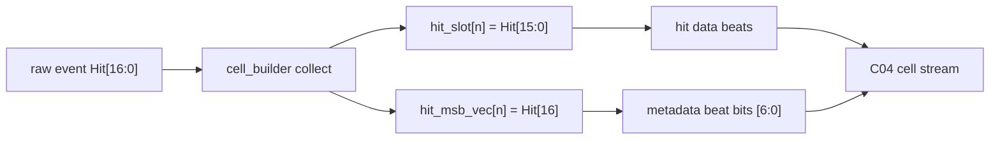
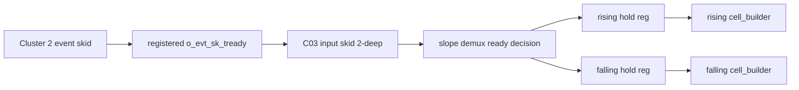

# C03 Cell Pipe 보완 결과 v001

- 생성 시간: `2026-05-01 02:45:04 +09:00`
- 최종 수정 시간: `2026-05-01 02:49:45 +09:00`
- 절대 기준: `Doc/TDC-GPX-Datasheet.pdf`
- 직전 분석 문서: `Doc/cluster_analysis/C03_Cell_Pipe/C03_Cell_Pipe_260501022223_Analysis_v001.md`
- RTL 수정 대상:
  - `tdc_gpx_pkg.vhd`
  - `tdc_gpx_cell_builder.vhd`
  - `tdc_gpx_cell_pipe.vhd`
- 검증 대상:
  - `tb_tdc_gpx_cell_pipe.vhd`
  - `tb_tdc_gpx_cell_pipe_c03_fix.vhd`
  - `xsim_c03_cell_pipe_smoke.log`
  - `xsim_c03_cell_pipe_fix.log`

---

## 1. 결론

C03 Cell Pipe 보완은 다음 3개 계약을 RTL에 반영하고 xsim으로 PASS 확인했다.

| 항목 | 상태 | 결과 |
|---|---|---|
| F-C03-01 | 반영 완료 | Datasheet I-Mode `Hit[16:0]` 중 `Hit[16]`을 cell metadata `hit_msb_vec[6:0]`로 보존한다. |
| F-C03-02 | 반영 완료 | `cell_pipe` 입력에 `tdc_gpx_skid_buffer`를 추가해 Cluster 2/3 경계 ready를 register boundary로 닫고 stale-ready 수락 beat를 보존한다. |
| F-C03-03 | 반영 완료 | per-slope abort 시 demux holding register를 해당 slope별로 clear하고, abort 중인 slope beat는 pop/drop 처리한다. |
| F-C03-04 | 보강 완료 | 전용 regression TB를 추가해 `Hit[16]`, pre-shot hold, per-slope abort stale clear를 검증했다. |

C03는 현재 기준으로 C04 진입 가능하지만, C04에서는 cell metadata bit layout을 parser와 문서 계약으로 받아야 한다.

---

## 2. Datasheet 기준과 RTL 계약

Datasheet 기준은 C03 판단의 절대 기준이다. C03가 다루는 I-Mode output data structure는 28-bit이며, 직전 분석 문서에서 추적한 근거는 다음과 같다.

| Datasheet 근거 | 내용 | C03 반영 |
|---|---|---|
| `Doc/TDC-GPX-Datasheet.pdf`, PDF page 20, section `1.7.2 Read registers` | I-Mode Register 8/9는 `IFIFO1/2` read word를 제공하며 bit 0..16이 time interval data다. | raw event의 hit 원본은 17-bit로 취급한다. |
| `Doc/TDC-GPX-Datasheet.pdf`, PDF page 27, section `2.4 Data structure` | 28-bit output 구조는 `ChaCode[27:26]`, `Start#[25:18]`, `Slope[17]`, `Hit[16:0]`이다. | `Hit[16]` 손실은 허용하지 않고 metadata로 분리 보존한다. |

기존 `c_HIT_SLOT_DATA_WIDTH = 16`은 그대로 유지한다. 이유는 32/64/128-bit output width별 beat 산출식과 throughput 이득을 유지하면서, metadata 예약 영역으로 7개 hit slot의 MSB를 보존할 수 있기 때문이다.

---

## 3. 수정 상세

### 3.1 Hit[16] metadata 보존

변경 전에는 `tdc_gpx_cell_builder`가 `i_s_axis_tdata(15 downto 0)`만 `hit_slot`에 저장했다. 따라서 Datasheet상 `Hit[16]`이 1인 raw hit는 C03 cell payload에서 손실될 수 있었다.

변경 후 구조는 다음과 같다.



metadata beat 계약은 다음과 같다.

| Bit range | 의미 |
|---:|---|
| `[31:25]` | `hit_valid[6:0]` |
| `[24:18]` | `slope_vec[6:0]` |
| `[17:16]` | reserved |
| `[15:12]` | `hit_count_actual` |
| `[11]` | `hit_dropped` |
| `[10]` | `error_fill` |
| `[9:8]` | `chip_id` |
| `[7]` | reserved |
| `[6:0]` | `hit_msb_vec[6:0]`, 각 hit slot의 `Hit[16]` |

추적 근거:

| 파일 | 근거 |
|---|---|
| `tdc_gpx_pkg.vhd:48-50` | `Hit[16]`을 metadata `hit_msb_vec[6:0]`로 보존한다고 명시 |
| `tdc_gpx_pkg.vhd:610-619` | `t_cell`에 `hit_msb_vec` 필드 추가 |
| `tdc_gpx_pkg.vhd:629` | `c_CELL_INIT`에서 `hit_msb_vec` 초기화 |
| `tdc_gpx_cell_builder.vhd:399-403` | metadata bit layout 주석 추가 |
| `tdc_gpx_cell_builder.vhd:428` | metadata `[6:0]`에 `cell.hit_msb_vec` serialize |
| `tdc_gpx_cell_builder.vhd:653` | collect 시 `i_s_axis_tdata(16)`을 `hit_msb_vec(v_seq)`에 저장 |

### 3.2 cell_pipe stale-ready 보강

변경 전 구조는 `s_can_accept_r`를 1-clock register로 만들어 외부 `o_evt_sk_tready`를 닫았지만, 내부 demux slot이 같은 cycle에 받을 수 없는 상태로 바뀌면 이미 수락된 beat가 저장되지 않을 수 있었다.

변경 후에는 `cell_pipe` 입력에 `tdc_gpx_skid_buffer`를 직접 배치했다. 외부 ready는 skid buffer가 등록 신호로 제공하고, demux는 skid output과 handshake한다.



추적 근거:

| 파일 | 근거 |
|---|---|
| `tdc_gpx_cell_pipe.vhd:105-110` | input skid output 신호 추가 |
| `tdc_gpx_cell_pipe.vhd:171-187` | `u_evt_in_skid` 인스턴스 추가 |
| `tdc_gpx_cell_pipe.vhd:200-203` | skid output beat에 대한 demux ready 산출 |
| `tdc_gpx_cell_pipe.vhd:226-228` | skid에서 pop된 beat만 demux holding register로 적재 |

### 3.3 per-slope abort 보강

변경 전에는 `i_abort_rise/fall`이 cell_builder에는 들어가지만, demux holding register clear 조건은 global `i_abort`만 보았다. 그래서 slope-only abort 뒤에 demux register의 stale beat가 다시 builder로 들어갈 수 있었다.

변경 후에는 slope별로 clear 조건을 분리했다.

| 상황 | 동작 |
|---|---|
| `i_abort_rise = 1` | rising demux valid clear, rising target beat는 pop/drop |
| `i_abort_fall = 1` | falling demux valid clear, falling target beat는 pop/drop |
| drain_done beat + 한쪽 slope abort | abort되지 않은 slope에만 전달 |
| global `i_abort = 1` | input skid flush 및 양쪽 demux valid clear |

추적 근거:

| 파일 | 근거 |
|---|---|
| `tdc_gpx_cell_pipe.vhd:214-221` | downstream handshake 또는 matching slope abort로 valid clear |
| `tdc_gpx_cell_pipe.vhd:226-250` | abort 중인 slope는 beat를 re-issue하지 않음 |

---

## 4. Timing / Latency / Throughput / Pipeline / II

### 4.1 Pipeline 변화

| 구간 | 변경 전 | 변경 후 | 영향 |
|---|---|---|---|
| C2 event output -> C3 demux | registered ready + demux holding register | input skid 2-deep + demux holding register | boundary 안정성 증가 |
| demux -> cell_builder | slope별 holding register | 동일 | slope 분리 유지 |
| cell_builder collect -> output serializer | 동일 | 동일 | output beat 수 변화 없음 |
| metadata serialization | `Hit[16]` 없음 | metadata `[6:0]`에 `hit_msb_vec` 추가 | beat 수 변화 없음 |

### 4.2 Latency

입력 skid가 추가되어 C2 event beat가 demux에 도달하는 최단 latency는 +1 clock 증가한다. 그러나 `cell_builder`는 `shot_start`와 drain sequence에 의해 출력이 결정되므로, 실제 row/face latency에서는 C03 input boundary 안정화 비용으로 해석한다.

| Metric | 변경 후 값 |
|---|---|
| C2/C3 boundary latency | +1 clock |
| demux holding latency | 기존과 동일, target builder ready에 따라 0 또는 대기 |
| cell output latency | 기존 serializer FSM과 동일 |
| metadata 위치 | runtime last beat 유지 |

### 4.3 Throughput

`Hit[16]`을 metadata에 싣기 때문에 hit data slot 폭은 16-bit로 유지된다. 따라서 32/64/128-bit output width별 beat 수는 변하지 않는다.

| Output width | `max_hits=7` 기준 cell beat 수 | 비고 |
|---:|---:|---|
| 32-bit | 5 beats | hit data 4 + metadata 1 |
| 64-bit | 3 beats | hit data 2 + metadata 1 |
| 128-bit | 2 beats | hit data 1 + metadata 1 |

### 4.4 II, Initiation Interval

| 위치 | II 판단 |
|---|---|
| C2 -> C3 input skid | downstream ready 유지 시 II=1 |
| skid -> demux | target slope free 또는 abort-drop 가능 시 II=1 |
| demux -> cell_builder | cell_builder `ST_C_ACTIVE` ready 유지 시 II=1 |
| output serializer | output tready 유지 시 1 beat/clk |

stale-ready 보강은 정상 steady-state II=1을 깨지 않는다. 다만 skid가 비어 있는 최초 beat는 register boundary 때문에 demux 관점에서 +1 clock latency가 추가된다.

---

## 5. 검증 결과

### 5.1 실행 명령

```powershell
& 'C:\AMDDesignTools\2025.2.1\Vivado\bin\xvhdl.bat' --2008 .\tdc_gpx_pkg.vhd .\tdc_gpx_skid_buffer.vhd .\tdc_gpx_cell_builder.vhd .\tdc_gpx_cell_pipe.vhd .\tb_tdc_gpx_cell_pipe.vhd .\tb_tdc_gpx_cell_pipe_c03_fix.vhd
& 'C:\AMDDesignTools\2025.2.1\Vivado\bin\xelab.bat' tb_tdc_gpx_cell_pipe -s tb_tdc_gpx_cell_pipe_c03_smoke
& 'C:\AMDDesignTools\2025.2.1\Vivado\bin\xsim.bat' tb_tdc_gpx_cell_pipe_c03_smoke -runall --log xsim_c03_cell_pipe_smoke.log
& 'C:\AMDDesignTools\2025.2.1\Vivado\bin\xelab.bat' tb_tdc_gpx_cell_pipe_c03_fix -s tb_tdc_gpx_cell_pipe_c03_fix
& 'C:\AMDDesignTools\2025.2.1\Vivado\bin\xsim.bat' tb_tdc_gpx_cell_pipe_c03_fix -runall --log xsim_c03_cell_pipe_fix.log
```

### 5.2 PASS 근거

| 로그 | 근거 |
|---|---|
| `xsim_c03_cell_pipe_smoke.log:28` | 기존 smoke TB PASS |
| `xsim_c03_cell_pipe_fix.log:36` | C03 보완 regression PASS |

### 5.3 새 regression 범위

| Case | 검증 내용 | 근거 |
|---|---|---|
| Case 1 | `Hit[16]` 패턴 `1010101`을 metadata `[6:0]`으로 확인 | `tb_tdc_gpx_cell_pipe_c03_fix.vhd:250-264` |
| Case 1 | 첫 hit를 `shot_start` 전 수락한 뒤, input skid와 demux hold를 거쳐 보존 | `tb_tdc_gpx_cell_pipe_c03_fix.vhd:250-264` |
| Case 2 | falling hit 2개를 `shot_start` 전 수락한 뒤 fall-only abort로 제거 | `tb_tdc_gpx_cell_pipe_c03_fix.vhd:266-275` |
| Case 2 | abort 후 falling metadata의 `hit_valid`, `hit_msb_vec`, `hit_count`가 모두 0인지 확인 | `tb_tdc_gpx_cell_pipe_c03_fix.vhd:225-243` |

---

## 6. C04로 넘길 계약

| 계약 ID | 내용 | C04 수락 필요 여부 |
|---|---|---|
| C03-C04-01 | Cell metadata `[6:0]`은 `hit_msb_vec[6:0]`이며 각 slot의 Datasheet `Hit[16]`이다. | 필요 |
| C03-C04-02 | `Hit[15:0]`은 기존 16-bit hit slot data beat에 유지된다. | 필요 |
| C03-C04-03 | Downstream parser는 full hit를 `Hit[16] & Hit[15:0]`으로 복원해야 한다. | 필요 |
| C03-C04-04 | 32/64/128-bit output width별 beat count는 변경되지 않는다. | 필요 |
| C03-C04-05 | per-slope abort 후 해당 slope의 stale demux beat는 출력 cell metadata에 남지 않는다. | 참고 |

---

## 7. 다음 단계

1. C04 진입 전 parser/header/face assembly 문서에서 metadata `[6:0] = hit_msb_vec` 계약을 수락한다.
2. C04 분석에서 blank-fill metadata의 `[6:0] = 0` 의미를 명시한다.
3. C04 regression에서 32/64/128-bit 폭별 metadata `[6:0]` 전달 보존을 확인한다.
