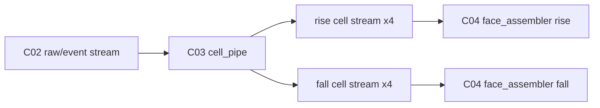
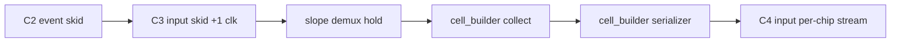

# C03 Cell Pipe -> C04 Output Stage 인계 문서 v001

- 생성 시간: `2026-05-01 02:52:21 +09:00`
- 최종 수정 시간: `2026-05-01 02:52:21 +09:00`
- 절대 기준: `Doc/TDC-GPX-Datasheet.pdf`
- 직전 문서:
  - `Doc/cluster_analysis/C03_Cell_Pipe/C03_Cell_Pipe_260501022223_Analysis_v001.md`
  - `Doc/cluster_analysis/C03_Cell_Pipe/C03_Cell_Pipe_260501024504_Fix_Result_v001.md`
- 관련 커밋: `fff793d fix: close C03 cell pipe contracts`
- 다음 Cluster: `C04_Output_Stage`

---

## 1. C03 종료 판단

C03에서 더 검토할 미결 P1/P2 항목은 현재 기준으로 없다. 단, C03에서 새로 확정된 cell metadata 계약은 C04에서 반드시 수락해야 한다.

| C03 항목 | 상태 | 종료 근거 |
|---|---|---|
| F-C03-01 `Hit[16]` 손실 | Close | `tdc_gpx_pkg.vhd:619`, `tdc_gpx_cell_builder.vhd:428`, `tdc_gpx_cell_builder.vhd:653` |
| F-C03-02 stale-ready beat loss | Close | `tdc_gpx_cell_pipe.vhd:171-187`, `tdc_gpx_cell_pipe.vhd:200-203`, `tdc_gpx_cell_pipe.vhd:226-228` |
| F-C03-03 per-slope abort stale hold | Close | `tdc_gpx_cell_pipe.vhd:214-221`, `tdc_gpx_cell_pipe.vhd:226-250` |
| F-C03-04 TB 부족 | Close | `tb_tdc_gpx_cell_pipe_c03_fix.vhd`, `xsim_c03_cell_pipe_fix.log:36` |

검증 결과:

| 로그 | 결과 |
|---|---|
| `xsim_c03_cell_pipe_smoke.log:28` | 기존 smoke PASS |
| `xsim_c03_cell_pipe_fix.log:36` | `Hit[16]`, input skid, per-slope abort regression PASS |

---

## 2. Datasheet 기준

Datasheet가 C03/C04 계약의 최상위 기준이다.

| Datasheet 근거 | 내용 | 인계 의미 |
|---|---|---|
| `Doc/TDC-GPX-Datasheet.pdf`, PDF page 20, section `1.7.2 Read registers` | I-Mode IFIFO read word에서 bit 0..16이 time interval data다. | C04는 C03가 보존한 `Hit[16:0]` 의미를 훼손하지 않아야 한다. |
| `Doc/TDC-GPX-Datasheet.pdf`, PDF page 27, section `2.4 Data structure` | 28-bit output은 `ChaCode[27:26]`, `Start#[25:18]`, `Slope[17]`, `Hit[16:0]`이다. | C04 parser/VDMA 소비자는 `Hit[16] & Hit[15:0]` 복원 계약을 알아야 한다. |
| `Doc/TDC-GPX-Datasheet.pdf`, PDF page 27 | Interface FIFO transfer rate 상한은 40 MHz다. | C04 output width가 커져도 GPX read 속도 상한 자체는 바뀌지 않는다. |

---

## 3. C03가 C04로 넘기는 데이터 계약

### 3.1 Cell Stream 구조



C03 output cell stream은 chip별, slope별 AXI4-Stream이다.

| Signal | 의미 | C04 수락 필요 |
|---|---|---|
| `tdata` | cell beat payload, width = `g_OUTPUT_WIDTH` = 32/64/128 | 필요 |
| `tvalid/tready` | per-chip cell stream handshake | 필요 |
| `tlast` | chip slice 마지막 beat | 필요 |
| `tuser(0)` | chip slice faulted flag, `tlast`와 동행 | 필요 |

### 3.2 Cell Metadata bit layout

C03에서 확정된 metadata beat layout은 다음과 같다.

| Bit range | 의미 | C04 동작 |
|---:|---|---|
| `[31:25]` | `hit_valid[6:0]` | 그대로 전달 |
| `[24:18]` | `slope_vec[6:0]` | 그대로 전달 |
| `[17:16]` | reserved | 0 유지 기대 |
| `[15:12]` | `hit_count_actual` | 그대로 전달 |
| `[11]` | `hit_dropped` | 그대로 전달 |
| `[10]` | `error_fill` | blank-fill 판단에 사용 가능 |
| `[9:8]` | `chip_id` | C04 blank-fill 생성 시 동일 계약 유지 |
| `[7]` | reserved | 0 유지 기대 |
| `[6:0]` | `hit_msb_vec[6:0] = Hit[16] per hit slot` | C04 최종 output까지 보존 |

### 3.3 Full Hit 복원 계약

각 hit slot의 full hit는 다음과 같이 복원한다.

```text
hit_full[n] = metadata.hit_msb_vec[n] & hit_slot[n][15:0]
```

C04는 cell data를 재포장하거나 FIFO/header를 거쳐도 이 bit layout을 바꾸면 안 된다.

---

## 4. Timing / Latency / Throughput / Pipeline / II 인계

### 4.1 C03 종료 시점 Pipeline



### 4.2 C04가 이어서 검토해야 할 Metric

| Metric | C03에서 확정 | C04 확인 필요 |
|---|---|---|
| Latency | C2/C3 boundary input skid로 +1 clk | face_assembler scan/resolve/forward, FIFO, header prefix latency |
| Throughput | 32/64/128-bit cell beat 수 유지 | face row output과 header 포함 VDMA line throughput |
| Pipeline | cell stream은 slope/chip별 register boundary로 출력 | face_assembler input FIFO와 header output register 경계 |
| II | C03 steady-state II=1 가능 | C04 row scheduling과 per-chip strict order가 II를 제한하는지 |

### 4.3 Width별 Cell Beat 계약

| Output width | `max_hits=7` cell beats | C04 의미 |
|---:|---:|---|
| 32-bit | 5 beats/cell | face_assembler/header가 5 beat 단위로 cell metadata를 보존해야 함 |
| 64-bit | 3 beats/cell | metadata beat는 runtime last beat |
| 128-bit | 2 beats/cell | metadata beat는 runtime last beat |

---

## 5. C04 수락 계약 목록

| 계약 ID | 내용 | C04 검토 항목 |
|---|---|---|
| C03-C04-01 | metadata `[6:0]`은 `hit_msb_vec[6:0]`, 각 hit slot의 Datasheet `Hit[16]`이다. | face_assembler pass-through, blank-fill, header 후 최종 stream에서 보존 |
| C03-C04-02 | `Hit[15:0]`은 기존 hit slot data beat에 유지된다. | 32/64/128 width별 slot 위치 확인 |
| C03-C04-03 | full hit 복원식은 `Hit[16] & Hit[15:0]`이다. | C04 문서와 TB checker 반영 |
| C03-C04-04 | 32/64/128 output width별 beat count는 변경되지 않는다. | `fn_beats_per_cell_rt`, face_assembler/header alignment 확인 |
| C03-C04-05 | per-slope abort 후 stale demux beat는 C03 output metadata에 남지 않는다. | C04 abort/flush가 stale cell을 재출력하지 않는지 확인 |
| C03-C04-06 | `tuser(0)` faulted flag는 chip slice `tlast`와 동행한다. | face_assembler input FIFO와 row faulted pulse 정합성 확인 |

---

## 6. C04 진입 조건

C04는 다음 조건에서 시작한다.

1. I-Mode single 운용만 대상으로 한다.
2. 32/64/128-bit output width만 대상으로 한다.
3. Quiet/M-mode, Continuous Measurement, 16-bit bus mode, 250 MHz retiming은 제외한다.
4. Datasheet I-Mode data structure와 C03 metadata 계약을 C04 판단 기준으로 삼는다.
5. C04 분석 결과도 Markdown/PPT로 기록하고, timing diagram 또는 timing block diagram을 포함한다.

