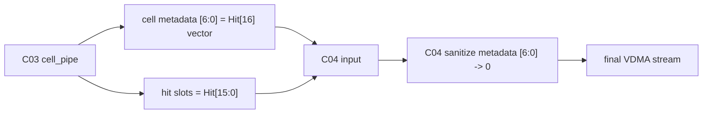

# C03 Cell Pipe -> C04 Output Stage 인계 문서 v002

- 생성 시간: `2026-05-01 03:00:46 +09:00`
- 최종 수정 시간: `2026-05-01 03:00:46 +09:00`
- 절대 기준: `Doc/TDC-GPX-Datasheet.pdf`
- 직전 문서:
  - `Doc/cluster_analysis/C03_Cell_Pipe/C03_Cell_Pipe_260501025221_C04_Handoff_v001.md`
  - `Doc/cluster_analysis/C04_Output_Stage/C04_Output_Stage_260501025221_Plan_v001.md`
- 변경 사유: 사용자 결정에 따라 이번 generation의 최종 VDMA stream에서는 `Hit[16]`을 버린다.
- 관련 커밋:
  - `fff793d fix: close C03 cell pipe contracts`
  - `2ee87b3 docs: hand off C03 to C04`
- 다음 Cluster: `C04_Output_Stage`

---

## 0. v001 대비 변경

| 항목 | v001 | v002 |
|---|---|---|
| C04 최종 정책 | C03 metadata `[6:0] = Hit[16]`을 최종 output까지 보존 | C04 최종 VDMA stream에서는 `Hit[16]`을 명시적으로 폐기 |
| Q-C04-01 | metadata `[6:0]` pass-through 확인 | metadata `[6:0]` sanitize(clear) 위치와 검증 확인 |
| full hit 복원 | C04/SW에서 `Hit[16] & Hit[15:0]` 복원 | 이번 generation에서는 복원하지 않음. 다음 generation 검토 항목으로 이관 |
| C04 구현 방향 | 변형 없는 전달 | `face_assembler` metadata beat에서 `[6:0]` clear 권장 |

---

## 1. C03 종료 판단

C03 RTL은 Datasheet 기준 raw hit 의미를 내부적으로 보존할 수 있도록 보완되어 있으며, 현재 기준 추가 P1/P2 미결은 없다.

| C03 항목 | 상태 | 종료 근거 |
|---|---|---|
| F-C03-01 `Hit[16]` 손실 | Close | C03 내부 cell metadata에 `hit_msb_vec`로 보존 |
| F-C03-02 stale-ready beat loss | Close | `tdc_gpx_cell_pipe` 입력 skid boundary 추가 |
| F-C03-03 per-slope abort stale hold | Close | per-slope demux clear/drop 반영 |
| F-C03-04 TB 부족 | Close | `tb_tdc_gpx_cell_pipe_c03_fix.vhd`, `xsim_c03_cell_pipe_fix.log:36` |

주의: C03가 `Hit[16]`을 metadata로 만들어 내는 것과, C04가 최종 VDMA로 내보내는 것은 별도 계약이다. v002에서는 C04 최종 출력에서 `Hit[16]`을 버리는 것으로 확정한다.

---

## 2. Datasheet 기준과 이번 generation 정책

Datasheet는 여전히 절대 기준이다.

| Datasheet 근거 | 내용 | 이번 generation 판단 |
|---|---|---|
| `Doc/TDC-GPX-Datasheet.pdf`, PDF page 20, section `1.7.2 Read registers` | I-Mode IFIFO read word에서 bit 0..16이 time interval data다. | 원천 data는 17-bit임을 문서에 남긴다. |
| `Doc/TDC-GPX-Datasheet.pdf`, PDF page 27, section `2.4 Data structure` | 28-bit output은 `ChaCode[27:26]`, `Start#[25:18]`, `Slope[17]`, `Hit[16:0]`이다. | C03 내부 보존은 유지하지만, C04 최종 VDMA에서는 `Hit[16]`을 폐기한다. |

정책의 의미는 다음과 같다.

1. Datasheet 기준 raw hit는 17-bit다.
2. C03는 다음 generation 검토를 위해 `Hit[16]` 보존 구조를 가진다.
3. C04는 현재 generation의 최종 VDMA stream에서 `Hit[16]`을 전달하지 않는다.
4. 따라서 SW/VDMA 소비자는 이번 generation에서 `Hit[15:0]`만 유효 hit slot로 해석한다.

---

## 3. C03가 C04로 넘기는 데이터와 C04 처리 정책

### 3.1 C03 Output Cell Stream



### 3.2 Metadata bit 처리

| Bit range | C03 의미 | C04 v002 처리 |
|---:|---|---|
| `[31:25]` | `hit_valid[6:0]` | 보존 |
| `[24:18]` | `slope_vec[6:0]` | 보존 |
| `[17:16]` | reserved | 0 유지 |
| `[15:12]` | `hit_count_actual` | 보존 |
| `[11]` | `hit_dropped` | 보존 |
| `[10]` | `error_fill` | 보존 |
| `[9:8]` | `chip_id` | 보존 |
| `[7]` | reserved | 0 유지 |
| `[6:0]` | `hit_msb_vec[6:0] = Hit[16] per slot` | 최종 VDMA 전 0으로 clear |

### 3.3 Full Hit 복원 계약의 이관

v001의 복원식은 다음과 같았다.

```text
hit_full[n] = metadata.hit_msb_vec[n] & hit_slot[n][15:0]
```

v002에서는 이 복원식이 현재 generation의 최종 VDMA/SW 계약이 아니다. 다음 generation 검토 항목으로 이관한다.

---

## 4. C04 권장 구현 위치

최종 VDMA stream에서 `Hit[16]`을 버리려면 `header_inserter` 이후보다 `face_assembler` 단계에서 처리하는 것이 가장 합리적이다.

| 위치 | 판단 |
|---|---|
| `face_assembler` real-chip forwarding | 권장. cell metadata beat 위치를 `s_fwd_beat_r = s_rt_last_beat_r`로 알고 있으므로 `[6:0]` clear가 단순하다. |
| `face_assembler` blank-fill | 이미 `[6:0] = 0`이므로 계약만 명시하면 된다. |
| output FIFO 이후 | 비권장. header prefix와 cell data가 섞인 뒤라 metadata beat 식별이 복잡하다. |
| `header_inserter` 이후 final stream | 비권장. header beat와 data beat를 구분해야 하며 timing/II 분석 부담이 커진다. |

예상 RTL 보완 방향:

```text
if real_chip_forward and s_fwd_beat_r = s_rt_last_beat_r then
    forwarded_tdata(6 downto 0) := (others => '0');
end if;
```

---

## 5. Timing / Latency / Throughput / Pipeline / II 인계

Hit[16] 폐기는 metadata beat의 7-bit clear이므로 beat count를 바꾸지 않는다.

| Metric | C03 확정 | C04 v002 확인 |
|---|---|---|
| Latency | C2/C3 boundary input skid로 +1 clk | sanitize가 metadata beat forwarding cycle에 추가 bubble 없이 가능한지 |
| Throughput | 32/64/128-bit cell beat 수 유지 | sanitize 후에도 row throughput과 VDMA line throughput 유지 |
| Pipeline | cell stream은 slope/chip별 register boundary로 출력 | `face_assembler` output register에서 clear 처리 여부 |
| II | C03 steady-state II=1 가능 | clear logic이 II=1 forwarding을 깨지 않는지 |

---

## 6. C04 수락 계약 목록 v002

| 계약 ID | 내용 | C04 검토 항목 |
|---|---|---|
| C03-C04-01-v2 | C03 input cell metadata `[6:0]`은 `Hit[16]` vector일 수 있으나, C04 final VDMA stream에서는 0으로 clear한다. | real-chip metadata beat sanitize |
| C03-C04-02-v2 | 최종 VDMA hit slot은 `Hit[15:0]`만 유효하다. | SW/VDMA output 문서 반영 |
| C03-C04-03-v2 | full hit 복원은 이번 generation 범위가 아니다. | 다음 generation follow-up으로 기록 |
| C03-C04-04-v2 | 32/64/128 output width별 beat count는 변경하지 않는다. | `fn_beats_per_cell_rt`, face_assembler/header alignment 확인 |
| C03-C04-05-v2 | per-slope abort 후 stale demux beat는 C03 output metadata에 남지 않는다. | C04 abort/flush가 stale cell을 재출력하지 않는지 확인 |
| C03-C04-06-v2 | `tuser(0)` faulted flag는 chip slice `tlast`와 동행한다. | face_assembler input FIFO와 row faulted pulse 정합성 확인 |

---

## 7. C04 진입 조건 v002

1. I-Mode single 운용만 대상으로 한다.
2. 32/64/128-bit output width만 대상으로 한다.
3. Quiet/M-mode, Continuous Measurement, 16-bit bus mode, 250 MHz retiming은 제외한다.
4. C03 내부 `Hit[16]` 보존 구조는 인정하되, C04 최종 VDMA stream에서는 `Hit[16]`을 버린다.
5. 다음 generation에서 full 17-bit output 복원 여부를 재검토한다.

