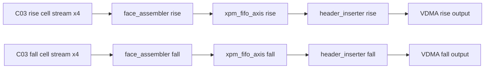
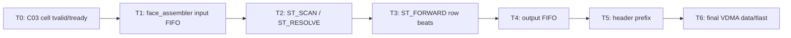

# C04 Output Stage 분석 계획 v001

- 생성 시간: `2026-05-01 02:52:21 +09:00`
- 최종 수정 시간: `2026-05-01 02:52:21 +09:00`
- 절대 기준: `Doc/TDC-GPX-Datasheet.pdf`
- 인계 문서: `Doc/cluster_analysis/C03_Cell_Pipe/C03_Cell_Pipe_260501025221_C04_Handoff_v001.md`
- 대상 Cluster: `C04_Output_Stage`
- 대상 RTL:
  - `tdc_gpx_output_stage.vhd`
  - `tdc_gpx_face_assembler.vhd`
  - `tdc_gpx_header_inserter.vhd`
  - output stage 내부 `xpm_fifo_axis` 2개

---

## 1. 목적

C04는 C03에서 생성된 chip/slope별 cell stream을 최종 VDMA output stream으로 구성하는 단계다. 이번 분석의 목적은 다음 4가지다.

1. C03 cell metadata 계약이 최종 output까지 보존되는지 확인한다.
2. `face_assembler -> FIFO -> header_inserter` pipeline의 latency, throughput, II를 수치화한다.
3. row/frame/tlast/tuser/header 계약이 32/64/128-bit width에서 일관되는지 확인한다.
4. C04 내부에 timing 분석을 방해하는 조합 경로, stale-ready, abort/flush 미정합이 있는지 검토한다.

---

## 2. C04 범위

`tdc_gpx_top.vhd` 기준 C04는 다음 구조다.

추적 근거:

| 파일 | 근거 |
|---|---|
| `tdc_gpx_top.vhd:14-15` | Cluster 3/4 경계 정의 |
| `tdc_gpx_top.vhd:724-808` | `u_output_stage` instantiation |
| `tdc_gpx_output_stage.vhd:8-17` | C04 내부 instance 구조 |
| `tdc_gpx_output_stage.vhd:238-306` | rising/falling `tdc_gpx_face_assembler` |
| `tdc_gpx_output_stage.vhd:329-399` | rising/falling `xpm_fifo_axis` |
| `tdc_gpx_output_stage.vhd:410-481` | rising/falling `tdc_gpx_header_inserter` |

---

## 3. 절대 기준과 C03 인계 계약

### 3.1 Datasheet 기준

| Datasheet 근거 | C04 의미 |
|---|---|
| `Doc/TDC-GPX-Datasheet.pdf`, PDF page 20, section `1.7.2 Read registers` | IFIFO read word의 time interval data는 17-bit다. |
| `Doc/TDC-GPX-Datasheet.pdf`, PDF page 27, section `2.4 Data structure` | 최종 SW/VDMA 소비자가 복원해야 하는 원천 hit 의미는 `Hit[16:0]`이다. |

### 3.2 C03 수락 계약

C04는 분석 시작 시 아래 계약을 수락한다.

| 계약 ID | 내용 |
|---|---|
| C03-C04-01 | cell metadata `[6:0] = hit_msb_vec[6:0] = Hit[16] per slot` |
| C03-C04-02 | hit data beat slot은 `Hit[15:0]`이다. |
| C03-C04-03 | full hit 복원식은 `Hit[16] & Hit[15:0]`이다. |
| C03-C04-04 | 32/64/128 output width별 beat count는 C03에서 이미 확정된 값을 유지한다. |
| C03-C04-05 | per-slope abort 후 stale cell metadata가 C04로 넘어오지 않는 것이 C03 보장이다. |
| C03-C04-06 | `tuser(0)` faulted flag는 chip slice `tlast`와 동행한다. |

---

## 4. 분석 Cluster 분해

C04는 다음 sub-cluster로 나누어 검토한다.

| Sub-cluster | 대상 | 분석 핵심 |
|---|---|---|
| C04-A | `tdc_gpx_face_assembler` input FIFO | C03 cell stream 수락, per-chip tuser/faulted 동행, backpressure |
| C04-B | `tdc_gpx_face_assembler` scheduling | active chip mask, strict chip order, blank-fill, row_done |
| C04-C | output `xpm_fifo_axis` | face row buffering, ready/valid 경계, abort flush |
| C04-D | `tdc_gpx_header_inserter` prefix | 48-byte header, SOF/tuser, line/frame/tlast |
| C04-E | final VDMA stream | 32/64/128 width별 HSIZE/VSIZE/STRIDE, metadata 보존 |

---

## 5. 주요 검토 질문

| ID | 질문 | 이유 |
|---|---|---|
| Q-C04-01 | face_assembler가 C03 metadata `[6:0]`을 변형 없이 최종 stream으로 통과시키는가? | `Hit[16]` 보존 계약 |
| Q-C04-02 | blank-fill cell metadata는 C03 metadata 계약과 충돌하지 않는가? | `error_fill`, `chip_id`, `hit_msb_vec=0` 의미 명확화 |
| Q-C04-03 | `tuser(0)` faulted flag는 input FIFO 뒤에서도 chip slice `tlast`와 정렬되는가? | faulted row/event 판단 |
| Q-C04-04 | 32/64/128-bit width에서 cell beat 수와 header beat 수가 일치하는가? | output width 이득의 실제 반영 |
| Q-C04-05 | face_assembler ready path가 규칙상 허용 가능한 조합 depth인가? | timing closure |
| Q-C04-06 | header_inserter `ST_DRAIN_LAST`, abort, pending face_start가 row/frame 완료와 충돌하지 않는가? | frame_done/tlast 무결성 |
| Q-C04-07 | `xpm_fifo_axis` flush/reset이 per-slope abort와 정합적인가? | stale row 방지 |
| Q-C04-08 | VDMA output `tkeep/tstrb/tuser/tlast`가 full-width/line boundary로 유지되는가? | downstream protocol |

---

## 6. 검증 Matrix 초안

| ID | 검증 항목 | 기대 결과 |
|---|---|---|
| VB-C04-01 | C03 metadata `[6:0]` pass-through | final output cell metadata에서 동일 bit pattern 확인 |
| VB-C04-02 | blank-fill metadata | `error_fill=1`, `chip_id` 정상, `hit_msb_vec=0` |
| VB-C04-03 | 32/64/128 width row size | width별 cell/header beat count와 `tlast` 위치 일치 |
| VB-C04-04 | active chip mask | inactive chip skip, active chip strict order |
| VB-C04-05 | per-chip faulted tuser | chip slice faulted가 row_done_faulted/frame_done_faulted로 연결 |
| VB-C04-06 | downstream backpressure | no data loss, no tvalid withdrawal |
| VB-C04-07 | face_start while busy | pending/collapse count와 frame continuity 확인 |
| VB-C04-08 | abort/flush | stale row/frame이 재출력되지 않음 |
| VB-C04-09 | header first line only | line 0 header metadata, line 1+ zero prefix |
| VB-C04-10 | final VDMA protocol | SOF, EOL, full tkeep/tstrb, frame_done 정합 |

---

## 7. Timing / Latency / Throughput / Pipeline / II 분석 계획

### 7.1 Timing Block 초안

### 7.2 측정할 Metric

| Metric | 측정 경계 |
|---|---|
| Latency | C03 cell accepted -> face_assembler row first beat -> header first data -> final tlast |
| Throughput | row당 cell beats + header beats / output clock |
| Pipeline | face_assembler FSM, output FIFO, header FSM register boundary |
| II | 연속 shot/row 입력 시 row start 간격, face line 간격 |

---

## 8. 예상 Finding 후보

현재는 분석 전 계획 단계이므로 Finding으로 확정하지 않는다. 다만 C04에서 우선 확인할 후보는 다음이다.

| 후보 | 검토 이유 |
|---|---|
| output_stage FIFO에서 `tuser` 미전달 여부 | C03 metadata는 `tdata` 내부라 영향 없지만, row/faulted sideband와 혼동 가능 |
| face_assembler blank-fill metadata | C03 metadata `[6:0]` 신규 의미와 blank-fill 0 처리 계약 필요 |
| face_assembler ready path | 이전 C02/C03에서 ready path 보강 이력이 있어 C04도 동일 기준 적용 필요 |
| header_inserter face_start pending | frame_done/tlast와 timing 관계를 수치화해야 함 |
| width별 header prefix beats | 48-byte prefix가 32/64/128에서 정확히 12/6/3 beats인지 재검증 필요 |

---

## 9. 진행 순서

1. C04-A: C03 cell stream 수락과 metadata pass-through 분석
2. C04-B: face_assembler row scheduling / blank-fill 분석
3. C04-C: output FIFO / ready boundary 분석
4. C04-D: header_inserter header/tlast/tuser 분석
5. C04-E: 32/64/128 width별 final data flow, timing, II 검증 계획 확정
6. 코드 부실 항목 도출 후 사용자 검토
7. 승인된 항목을 RTL/TB로 보완

