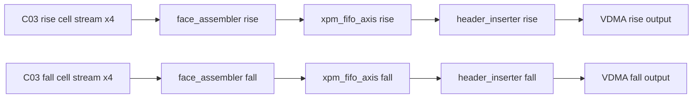
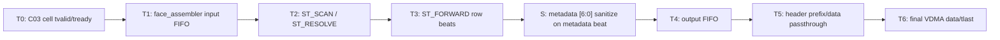

# C04 Output Stage 분석 계획 v002

- 생성 시간: `2026-05-01 03:00:46 +09:00`
- 최종 수정 시간: `2026-05-01 03:00:46 +09:00`
- 절대 기준: `Doc/TDC-GPX-Datasheet.pdf`
- 직전 계획: `Doc/cluster_analysis/C04_Output_Stage/C04_Output_Stage_260501025221_Plan_v001.md`
- 인계 문서: `Doc/cluster_analysis/C03_Cell_Pipe/C03_Cell_Pipe_260501030046_C04_Handoff_v002.md`
- 변경 사유: 사용자 결정에 따라 최종 VDMA stream에서는 `Hit[16]`을 버리고, full 17-bit output 복원은 다음 generation에서 검토한다.
- 대상 RTL:
  - `tdc_gpx_output_stage.vhd`
  - `tdc_gpx_face_assembler.vhd`
  - `tdc_gpx_header_inserter.vhd`
  - output stage 내부 `xpm_fifo_axis` 2개

---

## 0. v001 대비 계획 변경

| 항목 | v001 | v002 |
|---|---|---|
| Q-C04-01 | C03 metadata `[6:0]` pass-through 확인 | 최종 VDMA stream에서 metadata `[6:0]` clear 확인 |
| VB-C04-01 | final output에서 `Hit[16]` vector 동일 확인 | final output metadata `[6:0] = 0` 확인 |
| Full hit 복원 | C04/SW 계약으로 포함 | 이번 generation 범위 제외, 다음 generation follow-up |
| 구현 후보 | pass-through 중심 | `face_assembler` metadata beat sanitize 중심 |
| blank-fill | `hit_msb_vec=0` 의미 명확화 | 동일하되 real-chip metadata도 final stream에서는 0 |

---

## 1. 목적

C04는 C03에서 생성된 chip/slope별 cell stream을 최종 VDMA output stream으로 구성하는 단계다. v002에서 분석 목적은 다음과 같다.

1. C03가 내부적으로 만든 `Hit[16]` metadata를 C04 최종 VDMA stream에서 명시적으로 버리는 정책을 설계한다.
2. `face_assembler -> FIFO -> header_inserter` pipeline의 latency, throughput, II를 수치화한다.
3. row/frame/tlast/tuser/header 계약이 32/64/128-bit width에서 일관되는지 확인한다.
4. C04 내부에 timing 분석을 방해하는 조합 경로, stale-ready, abort/flush 미정합이 있는지 검토한다.

---

## 2. C04 범위

추적 근거:

| 파일 | 근거 |
|---|---|
| `tdc_gpx_top.vhd:14-15` | Cluster 3/4 경계 정의 |
| `tdc_gpx_top.vhd:724-808` | `u_output_stage` instantiation |
| `tdc_gpx_output_stage.vhd:8-17` | C04 내부 instance 구조 |
| `tdc_gpx_output_stage.vhd:238-306` | rising/falling `tdc_gpx_face_assembler` |
| `tdc_gpx_output_stage.vhd:329-399` | rising/falling `xpm_fifo_axis` |
| `tdc_gpx_output_stage.vhd:410-481` | rising/falling `tdc_gpx_header_inserter` |

---

## 3. 절대 기준과 이번 generation의 운용 결정

### 3.1 Datasheet 기준

| Datasheet 근거 | 의미 |
|---|---|
| `Doc/TDC-GPX-Datasheet.pdf`, PDF page 20, section `1.7.2 Read registers` | IFIFO read word의 time interval data는 17-bit다. |
| `Doc/TDC-GPX-Datasheet.pdf`, PDF page 27, section `2.4 Data structure` | GPX 원천 output의 hit 의미는 `Hit[16:0]`이다. |

### 3.2 이번 generation 결정

Datasheet 기준 원천 hit가 17-bit라는 사실은 유지한다. 다만 이번 generation 최종 VDMA stream은 16-bit hit slot만 제공한다.

| 항목 | 결정 |
|---|---|
| C03 내부 metadata `[6:0]` | `Hit[16]` vector로 존재 가능 |
| C04 final VDMA stream | metadata `[6:0]`을 0으로 clear |
| SW output 해석 | hit slot `Hit[15:0]`만 유효 |
| Full 17-bit 복원 | 다음 generation 검토 |

---

## 4. Sub-cluster 분석 분해 v002

| Sub-cluster | 대상 | 분석 핵심 |
|---|---|---|
| C04-A | `tdc_gpx_face_assembler` input FIFO | C03 cell stream 수락, per-chip tuser/faulted 동행 |
| C04-B | `tdc_gpx_face_assembler` scheduling | active chip mask, strict chip order, blank-fill, row_done |
| C04-C | metadata sanitize | real-chip metadata beat에서 `[6:0]` clear, blank-fill `[6:0]=0` 확인 |
| C04-D | output `xpm_fifo_axis` | face row buffering, ready/valid 경계, abort flush |
| C04-E | `tdc_gpx_header_inserter` prefix | 48-byte header, SOF/tuser, line/frame/tlast |
| C04-F | final VDMA stream | 32/64/128 width별 HSIZE/VSIZE/STRIDE, `Hit[16]` 폐기 확인 |

---

## 5. 주요 검토 질문 v002

| ID | 질문 | 이유 |
|---|---|---|
| Q-C04-01 | C04 final VDMA stream에서 cell metadata `[6:0]`이 0으로 clear되는가? | 이번 generation에서는 `Hit[16]`을 버리기로 결정 |
| Q-C04-02 | clear 위치는 `face_assembler` metadata beat forwarding cycle이 맞는가? | header 이후 clear보다 단순하고 timing 영향이 작음 |
| Q-C04-03 | blank-fill cell metadata는 `[6:0]=0`, `error_fill=1`, `chip_id` 정상인가? | synthetic data 해석 |
| Q-C04-04 | `tuser(0)` faulted flag는 input FIFO 뒤에서도 chip slice `tlast`와 정렬되는가? | faulted row/event 판단 |
| Q-C04-05 | 32/64/128-bit width에서 cell beat 수와 header beat 수가 일치하는가? | output width 이득의 실제 반영 |
| Q-C04-06 | face_assembler ready path가 규칙상 허용 가능한 조합 depth인가? | timing closure |
| Q-C04-07 | header_inserter `ST_DRAIN_LAST`, abort, pending face_start가 row/frame 완료와 충돌하지 않는가? | frame_done/tlast 무결성 |
| Q-C04-08 | `xpm_fifo_axis` flush/reset이 per-slope abort와 정합적인가? | stale row 방지 |
| Q-C04-09 | VDMA output `tkeep/tstrb/tuser/tlast`가 full-width/line boundary로 유지되는가? | downstream protocol |

---

## 6. 검증 Matrix v002

| ID | 검증 항목 | 기대 결과 |
|---|---|---|
| VB-C04-01 | final metadata sanitize | C03 input metadata `[6:0]`에 1이 있어도 final VDMA metadata `[6:0]=0` |
| VB-C04-02 | `Hit[15:0]` 보존 | hit slot data beat의 lower 16-bit 값은 유지 |
| VB-C04-03 | blank-fill metadata | `error_fill=1`, `chip_id` 정상, `[6:0]=0` |
| VB-C04-04 | 32/64/128 width row size | width별 cell/header beat count와 `tlast` 위치 일치 |
| VB-C04-05 | active chip mask | inactive chip skip, active chip strict order |
| VB-C04-06 | per-chip faulted tuser | chip slice faulted가 row_done_faulted/frame_done_faulted로 연결 |
| VB-C04-07 | downstream backpressure | no data loss, no tvalid withdrawal |
| VB-C04-08 | face_start while busy | pending/collapse count와 frame continuity 확인 |
| VB-C04-09 | abort/flush | stale row/frame이 재출력되지 않음 |
| VB-C04-10 | header first line only | line 0 header metadata, line 1+ zero prefix |
| VB-C04-11 | final VDMA protocol | SOF, EOL, full tkeep/tstrb, frame_done 정합 |

---

## 7. Timing / Latency / Throughput / Pipeline / II 분석 계획

### 7.1 Timing Block 초안

### 7.2 측정할 Metric

| Metric | 측정 경계 |
|---|---|
| Latency | C03 cell accepted -> face_assembler row first beat -> sanitize metadata beat -> header first data -> final tlast |
| Throughput | row당 cell beats + header beats / output clock |
| Pipeline | face_assembler FSM, sanitize register boundary, output FIFO, header FSM |
| II | 연속 shot/row 입력 시 row start 간격, face line 간격 |

sanitize는 metadata beat의 bit clear이므로 정상적으로는 추가 beat나 bubble을 만들지 않아야 한다. C04 분석에서 이 점을 명시적으로 검증한다.

---

## 8. 예상 Finding 후보 v002

현재는 분석 전 계획 단계이므로 Finding으로 확정하지 않는다.

| 후보 | 검토 이유 |
|---|---|
| C04가 현재 pass-through이면 `Hit[16]`이 최종 stream에 남을 수 있음 | 사용자 결정과 충돌 |
| face_assembler blank-fill metadata | `error_fill=1`, `[6:0]=0` 계약 필요 |
| face_assembler ready path | 이전 C02/C03에서 ready path 보강 이력이 있어 C04도 동일 기준 적용 필요 |
| header_inserter face_start pending | frame_done/tlast와 timing 관계를 수치화해야 함 |
| width별 header prefix beats | 48-byte prefix가 32/64/128에서 정확히 12/6/3 beats인지 재검증 필요 |

---

## 9. 진행 순서 v002

1. C04-A: C03 cell stream 수락과 faulted tuser 정렬 분석
2. C04-B: face_assembler row scheduling / blank-fill 분석
3. C04-C: metadata `[6:0]` sanitize 위치와 timing 영향 분석
4. C04-D: output FIFO / ready boundary 분석
5. C04-E: header_inserter header/tlast/tuser 분석
6. C04-F: 32/64/128 width별 final data flow, timing, II 검증 계획 확정
7. 코드 부실 항목 도출 후 사용자 검토
8. 승인된 항목을 RTL/TB로 보완

---

## 10. 다음 generation 이관 항목

| 항목 | 이관 사유 |
|---|---|
| Full 17-bit hit final output | 이번 generation에서는 최종 VDMA stream에서 `Hit[16]` 폐기 |
| SW parser의 `Hit[16] & Hit[15:0]` 복원 | 최종 stream에 `Hit[16]`이 없으므로 현재 범위 아님 |
| metadata bit 재배치 또는 확장 | 다음 generation에서 output format 재설계 시 검토 |

