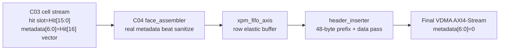
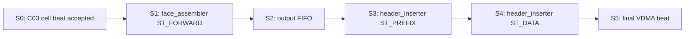

# C04 Output Stage 수정 결과 v001

- 생성 시간: `2026-05-01 03:17:20 +09:00`
- 최종 수정 시간: `2026-05-01 03:20:38 +09:00`
- 기준 문서: `Doc/TDC-GPX-Datasheet.pdf`
- 선행 계획: `Doc/cluster_analysis/C04_Output_Stage/C04_Output_Stage_260501030046_Plan_v002.md`
- 관련 인계: `Doc/cluster_analysis/C03_Cell_Pipe/C03_Cell_Pipe_260501030046_C04_Handoff_v002.md`
- 수정 목적: 이번 generation의 최종 VDMA stream에서는 Datasheet 원천 hit의 `Hit[16]`을 내보내지 않고, C04 final metadata `[6:0]`을 명시적으로 `0`으로 정리한다.

---

## 1. 반영 요약

| 항목 | 반영 내용 | 근거 |
|---|---|---|
| C04-C metadata sanitize | real-chip metadata beat 전달 시 `tdata[6:0]`을 `0`으로 clear | `tdc_gpx_face_assembler.vhd:827-831` |
| Blank-fill 정책 | blank metadata는 기존 `fn_blank_beat()`가 `[6:0]=0`을 유지 | `tdc_gpx_face_assembler.vhd:313-327`, `tdc_gpx_face_assembler.vhd:776` |
| Runtime beat 기준 | TB의 cell beat 수를 `fn_beats_per_cell_rt(max_hits_cfg=7, width)` 기준으로 변경 | `tb_tdc_gpx_output_stage.vhd:45-46` |
| 최종 VDMA 검증 | metadata beat에 의도적으로 `0x55`를 주입하고 final VDMA에서 `[6:0]=0`인지 확인 | `tb_tdc_gpx_output_stage.vhd:176-177`, `tb_tdc_gpx_output_stage.vhd:327-329`, `tb_tdc_gpx_output_stage.vhd:427`, `tb_tdc_gpx_output_stage.vhd:532` |
| 폭별 검증 | 32/64/128bit wrapper TB 추가 | `tb_tdc_gpx_output_stage_w32.vhd`, `tb_tdc_gpx_output_stage_w128.vhd` |

---

## 2. Data Flow

판단:

1. C03 내부에서는 `Hit[16]` vector를 metadata `[6:0]`에 보존할 수 있다.
2. C04 최종 stream은 이번 generation의 SW/VDMA 계약에 맞춰 metadata `[6:0]`을 버린다.
3. 따라서 최종 VDMA 소비자는 `Hit[15:0]`만 유효 hit 값으로 해석한다.
4. full 17-bit hit 복원은 다음 generation 검토 항목으로 유지한다.

---

## 3. Timing / Pipeline / II

### 3.1 Pipeline 단계

### 3.2 Width별 line beat 모델

검증 조건은 `active_chip=1`, `stops_per_chip=2`, `max_hits_cfg=7`이다.

| Output width | Header beats | Runtime beats/cell | Data beats | Scenario 1 final beats | 근거 |
|---:|---:|---:|---:|---:|---|
| 32bit | 12 | 5 | 10 | 22 | `xsim_output_stage_c04_w32.log:30` |
| 64bit | 6 | 3 | 6 | 12 | `xsim_output_stage_c04_w64.log:30` |
| 128bit | 3 | 2 | 4 | 7 | `xsim_output_stage_c04_w128.log:30` |

### 3.3 Latency / Throughput / II 판단

| 항목 | 판단 |
|---|---|
| II | backpressure가 없으면 C04 final output은 `1 beat/clk`로 전송된다. metadata clear는 같은 등록 경로 안의 bit mask라 II를 증가시키지 않는다. |
| Throughput | width가 넓어질수록 runtime beats/cell이 감소한다. 검증 결과 32bit `22 beats`, 64bit `12 beats`, 128bit `7 beats`로 최종 line beat 수가 줄었다. |
| Latency | header prefix는 width별로 `12/6/3 beats`이며, cell data는 runtime cell beat 수에 따라 이어진다. Scenario 1 완료 시각은 32bit `317.5 ns`, 64bit `297.5 ns`, 128bit `287.5 ns`로 관측되었다. |
| Pipeline 영향 | `tdc_gpx_face_assembler`의 metadata clear는 `s_pipe_tdata_r` 등록 직전에 수행되어 새 조합 경계나 추가 stage를 만들지 않는다. |

---

## 4. 검증 결과

Vivado/xsim 기준 경로: `C:\AMDDesignTools\2025.2.1\Vivado`

| Width | Snapshot | 결과 | 핵심 로그 |
|---:|---|---|---|
| 32bit | `tb_tdc_gpx_output_stage_c04_w32` | PASS | `xsim_output_stage_c04_w32.log:42`, `:44`, `:46`, `:60` |
| 64bit | `tb_tdc_gpx_output_stage_c04_w64` | PASS | `xsim_output_stage_c04_w64.log:42`, `:44`, `:46`, `:60` |
| 128bit | `tb_tdc_gpx_output_stage_c04_w128` | PASS | `xsim_output_stage_c04_w128.log:42`, `:44`, `:46`, `:60` |

공통 확인 항목:

| 항목 | 결과 |
|---|---|
| metadata sanitize | `metadata sanitize ok: true` |
| metadata beat 검출 | `metadata seen count: 2` |
| Scenario 1 | `rise-only smoke PASS` |
| Scenario 2 | `slope-independent abort PASS` |
| AXI keep/strb | 기존 full-width all-ones 검증 유지 |

---

## 5. 결정 및 후속

1. C04 v002 계획의 Q-C04-01은 구현 및 폭별 xsim 검증 완료로 닫는다.
2. 이번 generation 최종 VDMA stream에서는 `Hit[16]`을 버린다.
3. C03 내부 metadata 보존은 유지하되, C04 final output 계약은 `metadata[6:0]=0`이다.
4. full 17-bit hit 복원은 다음 generation에서 output format, SW parser, VDMA memory layout까지 함께 재검토한다.
