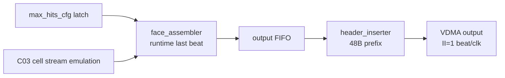

# C04 Output Stage max_hits_cfg Sweep 검증 v001

- 생성 시간: `2026-05-01 03:31:10 +09:00`
- 최종 수정 시간: `2026-05-01 03:35:16 +09:00`
- 기준 문서: `Doc/TDC-GPX-Datasheet.pdf`
- 선행 결과: `Doc/cluster_analysis/C04_Output_Stage/C04_Output_Stage_260501031720_Result_v001.md`
- 검증 목적: `max_hits_cfg=0..7` 변경 시 C04 final VDMA beat 수, metadata beat 위치, `metadata[6:0]=0` sanitize가 32/64/128bit에서 유지되는지 확인한다.

---

## 1. 판단 기준

`max_hits_cfg=000`은 C03/C04 운용 계약에서 `7 hits`로 alias된다. 따라서 sweep의 effective hit 수는 다음과 같다.

| max_hits_cfg | effective_hits |
|---:|---:|
| 0 | 7 |
| 1 | 1 |
| 2 | 2 |
| 3 | 3 |
| 4 | 4 |
| 5 | 5 |
| 6 | 6 |
| 7 | 7 |

근거:

| 항목 | 추적 근거 |
|---|---|
| runtime beat helper | `tdc_gpx_pkg.vhd`, `fn_beats_per_cell_rt(max_hits, tdata_width)` |
| cfg=0 alias | `tb_tdc_gpx_output_stage.vhd:181-188`, `fn_effective_max_hits_cfg()` |
| sweep loop | `tb_tdc_gpx_output_stage.vhd:419-542` |
| metadata sanitize monitor | `tb_tdc_gpx_output_stage.vhd:328-345`, `tb_tdc_gpx_output_stage.vhd:361-384` |
| width wrapper | `tb_tdc_gpx_output_stage_maxhits_w32.vhd`, `tb_tdc_gpx_output_stage_maxhits_w64.vhd`, `tb_tdc_gpx_output_stage_maxhits_w128.vhd` |

---

## 2. Timing / Pipeline / II



검증 모델:

1. 각 cfg마다 rise/fall 양쪽에 동일한 chip0 cell stream을 넣는다.
2. `beats_per_cell = fn_beats_per_cell_rt(effective_hits, width)`로 stimulus와 monitor를 동시에 구성한다.
3. 각 stop의 마지막 beat를 metadata beat로 보고 `[6:0]=0x55`를 주입한다.
4. final VDMA에서는 rise/fall metadata beat 모두 `[6:0]=0`이어야 한다.
5. `frame_done`과 `frame_fall_done`은 cfg마다 각각 1회 발생해야 한다.

공식:

```text
output_delta = header_beats(width) + stops_per_chip * beats_per_cell(effective_hits, width)
stops_per_chip = 2
```

II 판단:

| 항목 | 판단 |
|---|---|
| Beat II | backpressure가 없으면 final stream은 1 beat/clk |
| cfg 영향 | cfg는 cell당 beat 수를 바꾸지만, beat 간 II를 바꾸지 않는다 |
| latency 영향 | cfg가 작아지면 line output beat 수가 감소한다 |
| pipeline 영향 | metadata clear는 등록 출력 전 bit mask라 stage 추가 없음 |

---

## 3. Sweep 결과 Matrix

### 3.1 32bit

| cfg | effective_hits | beats/cell | output_delta | 결과 | 로그 |
|---:|---:|---:|---:|---|---|
| 0 | 7 | 5 | 22 | PASS | `xsim_output_stage_maxhits_w32.log:30` |
| 1 | 1 | 2 | 16 | PASS | `xsim_output_stage_maxhits_w32.log:32` |
| 2 | 2 | 2 | 16 | PASS | `xsim_output_stage_maxhits_w32.log:34` |
| 3 | 3 | 3 | 18 | PASS | `xsim_output_stage_maxhits_w32.log:36` |
| 4 | 4 | 3 | 18 | PASS | `xsim_output_stage_maxhits_w32.log:38` |
| 5 | 5 | 4 | 20 | PASS | `xsim_output_stage_maxhits_w32.log:40` |
| 6 | 6 | 4 | 20 | PASS | `xsim_output_stage_maxhits_w32.log:42` |
| 7 | 7 | 5 | 22 | PASS | `xsim_output_stage_maxhits_w32.log:44` |

### 3.2 64bit

| cfg | effective_hits | beats/cell | output_delta | 결과 | 로그 |
|---:|---:|---:|---:|---|---|
| 0 | 7 | 3 | 12 | PASS | `xsim_output_stage_maxhits_w64.log:30` |
| 1 | 1 | 2 | 10 | PASS | `xsim_output_stage_maxhits_w64.log:32` |
| 2 | 2 | 2 | 10 | PASS | `xsim_output_stage_maxhits_w64.log:34` |
| 3 | 3 | 2 | 10 | PASS | `xsim_output_stage_maxhits_w64.log:36` |
| 4 | 4 | 2 | 10 | PASS | `xsim_output_stage_maxhits_w64.log:38` |
| 5 | 5 | 3 | 12 | PASS | `xsim_output_stage_maxhits_w64.log:40` |
| 6 | 6 | 3 | 12 | PASS | `xsim_output_stage_maxhits_w64.log:42` |
| 7 | 7 | 3 | 12 | PASS | `xsim_output_stage_maxhits_w64.log:44` |

### 3.3 128bit

| cfg | effective_hits | beats/cell | output_delta | 결과 | 로그 |
|---:|---:|---:|---:|---|---|
| 0 | 7 | 2 | 7 | PASS | `xsim_output_stage_maxhits_w128.log:30` |
| 1 | 1 | 2 | 7 | PASS | `xsim_output_stage_maxhits_w128.log:32` |
| 2 | 2 | 2 | 7 | PASS | `xsim_output_stage_maxhits_w128.log:34` |
| 3 | 3 | 2 | 7 | PASS | `xsim_output_stage_maxhits_w128.log:36` |
| 4 | 4 | 2 | 7 | PASS | `xsim_output_stage_maxhits_w128.log:38` |
| 5 | 5 | 2 | 7 | PASS | `xsim_output_stage_maxhits_w128.log:40` |
| 6 | 6 | 2 | 7 | PASS | `xsim_output_stage_maxhits_w128.log:42` |
| 7 | 7 | 2 | 7 | PASS | `xsim_output_stage_maxhits_w128.log:44` |

---

## 4. 검증 결론

| 검증 항목 | 결과 |
|---|---|
| `max_hits_cfg=0` alias | effective 7 hits로 검증 완료 |
| 32/64/128bit width별 beat 수 | 모두 기대값과 일치 |
| rise final metadata sanitize | 모든 cfg에서 `[6:0]=0` 유지 |
| fall final metadata sanitize | 모든 cfg에서 `[6:0]=0` 유지 |
| rise/fall frame_done | 각 cfg마다 1회씩 발생 |
| 기존 smoke/abort 회귀 | 64bit 기준 Scenario 1/2 PASS 유지 |

최종 판단: C04 final stream의 `max_hits_cfg=0..7` runtime width scaling과 `Hit[16]` 폐기 정책은 32/64/128bit에서 모두 검증 완료 상태다.
