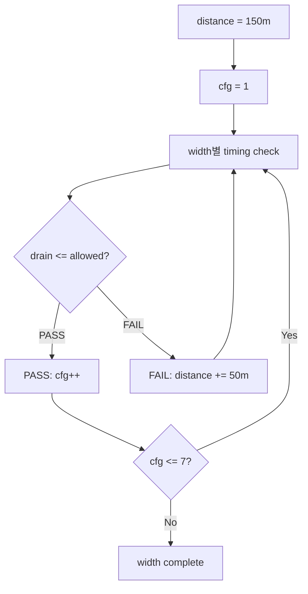

# C04 Distance 기반 max_hits_cfg Timing 검증 결과 v001

- 생성 시간: `2026-05-01 03:44:29 +09:00`
- 최종 수정 시간: `2026-05-01 03:46:29 +09:00`
- 기준 문서: `Doc/TDC-GPX-Datasheet.pdf`
- 선행 계획: `Doc/cluster_analysis/C04_Output_Stage/C04_Output_Stage_260501034246_Distance_MaxHits_Plan_v001.md`
- 실험 TB: `tb_tdc_gpx_distance_maxhits_matrix.vhd`
- 실험 로그: `xsim_distance_maxhits_matrix.log`

---

## 1. 실험 기준

이번 실험은 C04 final output drain이 거리별 허용 shot interval 안에 끝나는지를 확인한다.

| 항목 | 값 |
|---|---:|
| 시작 거리 | 150 m |
| 거리 증가 | FAIL 시 50 m |
| output drain clock | 150 MHz |
| output period | 6667 ps |
| round-trip 근사 | 6671 ps/m |
| active chips | 4 |
| stops per chip | 8 |
| cells per line | 32 |

판정 공식:

```text
allowed_ps = distance_m * 6671
drain_ps   = line_beats * 6667

PASS if drain_ps <= allowed_ps
```

`line_beats`는 RTL package의 `fn_beats_per_cell_rt(max_hits, width)`와 `fn_hdr_prefix_beats(width)`를 사용한다.

---

## 2. Sweep 절차



핵심은 FAIL 후 `cfg`를 증가시키지 않고, 다음 거리에서 같은 `cfg`를 다시 검증하는 것이다.

---

## 3. 32bit 결과

| Distance | cfg | line_beats | drain_ps | allowed_ps | 결과 | 근거 |
|---:|---:|---:|---:|---:|---|---|
| 150 | 1 | 76 | 506692 | 1000650 | PASS | `xsim_distance_maxhits_matrix.log:34` |
| 150 | 2 | 76 | 506692 | 1000650 | PASS | `xsim_distance_maxhits_matrix.log:36` |
| 150 | 3 | 108 | 720036 | 1000650 | PASS | `xsim_distance_maxhits_matrix.log:38` |
| 150 | 4 | 108 | 720036 | 1000650 | PASS | `xsim_distance_maxhits_matrix.log:40` |
| 150 | 5 | 140 | 933380 | 1000650 | PASS | `xsim_distance_maxhits_matrix.log:42` |
| 150 | 6 | 140 | 933380 | 1000650 | PASS | `xsim_distance_maxhits_matrix.log:44` |
| 150 | 7 | 172 | 1146724 | 1000650 | FAIL | `xsim_distance_maxhits_matrix.log:46` |
| 200 | 7 | 172 | 1146724 | 1334200 | PASS | `xsim_distance_maxhits_matrix.log:48` |

판단:

| 거리 | 32bit PASS 가능한 max_hits_cfg |
|---:|---|
| 150 m | 1..6 |
| 200 m | 7 포함 가능 |

---

## 4. 64bit 결과

| Distance | cfg | line_beats | drain_ps | allowed_ps | 결과 | 근거 |
|---:|---:|---:|---:|---:|---|---|
| 150 | 1 | 70 | 466690 | 1000650 | PASS | `xsim_distance_maxhits_matrix.log:54` |
| 150 | 2 | 70 | 466690 | 1000650 | PASS | `xsim_distance_maxhits_matrix.log:56` |
| 150 | 3 | 70 | 466690 | 1000650 | PASS | `xsim_distance_maxhits_matrix.log:58` |
| 150 | 4 | 70 | 466690 | 1000650 | PASS | `xsim_distance_maxhits_matrix.log:60` |
| 150 | 5 | 102 | 680034 | 1000650 | PASS | `xsim_distance_maxhits_matrix.log:62` |
| 150 | 6 | 102 | 680034 | 1000650 | PASS | `xsim_distance_maxhits_matrix.log:64` |
| 150 | 7 | 102 | 680034 | 1000650 | PASS | `xsim_distance_maxhits_matrix.log:66` |

판단: 64bit는 150m에서 `max_hits_cfg=1..7` 전부 PASS다.

---

## 5. 128bit 결과

| Distance | cfg | line_beats | drain_ps | allowed_ps | 결과 | 근거 |
|---:|---:|---:|---:|---:|---|---|
| 150 | 1 | 67 | 446689 | 1000650 | PASS | `xsim_distance_maxhits_matrix.log:72` |
| 150 | 2 | 67 | 446689 | 1000650 | PASS | `xsim_distance_maxhits_matrix.log:74` |
| 150 | 3 | 67 | 446689 | 1000650 | PASS | `xsim_distance_maxhits_matrix.log:76` |
| 150 | 4 | 67 | 446689 | 1000650 | PASS | `xsim_distance_maxhits_matrix.log:78` |
| 150 | 5 | 67 | 446689 | 1000650 | PASS | `xsim_distance_maxhits_matrix.log:80` |
| 150 | 6 | 67 | 446689 | 1000650 | PASS | `xsim_distance_maxhits_matrix.log:82` |
| 150 | 7 | 67 | 446689 | 1000650 | PASS | `xsim_distance_maxhits_matrix.log:84` |

판단: 128bit는 150m에서 `max_hits_cfg=1..7` 전부 PASS다.

---

## 6. 종합 결론

| Width | 150m에서 PASS 가능한 cfg | 최초 FAIL | FAIL 후 재검증 | 최종 판단 |
|---:|---|---|---|---|
| 32bit | 1..6 | 150m cfg=7 | 200m cfg=7 PASS | 150m 운용은 cfg<=6 권장, cfg=7은 200m 이상 |
| 64bit | 1..7 | 없음 | 불필요 | 150m부터 cfg=7 가능 |
| 128bit | 1..7 | 없음 | 불필요 | 150m부터 cfg=7 가능 |

이번 기준에서 32bit만 거리/`max_hits_cfg` 경계가 관찰되었다. 64bit와 128bit는 150m에서도 full `max_hits_cfg=7`을 timing 기준으로 만족한다.

---

## 7. 추적 근거

| 항목 | 근거 |
|---|---|
| 계획 문서 | `Doc/cluster_analysis/C04_Output_Stage/C04_Output_Stage_260501034246_Distance_MaxHits_Plan_v001.md` |
| TB source | `tb_tdc_gpx_distance_maxhits_matrix.vhd` |
| xsim compile | `xelab_distance_maxhits_matrix.log` |
| xsim run | `xsim_distance_maxhits_matrix.log` |
| 최종 PASS | `xsim_distance_maxhits_matrix.log:88` |
