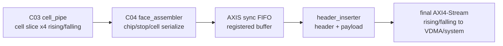

# C04 Output Stage -> C05 Top Sequencer/Status Handoff v001

- 생성 시간: `2026-05-01 04:31:06 +09:00`
- 최종 수정 시간: `2026-05-01 04:35:07 +09:00`
- 기준 문서: `Doc/TDC-GPX-Datasheet.pdf`
- 현재 Cluster: `C04_Output_Stage`
- 다음 Cluster: `C05_Top_Sequencer_Status`
- 관련 커밋:
  - `9b71ca8 fix: sanitize C04 hit msb output`
  - `88b02e6 test: sweep C04 max hits config`
  - `41296f2 test: add C04 distance max hits matrix`
  - `21836e1 test: recheck C04 distance timing`
  - `99dbe90 test: sweep C04 distance in 10m steps`
  - `1a4a8eb test: analyze C04 polygon timing budget`

---

## 1. C04 완료 판단

판단: C04는 C05로 넘길 수 있다.

C04는 C03 cell stream을 받아 rising/falling face stream을 만들고, output FIFO와 header inserter를 거쳐 최종 AXI4-Stream을 내보내는 범위다. 이번 Cluster에서 다음 항목을 닫았다.

| 항목 | 상태 | 근거 |
|---|---|---|
| 32/64/128bit output width 지원 | Close | `tdc_gpx_output_stage.vhd:34`, `:216`, `:217` |
| rising/falling output lane 분리 | Close | `tdc_gpx_output_stage.vhd:97`~`:111` |
| face assembler 32/64/128 검증 경계 | Close | `tdc_gpx_face_assembler.vhd:81`, `:331`, `:332` |
| runtime `max_hits_cfg`에 따른 beat 계산 | Close | `tdc_gpx_face_assembler.vhd:673`~`:680`, `tdc_gpx_pkg.vhd:814` |
| 최종 VDMA stream에서 `Hit[16]` 제거 | Close | `tdc_gpx_face_assembler.vhd:829` |
| header/tkeep/tstrb/tuser/frame_done 출력 계약 | Close | `tdc_gpx_header_inserter.vhd:127`~`:136`, `:302`~`:308` |
| polygon mirror budget 기반 cfg swap 검증 | Close | `xsim_polygon_budget_matrix.log:554` |

Datasheet 기준으로 raw hit은 17-bit 의미를 가지지만, 이번 generation의 최종 VDMA stream에서는 `Hit[16]`을 버리는 정책으로 확정했다. 따라서 C04 final stream 소비자는 현재 generation에서 `Hit[15:0]`만 유효 hit slot으로 해석해야 한다.

---

## 2. C04 검증 산출물

| 문서/검증 | 목적 | 결론 |
|---|---|---|
| `C04_Output_Stage_260501031720_Result_v001.md/.pptx` | C04 코드 보완 결과 | Hit[16] sanitize 및 기본 output path 검증 |
| `C04_Output_Stage_260501033110_MaxHits_Sweep_v001.md/.pptx` | `max_hits_cfg=0..7` 검증 | runtime width/beat 계약 점검 |
| `C04_Output_Stage_260501035419_Distance_Time_Recheck_v002.md/.pptx` | 150m 왕복시간 기준 재검토 | `start_tdc -> stop_tdc`와 C04 drain 시간을 분리 |
| `C04_Output_Stage_260501040101_Distance_10m_Sweep_Result_v003.md/.pptx` | 100m부터 10m 단위 post-stop 스윕 | 거리별 보수 모델 경계 기록 |
| `C04_Output_Stage_260501042543_Polygon_Budget_Sweep_Result_v001.md/.pptx` | polygon mirror 운용 budget 반영 | 실제 point 간격 기반 cfg swap 표 도출 |
| `tb_tdc_gpx_polygon_budget_matrix.vhd` | polygon budget 분석 TB | xsim PASS |

최신 운용 판단은 polygon mirror budget 문서를 기준으로 한다. 이전 100m/150m post-stop 문서는 더 보수적인 모델의 참고 자료이며, 현재 사용자가 제시한 polygon timing 조건이 실제 운용 조건에 더 가깝다.

---

## 3. C04 최종 Data Flow 계약



| 경계 | 계약 |
|---|---|
| C03 -> C04 | cell payload는 32/64/128bit width에 맞춰 들어온다. |
| C04 내부 | `max_hits_cfg`는 face/shot 시작 전에 안정되어야 하며 C04는 runtime beat 계산에 반영한다. |
| C04 final stream | `g_OUTPUT_WIDTH`는 32/64/128만 허용한다. |
| C04 final stream | `tkeep/tstrb`는 valid beat에서 full-keep/full-strobe 계약이다. |
| C04 final stream | `tuser(0)`는 header inserter의 SOF 의미로 사용한다. |
| C04 final stream | 현재 generation에서는 `Hit[16]`을 출력하지 않는다. |
| C04 error/status | shot overrun, frame_done faulted, row_done faulted 등은 C05 status/IRQ 경계에서 다시 추적한다. |

---

## 4. Timing / Latency / Throughput / Pipeline / II 인계

### 4.1 C04 Output Beat 공식

```text
line_beats(width, cfg)
  = header_beats(width)
  + active_chips * stops_per_chip * beats_per_cell_rt(cfg, width)

drain_time_ps = line_beats * 6667 ps
```

근거:

| 항목 | 근거 |
|---|---|
| header beat helper | `tdc_gpx_pkg.vhd:792` |
| runtime cell beat helper | `tdc_gpx_pkg.vhd:814` |
| output clock 모델 150MHz | `tb_tdc_gpx_polygon_budget_matrix.vhd:39` |
| full line load 4 chips x 8 stops | `tb_tdc_gpx_polygon_budget_matrix.vhd:34`, `:35` |

### 4.2 Polygon Mirror 운용 Budget

```text
start_tdc interval = 13.888889 us
VDMA + PS + Ethernet reserve = 8.000000 us
pre-ToF budget = 5.888889 us

C04 budget(distance) = 5.888889 us - round_trip(distance)
```

최신 스왑 결과:

| Width | cfg=7 유지 가능 거리 | cfg swap 구간 | 완전 FAIL 시작 |
|---:|---:|---|---:|
| 32 | 710m까지 | 720~740m cfg6, 750~770m cfg4, 780~800m cfg2 | 810m |
| 64 | 780m까지 | 790~810m cfg4 | 820m |
| 128 | 810m까지 | 없음 | 820m |

C05는 이 표를 시스템 운용 계약으로 받아야 하지만, 아직 `8 us reserve`는 실측값이 아니라 사용자 가정이다. C05에서 실제 VDMA backpressure, PS 처리, Ethernet 전송 worst-case와 연결해 재검증해야 한다.

### 4.3 Pipeline / II 인계

| Metric | C04 판단 | C05 확인 필요 |
|---|---|---|
| Latency | C04 내부 beat serialization과 header insertion은 width/cfg에 따라 결정된다. | `face_seq`의 shot 간격/deferral이 C04 drain 상태와 충돌하지 않는지 확인 |
| Throughput | final AXIS는 ready가 유지되면 beat 단위 II=1로 해석한다. | VDMA/CDC/PS 쪽 backpressure가 II=1 가정을 깨지 않는지 확인 |
| Pipeline | C04에는 face assembler FIFO, output FIFO, header inserter가 있다. | top-level `s_frame_done_both`, `s_face_closing`, status aggregation과 timing 관계 확인 |
| II | C04 단독 분석은 output ready high 기준이다. | 실제 `i_m_axis_tready`, `i_m_axis_fall_tready`의 stall 모델을 포함해야 한다. |

---

## 5. C05로 넘길 계약

| ID | 계약 | C05 검토 항목 |
|---|---|---|
| H-C04C05-01 | 최종 output width는 32/64/128만 지원한다. | top generic `g_OUTPUT_WIDTH`와 downstream VDMA 폭 일치 확인 |
| H-C04C05-02 | final stream은 rising/falling 두 lane으로 분리된다. | VDMA channel mapping, memory layout, PS 소비 계약 확인 |
| H-C04C05-03 | `tuser(0)`는 SOF로 사용된다. | VDMA/SW가 SOF와 `tlast`를 올바르게 해석하는지 확인 |
| H-C04C05-04 | 현재 generation에서 `Hit[16]`은 최종 stream에서 제거된다. | SW packet parser가 16-bit hit slot만 해석하도록 문서화 |
| H-C04C05-05 | `max_hits_cfg`는 face/shot 시작 전에 설정되어야 output width 이득이 반영된다. | face_seq/CSR snapshot 시점과 운용 sequence 확인 |
| H-C04C05-06 | polygon budget 결과는 `8us reserve` 가정에 의존한다. | 실제 VDMA/PS/Ethernet timing worst-case 실측 또는 보수치 갱신 |
| H-C04C05-07 | C04 timing PASS는 `i_m_axis_tready`가 충분히 유지되는 조건이다. | backpressure/stall negative test 필요 |
| H-C04C05-08 | C04 error/fault는 status/IRQ로 사용자에게 추적 가능해야 한다. | status bit mapping, sticky clear, IRQ pulse/level 정책 확인 |
| H-C04C05-09 | 820m 이후는 현재 8us reserve 기준에서 모든 width가 FAIL이다. | 목표거리 정책과 cfg clamp/운용 제한 조건 확인 |

---

## 6. C05 시작 범위 제안

C05는 코드상 C01~C04 밖에 남은 top-level 운영 제어 구간을 다룬다.

대상 RTL:

| RTL | 역할 | 근거 |
|---|---|---|
| `tdc_gpx_face_seq.vhd` | shot/face sequencer, shot_start gating, face closing | `tdc_gpx_top.vhd:853`, `tdc_gpx_face_seq.vhd:31` |
| `tdc_gpx_status_agg.vhd` | status aggregation, timestamp, pipeline overrun | `tdc_gpx_top.vhd:917`, `tdc_gpx_status_agg.vhd:32` |
| `tdc_gpx_top.vhd` | C01~C04, face_seq, status_agg 연결 | `tdc_gpx_top.vhd:1`~`:17` |
| downstream VDMA/PS/Ethernet 계약 | final AXIS 소비 및 시스템 시간 예산 | `tdc_gpx_top.vhd:147`~`:164` |

C05의 첫 목표는 다음과 같다.

1. `start_tdc`가 들어온 뒤 `face_seq`가 C01~C04 전체를 어떻게 열고 닫는지 상태머신/타이밍도로 설명한다.
2. C04의 `frame_done`, `shot_overrun`, `face_closing`이 다음 shot 허용 조건과 어떻게 연결되는지 확인한다.
3. status/IRQ가 C01~C04 fault를 사용자에게 추적 가능한 형태로 노출하는지 검증한다.
4. polygon budget에서 가정한 `8us reserve`와 output ready 조건을 top-level/system 계약으로 검증한다.
5. 최종적으로 C01~C04 end-to-end latency, throughput, pipeline, II를 한 장의 timing block diagram으로 닫는다.

---

## 7. C04 종료 후 남은 위험

| 위험 | 영향 | C05 완화 계획 |
|---|---|---|
| VDMA backpressure가 C04 II=1 가정을 깨는 경우 | polygon budget PASS 거리 감소 | ready stall TB와 worst-case margin 문서화 |
| PS/Ethernet 8us reserve가 실제보다 작게 잡힌 경우 | 운용 가능 거리 과대평가 | reserve sweep 또는 실측값 반영 |
| face_seq가 C04 drain 중 다음 shot을 허용하는 경우 | frame truncation, shot overrun | `face_closing`, `hdr_draining`, `frame_done_both` gating 검증 |
| status bit가 fault 원인을 충분히 설명하지 못하는 경우 | 운용 중 디버깅 불가 | status map과 sticky clear 동작 검증 |
| 32/64/128 선택이 system memory layout과 충돌 | VDMA/PS parser 오류 | C05에서 final packet map 재확인 |

---

## 8. C05 진입 판정

판정: 진입 가능.

C04 내부 구현과 analytical/xsim 기반 timing sweep은 현재 요구된 범위에서 닫혔다. 단, C04 결과를 실제 시스템 운용 가능성으로 확정하려면 top-level sequencer, status, downstream ready, VDMA/PS/Ethernet reserve가 함께 닫혀야 한다. 따라서 다음 Cluster는 `C05_Top_Sequencer_Status`로 진행한다.
