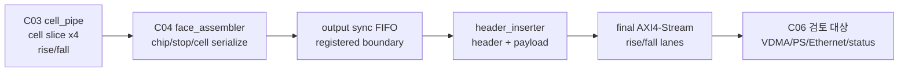

# C04 Output Stage -> C06 Control/Status Integration Handoff v002

- 작성 시간: `2026-05-01 04:40:33 +09:00`
- 최종 수정 시간: `2026-05-01 04:40:33 +09:00`
- 절대 기준 문서: `Doc/TDC-GPX-Datasheet.pdf`
- 기준 소통 문서: `Doc/cluster_analysis/cluster_analysis_communication_plan_20260429_v001.md`
- 현재 Cluster: `C04_Output_Stage`
- 실제 다음 Cluster: `C06_Control_Status_Integration`
- Supersedes: `C04_Output_Stage_260501043106_C05_Handoff_v001.md`

---

## 1. 정정 사유

초기 소통 계획의 Cluster 구조는 다음과 같다.

| 초기 계획 Cluster | 목적 | 현재 진행상 대응 |
|---|---|---|
| `C05_Face_Output` | chip slice를 row/frame/VDMA packet으로 조립 | 이미 `C04_Output_Stage`에서 수행됨 |
| `C06_Control_Status_Integration` | top-level sequencing, CSR, status, recovery 통합 | 지금부터 진입해야 할 실제 다음 Cluster |

따라서 직전 생성 문서의 `C04 -> C05_Top_Sequencer_Status` 표기는 기능적으로는 맞는 방향이지만, `cluster_analysis_communication_plan_20260429_v001.md`의 번호 체계와 불일치한다. 이 v002 문서는 C04 완료 결과를 `C06_Control_Status_Integration`으로 인계하도록 명칭과 lineage를 정정한다.

정정 범위:

- C04 기술 결론은 유지한다.
- `C05_Top_Sequencer_Status` 명칭은 폐기하지 않고 `C06_Control_Status_Integration`으로 superseded 처리한다.
- 다음 분석 폴더는 `Doc/cluster_analysis/C06_Control_Status_Integration`을 사용한다.
- 이후 문서/PPT/검증 결과는 `C06_Control_Status_Integration_<YYMMDDHHMMSS>_..._vNNN` 규칙을 따른다.

---

## 2. C04 완료 판단

판단: C04는 C06으로 인계 가능하다.

C04는 C03 cell stream을 받아 rising/falling face stream을 만들고, output FIFO와 header inserter를 거쳐 최종 AXI4-Stream으로 내보내는 범위다. 이번 Cluster에서 다음 항목이 닫혔다.

| 항목 | 상태 | 근거 |
|---|---|---|
| 32/64/128bit output width 지원 | Close | `tdc_gpx_output_stage.vhd:34`, `tdc_gpx_output_stage.vhd:216-217` |
| rising/falling output lane 분리 | Close | `tdc_gpx_output_stage.vhd:97-111` |
| face assembler 32/64/128 경계 | Close | `tdc_gpx_face_assembler.vhd:81`, `tdc_gpx_face_assembler.vhd:331-332` |
| runtime `max_hits_cfg` 기반 beat 계산 | Close | `tdc_gpx_face_assembler.vhd:673-680`, `tdc_gpx_pkg.vhd:814` |
| 최종 VDMA stream에서 `Hit[16]` 제거 | Close | `tdc_gpx_face_assembler.vhd:829` |
| header/tkeep/tstrb/tuser/frame_done 계약 | Close | `tdc_gpx_header_inserter.vhd:127-136`, `tdc_gpx_header_inserter.vhd:302-308` |
| polygon mirror budget 기반 cfg swap 검증 | Close | `xsim_polygon_budget_matrix.log:554` |

Datasheet 기준 raw hit는 17-bit 의미를 가지지만, 현재 generation의 최종 VDMA stream에서는 사용자 결정에 따라 `Hit[16]`을 버린다. C06에서는 status/VDMA/PS 계약에서 이 정책이 소프트웨어 해석과 충돌하지 않는지 확인해야 한다.

---

## 3. C04 산출물

| 문서/검증 | 목적 | 결론 |
|---|---|---|
| `C04_Output_Stage_260501031720_Result_v001.md/.pptx` | C04 코드 보완 결과 | Hit[16] sanitize 및 기본 output path 검증 |
| `C04_Output_Stage_260501033110_MaxHits_Sweep_v001.md/.pptx` | `max_hits_cfg=0..7` 검증 | runtime width/beat 계약 확인 |
| `C04_Output_Stage_260501035419_Distance_Time_Recheck_v002.md/.pptx` | 150m 왕복시간 기준 재검토 | `start_tdc -> stop_tdc`와 C04 drain 시간 분리 |
| `C04_Output_Stage_260501040101_Distance_10m_Sweep_Result_v003.md/.pptx` | 100m부터 10m 단위 post-stop sweep | 거리별 보수 모델 경계 기록 |
| `C04_Output_Stage_260501042543_Polygon_Budget_Sweep_Result_v001.md/.pptx` | polygon mirror 운용 budget 반영 | 실제 point 간격 기반 cfg swap 값 도출 |
| `tb_tdc_gpx_polygon_budget_matrix.vhd` | polygon budget 분석 TB | xsim PASS |

최신 운용 판단은 polygon mirror budget 문서를 기준으로 한다. 이전 거리 sweep 문서는 보수적 모델의 참고 자료이고, 현재 사용자가 제시한 polygon timing 조건에는 `C04_Output_Stage_260501042543_Polygon_Budget_Sweep_Result_v001.md`가 더 직접적인 근거다.

---

## 4. C04 최종 Data Flow 계약



| 경계 | 계약 |
|---|---|
| C03 -> C04 | cell payload는 32/64/128bit width에 맞춰 들어온다. |
| C04 내부 | `max_hits_cfg`는 face/shot 시작 전에 안정되어야 output width 이득이 반영된다. |
| C04 final stream | `g_OUTPUT_WIDTH`는 32/64/128만 허용한다. |
| C04 final stream | `tkeep/tstrb`는 valid beat에서 full-keep/full-strobe 계약이다. |
| C04 final stream | `tuser(0)`은 header inserter의 SOF 의미로 사용한다. |
| C04 final stream | 현재 generation에서는 `Hit[16]`을 출력하지 않는다. |
| C04 error/status | shot overrun, frame_done faulted, row_done faulted 등은 C06 status/IRQ 경계에서 다시 추적한다. |

---

## 5. Timing / Latency / Throughput / Pipeline / II 인계

### 5.1 C04 Output Beat 공식

```text
line_beats(width, cfg)
  = header_beats(width)
  + active_chips * stops_per_chip * beats_per_cell_rt(cfg, width)

drain_time_ps = line_beats * 6667 ps   -- 150 MHz 기준
```

| 항목 | 근거 |
|---|---|
| header beat helper | `tdc_gpx_pkg.vhd:792` |
| runtime cell beat helper | `tdc_gpx_pkg.vhd:814` |
| output clock 모델 150MHz | `tb_tdc_gpx_polygon_budget_matrix.vhd:39` |
| full line load 4 chips x 8 stops | `tb_tdc_gpx_polygon_budget_matrix.vhd:34-35` |

### 5.2 Polygon Mirror 운용 Budget

사용자 운용 조건:

```text
start_tdc interval = 13.888889 us
VDMA + PS + Ethernet reserve = 8.000000 us
pre-ToF budget = 5.888889 us

C04 budget(distance) = 5.888889 us - round_trip(distance)
```

최신 xsim 결과:

| Width | cfg=7 유지 가능 거리 | cfg swap 구간 | 전체 FAIL 시작 |
|---:|---:|---|---:|
| 32 | 710m까지 | 720~740m cfg6, 750~770m cfg4, 780~800m cfg2 | 810m |
| 64 | 780m까지 | 790~810m cfg4 | 820m |
| 128 | 810m까지 | 없음 | 820m |

### 5.3 Pipeline / II 인계

| Metric | C04 판단 | C06 확인 필요 |
|---|---|---|
| Latency | C04 내부 serialization과 header insertion은 width/cfg로 결정된다. | `face_seq`의 shot interval/deferral이 C04 drain 상태와 충돌하지 않는지 확인 |
| Throughput | final AXIS ready가 유지되면 beat 단위 II=1로 해석한다. | VDMA/CDC/PS backpressure가 II=1 가정을 깨는지 확인 |
| Pipeline | face assembler FIFO, output FIFO, header inserter가 주요 stage다. | top-level `frame_done_both`, `face_closing`, status aggregation과 timing 관계 확인 |
| II | C04 단독 분석은 output ready high 기준이다. | 실제 `i_m_axis_tready`, `i_m_axis_fall_tready` stall 모델 포함 필요 |

---

## 6. C06으로 넘기는 계약

| ID | 계약 | C06 검토 항목 |
|---|---|---|
| H-C04C06-01 | 최종 output width는 32/64/128만 지원한다. | top generic `g_OUTPUT_WIDTH`와 downstream VDMA 폭 일치 확인 |
| H-C04C06-02 | final stream은 rising/falling 두 lane으로 분리된다. | VDMA channel mapping, memory layout, PS 파서 계약 확인 |
| H-C04C06-03 | `tuser(0)`은 SOF 의미다. | VDMA/SW가 SOF와 `tlast`를 올바르게 해석하는지 확인 |
| H-C04C06-04 | 현재 generation에서 `Hit[16]`은 최종 stream에서 제거된다. | SW packet parser는 16-bit hit slot만 해석하도록 문서화 |
| H-C04C06-05 | `max_hits_cfg`는 face/shot 시작 전에 설정되어야 한다. | face_seq/CSR snapshot 시점과 적용 sequence 확인 |
| H-C04C06-06 | polygon budget 결과는 `8us reserve` 사용자 가정에 의존한다. | 실제 VDMA/PS/Ethernet worst-case 측정 또는 보수치 갱신 |
| H-C04C06-07 | C04 timing PASS는 output ready가 충분히 유지되는 조건이다. | backpressure/stall negative test 필요 |
| H-C04C06-08 | C04 error/fault는 status/IRQ로 사용자가 추적 가능해야 한다. | status bit mapping, sticky clear, IRQ pulse/level 정책 확인 |
| H-C04C06-09 | 820m 이후는 현재 8us reserve 기준에서 모든 width가 FAIL이다. | 목표 거리 정책과 cfg clamp/운용 제한 조건 확인 |

---

## 7. C06 진입 범위

C06은 C01~C04 외부에 남은 top-level 운용 제어, status, CSR, recovery를 묶는다.

| RTL | 역할 | 근거 |
|---|---|---|
| `tdc_gpx_top.vhd` | C01~C04, face_seq, status_agg 연결 | `tdc_gpx_top.vhd:16-17`, `tdc_gpx_top.vhd:853`, `tdc_gpx_top.vhd:917` |
| `tdc_gpx_face_seq.vhd` | shot/face sequencer, shot_start gating, face closing | `tdc_gpx_face_seq.vhd:31`, `tdc_gpx_face_seq.vhd:59`, `tdc_gpx_face_seq.vhd:75-93` |
| `tdc_gpx_status_agg.vhd` | status aggregation, timestamp, overrun aggregation | `tdc_gpx_status_agg.vhd:32`, `tdc_gpx_status_agg.vhd:94`, `tdc_gpx_status_agg.vhd:161-179` |
| downstream VDMA/PS/Ethernet 계약 | final AXIS 소비와 시스템 시간 예산 | `tdc_gpx_top.vhd:147-164` |

C06 첫 목표:

1. `start_tdc`가 들어온 뒤 `face_seq`가 C01~C04 전체를 어떻게 열고 닫는지 상태머신/타이밍도로 설명한다.
2. C04의 `frame_done`, `shot_overrun`, `face_closing`이 다음 shot 허용 조건과 어떻게 연결되는지 확인한다.
3. status/IRQ가 C01~C04 fault를 사용자가 추적 가능한 형태로 노출하는지 검증한다.
4. polygon budget의 `8us reserve`와 output ready 조건을 top-level/system 계약으로 검증한다.
5. C01~C04 end-to-end latency, throughput, pipeline, II를 하나의 timing block diagram으로 닫는다.

---

## 8. 남은 위험과 완화 계획

| 위험 | 영향 | C06 완화 계획 |
|---|---|---|
| VDMA backpressure가 C04 II=1 가정을 깨는 경우 | polygon budget PASS 거리 감소 | ready stall TB와 worst-case margin 문서화 |
| PS/Ethernet 8us reserve가 실제보다 작게 잡힌 경우 | 운용 가능 거리 과대평가 | reserve sweep 또는 실측값 반영 |
| face_seq가 C04 drain 중 다음 shot을 허용하는 경우 | frame truncation, shot overrun | `face_closing`, `hdr_draining`, `frame_done_both` gating 검증 |
| status bit가 fault 원인을 충분히 설명하지 못하는 경우 | 운용 중 디버깅 불가 | status map, sticky clear, IRQ 정책 검증 |
| 32/64/128 선택이 system memory layout과 충돌하는 경우 | VDMA/PS parser 오류 | C06에서 final packet map 재확인 |

---

## 9. v001 반영 기록

| 이전 문서 | 지적/정정 내용 | v002 반영 위치 |
|---|---|---|
| `C04_Output_Stage_260501043106_C05_Handoff_v001.md` | 초기 communication plan 기준 다음 Cluster 번호가 C05가 아니라 C06이어야 함 | `1. 정정 사유`, `6. C06으로 넘기는 계약`, `7. C06 진입 범위` |
| `C05_Top_Sequencer_Status_260501043106_Plan_v001.md` | 기능적으로 C06 계획이므로 새 폴더/새 문서로 승계 필요 | `Doc/cluster_analysis/C06_Control_Status_Integration/C06_Control_Status_Integration_260501044033_Plan_v001.md` |

---

## 10. C06 진입 판정

판정: 진입 가능.

다만 C06은 단순한 문서 분석이 아니라, C04에서 가정한 output ready, 8us system reserve, face closing/shot gating, status/IRQ 노출 의미를 top-level 계약으로 검증해야 한다. 따라서 C06의 첫 산출물은 state relation diagram, data flow diagram, timing block diagram, pipeline/II 표를 모두 포함해야 한다.
